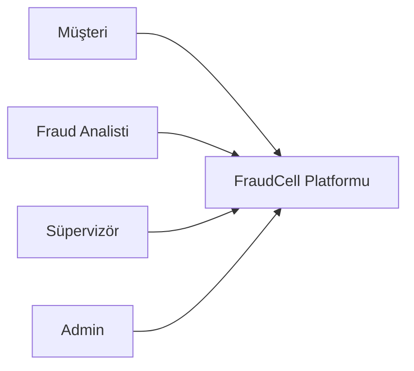
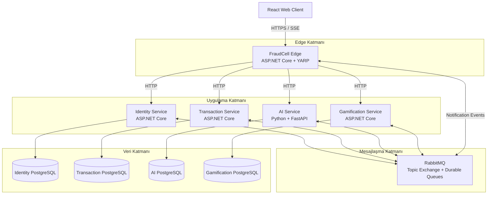
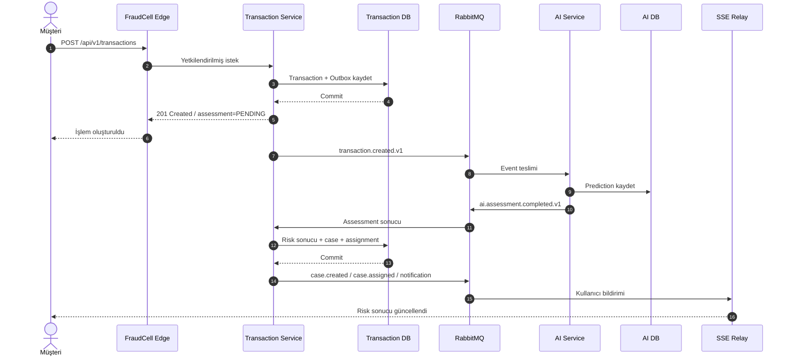
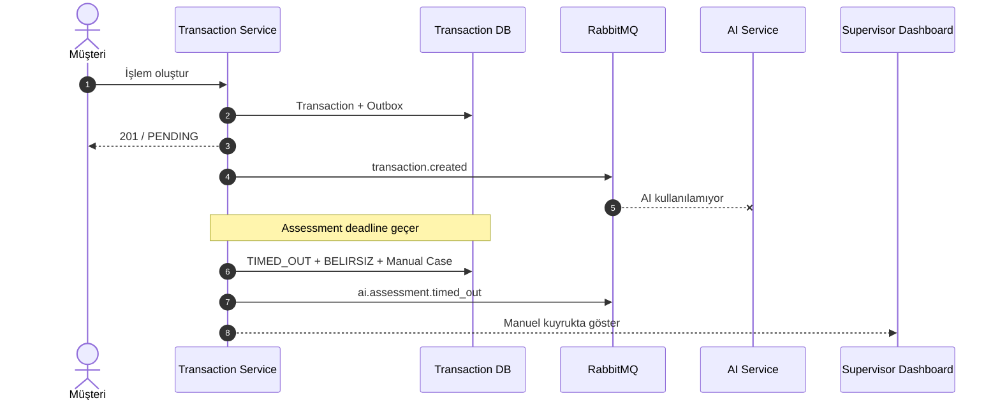
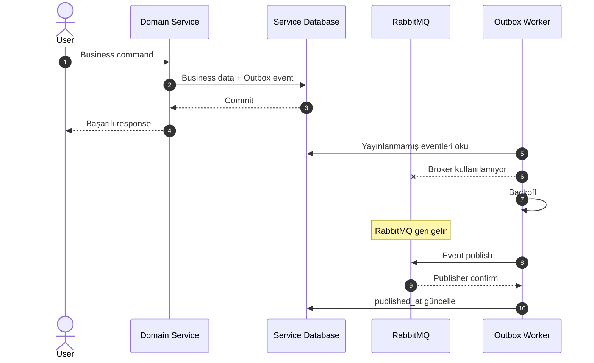
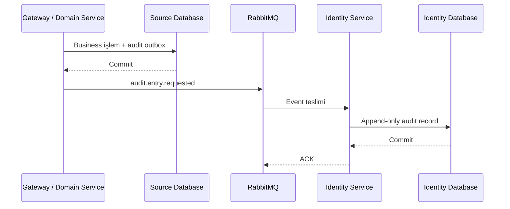
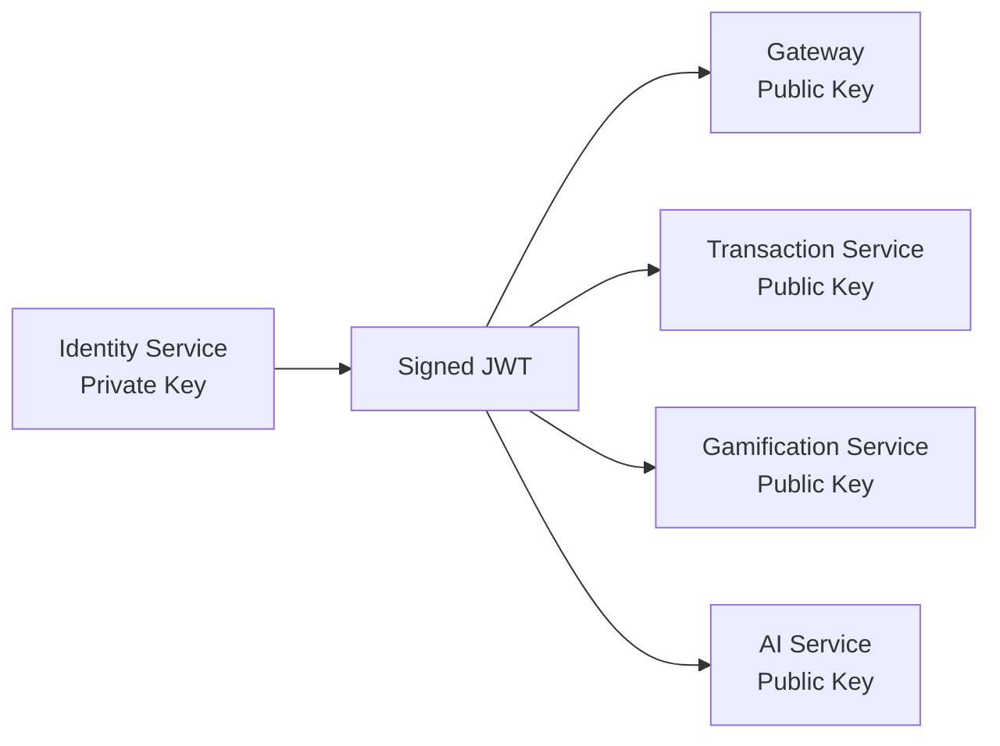
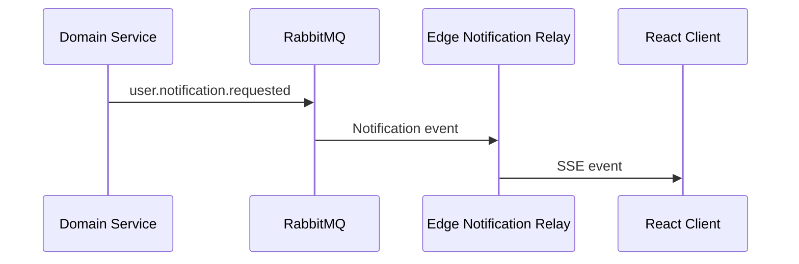
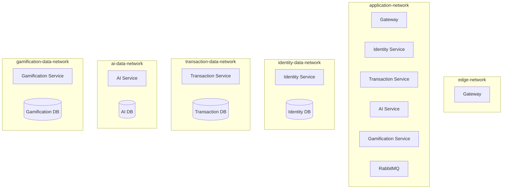
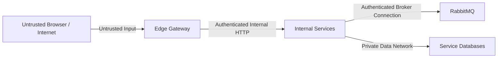

# FraudCell — Sistem Mimarisi Genel Bakış

**Doküman:** `02-ARCHITECTURE-OVERVIEW.md`
**Durum:** Accepted — Architecture Baseline v1.0
**Sistem:** FraudCell — Turkcell Gerçek Zamanlı Dolandırıcılık Tespit Platformu
**Son güncelleme:** YYYY-MM-DD
**İlgili dokümanlar:**

- `00-START-HERE.md`
- `01-REQUIREMENTS-TRACEABILITY.md`
- `03-TECH-STACK.md`
- `04-SERVICE-BOUNDARIES.md`
- `05-DOMAIN-AND-STATE-MACHINE.md`
- `06-DATA-ARCHITECTURE.md`
- `07-API-DESIGN.md`
- `08-EVENT-DRIVEN-ARCHITECTURE.md`
- `09-IDENTITY-SECURITY-AND-AUDIT.md`
- `10-AI-SERVICE-DESIGN.md`
- `11-GAMIFICATION-DESIGN.md`
- `12-RESILIENCE-AND-OBSERVABILITY.md`
- `13-DOCKER-COMPOSE-AND-OPERATIONS.md`
- `14-TEST-STRATEGY.md`
- `15-DEMO-AND-JURY-DEFENSE.md`

---

# 1. Dokümanın Amacı

Bu doküman FraudCell sisteminin üst seviye mimarisini tanımlar.

Buradaki amaç yalnızca hangi teknolojilerin kullanılacağını açıklamak değildir. Bu doküman aşağıdaki sorulara kesin cevap verir:

- Sistem hangi bağımsız bileşenlerden oluşur?
- Her bileşenin sorumluluğu nedir?
- Servisler birbiriyle nasıl iletişim kurar?
- Verilerin sahibi hangi servistir?
- İşlem oluşturulduğunda uçtan uca hangi akış gerçekleşir?
- AI Service çalışmıyorsa sistem nasıl davranır?
- RabbitMQ veya Gamification Service çalışmıyorsa veri kaybı nasıl engellenir?
- Kimlik doğrulama ve yetkilendirme nerede uygulanır?
- Gerçek zamanlı bildirimler nasıl iletilir?
- Bir servisin çökmesi durumunda sistem nasıl toparlanır?
- Mikroservis bağımsızlığı canlı demoda nasıl kanıtlanır?

Bu doküman mimarinin genel görünümünü verir. Tablo tasarımları, endpoint sözleşmeleri, event payload’ları ve güvenlik kuralları ilgili detay dokümanlarında tanımlanacaktır.

---

# 2. Mimari Hedef

FraudCell aşağıdaki temel hedeflerle geliştirilecektir:

1. Her business servisi bağımsız çalışabilmelidir.
2. Her servis yalnızca kendi veritabanına erişebilmelidir.
3. Bir servis arızası tüm sistemi kullanılamaz hale getirmemelidir.
4. İşlemler ve kritik domain event’leri kaybolmamalıdır.
5. Aynı event birden fazla kez teslim edilse bile business sonucu yalnızca bir kez uygulanmalıdır.
6. AI değerlendirmesi gerçek, tekrar üretilebilir ve açıklanabilir olmalıdır.
7. Yetkilendirme yalnızca role değil, erişilen kaynağın sahibine göre de uygulanmalıdır.
8. Sistem tek bir `docker compose up` komutuyla ayağa kalkmalıdır.
9. Bütün önemli mimari iddialar otomatik test veya canlı demo ile kanıtlanabilmelidir.
10. Sisteme yalnızca puan veya güvenilirlik sağlayan teknolojiler eklenmelidir.

---

# 3. Mimari Yaklaşım

FraudCell aşağıdaki yaklaşımların birleşimi olarak geliştirilecektir:

- Microservice Architecture
- Database per Service
- Event-Driven Architecture
- Asynchronous Processing
- Transactional Outbox Pattern
- Idempotent Consumer / Inbox Pattern
- Eventual Consistency
- Vertical Slice Architecture
- Resource-Based Authorization
- Defense in Depth
- Observable and Recoverable Operations

Sistem dağıtık transaction veya two-phase commit kullanmayacaktır.

Her servis kendi local transaction’ını yönetir. Servisler arası veri tutarlılığı event’ler, outbox kayıtları ve idempotent consumer’lar üzerinden eventual consistency ile sağlanır.

---

# 4. Nihai Sistem Bileşenleri

FraudCell aşağıdaki ana bileşenlerden oluşur:

| Bileşen               | Teknoloji                       | Temel Sorumluluk                                                                                                |
| --------------------- | ------------------------------- | --------------------------------------------------------------------------------------------------------------- |
| FraudCell Edge        | ASP.NET Core + YARP             | Tek giriş noktası, routing, JWT doğrulama, rate limiting, güvenlik header’ları, React static hosting, SSE relay |
| Identity Service      | ASP.NET Core                    | Kullanıcı, rol, OTP, şifre, token rotation, hesap kilidi, personel profili ve audit log                         |
| Transaction Service   | ASP.NET Core                    | İşlem, risk vakası, state machine, SLA, müşteri doğrulaması, atama ve nihai karar                               |
| AI Service            | Python + FastAPI + scikit-learn | Risk skorlama, fraud sınıflandırma, açıklama üretimi ve analist aday sıralaması                                 |
| Gamification Service  | ASP.NET Core                    | Puan ledger’ı, rozet, seviye, profil ve liderlik tablosu                                                        |
| RabbitMQ              | RabbitMQ                        | Güvenilir asenkron event iletimi                                                                                |
| Identity Database     | PostgreSQL                      | Yalnızca Identity Service verileri                                                                              |
| Transaction Database  | PostgreSQL                      | Yalnızca Transaction Service verileri                                                                           |
| AI Database           | PostgreSQL                      | Yalnızca AI Service verileri                                                                                    |
| Gamification Database | PostgreSQL                      | Yalnızca Gamification Service verileri                                                                          |
| Web Client            | React + TypeScript              | Müşteri, analist, süpervizör ve admin arayüzleri                                                                |

---

# 5. Sistem Bağlam Diyagramı



## 5.1 Aktörler

### Müşteri

Müşteri:

- GSM ve OTP ile giriş yapar.
- İşlem oluşturur.
- Şüpheli işlem bildirimi alır.
- İşlemi kendisinin yapıp yapmadığını belirtir.
- Vaka sonucunu takip eder.
- Kapanan vaka sonrasında memnuniyet puanı verir.

### Fraud Analisti

Fraud analisti:

- E-posta ve şifre ile giriş yapar.
- Kendisine atanmış vakaları görür.
- Vaka incelemesini başlatır.
- AI skoru, fraud türü ve açıklama nedenlerini görür.
- Müşteri doğrulaması ister.
- Fraud türünü override edebilir.
- İşlemi onaylar veya bloklar.
- Puan ve rozet kazanır.

### Süpervizör

Süpervizör:

- Operasyon dashboard’unu görür.
- SLA durumlarını takip eder.
- Bekleyen vakaları görür.
- Manuel analist ataması yapar.
- AI doğruluk metriklerini takip eder.
- Analist performansını inceler.
- Fraud ve risk tipi override edebilir.

### Admin

Admin:

- Personel hesabı oluşturur.
- Rol ve personel alanlarını yönetir.
- Audit log kayıtlarını görüntüler.
- Dashboard verilerini görüntüleyebilir.

---

# 6. Container Seviyesi Mimari



---

# 7. Dışarıya Açılan Yüzey

Sistemin dışarıya açılan tek uygulama adresi:

```text
http://localhost:8080
```

FraudCell Edge aşağıdaki görevleri yerine getirir:

- React uygulamasını static dosya olarak sunar.
- `/api/v1/**` isteklerini ilgili servise yönlendirir.
- JWT access token doğrular.
- Route seviyesinde kaba rol kontrolü yapar.
- Rate limiting uygular.
- Correlation ID üretir veya var olanı taşır.
- Request boyutu sınırlarını uygular.
- Security response header’larını ekler.
- SSE bağlantılarını yönetir.
- Dışarıdan gönderilmiş güvenilmeyen identity header’larını temizler.

Aşağıdaki bileşenlerin portları host ortamına açılmayacaktır:

- Identity Service
- Transaction Service
- AI Service
- Gamification Service
- Identity PostgreSQL
- Transaction PostgreSQL
- AI PostgreSQL
- Gamification PostgreSQL
- RabbitMQ AMQP portu

RabbitMQ Management UI yalnızca development veya demo-debug profili etkinleştirildiğinde host ortamına açılabilir.

---

# 8. Gateway Routing

Temel route yapısı:

```text
/api/v1/auth/**          -> Identity Service
/api/v1/users/**         -> Identity Service
/api/v1/staff/**         -> Identity Service
/api/v1/audit-logs/**    -> Identity Service

/api/v1/transactions/**  -> Transaction Service
/api/v1/cases/**         -> Transaction Service
/api/v1/dashboard/ops/** -> Transaction Service

/api/v1/ai/metrics/**    -> AI Service
/api/v1/ai/models/**     -> AI Service

/api/v1/game/**          -> Gamification Service
/api/v1/leaderboard/**   -> Gamification Service
/api/v1/profiles/**      -> Gamification Service

/api/v1/notifications/** -> Edge Notification Relay
```

AI’ın işlem skorlama endpoint’i ana kullanıcı trafiğine açık olmayacaktır.

AI Service’in internal skor endpoint’i bulunabilir:

```text
/internal/v1/assessments/score
```

Ancak ana işlem değerlendirme akışı HTTP üzerinden değil RabbitMQ event’leri üzerinden çalışacaktır.

---

# 9. Temel Mimari Sınırlar

## 9.1 Identity Service Sınırı

Identity Service aşağıdaki verilerin tek sahibidir:

- Kullanıcı hesabı
- Müşteri kimliği
- Personel hesabı
- Rol
- Uzmanlık
- Bölge
- Şifre hash’i
- Başarısız giriş sayısı
- Hesap kilidi
- Refresh token session’ları
- Audit log kayıtları

Identity Service aşağıdaki verilerin sahibi değildir:

- Transaction
- Risk case
- SLA
- AI prediction
- Point ledger
- Badge
- Leaderboard

## 9.2 Transaction Service Sınırı

Transaction Service aşağıdaki verilerin tek sahibidir:

- Transaction
- Transaction number
- Assessment status
- Risk case
- Case state
- Case transition history
- Assignment
- Active analyst workload
- SLA deadline
- Temporary block
- Customer verification
- Analyst decision
- Analyst note
- Customer feedback

Transaction Service sistemin operasyonel source of truth bileşenidir.

## 9.3 AI Service Sınırı

AI Service aşağıdaki verilerin sahibidir:

- Model sürümü
- Model metadata
- Training metadata
- Risk prediction
- Fraud-type prediction
- Feature snapshot
- Explanation/reason codes
- Analyst scoring projection
- AI override feedback
- Accuracy metrics
- Category-based accuracy

AI Service Transaction Database veya Identity Database’e doğrudan bağlanamaz.

## 9.4 Gamification Service Sınırı

Gamification Service aşağıdaki verilerin sahibidir:

- Point ledger
- Total points projection
- Badge definitions
- Earned badges
- Analyst level
- Daily leaderboard
- Weekly leaderboard
- Analyst performance projection

Gamification Service Transaction Database’e doğrudan erişemez.

---

# 10. Veri Sahipliği Matrisi

| Veri                | Kaynak Servis | Diğer Servislerin Erişim Yöntemi         |
| ------------------- | ------------- | ---------------------------------------- |
| Kullanıcı kimliği   | Identity      | JWT claim veya identity event projection |
| Rol                 | Identity      | JWT claim                                |
| Analist uzmanlığı   | Identity      | `analyst.profile.updated` eventi         |
| Analist bölgesi     | Identity      | `analyst.profile.updated` eventi         |
| İşlem               | Transaction   | API veya transaction event’i             |
| Risk vakası         | Transaction   | API veya case event’i                    |
| Aktif vaka sayısı   | Transaction   | Assignment event projection              |
| AI tahmini          | AI            | `ai.assessment.completed` eventi         |
| AI model sürümü     | AI            | Prediction event/API                     |
| Analist performansı | Gamification  | `analyst.performance.updated` eventi     |
| Puan                | Gamification  | Gamification API/event                   |
| Rozet               | Gamification  | Gamification API/event                   |
| Audit log           | Identity      | `audit.entry.requested` eventi           |

Bir servisin başka servise ait veriye ihtiyaç duyması, o servisin veritabanına bağlanma hakkı vermez.

Gerekli veri şu yöntemlerden biriyle sağlanır:

1. İlgili servisin API’sine sorgu
2. Event tabanlı local projection
3. JWT claim
4. Frontend’in birden fazla servisten paralel veri çekmesi

---

# 11. Servisler Arası İletişim Politikası

## 11.1 Ana Kural

Synchronous HTTP yalnızca çağrıyı yapan tarafın o anda doğrudan cevaba ihtiyaç duyduğu durumlarda kullanılacaktır.

Business süreçlerin ilerlemesi mümkün olduğunca event’lerle sağlanacaktır.

## 11.2 HTTP Kullanılabilecek Alanlar

HTTP aşağıdaki alanlarda kullanılabilir:

- Kullanıcıdan servise gelen command ve query istekleri
- Dashboard sorguları
- Leaderboard sorguları
- Audit log sorguları
- Model metric sorguları
- Health check
- Internal diagnostics
- Yönetim işlemleri
- Batch personel profil sorgusu

## 11.3 Event Kullanılacak Alanlar

Event aşağıdaki alanlarda zorunludur:

- İşlem oluşturuldu
- AI değerlendirmesi tamamlandı
- AI değerlendirmesi başarısız oldu
- Risk vakası oluşturuldu
- Vaka atandı
- Vaka incelemesi başladı
- Müşteri doğrulaması istendi
- Müşteri cevap verdi
- Vaka kararı verildi
- Fraud türü override edildi
- SLA aşıldı
- Vaka kapandı
- Müşteri geri bildirim verdi
- Puan kazanıldı
- Rozet kazanıldı
- Analist performansı değişti
- Audit kaydı istendi
- Kullanıcıya bildirim gönderilmesi istendi

---

# 12. Ana İşlem Akışı

Ana işlem değerlendirme akışı asynchronous-first olarak tasarlanmıştır.



---

# 13. İşlem Oluşturma Davranışı

Müşteri işlem oluşturduğunda Transaction Service aşağıdaki işlemleri gerçekleştirir:

1. JWT identity bilgilerini okur.
2. Müşteri rolünü doğrular.
3. Request validation uygular.
4. `Idempotency-Key` kontrolü yapar.
5. İşlem numarası üretir.
6. İşlemi veritabanına yazar.
7. Başlangıç assessment durumunu `PENDING` olarak belirler.
8. Güvenli başlangıç kararını `INCELEME` olarak belirler.
9. Aynı database transaction’ında `transaction.created.v1` outbox kaydı oluşturur.
10. `201 Created` döner.

İlk response örneği:

```json
{
  "success": true,
  "data": {
    "transactionId": "01JZX5M0SDYF92K25F00V3R2R8",
    "transactionNo": "TRX-2026-000123",
    "assessmentStatus": "PENDING",
    "riskScore": null,
    "riskLevel": null,
    "displayRiskLevel": "BELIRSIZ",
    "decision": "INCELEME",
    "temporaryBlocked": false
  },
  "error": null,
  "meta": {
    "traceId": "01JZX5M03SBBH5QEKWKSPKFBMG"
  }
}
```

Transaction Service AI Service’in cevap vermesini HTTP request içinde beklemez.

Bu karar aşağıdaki riskleri ortadan kaldırır:

- AI timeout’unun customer request’ini geciktirmesi
- AI servis arızasının işlem kaydını engellemesi
- Ağ bağlantısı hatasının işlemi kaybettirmesi
- Uzun retry işlemlerinin HTTP request içinde yapılması
- Transaction Service latency’sinin AI latency’sine bağlanması

---

# 14. AI Değerlendirme Akışı

AI Service `transaction.created.v1` event’ini tüketir.

AI değerlendirmesi aşağıdaki adımlardan oluşur:

1. Event schema doğrulanır.
2. Event’in daha önce işlenip işlenmediği inbox üzerinden kontrol edilir.
3. Feature vector hazırlanır.
4. Risk modeli çalıştırılır.
5. Fraud-type modeli çalıştırılır.
6. Deterministic safety rule katmanı uygulanır.
7. Risk seviyesi hesaplanır.
8. Karar hesaplanır.
9. Operasyonel açıklama/reason code listesi üretilir.
10. Analyst projection üzerinden adaylar sıralanır.
11. Prediction AI Database’e kaydedilir.
12. `ai.assessment.completed.v1` outbox kaydı oluşturulur.
13. Local transaction commit edilir.
14. Outbox worker event’i RabbitMQ’ya yayınlar.

AI sonucu örneği:

```json
{
  "eventId": "01JZX5QJX7G0XDSHNFSBNQ52ZH",
  "eventType": "ai.assessment.completed",
  "eventVersion": 1,
  "occurredAt": "2026-07-22T14:32:11Z",
  "producer": "ai-service",
  "correlationId": "01JZX5M03SBBH5QEKWKSPKFBMG",
  "causationId": "01JZX5M7T0C27J5FPA60QFXB35",
  "subjectId": "01JZX5M0SDYF92K25F00V3R2R8",
  "payload": {
    "transactionId": "01JZX5M0SDYF92K25F00V3R2R8",
    "assessmentId": "01JZX5QJB5TT3P8M8Q3C1G9X01",
    "riskScore": 0.94,
    "riskLevel": "KRITIK",
    "decision": "BLOK",
    "fraudType": "CALINTI_KART",
    "modelVersion": "risk-1.0.0",
    "reasonCodes": [
      {
        "code": "NEW_DEVICE",
        "label": "İlk kez görülen cihaz",
        "impact": "HIGH"
      },
      {
        "code": "AMOUNT_DEVIATION",
        "label": "Normal işlem tutarının 8.4 katı",
        "impact": "HIGH"
      },
      {
        "code": "UNUSUAL_LOCATION",
        "label": "Alışılmadık işlem konumu",
        "impact": "HIGH"
      },
      {
        "code": "NIGHT_TRANSACTION",
        "label": "Gece saatinde gerçekleştirilen işlem",
        "impact": "MEDIUM"
      }
    ],
    "analystCandidates": [
      {
        "analystId": "01JZX4ANALYST0000000000001",
        "score": 0.91,
        "expertiseScore": 1.0,
        "capacityScore": 0.7,
        "performanceScore": 0.91
      }
    ]
  }
}
```

---

# 15. Risk Sonucunun Transaction Service Tarafından Uygulanması

Transaction Service `ai.assessment.completed.v1` event’ini aldığında:

1. Inbox idempotency kontrolü yapar.
2. Transaction kaydını bulur.
3. Assessment sonucunun daha önce uygulanıp uygulanmadığını kontrol eder.
4. Assessment sonucu geçerli ise transaction’a yazar.
5. Risk kararına göre vaka oluşturur veya işlemi tamamlar.
6. Analyst candidate listesini değerlendirir.
7. Analistin gerçek aktif vaka kapasitesini yeniden kontrol eder.
8. Atamayı atomik olarak gerçekleştirir.
9. Gerekli SLA deadline’ını oluşturur.
10. Gerekli outbox event’lerini yazar.
11. Local transaction’ı commit eder.
12. Mesajı ACK eder.

## 15.1 ONAY Sonucu

```text
riskScore < 0.40
```

Davranış:

- Transaction `ONAY` olur.
- Risk case oluşturulmaz.
- Geçici blok uygulanmaz.
- Kullanıcıya değerlendirme sonucu bildirilir.

## 15.2 İNCELEME Sonucu

```text
0.40 <= riskScore <= 0.90
```

Davranış:

- Risk case oluşturulur.
- Case başlangıç durumu `YENI` olur.
- Uygun analist varsa atama yapılır.
- Atama yapılırsa case `ATANDI` olur.
- Kapasite yoksa `assignmentStatus=QUEUED` olur.
- Risk seviyesine göre SLA başlatılır.

## 15.3 BLOK Sonucu

```text
riskScore > 0.90
```

Davranış:

- Transaction geçici olarak bloklanır.
- Risk seviyesi `KRITIK` olur.
- Risk case oluşturulur.
- 15 dakikalık SLA başlatılır.
- Uygun analist atanır.
- Kullanıcıya şüpheli işlem bildirimi iletilir.

---

# 16. Analist Atama Mimarisi

Analist atama iki aşamalıdır.

## 16.1 AI Service Aday Sıralaması

AI Service local analyst projection üzerinden adayları sıralar.

Skor:

```text
assignmentScore =
    expertiseMatch * 0.50
    + capacityRatio * 0.30
    + performance * 0.20
```

AI Service yalnızca aday listesi üretir.

AI Service aşağıdaki kararı vermez:

```text
Bu vaka kesin olarak analyst-123 kullanıcısına atanmıştır.
```

AI Service aşağıdaki öneriyi üretir:

```text
Aday sıralamasında analyst-123 en uygun kişidir.
```

## 16.2 Transaction Service Kesin Ataması

Transaction Service:

1. İlk adayı seçer.
2. Güncel aktif vaka sayısını kendi database’inden kontrol eder.
3. Kapasite 10’un altındaysa assignment oluşturur.
4. Optimistic concurrency veya row-level locking ile yarış durumunu engeller.
5. İlk aday doluysa ikinci adayı değerlendirir.
6. Uygun aday yoksa vakayı assignment queue’ya alır.

Temel kural:

> AI önerir; Transaction Service kapasiteyi doğrular ve atamayı kesinleştirir.

Bu ayrımın nedeni Transaction Service’in aktif vaka ve assignment bilgilerinin gerçek source of truth’u olmasıdır.

---

# 17. AI Service Kullanılamadığında Davranış

Event-driven mimaride AI’ın kullanılamaması, bir HTTP timeout ile değil assessment sonucunun belirlenen süre içinde gelmemesiyle tespit edilir.

Transaction Service içinde bir Assessment Watchdog bulunur.

Varsayılan assessment bekleme süresi:

```text
8 saniye
```

Bu değer environment variable ile değiştirilebilir:

```text
AI_ASSESSMENT_DEADLINE_SECONDS=8
```

Not: İlk değer (2 saniye) RabbitMQ + AI Service round-trip'inin gözlemlenen
gerçek süresinden (~4 saniye) kısaydı; watchdog neredeyse her zaman AI
sonucundan önce devreye giriyordu. 8 saniye, gözlemlenen süreye pay
bırakarak "happy path"in (risk skoru zamanında gelip otomatik karar
üretmesi) gerçekten çalışmasını sağlar.

Assessment Watchdog aşağıdaki kayıtları arar:

```text
assessment_status = PENDING
AND assessment_deadline_at <= now()
AND manual_review_fallback_created = false
```

Bu koşul sağlandığında:

1. Assessment durumu `TIMED_OUT` olarak işaretlenir.
2. Risk ekranda `BELIRSIZ` olarak gösterilir.
3. Güvenli karar `INCELEME` olarak korunur.
4. Manuel inceleme vakası oluşturulur.
5. `assignmentStatus=MANUAL_QUEUE` atanır.
6. Süpervizör dashboard’una düşürülür.
7. `ai.assessment.timed_out.v1` event’i yayınlanır.
8. Audit kaydı oluşturulur.



---

# 18. AI Geri Geldiğinde Recovery

AI Service geri geldiğinde RabbitMQ kuyruğundaki bekleyen `transaction.created` event’lerini tüketir.

Geç gelen assessment sonucu Transaction Service’e ulaştığında üç olası durum vardır.

## 18.1 Manuel Vaka Henüz İncelenmediyse

Case durumu:

```text
YENI
```

veya:

```text
ATANDI
```

ancak analist incelemeye başlamamışsa:

- AI sonucu transaction’a uygulanır.
- Risk skoru ve fraud türü güncellenir.
- Uygun analist ataması yeniden değerlendirilebilir.
- Manuel fallback nedeni kaldırılmaz; audit history’de korunur.
- Kullanıcı ve süpervizör ekranı SSE ile güncellenir.

## 18.2 Analist İncelemeye Başladıysa

Case durumu:

```text
INCELENIYOR
```

ise:

- AI sonucu evidence olarak kaydedilir.
- Analistin mevcut assignment’ı değiştirilmez.
- Case state geriye alınmaz.
- AI sonucu analist ekranında gösterilir.
- Nihai karar analiste bırakılır.

## 18.3 Nihai Karar Verildiyse

Case durumu:

```text
ONAYLANDI
BLOKLANDI
KAPANDI
```

ise:

- Geç AI prediction audit amacıyla saklanır.
- Nihai karar değiştirilmez.
- Gamification yeniden tetiklenmez.
- Late assessment metriği kaydedilir.

Temel kural:

> Geç gelen AI sonucu, başlamış veya tamamlanmış insan kararını sessizce geçersiz kılamaz.

---

# 19. RabbitMQ Kullanılamadığında Davranış

RabbitMQ geçici olarak kapalı olduğunda business işlemleri tamamen reddedilmeyecektir.

Örnek:

1. Transaction Database’e işlem kaydedilir.
2. `transaction.created` event’i aynı local transaction içinde outbox’a yazılır.
3. Database commit edilir.
4. Outbox publisher RabbitMQ’ya bağlanamaz.
5. Event `published_at = null` durumunda kalır.
6. Publisher kontrollü şekilde yeniden dener.
7. RabbitMQ geri geldiğinde event yayınlanır.



Business data ile event arasında dual-write yapılmayacaktır.

---

# 20. Gamification Service Kullanılamadığında Davranış

Gamification Service kapalıyken analist vaka kararı verebilir.

Akış:

1. Transaction Service vaka kararını kaydeder.
2. `case.decision.made.v1` outbox kaydı oluşturur.
3. Event RabbitMQ kuyruğuna iletilir.
4. Gamification consumer kapalı olduğu için event durable queue’da bekler.
5. Kullanıcıya case kararının başarılı olduğu söylenir.
6. Gamification Service geri geldiğinde event’i tüketir.
7. Puan ledger kayıtlarını oluşturur.
8. Gerekli badge’leri hesaplar.
9. Leaderboard projection’ını günceller.
10. Kullanıcıya puan ve badge bildirimi gönderilir.

Case kararının başarısı Gamification Service’in erişilebilirliğine bağlı değildir.

---

# 21. Identity Service Kullanılamadığında Davranış

Identity Service kapalı olduğunda:

- Yeni login yapılamaz.
- OTP doğrulaması yapılamaz.
- Refresh token yenilemesi yapılamaz.
- Logout işlemi tamamlanamaz.
- Yeni personel hesabı oluşturulamaz.
- Audit consumer geçici olarak event tüketemez.

Ancak daha önce verilmiş ve süresi dolmamış access token’lar:

- Gateway tarafından RSA public key ile doğrulanabilir.
- İlgili servis tarafından yeniden doğrulanabilir.
- Token süresi dolana kadar kullanılabilir.

Bu nedenle Identity Service arızası bütün aktif kullanıcı oturumlarını anında kullanılamaz hale getirmez.

Audit event’leri durable queue veya producer outbox içinde bekler ve Identity Service geri geldiğinde işlenir.

---

# 22. Transaction Service Kullanılamadığında Davranış

Transaction Service sistemin operasyonel ana servisidir.

Transaction Service kapalı olduğunda:

- Yeni işlem oluşturulamaz.
- Case state değiştirilemez.
- Yeni assignment yapılamaz.
- SLA case işlemleri geçici olarak ilerlemez.

Ancak:

- Identity login işlemleri devam edebilir.
- AI Service mevcut kuyruğundaki event’leri işleyebilir.
- Gamification ve leaderboard sorguları çalışabilir.
- Audit log sorguları çalışabilir.
- AI ve Gamification event sonuçları RabbitMQ kuyruklarında bekler.

Transaction Service geri geldiğinde:

- Kuyrukta bekleyen event’leri tüketir.
- Outbox event’lerini yayınlar.
- Assessment Watchdog ve SLA worker kaldığı yerden devam eder.

Transaction Service’in kritik olması, diğer servislerin de process seviyesinde çökmesini gerektirmez.

---

# 23. Event Güvenilirliği

FraudCell aşağıdaki mesaj teslim modelini kullanır:

```text
At-least-once delivery
+
Idempotent consumer
```

Sistem network seviyesinde exactly-once delivery iddiasında bulunmaz.

## 23.1 Outbox

Event üreten her servis kendi database’inde outbox tablosu bulundurur.

Business değişikliği ve outbox kaydı aynı local database transaction içinde yazılır.

Örnek:

```text
BEGIN

UPDATE risk_cases
SET status = 'BLOKLANDI',
    decided_at = now()

INSERT INTO outbox_messages (...)

COMMIT
```

## 23.2 Inbox

Event tüketen servis kendi database’inde inbox veya processed-message tablosu bulundurur.

Örnek unique key:

```text
event_id + consumer_name
```

Aynı event tekrar gelirse:

- Event’in daha önce başarıyla işlendiği görülür.
- Business logic tekrar çalıştırılmaz.
- Mesaj ACK edilir.

## 23.3 Publisher Confirm

Outbox event’i ancak RabbitMQ event’i kabul ettiğini publisher confirm ile bildirdikten sonra yayınlanmış olarak işaretlenir.

## 23.4 Manual Acknowledgement

Consumer mesajı yalnızca:

- Schema doğrulaması geçtiğinde,
- Business işlem tamamlandığında,
- Local database commit edildiğinde

ACK eder.

## 23.5 Retry ve Dead Letter Queue

Retry sırası:

```text
1. hata -> 5 saniye
2. hata -> 30 saniye
3. hata -> 2 dakika
4. hata -> Dead Letter Queue
```

Kalıcı olarak hatalı mesajlar sonsuz döngüye sokulmaz.

---

# 24. RabbitMQ Topolojisi

Ana exchange:

```text
fraudcell.events
```

Özellikleri:

```text
type: topic
durable: true
auto-delete: false
```

Örnek kuyruklar:

```text
ai.transaction-created
transaction.ai-assessment-completed
transaction.customer-events
gamification.case-events
identity.audit-events
edge.user-notifications
```

Her consumer grubu kendi kuyruğuna sahiptir.

Aynı business event birden fazla servis tarafından tüketilecekse her servis için ayrı queue kullanılır.

Örnek:

```text
case.decision.made
```

event’i:

- Gamification Service tarafından puan için
- Identity Service tarafından audit için
- Edge tarafından notification için
- AI Service tarafından doğruluk/performance projection için

ayrı kuyruklar üzerinden tüketilebilir.

---

# 25. Event Envelope Standardı

Tüm domain event’leri ortak envelope kullanır:

```json
{
  "eventId": "01JZX5QJX7G0XDSHNFSBNQ52ZH",
  "eventType": "case.decision.made",
  "eventVersion": 1,
  "occurredAt": "2026-07-22T14:32:11Z",
  "producer": "transaction-service",
  "correlationId": "01JZX5M03SBBH5QEKWKSPKFBMG",
  "causationId": "01JZX5M7T0C27J5FPA60QFXB35",
  "subjectId": "01JZX5M0SDYF92K25F00V3R2R8",
  "payload": {}
}
```

Alanların anlamı:

| Alan            | Açıklama                                       |
| --------------- | ---------------------------------------------- |
| `eventId`       | Global benzersiz event kimliği                 |
| `eventType`     | Domain event adı                               |
| `eventVersion`  | Payload schema sürümü                          |
| `occurredAt`    | Event’in domain seviyesinde gerçekleşme zamanı |
| `producer`      | Event’i üreten servis                          |
| `correlationId` | Uçtan uca business akış kimliği                |
| `causationId`   | Bu event’i doğuran command veya event          |
| `subjectId`     | Event’in ana domain nesnesi                    |
| `payload`       | Event’e özel veri                              |

---

# 26. Audit Akışı

Audit log Identity Service’in sorumluluğundadır.

Diğer servisler Identity Database’e doğrudan audit kaydı yazamaz.

Audit akışı:



Audit kaydı aşağıdaki alanları içerecektir:

- Actor ID
- Action
- Timestamp
- Source service
- IP address
- Result
- Resource type
- Resource ID
- Correlation ID
- Structured details

Audit API üzerinden audit kayıtlarını değiştirme veya silme endpoint’i bulunmayacaktır.

---

# 27. Kimlik Doğrulama Mimarisi

Identity Service access token’ı RSA private key ile imzalar.

Gateway ve business servisleri yalnızca public key’e sahiptir.



Bu yaklaşımın sonucu:

- Token doğrulayabilen servis token üretemez.
- Private key yalnızca Identity Service’te bulunur.
- Gateway bypass edilse bile business servisleri token doğrulayabilir.
- Authentication tek noktada üretilir, validation defense-in-depth olarak uygulanır.

---

# 28. Yetkilendirme Mimarisi

Yetkilendirme iki seviyelidir.

## 28.1 Gateway Seviyesi

Gateway coarse-grained kontrol uygular:

- Token var mı?
- İmza geçerli mi?
- Token süresi dolmuş mu?
- Issuer ve audience doğru mu?
- Route gerekli role izin veriyor mu?
- Rate limit aşıldı mı?

## 28.2 Servis Seviyesi

Business servisi fine-grained kontrol uygular:

- Kullanıcı bu transaction’ın sahibi mi?
- Analist bu case’e atanmış mı?
- Süpervizör manuel atama yapabilir mi?
- Kullanıcı bu state transition’ı gerçekleştirebilir mi?
- Kullanıcı AI fraud type override yetkisine sahip mi?

Örnek analist sorgusu:

```text
case_id = requested_case_id
AND assigned_analyst_id = authenticated_user_id
```

Örnek müşteri sorgusu:

```text
transaction_id = requested_transaction_id
AND customer_id = authenticated_user_id
```

Ownership kontrolü yalnızca controller içinde sonradan yapılmaz. Database query’sinin parçası olur.

---

# 29. Gerçek Zamanlı Bildirim Mimarisi

Gerçek zamanlı bildirim için Server-Sent Events kullanılacaktır.

Ayrı Notification Service oluşturulmayacaktır.

Edge içinde yalnızca transport sorumluluğuna sahip bir Notification Relay bulunacaktır.



Bildirim örnekleri:

- AI değerlendirmesi tamamlandı
- Şüpheli işlem tespit edildi
- Müşteri doğrulaması istendi
- Vaka analiste atandı
- Vaka durumu değişti
- Puan kazanıldı
- Rozet kazanıldı
- Leaderboard sırası değişti
- SLA kritik seviyeye yaklaştı

Gateway bildirimin business içeriğine karar vermez.

Domain Service hedef kullanıcıyı ve bildirimin semantic içeriğini event payload’ında belirtir. Gateway yalnızca event’i doğru SSE bağlantısına iletir.

---

# 30. Süpervizör Dashboard Mimarisi

Dashboard için ayrı Reporting Service veya BFF oluşturulmayacaktır.

Frontend gerekli verileri Gateway üzerinden ilgili servislerden paralel olarak alır.

| Dashboard Alanı            | Veri Sahibi                          |
| -------------------------- | ------------------------------------ |
| Aktif case sayısı          | Transaction Service                  |
| Risk seviyesi dağılımı     | Transaction Service                  |
| Fraud türü dağılımı        | Transaction Service                  |
| SLA uyum oranı             | Transaction Service                  |
| SLA aşmış aktif vakalar    | Transaction Service                  |
| Manuel assignment queue    | Transaction Service                  |
| AI genel doğruluk          | AI Service                           |
| Kategori bazlı AI doğruluk | AI Service                           |
| Decision agreement         | AI Service                           |
| False-positive rate        | AI Service                           |
| Analist puanı              | Gamification Service                 |
| Analist karar sayısı       | Gamification Service projection      |
| Analist leaderboard        | Gamification Service                 |
| Analist görünen adı        | Identity Service batch profile query |

Frontend servisler arası join yapmaz; yalnızca UI composition gerçekleştirir.

Tek bir ekran yüklemesinde bağımsız sorgular paralel çalıştırılır.

Bir metrik servisi geçici olarak kapalıysa dashboard’un tamamı beyaz ekran olmamalıdır. İlgili widget:

- Loading
- Temporarily unavailable
- Retry

durumu göstermelidir.

---

# 31. Database-per-Service Mimarisi

Dört ayrı PostgreSQL container kullanılacaktır:

```text
identity-db
transaction-db
ai-db
gamification-db
```

Her database için:

- Ayrı PostgreSQL process/container
- Ayrı database user
- Ayrı password
- Ayrı volume
- Ayrı migration history
- Ayrı connection string
- Ayrı Docker network

bulunacaktır.

Tek PostgreSQL container içinde dört schema veya database kullanılmayacaktır.

Bunun nedeni:

1. Ortak veritabanı yorumuna açık kapı bırakmamak
2. Servis bağımsızlığını fiziksel olarak göstermek
3. Ayrı failure domain oluşturmak
4. Servisler arası doğrudan sorguyu network seviyesinde engellemek
5. Diskalifiye riskini ortadan kaldırmak

---

# 32. Docker Network Mimarisi



Network üyelikleri:

| Network                     | Üyeler                                |
| --------------------------- | ------------------------------------- |
| `edge-network`              | Gateway                               |
| `application-network`       | Gateway, dört servis, RabbitMQ        |
| `identity-data-network`     | Identity Service, Identity DB         |
| `transaction-data-network`  | Transaction Service, Transaction DB   |
| `ai-data-network`           | AI Service, AI DB                     |
| `gamification-data-network` | Gamification Service, Gamification DB |

Örneğin Gamification Service:

- Gamification Database’e erişebilir.
- RabbitMQ’ya erişebilir.
- Transaction Database’e erişemez.
- Identity Database’e erişemez.

Bu yalnızca convention değil, network seviyesinde uygulanmış bir sınırdır.

---

# 33. Health Check Mimarisi

Her servis iki ayrı health endpoint’i sunar:

```text
/health/live
/health/ready
```

## 33.1 Liveness

Liveness şu soruya cevap verir:

```text
Servis process’i çalışıyor mu?
```

Liveness kontrolü database veya RabbitMQ gibi dış bağımlılıklar yüzünden başarısız olmamalıdır.

## 33.2 Readiness

Readiness şu soruya cevap verir:

```text
Servis yeni trafik kabul etmeye hazır mı?
```

Readiness kontrolü:

- Servisin kendi database bağlantısını
- Gerekli migration durumunu
- Kritik local initialization işlemlerini

kontrol eder.

RabbitMQ veya downstream servisin kapalı olması her durumda servisi tamamen `not ready` yapmamalıdır.

Örneğin Transaction Service:

- Kendi database’i kapalıysa `not ready`
- AI Service kapalıysa `ready`, ancak degraded
- RabbitMQ kapalıysa business command’leri outbox’a kabul edebildiği sürece `ready`, ancak degraded

olabilir.

## 33.3 Degraded Durumu

Servislerin detay health çıktısında aşağıdaki durumlar gösterilebilir:

```text
Healthy
Degraded
Unhealthy
```

Degraded örneği:

```json
{
  "status": "Degraded",
  "checks": {
    "database": "Healthy",
    "rabbitmq": "Unhealthy",
    "outboxBacklog": 12
  }
}
```

---

# 34. Background Worker’lar

## Transaction Service

- Outbox Publisher
- Inbox Cleanup
- Assessment Watchdog
- SLA Breach Worker
- Case Closure Worker
- Assignment Queue Worker
- Idempotency Record Cleanup

## Identity Service

- Outbox Publisher
- Audit Event Consumer
- Expired Refresh Session Cleanup
- Expired OTP Cleanup
- Account Lock Cleanup veya calculated unlock

## AI Service

- Transaction Assessment Consumer
- Outbox Publisher
- Analyst Projection Consumers
- Metric Aggregation Worker
- Model Health/Metadata Loader

## Gamification Service

- Case Event Consumer
- Outbox Publisher
- Badge Evaluator
- Leaderboard Projection Worker
- Daily/Weekly Aggregate Maintenance

Worker’lar business servisten ayrı container olmak zorunda değildir.

İlk sürümde servis process’i içinde hosted background worker olarak çalışırlar.

Bu karar container sayısını ve operasyonel karmaşıklığı azaltır.

---

# 35. Structured Logging ve Correlation

Bütün servisler JSON structured logging kullanacaktır.

Her request ve event akışı bir `correlationId` taşıyacaktır.

HTTP request:

```text
X-Correlation-ID
```

Event:

```json
{
  "correlationId": "01JZX5M03SBBH5QEKWKSPKFBMG"
}
```

Örnek log:

```json
{
  "timestamp": "2026-07-22T14:32:11Z",
  "level": "Information",
  "service": "transaction-service",
  "correlationId": "01JZX5M03SBBH5QEKWKSPKFBMG",
  "eventId": "01JZX5QJX7G0XDSHNFSBNQ52ZH",
  "transactionId": "01JZX5M0SDYF92K25F00V3R2R8",
  "message": "AI assessment applied",
  "riskScore": 0.94,
  "decision": "BLOK"
}
```

Loglara aşağıdaki hassas veriler yazılmayacaktır:

- Şifre
- OTP
- Raw refresh token
- Access token
- Private key
- Tam kart numarası
- Gereksiz kişisel veri

---

# 36. Zaman Standardı

Bütün backend timestamp’leri UTC saklanacaktır.

Database alanları timezone-aware olacaktır.

API ve event formatı:

```text
ISO 8601 UTC
```

Örnek:

```text
2026-07-22T14:32:11Z
```

Frontend kullanıcıya Türkiye saatini gösterebilir.

SLA hesabı server-side UTC zamanına göre yapılır.

Frontend countdown yalnızca görsel gösterimdir. SLA kararının source of truth’u Transaction Service’tir.

Testlerde sistem saatine doğrudan bağımlılık yerine injectable clock/time provider kullanılacaktır.

---

# 37. Kimlik Standardı

Internal entity kimlikleri için ULID kullanılacaktır.

Örnek:

```text
01JZX5M0SDYF92K25F00V3R2R8
```

ULID kullanım nedenleri:

- Global benzersizlik
- Zaman bazlı sıralanabilirlik
- Loglarda okunabilirlik
- Event sistemiyle kolay korelasyon
- Merkezi ID servisine ihtiyaç duymama

Kullanıcıya gösterilecek işlem numarası ayrıca oluşturulur:

```text
TRX-2026-000123
```

Internal ID ile okunabilir business number birbirinden ayrılır.

---

# 38. API Response Standardı

Başarılı response:

```json
{
  "success": true,
  "data": {},
  "error": null,
  "meta": {
    "traceId": "01JZX5M03SBBH5QEKWKSPKFBMG"
  }
}
```

Hatalı response:

```json
{
  "success": false,
  "data": null,
  "error": {
    "code": "INVALID_CASE_TRANSITION",
    "message": "INCELENIYOR durumundan ATANDI durumuna geçilemez.",
    "details": {
      "currentState": "INCELENIYOR",
      "requestedState": "ATANDI"
    }
  },
  "meta": {
    "traceId": "01JZX5M03SBBH5QEKWKSPKFBMG"
  }
}
```

HTTP status kullanımı:

| Status | Kullanım                                              |
| -----: | ----------------------------------------------------- |
|  `200` | Başarılı query veya action                            |
|  `201` | Resource oluşturuldu                                  |
|  `202` | İş kabul edildi, asenkron işlem devam ediyor          |
|  `204` | Başarılı, response body yok                           |
|  `400` | Request formatı veya validation hatası                |
|  `401` | Authentication başarısız                              |
|  `403` | Kullanıcı doğrulandı ancak yetkisi yok                |
|  `404` | Resource bulunamadı veya ownership nedeniyle gizlendi |
|  `409` | Concurrency veya idempotency çakışması                |
|  `422` | Domain/state machine kuralı ihlali                    |
|  `429` | Rate limit                                            |
|  `503` | Servis yeni işlem kabul edemiyor                      |

---

# 39. State Machine Sahipliği

Risk case state machine yalnızca Transaction Service tarafından yönetilir.

Başka hiçbir servis:

- Case state’i değiştiremez.
- Assignment kaydı oluşturamaz.
- Nihai transaction kararını değiştiremez.
- SLA’yı durduramaz.
- Temporary block kaldırmaz.

AI Service yalnızca prediction ve analyst recommendation üretir.

Gamification Service yalnızca gerçekleşmiş event’lerden puan sonucu üretir.

Identity Service yalnızca identity ve audit domain’ini yönetir.

---

# 40. Concurrency Politikası

Aşağıdaki yarış durumları özellikle ele alınacaktır:

- Aynı transaction request’inin iki kez gönderilmesi
- Aynı vakaya iki analistin aynı anda karar vermesi
- Aynı analiste eşzamanlı birden fazla case atanması
- Aynı event’in tekrar teslim edilmesi
- Aynı müşteri geri bildiriminin iki kez gönderilmesi
- Aynı refresh token’ın eşzamanlı kullanılması
- Late AI result’in manuel karar sonrasında gelmesi

Kullanılacak yöntemler:

- Idempotency key
- Unique constraint
- Optimistic concurrency token
- Row-level locking gerektiğinde `FOR UPDATE`
- Inbox unique constraint
- Refresh token atomic rotation
- State precondition kontrolü

---

# 41. Güvenlik Trust Boundary’leri



## Boundary 1 — Browser ve Gateway

Bu boundary’de:

- JWT validation
- Rate limiting
- Request size limit
- CORS/same-origin policy
- Security headers
- Input validation
- Trusted proxy/IP handling

uygulanır.

## Boundary 2 — Gateway ve Business Service

Bu boundary’de:

- Token yeniden doğrulanır.
- Role policy uygulanır.
- Resource ownership kontrol edilir.
- Gateway tarafından taşınan header’lara kör güvenilmez.

## Boundary 3 — Service ve RabbitMQ

Bu boundary’de:

- Ayrı broker credentials
- Vhost/permission
- Durable queue
- Schema validation
- Message size limit
- Idempotency

uygulanır.

## Boundary 4 — Service ve Database

Bu boundary’de:

- Her servise yalnızca kendi DB credential’ı
- Parametreli query
- Least privilege DB user
- Migration user ve runtime user ayrımı değerlendirilebilir
- Network isolation

uygulanır.

---

# 42. Deployment Topolojisi

Kök compose dosyasında aşağıdaki container’lar bulunacaktır:

```text
fraudcell-edge
identity-service
identity-db
transaction-service
transaction-db
ai-service
ai-db
gamification-service
gamification-db
rabbitmq
```

React production build, FraudCell Edge image’ının static content alanına kopyalanacaktır.

Bu nedenle production/demo topolojisinde ayrı frontend container’ı zorunlu değildir.

Avantajları:

- Tek origin
- CORS karmaşıklığının azalması
- Same-site refresh cookie
- Dışarıya tek port
- Daha düşük container sayısı
- Daha kolay canlı demo
- Daha az startup bağımlılığı

---

# 43. Startup ve Migration Politikası

Container’ın başlaması servisin hazır olduğu anlamına gelmez.

Compose healthcheck’leri kullanılacaktır.

Önerilen startup sırası:

1. PostgreSQL container’ları
2. RabbitMQ
3. Migration işlemleri
4. Domain servisleri
5. Edge Gateway
6. Seed işlemi
7. Smoke test

Servisler database’in hazır olmasını sonsuz crash loop yerine kontrollü retry ile bekleyebilir.

Migration işlemleri aşağıdaki yöntemlerden biriyle uygulanacaktır:

- Servis başlangıcında kontrollü migration
- Ayrı one-shot migration container
- `docker compose run migrate`

Nihai yöntem `13-DOCKER-COMPOSE-AND-OPERATIONS.md` içinde kesinleştirilecektir.

Aynı anda birden fazla instance’ın migration çalıştırmasına izin verilmemelidir.

---

# 44. Seed ve Demo Verisi

Seed işlemi aşağıdaki verileri oluşturacaktır:

- Bir müşteri
- Bir admin
- Bir süpervizör
- Birden fazla analist
- Analist uzmanlıkları
- Analist bölgeleri
- Analist performans geçmişi
- Geçmiş müşteri işlemleri
- Normal işlem davranışı
- Şüpheli işlem senaryoları
- Başlangıç leaderboard verisi
- Badge tanımları
- AI model metadata
- Demo için deterministik yüksek riskli işlem preset’i

Demo sistemi her provadan önce aşağıdaki komutla sıfırlanabilmelidir:

```bash
./scripts/demo-reset.sh
```

Windows uyumluluğu için eşdeğer PowerShell script’i sağlanabilir:

```powershell
./scripts/demo-reset.ps1
```

---

# 45. Ana Demo Mimarisi

Canlı demo aşağıdaki mimari özellikleri kanıtlar:

## Perde 1 — Normal Akış

1. Sistem Compose ile ayağa kalkar.
2. Müşteri giriş yapar.
3. Yüksek riskli işlem oluşturur.
4. Transaction önce `PENDING` görünür.
5. AI event’i işler.
6. Risk skoru ve fraud türü SSE ile ekrana gelir.
7. Uygun uzman analist atanır.
8. Analist vakayı inceler.
9. Müşteri “Ben yapmadım” der.
10. Analist blok kararı verir.
11. Gamification puan ve badge üretir.
12. Leaderboard güncellenir.

## Perde 2 — Servis Arızası

AI Service durdurulur:

```bash
docker compose stop ai-service
```

Yeni işlem oluşturulur.

Beklenen:

- İşlem başarıyla kaydedilir.
- Risk `BELIRSIZ` görünür.
- Karar `INCELEME` olur.
- Manuel kuyruğa düşer.
- Sistem 500 hatasıyla çökmez.

AI Service yeniden başlatılır:

```bash
docker compose start ai-service
```

Beklenen:

- Bekleyen event işlenir.
- AI sonucu sisteme ulaşır.
- Manuel vaka güvenli reconciliation kuralıyla güncellenir.
- Ekran SSE ile güncellenir.

## Perde 3 — Güvenlik

- Customer token ile supervisor endpoint → 403
- Başka müşterinin transaction ID’si → 404/403
- Manipüle JWT → 401
- Expired JWT → 401
- Revoke refresh token reuse → bütün session’lar sonlandırılır
- SQL injection girdisi → veri sızıntısı yok
- XSS girdisi → script çalışmaz
- Brute-force → rate limit veya hesap kilidi

---

# 46. Mimari Olarak Yapılmayacaklar

Aşağıdaki teknolojiler veya yaklaşımlar ilk sürüme eklenmeyecektir:

- Kafka
- Kubernetes
- Redis
- MongoDB
- Elasticsearch
- GraphQL
- Service mesh
- Full event sourcing
- Distributed transaction
- Two-phase commit
- Harici LLM tabanlı risk motoru
- Ayrı Notification Service
- Ayrı Reporting Service
- Ortak PostgreSQL
- Ortak domain entity package
- Gateway içinde business logic
- Her servis için gereksiz çok sayıda project katmanı
- Generic repository abstraction
- Gereksiz mediator framework
- Business event için doğrudan fire-and-forget publish
- Refresh token’ın localStorage’da tutulması

Bu kararların nedeni teknolojilerin kötü olması değildir.

Bu teknolojiler mevcut case için:

- Gerekli puan katkısını sağlamaz.
- Operasyonel karmaşıklığı artırır.
- Demo riskini yükseltir.
- Üç kişilik takımın dikkatini kritik iş kurallarından uzaklaştırır.

---

# 47. Kod Organizasyonu

Her .NET servisi tek deployable project olarak başlayacaktır.

Örnek Transaction Service:

```text
Transaction.Service/
├── Features/
│   ├── Transactions/
│   │   ├── CreateTransaction/
│   │   ├── GetTransaction/
│   │   └── ListCustomerTransactions/
│   ├── Cases/
│   │   ├── GetAssignedCases/
│   │   ├── StartReview/
│   │   ├── RequestCustomerVerification/
│   │   ├── SubmitDecision/
│   │   ├── OverrideFraudType/
│   │   └── CloseCase/
│   ├── Assignments/
│   │   ├── AutoAssign/
│   │   ├── ManualAssign/
│   │   └── GetAssignmentQueue/
│   └── Dashboard/
│       ├── GetRiskDistribution/
│       ├── GetSlaMetrics/
│       └── GetPendingQueue/
├── Domain/
├── Persistence/
├── Messaging/
├── BackgroundJobs/
├── Security/
├── Observability/
└── Common/
```

Mikroservis bağımsızlığı project sayısıyla değil:

- Ayrı process
- Ayrı database
- Ayrı deployment
- Ayrı domain ownership
- Ayrı API/event sözleşmesi

ile sağlanır.

---

# 48. Mimari Kabul Kriterleri

Bu dokümandaki mimari ancak aşağıdaki koşullar sağlandığında uygulanmış kabul edilir.

## 48.1 Bağımsızlık

- Dört business servisi ayrı container olarak çalışır.
- Her servis yalnızca kendi database’ine erişebilir.
- AI Service kapalıyken transaction oluşturulur.
- Gamification Service kapalıyken case kararı verilir.
- RabbitMQ kapalıyken business veri commit edilir ve outbox’ta bekler.
- Identity Service kapalıyken geçerli access token’larla bazı mevcut oturum işlemleri devam eder.

## 48.2 Güvenilirlik

- Business değişiklikleriyle event’ler aynı local transaction’da outbox’a yazılır.
- Duplicate event duplicate puan veya state change üretmez.
- Poison message DLQ’ya gider.
- Late AI result nihai insan kararını bozmaz.
- Aynı vaka iki kez karara bağlanamaz.

## 48.3 Güvenlik

- İç servis portları dışarıya açık değildir.
- JWT Gateway ve servis seviyesinde doğrulanır.
- Resource ownership query seviyesinde uygulanır.
- Refresh token rotation ve reuse detection çalışır.
- Rate limiting ve account lockout birlikte çalışır.
- Audit kayıtları append-only tutulur.

## 48.4 Operasyon

- Temiz ortamda `docker compose up` çalışır.
- Health check’ler doğru sonuç verir.
- Seed işlemi deterministiktir.
- Demo reset script’i çalışır.
- Correlation ID HTTP ve event akışında korunur.
- Loglarda secret bulunmaz.

## 48.5 Demo

- Normal uçtan uca akış gösterilebilir.
- AI servis kapatma akışı gösterilebilir.
- AI geri geldiğinde recovery gösterilebilir.
- Puan ve badge güncellemesi gösterilebilir.
- Güvenlik testleri canlı uygulanabilir.

---

# 49. Mimari Karar Özeti

| Konu                    | Nihai Karar                                    |
| ----------------------- | ---------------------------------------------- |
| Mimari stil             | Mikroservis + event-driven                     |
| Ana backend runtime     | ASP.NET Core                                   |
| AI runtime              | Python + FastAPI                               |
| Gateway                 | ASP.NET Core + YARP                            |
| Frontend                | React + TypeScript                             |
| Frontend hosting        | Edge container’dan static hosting              |
| Veritabanı              | Servis başına ayrı PostgreSQL container        |
| Broker                  | RabbitMQ                                       |
| AI ana akışı            | Asenkron event-first                           |
| Senkron iletişim        | Query, yönetim ve gerekli internal işlemler    |
| Mesaj garantisi         | At-least-once                                  |
| Duplicate koruması      | Idempotent inbox                               |
| Event kaybı koruması    | Transactional outbox                           |
| Gerçek zamanlı UI       | SSE                                            |
| Authentication          | Identity Service + RSA JWT                     |
| Authorization           | Gateway coarse-grained + servis resource-based |
| Atama                   | AI önerir, Transaction kesinleştirir           |
| Audit                   | Event ile Identity Service’e aktarılır         |
| Dashboard               | Frontend paralel servis composition            |
| Servis yapısı           | Vertical slice                                 |
| Deployment              | Docker Compose                                 |
| Dış port                | Yalnızca Edge                                  |
| Distributed transaction | Kullanılmayacak                                |
| Event sourcing          | Kullanılmayacak                                |
| Harici LLM              | Kullanılmayacak                                |

---

# 50. Son Mimari İlkeler

FraudCell geliştirilirken aşağıdaki ilkeler değişmez kabul edilir:

1. İşlem önce güvenli şekilde kaydedilir, sonra işlenir.
2. Bir servisin arızası işin kaybolmasına neden olmaz.
3. Bir event birden fazla kez gelebilir; sonuç yalnızca bir kez uygulanır.
4. Başka servisin database’i hiçbir zaman integration API değildir.
5. Gateway tek güvenlik katmanı değildir.
6. Role sahip olmak, her kaynağa erişme hakkı vermez.
7. AI bir otorite değil, karar destek ve öneri bileşenidir.
8. Nihai case state’inin sahibi Transaction Service’tir.
9. Puanın sahibi Gamification Service’tir.
10. Kullanıcı ve token domain’inin sahibi Identity Service’tir.
11. Model ve prediction domain’inin sahibi AI Service’tir.
12. Eventual consistency kullanıcı arayüzünde açık durumlarla gösterilir.
13. Her failure senaryosunun beklenen ve test edilebilir bir sonucu bulunur.
14. Mimari yalnızca diyagramla değil, canlı hata ve recovery demosuyla kanıtlanır.
15. Karmaşıklık yalnızca somut risk veya gereksinim çözdüğünde sisteme eklenir.

---

# 51. Sonraki Doküman

Bu dokümandan sonra hazırlanacak dosya:

```text
03-TECH-STACK.md
```

Bu dosyada:

- Teknolojilerin kesin sürümleri
- Her teknoloji seçiminin nedeni
- Reddedilen alternatifler
- Package ve dependency politikası
- Lisans ve demo riski
- Runtime ve image kararları
- Güncelleme/pinning stratejisi

ayrıntılı olarak belgelenecektir.
