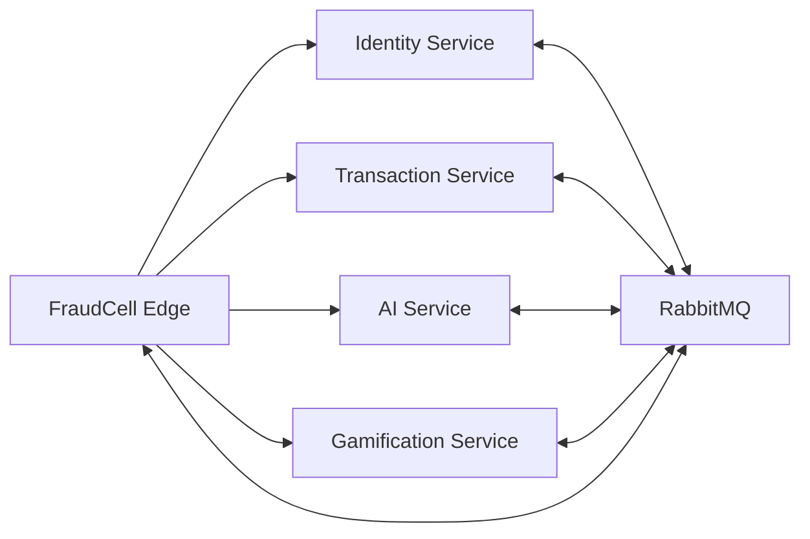

# FraudCell — Servis Sınırları ve Veri Sahipliği

**Doküman:** `04-SERVICE-BOUNDARIES.md`
**Durum:** Accepted — Architecture Baseline v1.0
**Sistem:** FraudCell — Turkcell Gerçek Zamanlı Dolandırıcılık Tespit Platformu
**Son güncelleme:** YYYY-MM-DD
**İlgili dokümanlar:**

- `00-START-HERE.md`
- `01-REQUIREMENTS-TRACEABILITY.md`
- `02-ARCHITECTURE-OVERVIEW.md`
- `03-TECH-STACK.md`
- `05-DOMAIN-AND-STATE-MACHINE.md`
- `06-DATA-ARCHITECTURE.md`
- `07-API-DESIGN.md`
- `08-EVENT-DRIVEN-ARCHITECTURE.md`
- `09-IDENTITY-SECURITY-AND-AUDIT.md`
- `10-AI-SERVICE-DESIGN.md`
- `11-GAMIFICATION-DESIGN.md`
- `12-RESILIENCE-AND-OBSERVABILITY.md`
- `13-DOCKER-COMPOSE-AND-OPERATIONS.md`

---

# 1. Dokümanın Amacı

Bu doküman FraudCell sistemindeki servislerin kesin sınırlarını tanımlar.

Her servis için aşağıdaki sorular cevaplanır:

- Bu servis hangi business capability’lerin sahibidir?
- Hangi verileri oluşturabilir ve değiştirebilir?
- Hangi verilerin source of truth noktasıdır?
- Hangi işlemleri gerçekleştirmesi yasaktır?
- Başka servislerden hangi bilgileri alabilir?
- Başka servislere hangi event’leri yayınlar?
- Hangi event’leri tüketir?
- Hangi verileri local projection olarak tutabilir?
- Servis kullanılamadığında sistemin geri kalanı nasıl davranır?
- Yetkilendirme ve güvenlik sorumluluğu hangi seviyede uygulanır?
- Servisler arasında hangi bağımlılık yönleri kabul edilir?
- Hangi coupling biçimleri mimari ihlal sayılır?

Bu dokümanın temel amacı dört ayrı container üretmek değildir.

Temel amaç:

> Her servis için açık bir business otoritesi, açık bir veri sahipliği ve uygulanabilir bir bağımsızlık sınırı oluşturmaktır.

---

# 2. Temel Sınır Prensipleri

FraudCell servisleri aşağıdaki değişmez prensiplere göre tasarlanacaktır.

## 2.1 Tek Veri Sahibi

Her business verisinin yalnızca bir authoritative sahibi bulunur.

Örnek:

- Kullanıcının rolünün sahibi Identity Service’tir.
- Risk vakasının durumunun sahibi Transaction Service’tir.
- Model tahmininin sahibi AI Service’tir.
- Analistin puanının sahibi Gamification Service’tir.

Başka servisler bu verilerin kopyasını local projection olarak tutabilir; ancak authoritative veriyi değiştiremez.

## 2.2 Database Bir Integration API Değildir

Bir servisin veritabanı yalnızca o servis tarafından kullanılabilir.

Başka bir servis:

- SQL sorgusu gönderemez.
- Aynı connection string’i kullanamaz.
- View okuyamaz.
- Stored procedure çağıramaz.
- Database replication üzerinden business veri tüketemez.
- Ortak schema kullanamaz.
- Aynı ORM entity’sini paylaşamaz.

Servisler arası iletişim yalnızca:

- Versioned HTTP API
- Versioned domain event
- JWT claim
- Kontrollü batch query

üzerinden yapılabilir.

## 2.3 Servis Kendi Domain Kuralını Korur

Bir servis başka servisin domain kuralını uygulamaz.

Örnek:

- AI Service vaka state transition’ı uygulamaz.
- Gamification Service case’i bloklamaz.
- Identity Service analyst assignment yapmaz.
- Gateway risk skoru hesaplamaz.

## 2.4 Başka Servisin Cevabı Olmadan İş Yapabilme

Bir business işlem, gerekli olmadığı sürece başka servisin synchronous cevabına bağlanmayacaktır.

Örnek:

- Transaction oluşturmak için AI HTTP cevabı beklenmez.
- Case kararı vermek için Gamification Service beklenmez.
- Audit kaydı yazmak için Identity Service beklenmez.
- Badge bildirimi göndermek için Edge bağlantısı beklenmez.

## 2.5 Local Transaction Sınırı

Her servis yalnızca kendi database transaction’ını yönetir.

Servisler arası:

- Distributed transaction
- Two-phase commit
- Ortak Unit of Work

kullanılmayacaktır.

Servisler arası tutarlılık eventual consistency ile sağlanır.

## 2.6 Event’ler Gerçekleşmiş Olayları Temsil Eder

Event isimleri geçmiş zamanlı ve business anlamlı olacaktır.

Doğru örnekler:

```text
transaction.created
ai.assessment.completed
case.assigned
case.decision.made
badge.earned
```

Yanlış örnekler:

```text
createTransaction
calculateScore
givePoints
updateUser
```

İkinci gruptaki isimler command niteliğindedir ve event olarak kullanılmayacaktır.

## 2.7 Source of Truth ile Projection Ayrımı

Bir servis başka bir servisten gelen veriyi kendi database’inde projection olarak tutabilir.

Ancak projection:

- Authoritative değildir.
- Kaynak servisin event’leriyle güncellenir.
- Gecikmeli olabilir.
- Yeniden oluşturulabilir olmalıdır.
- Critical command öncesinde gerekirse kaynak otorite tarafından doğrulanmalıdır.

---

# 3. Sistem Bileşenleri

FraudCell aşağıdaki ana bileşenlerden oluşur:

| Bileşen              | Tür            | Business Servisi mi? | Database Sahibi mi? |
| -------------------- | -------------- | -------------------: | ------------------: |
| FraudCell Edge       | Edge/Gateway   |                Hayır |               Hayır |
| Identity Service     | Mikroservis    |                 Evet |                Evet |
| Transaction Service  | Mikroservis    |                 Evet |                Evet |
| AI Service           | Mikroservis    |                 Evet |                Evet |
| Gamification Service | Mikroservis    |                 Evet |                Evet |
| RabbitMQ             | Infrastructure |                Hayır |               Hayır |
| React Web Client     | Client         |                Hayır |               Hayır |

Edge Gateway bir business mikroservisi değildir.

RabbitMQ bir business otoritesi değildir.

React frontend herhangi bir business verisinin source of truth noktası değildir.

---

# 4. Business Capability Haritası

| Business Capability                    | Otorite Servis       |
| -------------------------------------- | -------------------- |
| Müşteri hesabı oluşturma               | Identity Service     |
| OTP doğrulama                          | Identity Service     |
| Personel hesabı oluşturma              | Identity Service     |
| Login                                  | Identity Service     |
| Access token üretimi                   | Identity Service     |
| Refresh token rotation                 | Identity Service     |
| Hesap kilitleme                        | Identity Service     |
| Rol yönetimi                           | Identity Service     |
| Uzmanlık ve bölge yönetimi             | Identity Service     |
| Audit log persistence                  | Identity Service     |
| İşlem oluşturma                        | Transaction Service  |
| İşlem numarası üretme                  | Transaction Service  |
| Risk case oluşturma                    | Transaction Service  |
| State machine                          | Transaction Service  |
| SLA yönetimi                           | Transaction Service  |
| Müşteri doğrulama süreci               | Transaction Service  |
| Geçici blok                            | Transaction Service  |
| Analyst assignment kesinleştirme       | Transaction Service  |
| Nihai case kararı                      | Transaction Service  |
| Müşteri geri bildirimi                 | Transaction Service  |
| Risk skorlama                          | AI Service           |
| Fraud-type classification              | AI Service           |
| Model version yönetimi                 | AI Service           |
| AI açıklama/reason code üretimi        | AI Service           |
| Analist aday sıralaması                | AI Service           |
| AI doğruluk metrikleri                 | AI Service           |
| Puan hesaplama                         | Gamification Service |
| Puan ledger’ı                          | Gamification Service |
| Badge kazanımı                         | Gamification Service |
| Seviye hesaplama                       | Gamification Service |
| Leaderboard                            | Gamification Service |
| Analist gamification profili           | Gamification Service |
| HTTP routing                           | FraudCell Edge       |
| Edge rate limiting                     | FraudCell Edge       |
| Static frontend hosting                | FraudCell Edge       |
| SSE bağlantı yönetimi                  | FraudCell Edge       |
| Domain bildiriminin transport edilmesi | FraudCell Edge       |

---

# 5. Source of Truth Matrisi

| Veri                  | Authoritative Owner | Local Kopya Tutabilecek Servis | Kopyanın Amacı                      |
| --------------------- | ------------------- | ------------------------------ | ----------------------------------- |
| User ID               | Identity            | Transaction, AI, Gamification  | Foreign identity reference          |
| Customer profile      | Identity            | Gerektiğinde frontend          | Görüntüleme                         |
| Staff display name    | Identity            | Gamification, AI projection    | Leaderboard ve assignment gösterimi |
| Role                  | Identity            | JWT üzerinden bütün servisler  | Authorization                       |
| Analyst specialties   | Identity            | AI                             | Analyst ranking                     |
| Analyst regions       | Identity            | AI                             | Analyst ranking                     |
| Transaction           | Transaction         | AI prediction snapshot         | Model girdisi                       |
| Transaction number    | Transaction         | AI/Gamification event payload  | Correlation/gösterim                |
| Risk case             | Transaction         | AI/Gamification projection     | Metric ve puan                      |
| Case state            | Transaction         | AI/Gamification projection     | Metric ve event rule                |
| Assignment            | Transaction         | AI/Gamification projection     | Capacity ve performance             |
| Active case count     | Transaction         | AI projection                  | Candidate ranking                   |
| SLA deadline          | Transaction         | Gamification projection        | Puan kuralı                         |
| Customer verification | Transaction         | Gamification/AI projection     | Ground truth ve puan                |
| Customer feedback     | Transaction         | Gamification projection        | Gamification metriği                |
| Risk prediction       | AI                  | Transaction                    | Case kararı girdisi                 |
| Fraud-type prediction | AI                  | Transaction                    | Analist inceleme girdisi            |
| Model version         | AI                  | Transaction                    | Audit ve gösterim                   |
| AI reason codes       | AI                  | Transaction                    | Analist ekranı                      |
| AI accuracy           | AI                  | Frontend/dashboard             | Görselleştirme                      |
| Point ledger          | Gamification        | Yok                            | Gamification otoritesi              |
| Total points          | Gamification        | Frontend                       | Profil/leaderboard                  |
| Badge                 | Gamification        | Frontend                       | Profil/bildirim                     |
| Analyst performance   | Gamification        | AI projection                  | Assignment score                    |
| Audit record          | Identity            | Yok                            | Güvenlik kayıt otoritesi            |

---

# 6. FraudCell Edge Sınırı

## 6.1 Edge’in Temel Rolü

FraudCell Edge sistemin dış dünyaya açılan tek giriş noktasıdır.

Edge aşağıdaki teknik sorumluluklara sahiptir:

- HTTP request routing
- React static file hosting
- JWT access token validation
- Route seviyesinde role kontrolü
- Rate limiting
- Security response header’ları
- Correlation ID üretme ve taşıma
- Request size limit
- Forwarded header güvenliği
- Request timeout politikası
- SSE bağlantı yönetimi
- Standard edge error response
- Internal servis adreslerini gizleme

## 6.2 Edge’in Sahip Olduğu Kalıcı Business Veri

Edge kalıcı business database’e sahip olmayacaktır.

Edge içinde yalnızca geçici runtime state bulunabilir:

- Aktif SSE connection listesi
- Rate limit bucket’ları
- Kısa ömürlü route/config cache
- Correlation context
- Health status cache

Bu veriler Edge yeniden başlatıldığında kaybolabilir.

Sistem doğruluğu bu geçici state’e bağlı olmayacaktır.

## 6.3 Edge’in Yapmayacağı İşler

Edge aşağıdaki işlemleri yapamaz:

- Transaction oluşturma business kuralı
- Risk hesaplama
- Fraud-type değiştirme
- Case state geçişi
- SLA hesaplama
- Analyst assignment
- Puan hesaplama
- Badge değerlendirme
- User şifresi doğrulama
- Refresh token database işlemi
- Audit log persistence
- Birden fazla servis verisini business amaçla join etme
- Servis database’lerine doğrudan erişme

## 6.4 Edge Authorization Sınırı

Edge yalnızca coarse-grained authorization uygular.

Örnek:

```text
/api/v1/dashboard/** yalnızca SUPERVISOR veya ADMIN
```

Ancak Edge aşağıdaki soruya cevap vermez:

```text
Bu analist bu case’e gerçekten atanmış mı?
```

Bu kontrol Transaction Service tarafından yapılır.

## 6.5 Edge ve Identity Header’ları

Browser’dan gelen aşağıdaki header’lara güvenilmeyecektir:

```text
X-User-Id
X-Role
X-Analyst-Id
X-Customer-Id
X-Specialties
```

Edge bu header’ları temizler.

Business servisleri kullanıcı kimliğini doğrulanmış JWT claim’lerinden çıkarır.

## 6.6 Edge Event Tüketimi

Edge aşağıdaki notification event’lerini tüketebilir:

```text
user.notification.requested
ai.assessment.completed.notification
case.assigned.notification
customer.verification.requested.notification
gamification.points.awarded.notification
badge.earned.notification
```

Edge bu event’lerin business anlamını yeniden hesaplamaz.

Event içinde bulunan:

- Target user
- Notification type
- Title
- Message
- Resource type
- Resource ID

bilgilerini SSE üzerinden taşır.

---

# 7. Identity Service Sınırı

## 7.1 Identity Service’in Temel Rolü

Identity Service kullanıcı ve erişim kimliği domain’inin tek otoritesidir.

Aşağıdaki soruların cevabını yalnızca Identity Service verir:

- Bu kullanıcı kimdir?
- Kullanıcının rolü nedir?
- Hesap aktif mi?
- Hesap kilitli mi?
- Şifre doğru mu?
- OTP doğru mu?
- Refresh token geçerli mi?
- Token reuse gerçekleşti mi?
- Personelin uzmanlıkları nelerdir?
- Personelin bölgeleri nelerdir?
- Kullanıcının aktif session’ları hangileridir?
- Audit kaydı nedir?

## 7.2 Identity Service’in Sahip Olduğu Entity’ler

- User
- CustomerProfile
- StaffProfile
- Role
- UserRole
- Specialty
- StaffSpecialty
- Region
- StaffRegion
- OtpChallenge
- LoginAttempt
- AccountLock
- RefreshSession
- TokenFamily
- AuditLog
- OutboxMessage
- InboxMessage

## 7.3 Identity Service’in Gerçekleştirdiği Command’ler

- RegisterCustomer
- RequestOtp
- VerifyOtp
- LoginCustomer
- LoginStaff
- RefreshAccessToken
- Logout
- RevokeSession
- RevokeAllSessions
- CreateStaffAccount
- UpdateStaffProfile
- AssignRole
- RemoveRole
- AssignSpecialty
- AssignRegion
- LockAccount
- UnlockAccount
- PersistAuditEntry

## 7.4 Identity Service’in Sunduğu Query’ler

- GetCurrentUser
- GetUserById
- GetStaffProfile
- BatchGetStaffProfiles
- GetUserSessions
- GetAuditLogs
- GetRoles
- GetSpecialties
- GetRegions

Query API’leri role ve kullanım amacına göre sınırlandırılacaktır.

## 7.5 Identity Service’in Yayınladığı Event’ler

```text
identity.customer.registered
identity.staff.created
identity.staff.profile.updated
identity.user.role.changed
identity.account.locked
identity.account.unlocked
identity.login.succeeded
identity.login.failed
identity.session.revoked
identity.token.reuse.detected
identity.audit.entry.persisted
```

## 7.6 Identity Service’in Tükettiği Event’ler

```text
audit.entry.requested
```

Gerekirse ilerleyen aşamada:

```text
case.decision.made
case.fraud_type.overridden
```

gibi event’leri doğrudan tüketmek yerine bütün servislerin standardize edilmiş `audit.entry.requested` üretmesi tercih edilir.

## 7.7 Identity Service’in Yapmayacağı İşler

Identity Service:

- Transaction oluşturamaz.
- Risk case okuyup business karar veremez.
- Analyst assignment yapamaz.
- Active case sayısını authoritative olarak tutamaz.
- AI modeli çalıştıramaz.
- Puan veremez.
- Badge oluşturamaz.
- SLA takip edemez.
- Transaction Database’e bağlanamaz.
- Gamification Database’e bağlanamaz.
- AI Database’e bağlanamaz.

## 7.8 Personel Profil Projection’ı

Identity Service analist uzmanlık ve bölge bilgilerinin authoritative sahibidir.

AI Service bu bilgileri local projection olarak tutabilir.

Akış:

```text
Identity Service
    -> identity.staff.profile.updated
    -> RabbitMQ
    -> AI Service
    -> analyst_profile_projection
```

AI projection güncel olmayabilir.

Bu nedenle kritik manuel atama yetkisi Identity projection üzerinden değil Transaction Service ve authenticated role üzerinden uygulanır.

## 7.9 Audit Otoritesi

Audit kaydının final persistence sahibi Identity Service’tir.

Diğer servisler yalnızca:

```text
audit.entry.requested
```

event’i üretir.

Identity Service:

1. Event’i doğrular.
2. Duplicate kontrolü yapar.
3. Append-only audit kaydı oluşturur.
4. Audit event’ini ACK eder.

Audit kaydı oluşturulamaması kaynak business işlemi geri almaz.

---

# 8. Transaction Service Sınırı

## 8.1 Transaction Service’in Temel Rolü

Transaction Service sistemin operasyonel domain merkezidir.

Aşağıdaki soruların cevabını yalnızca Transaction Service verir:

- İşlem oluşturuldu mu?
- İşlem numarası nedir?
- AI assessment durumu nedir?
- Risk case var mı?
- Case hangi durumda?
- Case kime atanmış?
- Analist incelemeye başladı mı?
- SLA ne zaman başladı?
- SLA ne zaman doluyor?
- İşlem geçici bloklu mu?
- Müşteri nasıl cevap verdi?
- Nihai karar nedir?
- Case kapanmış mı?
- Müşteri feedback verdi mi?

## 8.2 Transaction Service’in Sahip Olduğu Entity’ler

- Transaction
- IdempotencyRecord
- AiAssessmentReference
- RiskCase
- CaseTransition
- CaseAssignment
- AnalystWorkload
- AnalystNote
- CustomerVerificationRequest
- CustomerVerificationResponse
- SlaRecord
- TemporaryBlock
- CaseDecision
- CustomerFeedback
- OutboxMessage
- InboxMessage

## 8.3 Transaction Service’in Gerçekleştirdiği Command’ler

- CreateTransaction
- ApplyAiAssessment
- MarkAssessmentTimedOut
- CreateRiskCase
- AutoAssignCase
- ManualAssignCase
- StartCaseReview
- RequestCustomerVerification
- SubmitCustomerVerification
- ApproveCase
- BlockCase
- OverrideFraudType
- OverrideRiskLevel
- MarkSlaBreached
- CloseCase
- SubmitCustomerFeedback

## 8.4 Transaction Service’in Sunduğu Query’ler

### Customer Query’leri

- GetOwnTransaction
- ListOwnTransactions
- GetOwnCase
- GetPendingVerification
- GetCaseResult

### Analyst Query’leri

- GetAssignedCases
- GetAssignedCaseDetail
- GetCaseEvidence
- GetSlaStatus

### Supervisor Query’leri

- ListAllCases
- GetAssignmentQueue
- GetSlaMetrics
- GetRiskDistribution
- GetFraudTypeDistribution
- GetActiveCriticalCases
- GetPendingManualReviewCases

## 8.5 Transaction Service’in Yayınladığı Event’ler

```text
transaction.created
transaction.assessment.timed_out
transaction.temporarily.blocked
transaction.approved

case.created
case.assigned
case.assignment.queued
case.review.started
case.customer_verification.requested
customer.verification.responded
case.decision.made
case.fraud_type.overridden
case.risk_level.overridden
case.sla.breached
case.closed

customer.feedback.submitted

audit.entry.requested
user.notification.requested
```

## 8.6 Transaction Service’in Tükettiği Event’ler

```text
ai.assessment.completed
ai.assessment.failed
```

Gerekirse:

```text
identity.staff.profile.updated
```

event’i yalnızca ekran için display-name projection amacıyla tüketilebilir.

Ancak analyst identity ve role otoritesi Identity Service olmaya devam eder.

## 8.7 Transaction Service’in Yapmayacağı İşler

Transaction Service:

- Kullanıcı şifresi doğrulamaz.
- OTP üretmez.
- JWT üretmez.
- Refresh token saklamaz.
- Analist uzmanlığını authoritative olarak değiştirmez.
- ML risk skoru hesaplamaz.
- Fraud classifier çalıştırmaz.
- Gamification puanı hesaplamaz.
- Badge vermez.
- Leaderboard oluşturmaz.
- Identity Database’e bağlanmaz.
- AI Database’e bağlanmaz.
- Gamification Database’e bağlanmaz.

## 8.8 State Machine Otoritesi

Case state’i yalnızca Transaction Service tarafından değiştirilebilir.

Aşağıdaki servislerden gelen hiçbir event doğrudan state değişikliğinin tek başına kanıtı değildir:

- AI Service
- Gamification Service
- Edge
- Identity Service

AI sonucu case oluşturulmasına neden olabilir; ancak state değişikliğini uygulayan Transaction Service’tir.

## 8.9 Assignment Otoritesi

AI Service uygun analist adaylarını sıralar.

Transaction Service:

1. Candidate listesini alır.
2. Analyst’in güncel aktif case sayısını kontrol eder.
3. Capacity limitini doğrular.
4. Assignment’ı atomik oluşturur.
5. Case state’ini `ATANDI` yapar.
6. Event yayınlar.

AI Service hiçbir zaman assignment tablosuna yazamaz.

## 8.10 Analyst Workload

Aktif vaka sayısının authoritative sahibi Transaction Service’tir.

Aktif vaka tanımı:

```text
ATANDI
INCELENIYOR
MUSTERI_DOGRULAMA
```

durumlarındaki ve nihai kararı verilmemiş vakalardır.

Kesin tanım `05-DOMAIN-AND-STATE-MACHINE.md` içinde sabitlenecektir.

## 8.11 AI Assessment Reference

Transaction Service AI Database’e bağlanmaz.

Transaction Database içinde yalnızca gerekli assessment snapshot tutulur:

- Assessment ID
- Risk score
- Risk level
- Decision
- Fraud type
- Model version
- Reason codes
- Assessed at
- Received event ID

AI’ın training metadata’sı veya tam model verisi Transaction Database’e kopyalanmaz.

## 8.12 Gamification Bağımsızlığı

Case kararı sırasında Transaction Service:

- Kaç puan verileceğini hesaplamaz.
- Hangi badge’in kazanıldığını hesaplamaz.
- Leaderboard’u güncellemez.

Yalnızca gerçekleşen business event’i yayınlar.

Gamification Service kendi kuralını uygulayarak puanı hesaplar.

---

# 9. AI Service Sınırı

## 9.1 AI Service’in Temel Rolü

AI Service FraudCell’in karar destek motorudur.

Aşağıdaki soruların cevabını AI Service üretir:

- Bu işlem ne kadar riskli?
- Risk skoru hangi decision threshold’una denk geliyor?
- İşlem hangi fraud türüne benziyor?
- Riskin başlıca operasyonel nedenleri nelerdir?
- Hangi analistler bu vaka için en uygun adaylardır?
- Modelin genel doğruluk oranı nedir?
- Model hangi fraud kategorilerinde daha zayıftır?
- Hangi prediction sonradan override edildi?

AI Service nihai insan kararının sahibi değildir.

## 9.2 AI Service’in Sahip Olduğu Entity’ler

- ModelVersion
- TrainingRun
- DatasetVersion
- Prediction
- PredictionFeatureSnapshot
- PredictionExplanation
- FraudTypePrediction
- RiskPrediction
- AnalystProfileProjection
- AnalystWorkloadProjection
- AnalystPerformanceProjection
- ClassificationFeedback
- AccuracyAggregate
- CategoryAccuracyAggregate
- OutboxMessage
- InboxMessage

## 9.3 AI Service’in Gerçekleştirdiği Command/İşlemler

- AssessTransaction
- CalculateRiskProbability
- ClassifyFraudType
- ApplySafetyRules
- GenerateReasonCodes
- RankAnalystCandidates
- RecordClassificationOverride
- RecalculateAccuracyMetrics
- LoadModelVersion
- ActivateModelVersion

Model eğitimi runtime business command’i değildir.

Training ayrı script veya training profile üzerinden çalışır.

## 9.4 AI Service’in Sunduğu Query’ler

- GetModelMetadata
- GetPrediction
- GetGeneralAccuracy
- GetCategoryAccuracy
- GetDecisionAgreement
- GetFalsePositiveRate
- GetModelHealth
- GetRecentOverrides

Internal debugging ortamında:

- ScoreTransactionInternal

endpoint’i bulunabilir.

Ana production akışı event consumer üzerinden çalışır.

## 9.5 AI Service’in Yayınladığı Event’ler

```text
ai.assessment.completed
ai.assessment.failed
ai.model.activated
ai.accuracy.updated
ai.category_accuracy.updated
audit.entry.requested
```

## 9.6 AI Service’in Tükettiği Event’ler

```text
transaction.created
identity.staff.profile.updated
case.assigned
case.decision.made
case.fraud_type.overridden
customer.verification.responded
analyst.performance.updated
```

## 9.7 AI Service’in Yapmayacağı İşler

AI Service:

- Transaction kaydı oluşturamaz.
- Transaction’ı onaylayamaz.
- Transaction’ı authoritative olarak bloklayamaz.
- Risk case state’ini değiştiremez.
- Analyst assignment’ı kesinleştiremez.
- Analyst capacity limitini authoritative olarak uygulayamaz.
- Müşteri doğrulama isteği oluşturamaz.
- SLA başlatamaz veya durduramaz.
- Puan veremez.
- Badge veremez.
- Kullanıcı hesabı oluşturamaz.
- Transaction Database’e bağlanamaz.
- Identity Database’e bağlanamaz.
- Gamification Database’e bağlanamaz.

## 9.8 AI Projection’ları

AI Service analyst ranking için üç local projection tutabilir.

### Analyst Profile Projection

Kaynak:

```text
identity.staff.profile.updated
```

Alanlar:

- Analyst ID
- Active status
- Specialties
- Regions
- Display name gerekirse
- Updated at
- Source event ID

### Analyst Workload Projection

Kaynak:

```text
case.assigned
case.decision.made
case.closed
```

Alanlar:

- Analyst ID
- Approximate active case count
- Last assigned at
- Projection updated at

### Analyst Performance Projection

Kaynak:

```text
analyst.performance.updated
```

Alanlar:

- Analyst ID
- Total decisions
- Correct decisions
- Accuracy rate
- Average decision duration

Bu projection’lar aday sıralaması için kullanılır.

Kesin assignment öncesinde Transaction Service authoritative kapasite kontrolünü tekrar yapar.

## 9.9 AI Sonucunun Yetki Seviyesi

AI çıktısı:

```text
Recommendation
```

niteliğindedir.

AI şu çıktıları üretir:

- Risk score
- Risk level önerisi
- Decision önerisi
- Fraud-type önerisi
- Analyst candidate listesi
- Reason codes

Transaction Service bu sonucu domain kurallarına göre uygular.

Örnek:

- AI risk skoru `0.94` üretir.
- Transaction Service threshold policy ile geçici blok uygular.
- AI doğrudan Transaction tablosuna blok yazmaz.

## 9.10 Late Prediction

AI sonucu geç geldiğinde AI Service önceki insan kararını değiştiremez.

AI yalnızca prediction event’i yayınlar.

Late result reconciliation kuralı Transaction Service tarafından uygulanır.

---

# 10. Gamification Service Sınırı

## 10.1 Gamification Service’in Temel Rolü

Gamification Service personel motivasyonu ve performans görünürlüğü domain’inin tek otoritesidir.

Aşağıdaki soruların cevabını yalnızca Gamification Service verir:

- Analist kaç puana sahip?
- Bu puan hangi hareketlerden oluşuyor?
- Analist hangi seviyede?
- Hangi badge’leri kazandı?
- Günlük sıralaması nedir?
- Haftalık sıralaması nedir?
- Kaç vaka çözdü?
- Ortalama karar süresi nedir?
- Hangi puan kuralları uygulandı?

## 10.2 Gamification Service’in Sahip Olduğu Entity’ler

- PointLedgerEntry
- AnalystScoreSummary
- BadgeDefinition
- EarnedBadge
- AnalystLevel
- DailyLeaderboardEntry
- WeeklyLeaderboardEntry
- AnalystPerformanceAggregate
- RuleEvaluationRecord
- OutboxMessage
- InboxMessage

## 10.3 Gamification Service’in Gerçekleştirdiği İşlemler

- EvaluateCaseDecisionPoints
- AwardFastDecisionBonus
- AwardConfirmedFraudBonus
- AwardCriticalWithinSlaBonus
- ApplySlaBreachPenalty
- ApplyFalsePositivePenalty
- EvaluateBadges
- CalculateLevel
- UpdateScoreProjection
- UpdateLeaderboardProjection
- UpdateAnalystPerformance
- RebuildLeaderboard

## 10.4 Gamification Service’in Sunduğu Query’ler

- GetAnalystProfile
- GetPointLedger
- GetEarnedBadges
- GetDailyLeaderboard
- GetWeeklyLeaderboard
- GetAnalystRank
- GetAnalystPerformance
- GetTopAnalysts

## 10.5 Gamification Service’in Yayınladığı Event’ler

```text
gamification.points.awarded
gamification.points.deducted
badge.earned
analyst.level.changed
leaderboard.updated
analyst.performance.updated
user.notification.requested
audit.entry.requested
```

## 10.6 Gamification Service’in Tükettiği Event’ler

```text
case.decision.made
case.sla.breached
case.closed
customer.verification.responded
customer.feedback.submitted
identity.staff.created
identity.staff.profile.updated
```

## 10.7 Gamification Service’in Yapmayacağı İşler

Gamification Service:

- Case state değiştiremez.
- Transaction onaylayamaz veya bloklayamaz.
- Analyst assignment yapamaz.
- SLA deadline değiştiremez.
- Customer verification oluşturamaz.
- AI fraud türünü değiştiremez.
- User role değiştiremez.
- Identity token üretemez.
- Transaction Database’e bağlanamaz.
- Identity Database’e bağlanamaz.
- AI Database’e bağlanamaz.

## 10.8 Point Ledger Otoritesi

Puan değişikliklerinin authoritative kaydı immutable point ledger’dır.

`total_points` yalnızca projection olabilir.

Puanın nedeni ledger üzerinden açıklanabilmelidir.

Örnek:

```text
CASE_DECISION             +10
FAST_DECISION              +5
CONFIRMED_FRAUD           +15
CRITICAL_WITHIN_SLA       +15
```

Gamification event’i tekrar gelirse aynı puan ikinci kez yazılmamalıdır.

Unique sınır:

```text
source_event_id + rule_code
```

olacaktır.

## 10.9 Performance Otoritesi

Assignment algoritmasında kullanılan performans metriğinin authoritative business sahibi Gamification Service’tir.

AI Service performans projection’ını event ile alır.

Gamification Service performansı aşağıdaki verilere göre hesaplar:

- Toplam karar
- Doğru karar
- Yanlış pozitif
- SLA içi çözüm
- Ortalama karar süresi
- Fraud-type bazlı başarı

Ground-truth tanımı ayrıca `10-AI-SERVICE-DESIGN.md` ve `11-GAMIFICATION-DESIGN.md` içinde sabitlenecektir.

---

# 11. RabbitMQ Sınırı

## 11.1 RabbitMQ’nun Rolü

RabbitMQ servisler arası asenkron mesaj transport katmanıdır.

RabbitMQ:

- Business otoritesi değildir.
- Event’in anlamını değiştirmez.
- Puan hesaplamaz.
- State transition uygulamaz.
- Kullanıcı kimliği doğrulamaz.
- Database yerine geçmez.

## 11.2 RabbitMQ’nun Sağladıkları

- Topic routing
- Durable queue
- Persistent message
- Manual acknowledgement
- Publisher confirm
- Retry queue
- Dead-letter queue
- Consumer isolation

## 11.3 RabbitMQ’da Saklanan Verinin Anlamı

RabbitMQ’daki mesaj:

- Kalıcı business kaydın kendisi değildir.
- Business olayı taşıyan transport mesajıdır.
- Kaynak event’in authoritative kaydı producer outbox’ında bulunur.
- Consumer sonucu consumer database’inde bulunur.

RabbitMQ mesajı kaybolsa bile producer outbox tekrar publish edebilmelidir.

---

# 12. React Web Client Sınırı

## 12.1 Frontend’in Rolü

React Web Client:

- Kullanıcı etkileşimini sağlar.
- API command/query gönderir.
- SSE event’lerini dinler.
- Loading/error/empty state gösterir.
- Rol bazlı navigasyonu düzenler.
- Dashboard verilerini görselleştirir.
- Server state’i kullanıcıya sunar.

## 12.2 Frontend Source of Truth Değildir

Frontend aşağıdaki kararları veremez:

- Case state geçişi geçerli mi?
- Kullanıcı bu case’in sahibi mi?
- Risk skoru nedir?
- SLA aşılmış mı?
- Kaç puan kazanılmalı?
- Refresh token geçerli mi?
- Role erişim izni var mı?

Frontend validation kullanıcı deneyimi içindir.

Backend validation ve authorization’ın yerini almaz.

## 12.3 Dashboard Composition

Frontend dashboard için birden fazla servisten paralel veri çekebilir.

Örnek:

```text
Transaction Service -> SLA ve case metrics
AI Service          -> Accuracy metrics
Gamification        -> Analyst performance ve leaderboard
Identity Service    -> Display name/profile
```

Frontend bu verileri görsel olarak birleştirir.

Frontend yeni bir authoritative business metric üretmez.

---

# 13. Command Sahipliği Matrisi

| Command                | Kabul Eden Servis | Başka Servis Çağırabilir mi?        |
| ---------------------- | ----------------- | ----------------------------------- |
| RegisterCustomer       | Identity          | Hayır, client → Identity            |
| VerifyOtp              | Identity          | Hayır                               |
| Login                  | Identity          | Hayır                               |
| RefreshToken           | Identity          | Hayır                               |
| CreateStaff            | Identity          | Admin client üzerinden              |
| UpdateStaffProfile     | Identity          | Admin client üzerinden              |
| CreateTransaction      | Transaction       | Customer client üzerinden           |
| StartReview            | Transaction       | Analyst client üzerinden            |
| RequestVerification    | Transaction       | Analyst client üzerinden            |
| SubmitVerification     | Transaction       | Customer client üzerinden           |
| SubmitDecision         | Transaction       | Analyst/supervisor client üzerinden |
| ManualAssign           | Transaction       | Supervisor client üzerinden         |
| OverrideFraudType      | Transaction       | Analyst/supervisor client üzerinden |
| SubmitFeedback         | Transaction       | Customer client üzerinden           |
| AssessTransaction      | AI                | Ana akışta event ile tetiklenir     |
| ActivateModel          | AI                | Admin/internal operation            |
| RebuildAccuracyMetrics | AI                | Internal operation                  |
| RebuildLeaderboard     | Gamification      | Internal/admin operation            |

Bir command’in başka servise event olarak gönderilmesi tercih edilmez.

Event, gerçekleşmiş sonucu bildirmelidir.

---

# 14. Query Sahipliği Matrisi

| Query                        | Sorumlu Servis |
| ---------------------------- | -------------- |
| Current user                 | Identity       |
| Staff profile                | Identity       |
| Audit logs                   | Identity       |
| Customer transactions        | Transaction    |
| Assigned cases               | Transaction    |
| Case detail                  | Transaction    |
| Assignment queue             | Transaction    |
| SLA metrics                  | Transaction    |
| Risk distribution            | Transaction    |
| Fraud-type distribution      | Transaction    |
| AI accuracy                  | AI             |
| Category accuracy            | AI             |
| Model metadata               | AI             |
| Prediction detail            | AI             |
| Analyst gamification profile | Gamification   |
| Point ledger                 | Gamification   |
| Daily leaderboard            | Gamification   |
| Weekly leaderboard           | Gamification   |
| Analyst performance          | Gamification   |

Bir servisin query ihtiyacı başka servisin database’ine doğrudan erişim hakkı oluşturmaz.

---

# 15. Event Üretici ve Tüketici Matrisi

| Event                                  | Producer               | Consumer’lar                           |
| -------------------------------------- | ---------------------- | -------------------------------------- |
| `identity.staff.created`               | Identity               | AI, Gamification                       |
| `identity.staff.profile.updated`       | Identity               | AI, Gamification                       |
| `identity.user.role.changed`           | Identity               | Audit/operational consumers            |
| `identity.account.locked`              | Identity               | Edge notification gerekirse            |
| `identity.token.reuse.detected`        | Identity               | Edge notification, audit               |
| `transaction.created`                  | Transaction            | AI, Identity audit                     |
| `transaction.assessment.timed_out`     | Transaction            | Identity audit, Edge                   |
| `transaction.temporarily.blocked`      | Transaction            | Edge, Identity audit                   |
| `ai.assessment.completed`              | AI                     | Transaction                            |
| `ai.assessment.failed`                 | AI                     | Transaction                            |
| `case.created`                         | Transaction            | AI projection, Identity audit          |
| `case.assigned`                        | Transaction            | AI projection, Gamification, Edge      |
| `case.review.started`                  | Transaction            | AI projection, Identity audit          |
| `case.customer_verification.requested` | Transaction            | Edge, Identity audit                   |
| `customer.verification.responded`      | Transaction            | AI, Gamification, Edge                 |
| `case.decision.made`                   | Transaction            | AI, Gamification, Identity audit, Edge |
| `case.fraud_type.overridden`           | Transaction            | AI, Identity audit                     |
| `case.sla.breached`                    | Transaction            | Gamification, Identity audit, Edge     |
| `case.closed`                          | Transaction            | AI, Gamification, Edge                 |
| `customer.feedback.submitted`          | Transaction            | Gamification                           |
| `gamification.points.awarded`          | Gamification           | Edge, Identity audit                   |
| `gamification.points.deducted`         | Gamification           | Edge, Identity audit                   |
| `badge.earned`                         | Gamification           | Edge, Identity audit                   |
| `analyst.performance.updated`          | Gamification           | AI                                     |
| `audit.entry.requested`                | Bütün kaynak servisler | Identity                               |
| `user.notification.requested`          | Domain servisleri      | Edge                                   |

Bu tablo `08-EVENT-DRIVEN-ARCHITECTURE.md` içindeki event catalog ile birebir uyumlu tutulacaktır.

---

# 16. Servis Bağımlılık Yönleri

## 16.1 Logical Dependency



Business servisleri birbirine doğrudan compile-time dependency taşımayacaktır.

## 16.2 Kabul Edilen Runtime Bağımlılıklar

| Kaynak       | Hedef        | Tür   |                         Zorunlu mu? |
| ------------ | ------------ | ----- | ----------------------------------: |
| Edge         | Identity     | HTTP  |             Login/auth işlemlerinde |
| Edge         | Transaction  | HTTP  |       Transaction/case işlemlerinde |
| Edge         | AI           | HTTP  |          Metric/model query’lerinde |
| Edge         | Gamification | HTTP  |   Leaderboard/profile query’lerinde |
| Transaction  | RabbitMQ     | Async |               Event publish/consume |
| AI           | RabbitMQ     | Async | Assessment ve projection event’leri |
| Gamification | RabbitMQ     | Async |            Puan ve badge event’leri |
| Identity     | RabbitMQ     | Async |         Audit ve profile event’leri |

Transaction → AI synchronous HTTP ana akışta zorunlu dependency değildir.

Gamification → Transaction synchronous HTTP business akışı bulunmayacaktır.

AI → Identity synchronous HTTP ana assignment akışında kullanılmayacaktır.

---

# 17. Synchronous Çağrı Kuralları

Bir servisten başka servise synchronous HTTP çağrısı ancak şu koşulların tamamı sağlandığında yapılabilir:

1. Çağıran taraf o anda cevaba gerçekten ihtiyaç duyuyor.
2. Eventual consistency kabul edilemiyor.
3. Çağrı başarısız olduğunda güvenli fallback tanımlı.
4. Timeout bulunuyor.
5. CancellationToken taşınıyor.
6. Retry yalnızca idempotent operasyonlarda uygulanıyor.
7. Circuit breaker veya benzeri koruma bulunuyor.
8. Çağrı business transaction içinde açık bırakılmıyor.
9. Failure davranışı test edilmiş.
10. Çağrı mimari dokümana eklenmiş.

Yeni synchronous servis bağımlılığı ADR gerektirir.

---

# 18. Cross-Service Veri Kopyalama Kuralları

Başka servise ait bir veri local projection olarak tutulacaksa aşağıdaki kurallar uygulanır.

## 18.1 Projection Kimliği

Projection kaydı şu alanları içermelidir:

- Source entity ID
- Source version uygun olduğunda
- Last source event ID
- Last updated at
- Projection status
- Source service

## 18.2 Projection Güncelleme

Projection:

- Event consumer ile güncellenir.
- Duplicate event’e dayanıklı olmalıdır.
- Eski event yeni verinin üzerine yazmamalıdır.
- Event sırası kritikse source version kontrolü yapmalıdır.

## 18.3 Projection Silme

Kaynak entity silindiğinde veya pasif olduğunda ilgili event yayınlanmalıdır.

Örnek:

```text
identity.staff.deactivated
```

AI Service de analyst projection’ını pasif hale getirir.

## 18.4 Projection Rebuild

Projection source of truth değildir.

Gerekirse sıfırlanıp event replay veya source batch export ile yeniden oluşturulabilmelidir.

İlk sürümde tam event replay altyapısı bulunmasa bile projection rebuild script’i veya admin operation tasarlanabilir.

---

# 19. Veri Tekrarı ile Veri Paylaşımı Arasındaki Ayrım

Mikroservislerde kontrollü veri tekrarı kabul edilir.

Örnek:

Transaction Service içinde:

```text
analyst_id
analyst_display_name_snapshot
```

tutulabilir.

Ancak authoritative display name Identity Service’tedir.

Snapshot tutulmasının nedenleri:

- Geçmiş kaydın sunum bütünlüğü
- Servis bağımsızlığı
- Audit okunabilirliği

Kontrolsüz veri tekrarı yasaktır.

Bir veri kopyalanacaksa şu sorular cevaplanmalıdır:

- Kaynak sahibi kim?
- Kopya neden gerekli?
- Nasıl güncellenecek?
- Stale olması kabul edilebilir mi?
- Yeniden oluşturulabilir mi?
- Security classification nedir?

---

# 20. Kimlik Referansı Kuralları

Servisler kullanıcı entity’sini paylaşmayacaktır.

Diğer servislerde kullanıcı yalnızca opaque ID ile referanslanır.

Örnek:

```text
customer_id
analyst_id
supervisor_id
actor_id
```

Bu alanlar local database foreign key ile Identity Database’e bağlanmaz.

Cross-database foreign key kullanılmayacaktır.

Kimliğin varlığı gerektiğinde:

- JWT claim
- Identity API
- Identity event projection

ile doğrulanır.

---

# 21. Güvenlik Sorumluluklarının Dağılımı

| Güvenlik Yeteneği        | Ana Sorumlu            | İkincil Kontrol     |
| ------------------------ | ---------------------- | ------------------- |
| Password hashing         | Identity               | Yok                 |
| OTP validation           | Identity               | Edge rate limit     |
| Account lockout          | Identity               | Edge rate limit     |
| Access token üretimi     | Identity               | Yok                 |
| JWT signature validation | Edge                   | Her business servis |
| Route role control       | Edge                   | Business servis     |
| Resource ownership       | İlgili business servis | Yok                 |
| Refresh rotation         | Identity               | Yok                 |
| Token reuse detection    | Identity               | Audit/notification  |
| SQL injection savunması  | Her veri sahibi servis | CI/security tests   |
| XSS output güvenliği     | Frontend/Edge          | Input validation    |
| Audit persistence        | Identity               | Producer outbox     |
| Request rate limiting    | Edge                   | Identity lockout    |
| Service DB isolation     | Docker/network         | Ayrı credentials    |
| Event schema validation  | Her consumer           | Contract tests      |
| Secret management        | Infrastructure         | CI secret scan      |

Gateway’den geçen request güvenilir kabul edilmeyecektir.

Her business servis kendi authorization kontrolünü uygular.

---

# 22. Hata Sınırları

## 22.1 Identity Service Kapalı

Etkilenen:

- Login
- OTP
- Refresh
- Logout
- Personel yönetimi
- Audit persistence gecikir

Etkilenmemesi gereken:

- Geçerli access token ile bazı mevcut işlemler
- Transaction processing
- AI event tüketimi
- Gamification sorguları

## 22.2 Transaction Service Kapalı

Etkilenen:

- Yeni işlem
- Case command/query
- Assignment
- SLA worker
- Customer verification

Etkilenmemesi gereken:

- Login
- AI mevcut queue işleme
- Leaderboard query
- Audit log query

## 22.3 AI Service Kapalı

Etkilenen:

- Yeni assessment sonucu gecikir
- AI metric query
- Model metadata query

Etkilenmemesi gereken:

- Transaction kaydı
- Safe fallback/manual queue
- Case manuel incelemesi
- Identity işlemleri
- Gamification

## 22.4 Gamification Service Kapalı

Etkilenen:

- Puanın hemen görünmesi
- Badge’in hemen görünmesi
- Leaderboard güncelliği

Etkilenmemesi gereken:

- Case kararı
- Transaction state
- AI değerlendirmesi
- Identity işlemleri

---

# 23. Yasaklanan Servisler Arası Erişimler

Aşağıdaki erişimler mimari ihlaldir.

## Identity Service İçin Yasaklar

```text
Identity -> Transaction DB
Identity -> AI DB
Identity -> Gamification DB
```

## Transaction Service İçin Yasaklar

```text
Transaction -> Identity DB
Transaction -> AI DB
Transaction -> Gamification DB
```

## AI Service İçin Yasaklar

```text
AI -> Identity DB
AI -> Transaction DB
AI -> Gamification DB
```

## Gamification Service İçin Yasaklar

```text
Gamification -> Identity DB
Gamification -> Transaction DB
Gamification -> AI DB
```

## Gateway İçin Yasaklar

```text
Gateway -> Herhangi bir business DB
```

Bu yasaklar yalnızca dokümantasyon seviyesinde kalmayacaktır.

Aşağıdaki yöntemlerle uygulanacaktır:

- Ayrı Docker network
- Ayrı DB credential
- Connection string izolasyonu
- CI configuration review
- Architecture tests
- Repository secret scan
- Code review checklist

---

# 24. Yasaklanan Kod Paylaşımı

Servisler arasında aşağıdaki kodlar paylaşılmayacaktır:

- Domain entity
- EF Core entity
- DbContext
- Repository
- Application service
- Business validator
- Domain event handler
- State machine
- Gamification rule
- Password logic
- AI model class
- ORM migration

Paylaşılabilecek teknik sözleşmeler:

- OpenAPI
- AsyncAPI
- JSON Schema
- Event envelope specification
- Error code catalog
- Correlation conventions
- Test fixture payload’ları
- Observability conventions

Ortak utility package oluşturulacaksa yalnızca teknik ve stateless olmalıdır.

Örnek kabul edilebilir teknik utility:

- ULID helper
- Correlation middleware
- Result type
- Event envelope serializer

Ancak bu paylaşımlar servisleri aynı deployment veya release’e zorlamamalıdır.

---

# 25. Shared Library Politikası

Shared library kullanımı minimumda tutulacaktır.

Yeni bir shared library eklemek için:

1. Kod gerçekten en az üç yerde aynı mı?
2. Kod business domain içeriyor mu?
3. Servisleri aynı sürüme zorlar mı?
4. Library bağımsız versionlanabilir mi?
5. Contract yerine code sharing yapılması zorunlu mu?
6. Bir servis library olmadan bağımsız build olabilir mi?

Business logic içeren shared library kabul edilmez.

---

# 26. Servis İçi Kod Sınırları

Her servis kendi içinde feature-based vertical slice yapısı kullanır.

Örnek:

```text
Transaction.Service/
├── Features/
├── Domain/
├── Persistence/
├── Messaging/
├── BackgroundJobs/
├── Security/
├── Observability/
└── Common/
```

## 26.1 Features

Use-case bazlı HTTP ve application akışı.

## 26.2 Domain

Entity, value object, invariant ve domain policy.

## 26.3 Persistence

DbContext, ORM mapping, migration ve database adapter.

## 26.4 Messaging

Outbox, inbox, RabbitMQ publisher/consumer ve event mapping.

## 26.5 BackgroundJobs

SLA, timeout, closure ve maintenance worker’ları.

## 26.6 Security

Authorization policy ve resource ownership kontrolleri.

`Common` klasörü bütün business kodların atıldığı genel çöplük haline getirilmeyecektir.

---

# 27. Public API ve Internal API Ayrımı

## 27.1 Public API

Browser/client tarafından Gateway üzerinden çağrılan endpoint’ler:

```text
/api/v1/**
```

Public API:

- Authentication gereksinimini açıkça tanımlar.
- OpenAPI ile belgelenir.
- Standard response formatı kullanır.
- Rate limit’e tabidir.
- Resource ownership uygular.

## 27.2 Internal API

Yalnızca application network içinden çağrılan endpoint’ler:

```text
/internal/v1/**
```

Internal API örnekleri:

- AI score diagnostics
- Projection rebuild
- Model health
- Service-to-service batch profile query
- Internal maintenance

Internal endpoint olması authentication gerektirmediği anlamına gelmez.

Internal API:

- Network seviyesinde dışarı kapalı
- Service credential veya internal auth
- Request limit
- Audit
- OpenAPI contract

kullanmalıdır.

## 27.3 Admin/Maintenance API

Admin ve bakım endpoint’leri ayrı policy altında olacaktır.

Örnek:

```text
/internal/admin/**
```

Bu endpoint’ler normal browser navigasyonunda görünmeyebilir.

---

# 28. Contract Versioning

## 28.1 HTTP Versioning

Public API base path:

```text
/api/v1
```

Breaking change gerektiğinde:

```text
/api/v2
```

kullanılır.

## 28.2 Event Versioning

Event envelope:

```json
{
  "eventType": "case.decision.made",
  "eventVersion": 1
}
```

şeklinde version taşır.

Breaking payload değişikliği:

- Yeni event version
- Consumer compatibility planı
- Transition dönemi
- Contract test

gerektirir.

## 28.3 Backward-Compatible Değişiklik

Aşağıdakiler genellikle backward-compatible olabilir:

- Optional field eklemek
- Yeni enum eklemek, consumer unknown enum stratejisine sahipse
- Yeni event type eklemek
- Yeni query endpoint’i eklemek

## 28.4 Breaking Değişiklik

- Required field silmek
- Field anlamını değiştirmek
- Enum değerini yeniden adlandırmak
- Timestamp formatını değiştirmek
- ID formatını değiştirmek
- Event type anlamını değiştirmek

Breaking değişiklik ADR ve version artışı gerektirir.

---

# 29. Servis Sınırı İhlal Örnekleri

## 29.1 Yanlış: Transaction Service Puan Hesaplıyor

```text
Case bloklandı
Transaction Service +45 hesapladı
Gamification Service’e POST /add-points çağırdı
```

Neden yanlış:

- Gamification business kuralı Transaction’a taşınır.
- Puan kuralı iki serviste tekrar eder.
- Gamification kapalıyken case kararı etkilenebilir.

Doğru:

```text
Transaction -> case.decision.made event
Gamification -> kuralları değerlendirir
```

## 29.2 Yanlış: AI Service Assignment Yazıyor

```text
AI Service Transaction DB’ye analyst_id yazdı
```

Neden yanlış:

- Database-per-service ihlali
- Capacity race condition
- Transaction otoritesi bozulur

Doğru:

```text
AI candidate listesi üretir
Transaction kapasiteyi doğrular
Transaction assignment yazar
```

## 29.3 Yanlış: Gateway Dashboard Join Yapıyor

```text
Gateway üç DB’ye bağlanıp tek SQL raporu oluşturdu
```

Neden yanlış:

- Gateway business logic kazanır.
- Servis DB sınırları kırılır.
- Gateway kritik merkezi monolith’e dönüşür.

Doğru:

```text
Frontend servis query’lerini paralel çağırır
veya ileride açıkça tanımlı read model servisi oluşturulur
```

## 29.4 Yanlış: Ortak User Entity Package

```text
Shared.Domain.User
```

bütün servislerde kullanılıyor.

Neden yanlış:

- Identity şema değişikliği bütün servisleri etkiler.
- Servisler bağımsız versionlanamaz.
- Identity domain’i sızar.

Doğru:

```text
Diğer servislerde yalnızca userId
ve gerekli local snapshot/projection
```

---

# 30. Dashboard Sınırları

Dashboard verileri tek bir database’den gelmeyecektir.

## Transaction Service Alanları

- Case distribution
- Risk distribution
- SLA compliance
- SLA breach list
- Manual queue
- Assignment queue
- Active critical cases

## AI Service Alanları

- General accuracy
- Category accuracy
- Decision agreement
- False-positive rate
- Model version
- Override counts

## Gamification Service Alanları

- Analyst decision count
- Average duration
- Score
- Level
- Badge
- Leaderboard
- Performance metrics

## Identity Service Alanları

- Analyst display name
- Analyst role
- Specialty
- Region
- Active/passive status

Frontend her widget için ayrı error state gösterebilir.

AI metric endpoint’i kapalıysa bütün dashboard çökmemelidir.

---

# 31. Notification Sınırı

Ayrı Notification Service oluşturulmayacaktır.

Domain servisi notification ihtiyacını event olarak bildirir.

Örnek:

```json
{
  "eventType": "user.notification.requested",
  "payload": {
    "targetUserId": "01J...",
    "notificationType": "BADGE_EARNED",
    "title": "Yeni rozet kazandınız",
    "message": "İlk Yakalama rozetini kazandınız.",
    "resourceType": "BADGE",
    "resourceId": "FIRST_CATCH"
  }
}
```

Edge yalnızca transport eder.

Domain servisi:

- Hedef kullanıcıyı
- Mesaj tipini
- Resource referansını

belirler.

Edge:

- Mesajı SSE bağlantısına iletir.
- Business notification kararı vermez.
- Kalıcı notification history sahibi değildir.

Kalıcı notification inbox ileride gerekirse ayrı karar olarak ele alınır.

---

# 32. Consistency Modeli

FraudCell strong consistency ve eventual consistency’yi bilinçli olarak ayırır.

## 32.1 Strong Consistency Gereken Alanlar

Aynı servis içindeki:

- Case state değişikliği
- Assignment kapasite kontrolü
- Refresh token rotation
- Feedback tek seferlik kayıt
- Puan ledger idempotency
- Outbox ile business değişikliği
- Inbox ile consumer sonucu

local transaction içinde strong consistent olmalıdır.

## 32.2 Eventual Consistency Kabul Edilen Alanlar

- AI assessment sonucunun transaction’a ulaşması
- Gamification puanının görünmesi
- Badge notification
- Leaderboard güncellemesi
- Audit kaydının merkezi persistence’i
- AI analyst projection
- Dashboard widget’ları
- Analyst performance projection

## 32.3 Kullanıcıya Gösterim

Eventual consistency gizlenmeyecektir.

UI durumları:

```text
PENDING
PROCESSING
COMPLETED
TIMED_OUT
DEGRADED
TEMPORARILY_UNAVAILABLE
```

açıkça gösterilecektir.

---

# 33. Veri Gizliliği ve Minimum Payload

Event payload’ları gereksiz kişisel veri içermeyecektir.

Örnek olarak AI assessment event’inde:

- Tam müşteri profili
- E-posta
- GSM
- Şifre
- Token

bulunmamalıdır.

Yalnızca model için gerekli işlem feature’ları ve opaque customer ID bulunabilir.

Gamification event’i yalnızca gerekli analist ve case referanslarını taşımalıdır.

Temel kural:

> Bir consumer’ın ihtiyacı olmayan kişisel veri event’e eklenmez.

---

# 34. Servis Credential Sınırları

Her servis için ayrı credential kullanılacaktır.

## Database Credential

```text
identity-service      -> identity-db credential
transaction-service   -> transaction-db credential
ai-service            -> ai-db credential
gamification-service  -> gamification-db credential
```

## RabbitMQ Credential

Her servis için ayrı broker user veya permission seti tercih edilir.

Örnek:

```text
identity_mq_user
transaction_mq_user
ai_mq_user
gamification_mq_user
edge_mq_user
```

Her kullanıcı yalnızca ihtiyacı olan exchange/queue izinlerine sahip olmalıdır.

## JWT Key

- Private key yalnızca Identity Service
- Public key Gateway ve business servisleri
- Frontend herhangi bir signing key taşımaz

---

# 35. Servis Sağlık Sınırları

Her servis kendi sağlık bilgisinden sorumludur.

## Identity Readiness

- Identity DB
- Migration
- JWT key load

## Transaction Readiness

- Transaction DB
- Migration
- Worker initialization

AI veya RabbitMQ kapalıysa `Degraded` olabilir; kendi DB’si çalışıyorsa işlem kabulü devam edebilir.

## AI Readiness

- AI DB
- Model artifact
- Feature schema
- Migration

## Gamification Readiness

- Gamification DB
- Migration
- Rule definitions

## Edge Readiness

- Route configuration
- JWT public key
- Static asset availability

Edge bütün downstream servisler kapalı diye kendi process’i için liveness failure vermemelidir.

---

# 36. Servis Deployment Bağımsızlığı

Her servis:

- Ayrı Dockerfile
- Ayrı image
- Ayrı environment variable seti
- Ayrı migration
- Ayrı health check
- Ayrı version
- Ayrı deployment unit

olacaktır.

Monorepo kullanılması servislerin aynı container veya aynı process olması anlamına gelmez.

Her servis bağımsız build edilebilmelidir.

Örnek:

```bash
docker build -f src/Services/Identity/Dockerfile .
docker build -f src/Services/Transaction/Dockerfile .
docker build -f src/AI/Dockerfile .
docker build -f src/Services/Gamification/Dockerfile .
```

---

# 37. Servis Sınırı Testleri

## 37.1 Architecture Test

CI aşağıdakileri kontrol etmelidir:

- Identity projesi Transaction persistence assembly’sine referans vermiyor.
- Transaction projesi Identity persistence assembly’sine referans vermiyor.
- Gamification projesi Transaction domain entity’sini referanslamıyor.
- Gateway hiçbir DbContext dependency’si taşımıyor.
- Shared domain project bulunmuyor.

## 37.2 Configuration Test

- Her servis yalnızca kendi database URL environment variable’ına sahip.
- Compose network üyelikleri doğru.
- Database portları host’a açık değil.
- İç servis portları host’a açık değil.

## 37.3 Runtime Test

- Gamification container’dan Transaction DB’ye bağlantı başarısız.
- AI container’dan Identity DB’ye bağlantı başarısız.
- Transaction container’dan AI DB’ye bağlantı başarısız.
- Gateway’den database portlarına erişim başarısız.

## 37.4 Behavioral Test

- AI down iken transaction oluşturulur.
- Gamification down iken case kararı verilir.
- Identity down iken geçerli access token ile izin verilen mevcut işlem çalışır.
- Duplicate event duplicate point oluşturmaz.
- Late AI result final case kararını değiştirmez.

---

# 38. Code Review Servis Sınırı Checklist’i

Her pull request için aşağıdaki sorular değerlendirilir:

- Bu değişikliğin gerçek business sahibi hangi servis?
- Başka servisin domain kuralı bu servise taşınmış mı?
- Başka database’e erişim eklenmiş mi?
- Yeni synchronous dependency oluşmuş mu?
- Event payload gereksiz veri içeriyor mu?
- Projection authoritative veri gibi kullanılmış mı?
- Gateway’e business logic eklenmiş mi?
- Shared library’ye domain logic taşınmış mı?
- Event duplicate olduğunda güvenli mi?
- Failure durumunda başka servis gereksiz şekilde etkileniyor mu?
- Yeni command doğru otorite servise mi gidiyor?
- Audit gereksinimi karşılanmış mı?
- Security ownership kontrolü doğru serviste mi?

---

# 39. Sınır İhlali Yönetimi

Bir servis sınırı ihlali tespit edildiğinde:

1. İhlal issue olarak açılır.
2. Etkilenen servisler belirlenir.
3. Veri sahipliği yeniden değerlendirilir.
4. Gerekirse ADR yazılır.
5. Direct DB veya shared domain erişimi kaldırılır.
6. API/event contract tanımlanır.
7. Migration ve backward compatibility planı hazırlanır.
8. Architecture test eklenir.
9. İlgili dokümanlar güncellenir.

“Şimdilik böyle yapalım” yaklaşımı P0/P1 servis sınırı ihlallerinde kabul edilmez.

---

# 40. Açık Sınır Kararları

| ID          | Konu                             | Önerilen Karar                                                              | Durum    |
| ----------- | -------------------------------- | --------------------------------------------------------------------------- | -------- |
| SB-OPEN-001 | Analyst display name projection  | Gamification ve AI event ile minimal snapshot tutabilir                     | OPEN     |
| SB-OPEN-002 | Dashboard profile composition    | Frontend paralel query; BFF oluşturulmayacak                                | ACCEPTED |
| SB-OPEN-003 | Notification history             | İlk sürümde kalıcı history yok, yalnızca SSE transport                      | ACCEPTED |
| SB-OPEN-004 | Audit IP güvenilirliği           | Edge trusted proxy kurallarıyla IP belirler ve audit event’e ekler          | OPEN     |
| SB-OPEN-005 | AI late result reconciliation    | Transaction mevcut state’e göre uygular veya evidence olarak saklar         | ACCEPTED |
| SB-OPEN-006 | Analyst performance ground truth | Gamification authoritative, AI event projection                             | OPEN     |
| SB-OPEN-007 | Internal service authentication  | Network izolasyonu + internal credential/mTLS alternatifi değerlendirilecek | OPEN     |
| SB-OPEN-008 | Customer profile projection      | Başka serviste kalıcı PII tutulmayacak; yalnızca opaque ID                  | ACCEPTED |

Açık kararlar ilgili detay dokümanlarında veya ADR dosyalarında kapatılacaktır.

---

# 41. Servis Sınırı Kabul Kriterleri

Bu dokümandaki sınırlar aşağıdaki koşullarda uygulanmış kabul edilir.

## Identity

- Identity yalnızca kendi DB’sine erişir.
- Kullanıcı, rol, token ve audit authoritative olarak Identity’dedir.
- Personel profil değişiklikleri event olarak yayınlanır.
- Başka business domain kuralı içermez.

## Transaction

- Transaction ve case state authoritative olarak Transaction’dadır.
- AI yalnızca event sonucu sağlar.
- Gamification case command’ini etkilemez.
- Assignment Transaction tarafından kesinleştirilir.
- State machine yalnızca Transaction’da bulunur.

## AI

- Gerçek model inference yapar.
- Transaction DB’ye erişmez.
- Analyst projection’ları event ile güncellenir.
- Assignment yazmaz.
- AI sonucu recommendation olarak kalır.

## Gamification

- Puan ledger’ı Gamification DB’dedir.
- Duplicate event duplicate puan üretmez.
- Transaction DB’ye erişmez.
- Case state değiştirmez.
- Performance event’i AI’a yayınlanır.

## Edge

- Business DB bağlantısı yoktur.
- Business logic içermez.
- İç servisleri dışarıya doğrudan açmaz.
- JWT ve rate limit uygular.
- SSE yalnızca transport görevi görür.

## Infrastructure

- Dört ayrı PostgreSQL container bulunur.
- Her servis ayrı network ve credential kullanır.
- RabbitMQ event transport görevi görür.
- Cross-database erişim network seviyesinde engellenir.

---

# 42. Nihai Servis Sınırı Özeti

| Servis       | Sahibi Olduğu Ana Domain                                      | Kesinlikle Sahibi Olmadığı Domain       |
| ------------ | ------------------------------------------------------------- | --------------------------------------- |
| Identity     | Kullanıcı, rol, authentication, token, audit                  | Transaction, AI, puan                   |
| Transaction  | İşlem, case, state, SLA, assignment, karar                    | Şifre, ML modeli, puan                  |
| AI           | Prediction, classification, model, AI metric, analyst ranking | Case state, final assignment, puan      |
| Gamification | Puan, badge, level, leaderboard, performance                  | Case state, transaction, kullanıcı auth |
| Edge         | Routing, edge security, SSE transport                         | Bütün business domain’leri              |

Temel sınır cümleleri:

> Identity kim olduğunu söyler.

> Transaction ne olduğunu ve vakanın hangi durumda olduğunu söyler.

> AI ne kadar riskli olduğunu ve kimin uygun aday olduğunu önerir.

> Gamification gerçekleşmiş sonuçların puan ve motivasyon etkisini hesaplar.

> Edge yalnızca güvenli giriş ve transport sağlar.

---

# 43. Son Mimari İlkeler

1. Bir veri yalnızca tek bir serviste authoritative olabilir.
2. Başka servisin database’i hiçbir zaman integration aracı değildir.
3. Bir projection karar otoritesi değildir.
4. AI önerir, Transaction uygular.
5. Transaction olay bildirir, Gamification puanı hesaplar.
6. Identity kullanıcıyı doğrular, business servis kaynağa erişimi doğrular.
7. Edge business mantığı içermez.
8. Eventual consistency UI’da açık durumlarla gösterilir.
9. Servis arızası event veya business veri kaybına neden olmamalıdır.
10. Servis bağımsızlığı yalnızca kod organizasyonu değil; process, database, network ve deployment seviyesinde uygulanır.
11. Shared code yerine shared contract tercih edilir.
12. Yeni bir cross-service dependency açıkça belgelenmeden eklenemez.
13. Her servis kendi failure boundary’sini yönetir.
14. Her kritik sınır architecture ve integration testleriyle korunur.
15. Monorepo, servis bağımsızlığını ortadan kaldırmaz; ortak process ve ortak DB kaldırır.

---

# 44. Sonraki Doküman

Bu dokümandan sonra hazırlanacak dosya:

```text
05-DOMAIN-AND-STATE-MACHINE.md
```

Bu dosyada aşağıdakiler kesinleştirilecektir:

- Transaction aggregate
- RiskCase aggregate
- Entity ve value object’ler
- Risk threshold’ları
- Case oluşturma kuralları
- Case state machine
- Geçiş yetkileri
- Geçiş koşulları
- SLA başlangıç ve bitiş kuralları
- Müşteri doğrulama davranışı
- Temporary block ve final block ayrımı
- Optimistic concurrency
- Domain invariant’ları
- Edge case’ler
- PDF’de açık bırakılan state geçiş kararları
