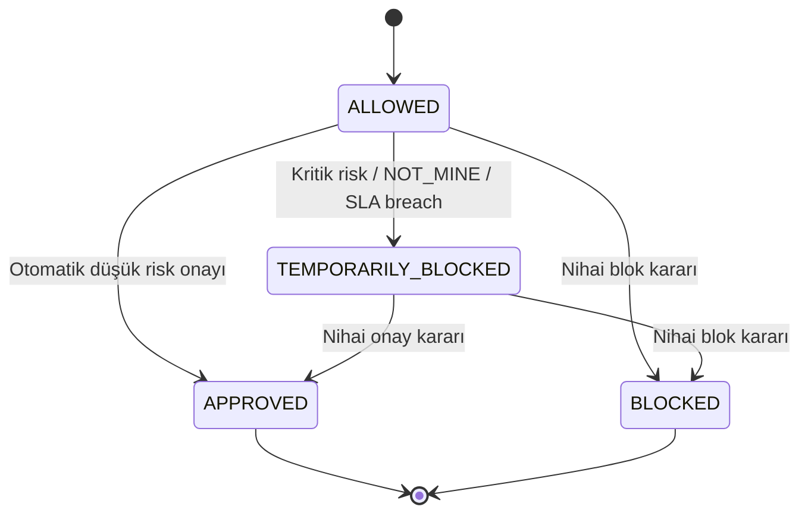
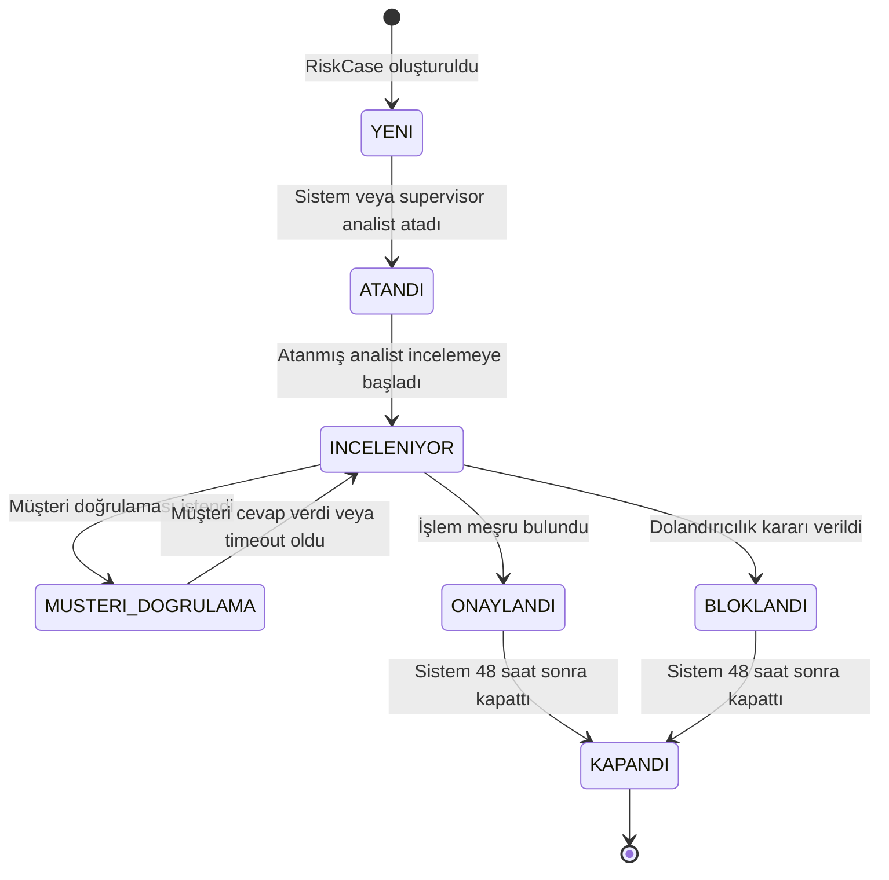

# FraudCell — Domain Modeli ve Risk Vakası State Machine

**Doküman:** `05-DOMAIN-AND-STATE-MACHINE.md`
**Durum:** Accepted — Domain Baseline v1.0
**Sistem:** FraudCell — Turkcell Gerçek Zamanlı Dolandırıcılık Tespit Platformu
**Son güncelleme:** YYYY-MM-DD
**İlgili dokümanlar:**

- `00-START-HERE.md`
- `01-REQUIREMENTS-TRACEABILITY.md`
- `02-ARCHITECTURE-OVERVIEW.md`
- `03-TECH-STACK.md`
- `04-SERVICE-BOUNDARIES.md`
- `06-DATA-ARCHITECTURE.md`
- `07-API-DESIGN.md`
- `08-EVENT-DRIVEN-ARCHITECTURE.md`
- `09-IDENTITY-SECURITY-AND-AUDIT.md`
- `10-AI-SERVICE-DESIGN.md`
- `11-GAMIFICATION-DESIGN.md`
- `12-RESILIENCE-AND-OBSERVABILITY.md`
- `14-TEST-STRATEGY.md`

---

# 1. Dokümanın Amacı

Bu doküman FraudCell sisteminin Transaction Service merkezli domain modelini ve risk vakası yaşam döngüsünü kesinleştirir.

Bu dokümanda aşağıdaki sorular cevaplanır:

- Transaction ile RiskCase arasındaki ilişki nedir?
- Transaction’ın değişmeyen gerçekleri nelerdir?
- AI değerlendirmesi nasıl saklanır?
- AI’ın orijinal tahmini ile sonradan oluşan efektif risk bilgisi nasıl ayrılır?
- Hangi işlemler risk vakasına dönüşür?
- Risk skoru hangi seviyeye ve karara karşılık gelir?
- Case hangi durumlara sahip olabilir?
- Hangi durumdan hangi duruma geçilebilir?
- Her geçişi kim gerçekleştirebilir?
- Supervisor hangi durumlarda analist davranışını override edebilir?
- Geçersiz state transition nasıl reddedilir?
- SLA ne zaman başlar, ne zaman durur ve nasıl aşılır?
- Müşteri “Ben yapmadım” dediğinde ne olur?
- Geçici blok ile nihai blok arasındaki fark nedir?
- AI sonucu geç geldiğinde sistem nasıl davranır?
- Aynı case’e eşzamanlı iki karar verilmesi nasıl engellenir?
- Case ne zaman kapanır?
- Müşteri feedback’i ne zaman ve kaç kez verilebilir?
- Domain kuralları hangi error code’larla dışarı yansıtılır?

Bu doküman domain davranışının ana otoritesidir.

Endpoint adları `07-API-DESIGN.md`, tablo ve indeks ayrıntıları `06-DATA-ARCHITECTURE.md`, event payload’ları ise `08-EVENT-DRIVEN-ARCHITECTURE.md` içinde tanımlanacaktır.

---

# 2. Domain Tasarım Prensipleri

FraudCell Transaction domain’i aşağıdaki prensiplere göre geliştirilecektir.

## 2.1 Domain State Serbestçe Değiştirilemez

Risk case durumu aşağıdaki gibi genel bir setter ile değiştirilemez:

```csharp
riskCase.Status = requestedStatus;
```

Bunun yerine niyet belirten domain metotları kullanılacaktır:

```csharp
riskCase.Assign(...);
riskCase.StartReview(...);
riskCase.RequestCustomerVerification(...);
riskCase.RecordCustomerResponse(...);
riskCase.Approve(...);
riskCase.Block(...);
riskCase.Close(...);
```

Her domain metodu:

- Mevcut durumu
- Actor rolünü
- Actor sahipliğini
- Zorunlu alanları
- Concurrency bilgisini
- SLA etkisini
- Oluşacak domain event’leri

kontrol eder.

## 2.2 Orijinal Tahmin Korunur

AI tarafından üretilen tahmin daha sonra değiştirilmeyecektir.

Sistem aşağıdaki değerleri ayrı tutar:

- AI tarafından üretilen orijinal risk skoru
- AI tarafından üretilen orijinal fraud türü
- Efektif risk skoru
- Efektif risk seviyesi
- Efektif fraud türü
- Analyst veya supervisor override bilgisi

Bu ayrım AI doğruluk metriği ve audit için zorunludur.

## 2.3 Geçici Kontrol ile Nihai Karar Ayrıdır

Bir transaction geçici olarak bloklanabilir.

Bu durum case’in nihai olarak `BLOKLANDI` olduğu anlamına gelmez.

Örnek geçici blok nedenleri:

- AI risk skoru `> 0.90`
- Müşteri “Ben yapmadım” cevabı
- KRITIK vaka SLA aşımı
- Supervisor’ın güvenlik amaçlı geçici blok kararı

Nihai blok kararı yalnızca uygun yetkili tarafından case kararı olarak verilir.

## 2.4 Her Aggregate Kendi Invariant’ını Korur

`Transaction` aggregate’i:

- İşlem gerçeklerini
- AI assessment durumunu
- Transaction kontrol durumunu
- Geçici blok bilgisini

korur.

`RiskCase` aggregate’i:

- Case state’ini
- Assignment’ı
- SLA’yı
- Müşteri doğrulama sürecini
- Nihai kararı
- Case kapanışını

korur.

Application layer iki aggregate arasındaki akışı koordine eder.

## 2.5 Domain Zamanı Test Edilebilir Olmalıdır

Domain kodu doğrudan sistem saatine bağlanmayacaktır.

.NET tarafında:

```text
TimeProvider
```

veya eşdeğer clock abstraction kullanılacaktır.

Bu yaklaşım aşağıdaki testleri deterministik yapar:

- SLA hesaplama
- 15 dakikadan hızlı karar
- 48 saat sonra kapanış
- Customer verification timeout
- Hesap kilidi dışındaki transaction zaman kontrolleri
- Daily gamification sınırları

---

# 3. Ana Domain Kavramları

FraudCell Transaction domain’inin temel kavramları:

| Kavram                 | Açıklama                                                              |
| ---------------------- | --------------------------------------------------------------------- |
| `Transaction`          | Müşterinin gerçekleştirdiği ödeme, transfer, fatura veya çekim işlemi |
| `AiAssessmentSnapshot` | AI tarafından üretilmiş orijinal tahmin sonucu                        |
| `RiskCase`             | İnsan incelemesi veya kritik kontrol gerektiren işlem vakası          |
| `CaseAssignment`       | Risk vakasının belirli bir analiste atanması                          |
| `CaseTransition`       | Risk vakasında gerçekleşen state değişikliğinin geçmiş kaydı          |
| `SlaPolicy`            | Risk seviyesine göre çözüm süresini belirleyen kural                  |
| `CustomerVerification` | Müşteriden işlemi doğrulamasını isteyen süreç                         |
| `CaseDecision`         | Analist veya supervisor tarafından verilen nihai onay/blok kararı     |
| `TemporaryBlock`       | Transaction üzerinde geçici güvenlik kontrolü                         |
| `CustomerFeedback`     | Kapanan vaka sonrasında verilen 1–5 yıldız memnuniyet puanı           |
| `IdempotencyRecord`    | Aynı transaction isteğinin iki kez uygulanmasını engelleyen kayıt     |

---

# 4. Aggregate Sınırları

## 4.1 Transaction Aggregate

Aggregate root:

```text
Transaction
```

Transaction aggregate aşağıdaki bilgilerin sahibidir:

- Transaction ID
- Transaction number
- Customer ID
- Amount
- Currency
- Transaction type
- Recipient
- Device fingerprint
- Location
- Occurred at
- Created at
- Assessment status
- AI assessment snapshot
- Effective risk information
- Transaction control status
- Temporary block information
- Risk case reference
- Concurrency version

Transaction aggregate aşağıdaki işlemleri yapabilir:

- Oluşturulmak
- AI assessment sonucunu almak
- Assessment timeout olarak işaretlenmek
- Efektif risk bilgisini güncellemek
- Geçici olarak bloklanmak
- Geçici bloktan çıkarılmak
- Nihai olarak onaylanmak
- Nihai olarak bloklanmak
- Risk case ile ilişkilendirilmek

## 4.2 RiskCase Aggregate

Aggregate root:

```text
RiskCase
```

RiskCase aşağıdaki bilgilerin sahibidir:

- Case ID
- Transaction ID
- Customer ID
- Case state
- Assignment status
- Assigned analyst ID
- AI prediction reference
- Orijinal risk bilgisi snapshot’ı
- Efektif risk bilgisi
- Fraud type
- SLA priority
- SLA start/deadline/breach bilgisi
- Review started at
- Customer verification
- Final decision
- Decision note
- Decided at
- Closed at
- Customer feedback
- Concurrency version

RiskCase aşağıdaki işlemleri yapabilir:

- Oluşturulmak
- Analiste atanmak
- Assignment queue’ya alınmak
- İncelemeye başlanmak
- Müşteri doğrulaması istemek
- Müşteri cevabını kaydetmek
- Fraud türünü override etmek
- Risk seviyesini override etmek
- Onaylanmak
- Bloklanmak
- SLA aşımı olarak işaretlenmek
- Kapanmak
- Feedback almak

## 4.3 Aggregate Ayrımının Nedeni

Transaction ve RiskCase aynı servis ve database içinde bulunur; ancak farklı yaşam döngülerine sahiptir.

Transaction:

- Her müşteri işlemi için vardır.
- Case oluşmasa da kalıcıdır.
- İşlem gerçeklerini taşır.
- Değişiklik sayısı sınırlıdır.

RiskCase:

- Yalnızca inceleme gereken işlemler için oluşur.
- Çok sayıda state transition içerir.
- Assignment, SLA ve insan kararı taşır.
- Daha yoğun concurrency kontrolüne ihtiyaç duyar.

Bu nedenle iki kavram tek devasa aggregate altında birleştirilmeyecektir.

---

# 5. Kimlik ve Referans Standardı

## 5.1 Internal ID

Internal entity ID’leri:

```text
ULID
```

olacaktır.

Örnek:

```text
01JZX5M0SDYF92K25F00V3R2R8
```

## 5.2 Transaction Number

Kullanıcıya gösterilen transaction number:

```text
TRX-2026-000123
```

formatında olacaktır.

Transaction number:

- Sistem genelinde unique
- İnsan tarafından okunabilir
- Database unique constraint ile korunmuş
- Internal ID’den bağımsız

olacaktır.

## 5.3 User Referansları

Transaction Service kullanıcı entity’si saklamaz.

Aşağıdaki alanlar opaque identity reference olarak tutulur:

```text
customerId
analystId
supervisorId
actorId
```

Identity Database’e cross-database foreign key kurulmaz.

---

# 6. Value Object’ler

## 6.1 Money

```text
Money
- amount
- currency
```

Kurallar:

- Amount `> 0` olmalıdır.
- Amount iki ondalık basamağa normalize edilir.
- Baseline currency `TRY` olur.
- Floating-point kullanılmaz.
- Database’te decimal/numeric tip kullanılır.

Örnek:

```json
{
  "amount": 25000.0,
  "currency": "TRY"
}
```

## 6.2 TransactionNumber

```text
TransactionNumber
```

Kurallar:

- Boş olamaz.
- Format doğrulanır.
- Değiştirilemez.
- Sistem genelinde unique olmalıdır.

## 6.3 DeviceFingerprint

```text
DeviceFingerprint
```

Kurallar:

- Boş olamaz.
- Normalize edilir.
- Maksimum uzunluk sınırı bulunur.
- Ham cihaz secret’ı veya kişisel veri taşımamalıdır.

## 6.4 TransactionLocation

```text
TransactionLocation
- city
- country
```

Baseline:

- `city` zorunlu
- `country` zorunlu
- Country ISO koduna normalize edilebilir
- Demo yurt dışı işlemi için Türkiye dışı country kullanılabilir

## 6.5 RiskScore

```text
RiskScore
```

Kurallar:

```text
0.0 <= riskScore <= 1.0
```

Risk score:

- Decimal/double olarak alınabilir.
- Domain sınırında range validation yapılır.
- API response’ta uygun hassasiyetle gösterilir.
- Orijinal AI skoru değiştirilemez.
- Efektif skor ayrı alanda tutulur.

## 6.6 DecisionNote

```text
DecisionNote
```

Kurallar:

- Blok kararında zorunludur.
- Yalnızca whitespace olamaz.
- Minimum anlamlı uzunluk uygulanabilir.
- Maksimum uzunluk sınırı bulunur.
- HTML kabul edilmez.
- Plain text olarak saklanır.

## 6.7 SlaDeadline

```text
SlaDeadline
- startedAt
- deadlineAt
- breachedAt
- stoppedAt
```

Kurallar:

- `deadlineAt > startedAt`
- `breachedAt` yalnızca bir kez atanabilir
- `stoppedAt` final karar anında atanır
- SLA breach kaydı silinemez

---

# 7. Transaction Type

Desteklenen transaction türleri:

```text
ODEME
TRANSFER
FATURA
CEKIM
```

Enum:

```csharp
public enum TransactionType
{
    Odeme,
    Transfer,
    Fatura,
    Cekim
}
```

API ve event değerleri:

```text
ODEME
TRANSFER
FATURA
CEKIM
```

şeklinde serialize edilir.

---

# 8. Fraud Type

Desteklenen fraud türleri:

```text
CALINTI_KART
HESAP_ELE_GECIRME
PARA_AKLAMA
SUPHELI_DAVRANIS
TEMIZ
```

## 8.1 Orijinal Fraud Type

AI tarafından üretilen değer:

```text
aiFraudType
```

olarak saklanır.

Bu değer sonradan değiştirilmez.

## 8.2 Efektif Fraud Type

İnsan incelemesi sonrasında kullanılan değer:

```text
effectiveFraudType
```

olarak saklanır.

Başlangıçta:

```text
effectiveFraudType = aiFraudType
```

olur.

Analist veya supervisor override ettiğinde yalnızca efektif değer değişir.

## 8.3 Override Kuralları

Fraud type override:

- Yalnızca atanmış analyst veya supervisor yapabilir.
- Case final karar verilmeden önce yapılabilir.
- Yeni tür eski türden farklı olmalıdır.
- Override nedeni zorunludur.
- Orijinal AI tahmini korunur.
- Override audit edilir.
- AI Service’e feedback event’i yayınlanır.

Final karar verilmiş case’te fraud type değiştirilmez.

---

# 9. AI Assessment Status

Transaction üzerinde assessment durumu aşağıdaki enum ile tutulur:

```text
PENDING
COMPLETED
TIMED_OUT
FAILED
```

## 9.1 PENDING

İşlem oluşturulmuştur ancak AI sonucu henüz gelmemiştir.

Başlangıç davranışı:

```text
assessmentStatus = PENDING
riskScore = null
riskLevel = null
displayRiskLevel = BELIRSIZ
safeDecision = INCELEME
```

## 9.2 COMPLETED

AI sonucu geçerli biçimde alınmış ve uygulanmıştır.

## 9.3 TIMED_OUT

Belirlenen assessment deadline içinde sonuç gelmemiştir.

Davranış:

- Risk kullanıcıya `BELIRSIZ` gösterilir.
- Güvenli karar `INCELEME` olarak tutulur.
- Manuel review case oluşturulur.
- SLA priority `YUKSEK` olarak atanır.
- Case manuel assignment queue’ya alınır.
- AI geç gelirse prediction evidence olarak saklanabilir.

## 9.4 FAILED

AI Service event’i işleyip teknik veya model kaynaklı hata sonucu üretmiştir.

Davranış:

- Timeout ile aynı güvenli fallback uygulanır.
- Teknik hata kodu kullanıcıya sızdırılmaz.
- Internal failure reason loglanır.
- Manuel review case oluşturulur.
- Retry/DLQ süreci event katmanında yönetilir.

---

# 10. Risk Kararı Eşikleri

AI karar eşikleri kesin olarak:

```text
riskScore < 0.40          -> ONAY
0.40 <= riskScore <= 0.90 -> INCELEME
riskScore > 0.90          -> BLOK
```

Boundary davranışları:

| Risk skoru | Karar      |
| ---------: | ---------- |
|   `0.0000` | `ONAY`     |
|   `0.3999` | `ONAY`     |
|   `0.4000` | `INCELEME` |
|   `0.7000` | `INCELEME` |
|   `0.9000` | `INCELEME` |
|   `0.9001` | `BLOK`     |
|   `1.0000` | `BLOK`     |

Bu sınırlar unit testlerle korunacaktır.

---

# 11. Risk Seviyesi Eşikleri

Risk level mapping aşağıdaki şekilde kesinleştirilmiştir:

```text
0.00 <= riskScore < 0.40  -> DUSUK
0.40 <= riskScore < 0.70  -> ORTA
0.70 <= riskScore <= 0.90 -> YUKSEK
0.90 < riskScore <= 1.00  -> KRITIK
```

Boundary tablosu:

| Risk skoru | Risk seviyesi | AI kararı  |
| ---------: | ------------- | ---------- |
|   `0.0000` | `DUSUK`       | `ONAY`     |
|   `0.3999` | `DUSUK`       | `ONAY`     |
|   `0.4000` | `ORTA`        | `INCELEME` |
|   `0.6999` | `ORTA`        | `INCELEME` |
|   `0.7000` | `YUKSEK`      | `INCELEME` |
|   `0.9000` | `YUKSEK`      | `INCELEME` |
|   `0.9001` | `KRITIK`      | `BLOK`     |
|   `1.0000` | `KRITIK`      | `BLOK`     |

Bu aralıklar PDF’de kesin verilmeyen `DUSUK`, `ORTA` ve `YUKSEK` sınırlarını tamamlayan FraudCell domain kararıdır.

---

# 12. Risk Level ile SLA Priority Ayrımı

AI değerlendirmesi bulunmadığında gerçek risk level bilinemez.

Bu nedenle iki farklı kavram kullanılır:

```text
riskLevel
slaPriority
```

## 12.1 Normal Akış

AI sonucu varsa:

```text
slaPriority = riskLevel
```

## 12.2 AI Timeout veya Failure

AI sonucu yoksa:

```text
riskLevel = null
displayRiskLevel = BELIRSIZ
slaPriority = YUKSEK
```

Bu kararın nedeni:

- Bilinmeyen riski düşük önceliğe atmamak
- Manual review kuyruğunun 1 saatlik operasyonel hedefe sahip olması
- Risk bilgisi olmadan `KRITIK` iddiasında bulunmamak
- Güvenli ama aşırı olmayan bir fallback kullanmak

Supervisor daha sonra efektif risk seviyesini ve SLA priority’yi yetkili override ile değiştirebilir.

---

# 13. Risk Case Oluşturma Kuralları

Risk case aşağıdaki durumlarda oluşturulur.

## 13.1 AI Kararı INCELEME

```text
0.40 <= riskScore <= 0.90
```

Davranış:

- RiskCase oluşturulur.
- Case başlangıç durumu `YENI`.
- SLA risk seviyesine göre başlar.
- Analyst assignment değerlendirilir.

## 13.2 AI Kararı BLOK

```text
riskScore > 0.90
```

Davranış:

- RiskCase oluşturulur.
- Transaction geçici bloklanır.
- Risk seviyesi `KRITIK`.
- SLA 15 dakika olarak başlar.
- Analyst assignment değerlendirilir.
- Müşteriye şüpheli işlem bildirimi oluşturulur.

## 13.3 Assessment TIMED_OUT

Davranış:

- Manual fallback RiskCase oluşturulur.
- Case state `YENI`.
- Risk level bilinmiyor olarak kalır.
- SLA priority `YUKSEK`.
- Assignment status `MANUAL_QUEUE`.
- Supervisor dashboard’a düşer.

## 13.4 Assessment FAILED

Timeout ile aynı güvenli fallback uygulanır.

## 13.5 ONAY Kararı

```text
riskScore < 0.40
```

Normal durumda RiskCase oluşturulmaz.

Transaction doğrudan onaylanır.

## 13.6 Tek Transaction için Tek Aktif Case

Bir transaction için aynı anda en fazla bir aktif RiskCase bulunabilir.

Database seviyesinde uygun unique/partial constraint uygulanacaktır.

Duplicate event veya race condition ikinci aktif case oluşturmamalıdır.

---

# 14. Transaction Control Status

Transaction’ın finansal/operasyonel kontrol durumu aşağıdaki enum ile tutulur:

```text
ALLOWED
TEMPORARILY_BLOCKED
APPROVED
BLOCKED
```

## 14.1 ALLOWED

Transaction henüz final karara ulaşmamıştır ve geçici blok uygulanmamıştır.

## 14.2 TEMPORARILY_BLOCKED

Transaction güvenlik nedeniyle geçici olarak durdurulmuştur.

Bu nihai karar değildir.

## 14.3 APPROVED

Case nihai olarak onaylanmış veya düşük risk nedeniyle otomatik onaylanmıştır.

## 14.4 BLOCKED

Case nihai olarak bloklanmıştır.

## 14.5 Geçişler



Final `APPROVED` veya `BLOCKED` durumundan geri dönüş yoktur.

---

# 15. Geçici Blok Nedenleri

Geçici blok nedenleri:

```text
AI_CRITICAL_RISK
CUSTOMER_NOT_MINE
CRITICAL_SLA_BREACH
SUPERVISOR_SECURITY_OVERRIDE
```

Temporary block kaydı aşağıdaki bilgileri taşır:

- Reason
- Applied at
- Applied by actor/system
- Source event ID
- Correlation ID
- Released at
- Release reason

Geçici blok aynı nedenden tekrar uygulanırsa duplicate kayıt veya event üretmemelidir.

---

# 16. Risk Case State’leri

RiskCase state enum:

```text
YENI
ATANDI
INCELENIYOR
MUSTERI_DOGRULAMA
ONAYLANDI
BLOKLANDI
KAPANDI
```

## 16.1 YENI

Case oluşturulmuştur ancak bir analiste kesin olarak atanmamıştır.

Olası assignment status:

```text
UNASSIGNED
QUEUED
MANUAL_QUEUE
```

## 16.2 ATANDI

Case aktif bir analiste atanmıştır.

Analist henüz review başlatmamıştır.

## 16.3 INCELENIYOR

Atanmış analist veya supervisor vakayı aktif olarak inceliyordur.

## 16.4 MUSTERI_DOGRULAMA

Müşteriye doğrulama sorusu gönderilmiştir ve cevap bekleniyordur.

## 16.5 ONAYLANDI

İşlem meşru bulunmuştur.

Bu final karar state’idir.

SLA durur.

## 16.6 BLOKLANDI

Dolandırıcılık doğrulanmış veya işlem bloklanmasına karar verilmiştir.

Bu final karar state’idir.

SLA durur.

## 16.7 KAPANDI

Final karar üzerinden 48 saat geçmiştir ve case operasyonel olarak kapanmıştır.

Customer feedback yalnızca bu durumda alınabilir.

---

# 17. State Machine Diyagramı



---

# 18. İzin Verilen State Transition Matrisi

| Mevcut durum        | Hedef durum         | Normal actor    | Supervisor override | Koşul                                                       |
| ------------------- | ------------------- | --------------- | ------------------: | ----------------------------------------------------------- |
| `YENI`              | `ATANDI`            | Sistem          |                Evet | Uygun aktif analist belirlenmiş olmalı                      |
| `ATANDI`            | `INCELENIYOR`       | Atanmış analist |                Evet | Assignment aktif olmalı                                     |
| `INCELENIYOR`       | `MUSTERI_DOGRULAMA` | Atanmış analist |                Evet | Açık doğrulama isteği bulunmamalı                           |
| `MUSTERI_DOGRULAMA` | `INCELENIYOR`       | Sistem          |               Hayır | Müşteri cevap vermiş veya verification timeout olmuş olmalı |
| `INCELENIYOR`       | `ONAYLANDI`         | Atanmış analist |                Evet | Final karar daha önce verilmemiş olmalı                     |
| `INCELENIYOR`       | `BLOKLANDI`         | Atanmış analist |                Evet | Karar notu zorunlu                                          |
| `ONAYLANDI`         | `KAPANDI`           | Sistem          |               Hayır | `decidedAt + 48 saat` geçmiş olmalı                         |
| `BLOKLANDI`         | `KAPANDI`           | Sistem          |               Hayır | `decidedAt + 48 saat` geçmiş olmalı                         |

Bu tablonun dışındaki bütün state transition’lar geçersizdir.

---

# 19. Supervisor Override Politikası

Role matrix supervisor’a durum değiştirme yetkisi vermektedir.

Ancak supervisor state’i serbestçe herhangi bir değere çeviremez.

Supervisor yalnızca normal state machine içindeki izin verilen transition’ları gerçekleştirebilir.

Supervisor override için:

- `overrideReason` zorunlu
- Actor ID kaydedilir
- Önceki ve yeni state kaydedilir
- Audit event üretilir
- Notification gerekiyorsa yayınlanır
- Concurrency kontrolü uygulanır

Supervisor aşağıdaki işlemleri yapabilir:

- Manuel assignment
- Assigned case’i incelemeye başlatma
- Müşteri doğrulaması isteme
- Nihai onay verme
- Nihai blok kararı verme
- Fraud type override
- Risk level override

Supervisor aşağıdakileri yapamaz:

- `YENI` state’inden doğrudan `BLOKLANDI` state’ine atlamak
- `ATANDI` state’inden doğrudan `ONAYLANDI` state’ine atlamak
- Final kararı geri almak
- `KAPANDI` case’i yeniden açmak
- Transition history silmek
- SLA breach geçmişini temizlemek

---

# 20. YENI → ATANDI

Command:

```text
AssignCase
```

Actor:

- Sistem
- Supervisor

Koşullar:

1. Case `YENI` olmalıdır.
2. Analyst ID bulunmalıdır.
3. Analyst aktif olmalıdır.
4. Analyst rolü uygun olmalıdır.
5. Analyst’in güncel aktif case sayısı kapasitenin altında olmalıdır.
6. Aynı case’in aktif assignment’ı bulunmamalıdır.
7. Concurrency version eşleşmelidir.

Sonuç:

- Assignment kaydı oluşturulur.
- `assignedAnalystId` atanır.
- `assignmentStatus = ASSIGNED`
- Case state `ATANDI` olur.
- `assignedAt` atanır.
- `case.assigned` event’i üretilir.
- Analyst notification event’i üretilir.
- Transition history kaydedilir.

Hatalar:

```text
CASE_NOT_NEW
ANALYST_NOT_FOUND
ANALYST_NOT_ACTIVE
ANALYST_CAPACITY_EXCEEDED
CASE_ALREADY_ASSIGNED
CONCURRENCY_CONFLICT
```

---

# 21. ATANDI → INCELENIYOR

Command:

```text
StartReview
```

Normal actor:

- Case’e atanmış analyst

Supervisor:

- Override reason ile gerçekleştirebilir

Koşullar:

1. Case `ATANDI` olmalıdır.
2. Assignment aktif olmalıdır.
3. Normal analyst actor assignment sahibi olmalıdır.
4. Final karar bulunmamalıdır.
5. Concurrency version eşleşmelidir.

Sonuç:

- State `INCELENIYOR`
- `reviewStartedAt` atanır
- `case.review.started` event’i üretilir
- Transition history kaydedilir
- Audit event üretilir

Aynı analyst tekrar `StartReview` gönderirse:

- İşlem idempotent ele alınabilir
- Yeni transition oluşturulmaz
- Mevcut state response olarak dönebilir

Başka analyst gönderirse:

```text
CASE_NOT_ASSIGNED_TO_ACTOR
```

hatası döner.

---

# 22. INCELENIYOR → MUSTERI_DOGRULAMA

Command:

```text
RequestCustomerVerification
```

Actor:

- Atanmış analyst
- Supervisor override

Koşullar:

1. Case `INCELENIYOR` olmalıdır.
2. Açık verification request bulunmamalıdır.
3. Transaction owner/customer ID bulunmalıdır.
4. Final karar bulunmamalıdır.
5. Concurrency version eşleşmelidir.

Verification request:

```text
status = PENDING
requestedAt = now
expiresAt = now + configuredDuration
```

Baseline customer verification timeout:

```text
10 dakika
```

Environment:

```text
CUSTOMER_VERIFICATION_TIMEOUT_MINUTES=10
```

Sonuç:

- State `MUSTERI_DOGRULAMA`
- Verification request oluşturulur
- Customer notification event’i üretilir
- `case.customer_verification.requested` event’i üretilir
- Transition history kaydedilir
- SLA çalışmaya devam eder

Müşteri doğrulaması istenmesi SLA’yı durdurmaz.

---

# 23. MUSTERI_DOGRULAMA → INCELENIYOR

Bu transition yalnızca sistem tarafından uygulanır.

Tetikleyiciler:

- Müşteri cevap verdi
- Customer verification timeout oldu

## 23.1 Müşteri Cevap Verdi

Cevap enum:

```text
MINE
NOT_MINE
```

Koşullar:

1. Case `MUSTERI_DOGRULAMA` olmalıdır.
2. Açık verification request bulunmalıdır.
3. Actor transaction’ın müşterisi olmalıdır.
4. Request daha önce cevaplanmamış olmalıdır.
5. Feedback değil verification response gönderiliyor olmalıdır.

Sonuç:

- Verification response kaydedilir
- Verification request `ANSWERED` olur
- Case state `INCELENIYOR` olur
- Transition history kaydedilir
- `customer.verification.responded` event’i üretilir
- Analyst notification event’i üretilir

## 23.2 Verification Timeout

Verification süresi dolduğunda:

- Request `EXPIRED` olur
- Response `NO_RESPONSE` olarak operational evidence’a eklenir
- Case state `INCELENIYOR` olur
- Analyst notification event’i üretilir
- SLA devam eder
- Nihai karar otomatik verilmez

---

# 24. Müşteri “Bu İşlemi Ben Yaptım” Cevabı

Cevap:

```text
MINE
```

Davranış:

- Müşteri cevabı evidence olarak kaydedilir.
- AI orijinal risk skoru değiştirilmez.
- Efektif risk skoru otomatik düşürülmez.
- Transaction üzerindeki kritik geçici blok otomatik kaldırılmaz.
- Nihai karar analyst veya supervisor tarafından verilir.
- Fraud type otomatik `TEMIZ` yapılmaz.

Bu kararın nedeni müşteri hesabının ele geçirilmiş veya müşterinin baskı altında olabileceği ihtimalidir.

Müşteri cevabı karar destek bilgisidir; tek başına final karar değildir.

---

# 25. Müşteri “Ben Yapmadım” Cevabı

Cevap:

```text
NOT_MINE
```

Kesin domain davranışı:

```text
effectiveRiskScore = max(currentEffectiveRiskScore, 0.91)
effectiveRiskLevel = KRITIK
slaPriority = KRITIK
temporaryBlock = true
```

Ek davranış:

- Temporary block nedeni `CUSTOMER_NOT_MINE`
- Transaction geçici bloklanır
- Case state tekrar `INCELENIYOR` olur
- Analyst’e yüksek öncelikli notification gönderilir
- Supervisor dashboard’da case kritik olarak güncellenir
- Event yayınlanır
- Audit kaydı üretilir

Ancak:

```text
caseStatus != BLOKLANDI
```

Case otomatik olarak nihai `BLOKLANDI` olmaz.

Nihai karar analyst veya supervisor tarafından verilir.

## 25.1 SLA Yeniden Hesaplama

“Ben yapmadım” cevabı case’i KRITIK seviyeye yükselttiğinde:

```text
newDeadline = caseCreatedAt + 15 dakika
```

olarak yeniden hesaplanır.

Yeni deadline geçmişte kaldıysa SLA aynı transaction içinde breached olarak işaretlenir.

Daha önce oluşmuş SLA breach kaydı hiçbir zaman temizlenmez.

---

# 26. INCELENIYOR → ONAYLANDI

Command:

```text
ApproveCase
```

Normal actor:

- Atanmış analyst

Supervisor:

- Override reason ile

Koşullar:

1. Case `INCELENIYOR` olmalıdır.
2. Actor yetkili olmalıdır.
3. Final decision bulunmamalıdır.
4. Concurrency version eşleşmelidir.
5. İlgili case hâlâ aktiftir.
6. Supervisor override ise reason zorunludur.

Karar notu:

- Approval için opsiyonel
- Maksimum uzunluk sınırına tabidir
- Plain text olmalıdır

Sonuç:

- Case state `ONAYLANDI`
- Final decision `APPROVE`
- `decidedAt = now`
- SLA durur
- Transaction control status `APPROVED`
- Var olan temporary block kaldırılır
- Active assignment tamamlanır
- Analyst workload azaltılır
- `case.decision.made` event’i üretilir
- Customer notification üretilir
- Audit event üretilir
- Transition history kaydedilir
- Case kapanış zamanı `decidedAt + 48 saat` olarak planlanır

---

# 27. INCELENIYOR → BLOKLANDI

Command:

```text
BlockCase
```

Normal actor:

- Atanmış analyst

Supervisor:

- Override reason ile

Koşullar:

1. Case `INCELENIYOR` olmalıdır.
2. Actor yetkili olmalıdır.
3. Final decision bulunmamalıdır.
4. Decision note bulunmalıdır.
5. Decision note yalnızca whitespace olmamalıdır.
6. Concurrency version eşleşmelidir.
7. Supervisor override ise override reason bulunmalıdır.

Sonuç:

- Case state `BLOKLANDI`
- Final decision `BLOCK`
- `decidedAt = now`
- SLA durur
- Transaction control status `BLOCKED`
- Temporary block nihai blokla kapanır
- Active assignment tamamlanır
- Analyst workload azaltılır
- `case.decision.made` event’i üretilir
- Customer notification üretilir
- Audit event üretilir
- Transition history kaydedilir
- Case kapanış zamanı `decidedAt + 48 saat` olarak planlanır

Decision note olmadan:

```text
422 DECISION_NOTE_REQUIRED
```

dönmelidir.

---

# 28. Final Kararların Değişmezliği

Case aşağıdaki state’lerden birine ulaştığında final karar verilmiştir:

```text
ONAYLANDI
BLOKLANDI
KAPANDI
```

Bu state’lerde:

- Yeni karar verilemez.
- Fraud type override yapılamaz.
- Risk level override yapılamaz.
- Assignment değiştirilemez.
- Customer verification istenemez.
- Review yeniden başlatılamaz.
- Case yeniden açılamaz.

Yanlış karar tespit edilirse mevcut karar geçmişten silinmez.

Gelecekte düzeltme ihtiyacı oluşursa ayrı bir:

```text
DecisionCorrection
```

iş akışı tasarlanmalıdır.

Bu akış baseline kapsamına dahil değildir.

---

# 29. ONAYLANDI → KAPANDI

Actor:

- Sistem

Koşullar:

1. Case `ONAYLANDI` olmalıdır.
2. `decidedAt` bulunmalıdır.
3. `now >= decidedAt + 48 saat`
4. Case daha önce kapanmamış olmalıdır.

Sonuç:

- State `KAPANDI`
- `closedAt = now`
- `case.closed` event’i üretilir
- Customer feedback özelliği aktif hale gelir
- Transition history kaydedilir

---

# 30. BLOKLANDI → KAPANDI

PDF’de bloklanan case’in kapanış yolu açıkça belirtilmemiştir.

FraudCell domain kararı:

> `BLOKLANDI` case sistem tarafından nihai blok kararından 48 saat sonra `KAPANDI` durumuna geçirilir.

Actor:

- Sistem

Koşullar:

1. Case `BLOKLANDI` olmalıdır.
2. `decidedAt` bulunmalıdır.
3. `now >= decidedAt + 48 saat`
4. Case daha önce kapanmamış olmalıdır.

Sonuç:

- State `KAPANDI`
- `closedAt = now`
- `case.closed` event’i üretilir
- Customer feedback özelliği aktif hale gelir
- Transition history kaydedilir

Bu karar aşağıdaki nedenlerle verilmiştir:

- Customer feedback yalnızca `KAPANDI` durumda verilebilir.
- Bloklanan case’lerin sonsuza kadar aktif kalmaması gerekir.
- Analyst workload final kararda zaten kapanmıştır.
- Onaylanan ve bloklanan case’ler aynı operasyonel kapanış politikasına sahip olmalıdır.

---

# 31. Case Closure Worker

Case Closure Worker belirli aralıklarla aşağıdaki case’leri bulur:

```text
status IN (ONAYLANDI, BLOKLANDI)
AND decided_at <= now - 48 saat
AND closed_at IS NULL
```

Concurrency güvenliği için PostgreSQL üzerinde:

```sql
FOR UPDATE SKIP LOCKED
```

veya eşdeğer locking yaklaşımı kullanılabilir.

Worker:

1. Uygun kayıtları batch olarak alır.
2. Her case için `Close` domain metodunu çağırır.
3. Transition ve outbox event’i yazar.
4. Transaction commit eder.
5. Başka worker’ın aynı case’i kapatmasını engeller.

Worker tekrar çalışırsa aynı case ikinci kez kapatılmaz.

---

# 32. Assignment Status

Case state ile assignment state ayrı kavramlardır.

Assignment status enum:

```text
UNASSIGNED
QUEUED
MANUAL_QUEUE
ASSIGNED
IN_PROGRESS
COMPLETED
CANCELLED
```

## 32.1 UNASSIGNED

Case oluşturulmuştur ancak assignment süreci henüz tamamlanmamıştır.

## 32.2 QUEUED

AI adayları değerlendirilmiş ancak uygun kapasite bulunamamıştır.

## 32.3 MANUAL_QUEUE

AI assessment yoktur veya otomatik atama güvenli şekilde tamamlanamamıştır.

Supervisor manuel atama yapmalıdır.

## 32.4 ASSIGNED

Case aktif analyst’e atanmıştır.

Case state:

```text
ATANDI
```

## 32.5 IN_PROGRESS

Analyst incelemeye başlamıştır.

Case state:

```text
INCELENIYOR
MUSTERI_DOGRULAMA
```

## 32.6 COMPLETED

Final karar verilmiştir.

## 32.7 CANCELLED

Bir assignment supervisor tarafından başka analyst’e yeniden atama sırasında kapatılmış olabilir.

Reassignment geçmişi silinmez.

---

# 33. Analyst Capacity

Her analyst için maksimum aktif vaka:

```text
10
```

Aktif vaka sayılan case state’leri:

```text
ATANDI
INCELENIYOR
MUSTERI_DOGRULAMA
```

`YENI` case aktif analyst workload’a dahil değildir.

Final state’ler:

```text
ONAYLANDI
BLOKLANDI
KAPANDI
```

aktif workload’a dahil değildir.

## 33.1 Capacity Invariant

Assignment oluşturulurken:

```text
activeCaseCount < 10
```

olmalıdır.

## 33.2 Race Condition Koruması

Aynı analyst’e eşzamanlı iki assignment yapılırken capacity aşılmamalıdır.

Kullanılabilecek yaklaşım:

- Analyst workload row lock
- Atomic counter update
- Serializable local transaction
- Optimistic concurrency ve retry

Nihai database yaklaşımı `06-DATA-ARCHITECTURE.md` içinde tanımlanacaktır.

---

# 34. Reassignment

Supervisor aktif case’i başka analyst’e atayabilir.

Reassignment koşulları:

- Case final durumda olmamalıdır.
- Yeni analyst aktif olmalıdır.
- Yeni analyst kapasitesi uygun olmalıdır.
- Yeni analyst mevcut analyst ile aynı olmamalıdır.
- Reassignment nedeni zorunludur.
- Eski assignment `CANCELLED` olur.
- Yeni assignment oluşturulur.
- Case state korunur.
- Review başlamışsa geçmiş korunur.
- Audit event üretilir.
- Eski ve yeni analyst’e notification gönderilir.

Case `MUSTERI_DOGRULAMA` durumundayken reassignment yapılırsa customer verification süreci devam eder.

---

# 35. SLA Süreleri

SLA priority ve süreleri:

| SLA Priority |      Süre |
| ------------ | --------: |
| `KRITIK`     | 15 dakika |
| `YUKSEK`     |    1 saat |
| `ORTA`       |    4 saat |
| `DUSUK`      |   24 saat |

SLA:

```text
case oluşturulma anında
```

başlar.

Assignment yapılmasını beklemez.

Analyst’in review başlatmasını beklemez.

---

# 36. SLA Başlangıcı

RiskCase oluşturulduğunda:

```text
slaStartedAt = caseCreatedAt
slaDeadlineAt = caseCreatedAt + slaDuration
```

Örnek:

```text
Case oluşturma: 14:00
Risk: KRITIK
SLA deadline: 14:15
```

AI timeout fallback case:

```text
riskLevel = null
slaPriority = YUKSEK
slaDeadlineAt = caseCreatedAt + 1 saat
```

---

# 37. SLA Durdurma

SLA aşağıdaki final kararlarda durur:

```text
ONAYLANDI
BLOKLANDI
```

SLA:

- `KAPANDI` state’ini beklemez.
- Customer feedback’i beklemez.
- Gamification event’ini beklemez.

Final kararda:

```text
slaStoppedAt = decidedAt
```

atanır.

SLA compliance:

```text
decidedAt <= slaDeadlineAt
```

ise başarılıdır.

---

# 38. SLA Aşımı

SLA aşağıdaki durumda aşılmış kabul edilir:

```text
now > slaDeadlineAt
AND finalDecision IS NULL
AND slaBreachedAt IS NULL
```

SLA Breach Worker:

1. Uygun case’i lock eder.
2. Hâlâ final karar olmadığını doğrular.
3. `slaBreachedAt = now` yazar.
4. `case.sla.breached` event’i üretir.
5. Audit kaydı üretir.
6. Gerekirse temporary block uygular.
7. Dashboard uyarılarını günceller.

SLA breach case state’ini değiştirmez.

Örnek:

```text
INCELENIYOR
```

state’inde kalır ancak:

```text
slaStatus = BREACHED
```

olur.

---

# 39. Risk Seviyesine Göre SLA Aşımı Davranışı

## 39.1 KRITIK

- Transaction geçici bloklanır.
- Supervisor dashboard’da en üstte kırmızı gösterilir.
- Yüksek öncelikli notification gönderilir.
- Gamification Service’e penalty event’i ulaşır.

## 39.2 YUKSEK

- Case turuncu olarak işaretlenir.
- Supervisor uyarısı oluşturulur.
- Gamification penalty event’i yayınlanır.

## 39.3 ORTA

- Görsel uyarı oluşturulur.
- Gamification penalty event’i yayınlanır.

## 39.4 DUSUK

- Görsel uyarı oluşturulur.
- Gamification penalty event’i yayınlanır.

---

# 40. SLA Risk Override Davranışı

Supervisor efektif risk seviyesini değiştirebilir.

Koşullar:

- Case final durumda olmamalıdır.
- Yeni seviye farklı olmalıdır.
- Override reason zorunludur.
- Orijinal AI risk seviyesi korunur.
- Audit ve event üretilir.

Yeni SLA deadline:

```text
caseCreatedAt + yeni risk seviyesinin SLA süresi
```

olarak yeniden hesaplanır.

Kurallar:

1. Deadline case oluşturma anından hesaplanır.
2. Önceki SLA breach kaydı varsa silinmez.
3. Yeni deadline geçmişteyse aynı transaction’da breach uygulanır.
4. Risk düşürülmesi daha önce oluşmuş breach’i geri almaz.
5. Final karardan sonra risk override yapılamaz.

---

# 41. SLA Warning Seviyeleri

Frontend ve dashboard için önerilen warning oranları:

```text
elapsed < 75%       -> NORMAL
75% <= elapsed <90% -> WARNING
90% <= elapsed      -> URGENT
deadline exceeded   -> BREACHED
```

Bu seviyeler yalnızca görsel/operasyonel projection’dır.

SLA breach kararı server tarafından verilir.

Frontend countdown breach event’inin source of truth’u değildir.

---

# 42. AI Assessment Snapshot

Transaction Service AI Database’e bağlanmaz.

AI sonucunun gerekli snapshot’ını kendi database’inde saklar.

Snapshot alanları:

- Assessment ID
- Source event ID
- AI risk score
- AI risk level
- AI decision
- AI fraud type
- Model version
- Reason codes
- Assessed at
- Received at
- Is late result
- Is applied as primary assessment

## 42.1 Immutable Alanlar

Aşağıdaki alanlar sonradan değiştirilmez:

- AI risk score
- AI risk level
- AI decision
- AI fraud type
- Model version
- Assessed at

## 42.2 Efektif Alanlar

Case üzerinde ayrı olarak:

- Effective risk score
- Effective risk level
- Effective fraud type
- Override source
- Override reason
- Override actor
- Override timestamp

tutulur.

---

# 43. Late AI Assessment

AI assessment fallback case oluşturulduktan sonra gelebilir.

Late result:

```text
receivedAt > assessmentDeadlineAt
```

ise late kabul edilir.

## 43.1 Genel Kural

Geç AI sonucu:

- Kaydedilir.
- Audit edilir.
- Analist evidence olarak gösterilir.
- Nihai insan kararını değiştirmez.
- Final case state’ini geriye almaz.
- Duplicate case oluşturmaz.

## 43.2 Case YENI ise

- AI sonucu evidence olarak uygulanır.
- Efektif risk bilgisi güncellenebilir.
- Assignment önerisi yeniden değerlendirilebilir.
- Manuel fallback case silinmez.
- Case otomatik onaylanmaz.
- Case manual review sürecinde kalır.

## 43.3 Case ATANDI ise

- AI sonucu evidence olarak eklenir.
- Review başlamamışsa assignment daha uygun analyst için yeniden değerlendirilebilir.
- Mevcut assignment sessizce değiştirilmez.
- Reassignment gerekiyorsa supervisor veya açık otomatik politika uygulanır.

Baseline:

```text
Mevcut assignment korunur.
```

## 43.4 Case INCELENIYOR veya MUSTERI_DOGRULAMA ise

- AI sonucu evidence olarak gösterilir.
- Assignment değiştirilmez.
- State değiştirilmez.
- Final karar analyst’e bırakılır.

## 43.5 Final Karar Verilmişse

- Prediction yalnızca audit ve accuracy için saklanır.
- Final karar değişmez.
- Gamification yeniden tetiklenmez.
- Customer notification tekrar gönderilmez.

---

# 44. Assessment Timeout ile AI Result Yarışı

Assessment Watchdog ile AI result consumer aynı transaction üzerinde eşzamanlı çalışabilir.

Koruma:

- Transaction concurrency version
- Assessment status compare-and-set
- Database transaction
- Unique assessment application constraint

Senaryolar:

## 44.1 AI Önce Kazanır

```text
PENDING -> COMPLETED
```

Watchdog daha sonra transaction’ı gördüğünde timeout uygulamaz.

## 44.2 Watchdog Önce Kazanır

```text
PENDING -> TIMED_OUT
```

Fallback case oluşturulur.

AI sonucu daha sonra late result olarak uygulanır.

## 44.3 Duplicate AI Event

Aynı assessment event’i tekrar gelirse:

- Inbox kaydı görülür.
- Snapshot ikinci kez yazılmaz.
- İkinci case oluşturulmaz.
- Event ACK edilir.

---

# 45. Transaction Oluşturma Invariant’ları

Transaction oluşturulurken:

1. Customer ID bulunmalıdır.
2. Actor role `CUSTOMER` olmalıdır.
3. Amount `> 0` olmalıdır.
4. Currency desteklenmelidir.
5. Transaction type geçerli olmalıdır.
6. Recipient boş olmamalıdır.
7. Device fingerprint bulunmalıdır.
8. City/country bulunmalıdır.
9. OccurredAt timezone-aware olmalıdır.
10. OccurredAt gelecekte makul toleransın ötesinde olmamalıdır.
11. Idempotency key bulunmalıdır.
12. Aynı customer + idempotency key daha önce kullanılmamış olmalıdır.

Gelecek zaman toleransı:

```text
5 dakika
```

Örnek:

```text
occurredAt <= now + 5 dakika
```

Demo simulator geçmiş bir gece saatini gönderebilir.

---

# 46. Idempotent Transaction Creation

Transaction create request’i:

```text
Idempotency-Key
```

header’ı taşır.

Scope:

```text
customerId + idempotencyKey
```

Idempotency kaydı:

- Request hash
- Response status
- Response body/reference
- Created at
- Expiration

taşır.

## 46.1 Aynı Key ve Aynı Request

Önceki response döndürülür.

Yeni transaction oluşturulmaz.

## 46.2 Aynı Key ve Farklı Request

```text
409 IDEMPOTENCY_KEY_REUSED_WITH_DIFFERENT_PAYLOAD
```

döner.

## 46.3 Eşzamanlı İstekler

Database unique constraint yalnızca bir request’in transaction oluşturmasına izin verir.

Diğer request kontrollü response alır.

---

# 47. Customer Feedback

Customer feedback yalnızca case `KAPANDI` durumundayken verilebilir.

Alanlar:

```text
rating: 1..5
comment: optional plain text
submittedAt
customerId
```

Kurallar:

1. Actor transaction’ın müşterisi olmalıdır.
2. Case `KAPANDI` olmalıdır.
3. Rating `1–5` arasında olmalıdır.
4. Aynı case için yalnızca bir feedback olabilir.
5. Feedback sonradan değiştirilemez.
6. Feedback silinemez.
7. HTML kabul edilmez.
8. `customer.feedback.submitted` event’i üretilir.

Duplicate feedback:

```text
409 FEEDBACK_ALREADY_SUBMITTED
```

Case kapanmadan feedback:

```text
422 CASE_NOT_CLOSED
```

---

# 48. Case Transition History

Her state değişikliği append-only transition history kaydı oluşturur.

Alanlar:

- Transition ID
- Case ID
- Previous state
- New state
- Actor ID
- Actor role
- Transition source
- Reason
- Occurred at
- Correlation ID
- Causation ID
- Source event ID
- Case version before
- Case version after

Transition source enum:

```text
USER
SYSTEM
AI_RESULT
SLA_WORKER
CUSTOMER_RESPONSE
SUPERVISOR_OVERRIDE
```

Transition history:

- Güncellenemez.
- Silinemez.
- Case detail ekranında yetkili kullanıcılara gösterilebilir.
- Audit log ile aynı şey değildir.
- Domain geçmişidir.

Audit log güvenlik/operasyon kaydıdır.

Transition history case domain geçmişidir.

---

# 49. Analyst Note

Analyst case’e inceleme notu ekleyebilir.

Kurallar:

- Case analyst’e atanmış olmalıdır.
- Case final durumda olmamalıdır.
- Analyst kendi atanmış case’ine not ekleyebilir.
- Supervisor not ekleyebilir.
- Not plain text olmalıdır.
- HTML çalıştırılmaz.
- Not uzunluk sınırına tabidir.
- Not geçmişten silinmez.
- Düzenleme gerekiyorsa revision history tutulmalıdır.

Block decision note normal analyst note’tan ayrıdır.

Blok kararında decision note zorunludur.

---

# 50. Fraud Type Override

Command:

```text
OverrideFraudType
```

Actor:

- Atanmış analyst
- Supervisor

Koşullar:

1. Case final durumda olmamalıdır.
2. Yeni fraud type geçerli olmalıdır.
3. Yeni type mevcut efektif type’tan farklı olmalıdır.
4. Reason zorunludur.
5. Actor yetkili olmalıdır.
6. Concurrency version eşleşmelidir.

Sonuç:

- `effectiveFraudType` güncellenir.
- AI orijinal fraud type korunur.
- Override history yazılır.
- `case.fraud_type.overridden` event’i üretilir.
- AI accuracy metriği için feedback oluşur.
- Audit event üretilir.

---

# 51. Risk Level Override

Command:

```text
OverrideRiskLevel
```

Actor:

- Supervisor

Case dokümanındaki role matrix analyst’in fraud türü override etmesine izin verir; risk level manuel değiştirme yetkisi yalnızca supervisor’a verilir.

Koşullar:

- Case final durumda olmamalıdır.
- Yeni risk level farklı olmalıdır.
- Override reason zorunludur.
- Concurrency version eşleşmelidir.

Sonuç:

- Effective risk level güncellenir.
- SLA priority güncellenir.
- Deadline case creation zamanından yeniden hesaplanır.
- Gerekiyorsa temporary block uygulanır.
- Gerekiyorsa breach oluşur.
- Audit ve event üretilir.

KRITIK seviyeye yükseltme:

```text
temporaryBlock = true
```

uygular.

---

# 52. Risk Score Değişikliği

Analyst doğrudan sayısal risk score yazamaz.

Analyst:

- Fraud type override edebilir.
- Karar verebilir.
- Evidence ekleyebilir.

Supervisor:

- Effective risk level override edebilir.

Müşteri `NOT_MINE` cevabı domain policy ile efektif risk skorunu minimum `0.91` seviyesine çıkarabilir.

Orijinal AI risk score hiçbir actor tarafından değiştirilmez.

Bu karar AI accuracy ve audit bütünlüğü için zorunludur.

---

# 53. Transaction Silme Politikası

Baseline sistemde transaction hard delete endpoint’i bulunmayacaktır.

Transaction kayıtları:

- Fraud incelemesi
- Audit
- AI metric
- Gamification
- Güvenlik testi

için geçmiş kaynak niteliğindedir.

Bu nedenle:

```text
DELETE /transactions/{id}
```

public API olarak sunulmayacaktır.

Gelecekte yasal veya operasyonel silme ihtiyacı oluşursa:

- Admin-only
- Soft delete veya anonymization
- Mandatory reason
- Audit
- İlişkili event
- Retention policy

ile ayrı bir akış tasarlanmalıdır.

---

# 54. Case Silme Politikası

RiskCase silinmez.

Yanlışlıkla oluşturulmuş case için gelecekte:

```text
CANCELLED
```

gibi ayrı bir state gerekebilir.

Bu state PDF’de bulunmadığı için baseline state machine’e eklenmemiştir.

Yanlış veri seed/reset dışında production API üzerinden hard delete edilmez.

---

# 55. Domain Event Üretimi

Domain davranışlarından oluşabilecek event’ler:

```text
transaction.created
transaction.assessment.completed
transaction.assessment.timed_out
transaction.assessment.failed
transaction.temporarily.blocked
transaction.temporary_block.released
transaction.approved
transaction.blocked

case.created
case.assignment.queued
case.assigned
case.reassigned
case.review.started
case.customer_verification.requested
customer.verification.responded
customer.verification.expired
case.fraud_type.overridden
case.risk_level.overridden
case.sla.breached
case.decision.made
case.closed

customer.feedback.submitted
```

Domain event’leri business database değişikliğiyle aynı transaction’da outbox’a yazılır.

---

# 56. Domain Event ile Integration Event Ayrımı

Domain event servis içindeki gerçekleşmiş olayı temsil eder.

Integration event diğer servislere yayınlanan versioned sözleşmedir.

Örnek domain event:

```text
RiskCaseBlocked
```

Integration event:

```text
case.decision.made.v1
```

Application layer domain event’i integration event’e map edebilir.

Domain entity RabbitMQ payload formatını bilmemelidir.

---

# 57. Concurrency Version

Transaction ve RiskCase üzerinde concurrency version bulunacaktır.

Örnek:

```text
version bigint
```

Her başarılı değişiklikte artar.

Command request’i beklenen version’ı taşıyabilir:

```json
{
  "expectedVersion": 7
}
```

Database’te mevcut version farklıysa:

```text
409 CONCURRENCY_CONFLICT
```

dönmelidir.

Response güncel case özeti veya reload yönlendirmesi içerebilir.

---

# 58. Eşzamanlı Karar Senaryosu

Analist A ve supervisor aynı anda case kararı gönderir.

Başlangıç:

```text
status = INCELENIYOR
version = 7
```

İlk transaction:

```text
UPDATE ... WHERE id = ? AND version = 7
```

başarılı olur.

Sonuç:

```text
status = BLOKLANDI
version = 8
```

İkinci transaction `version = 7` bulamaz.

İkinci istek:

```text
409 CONCURRENCY_CONFLICT
```

alır.

Case ikinci kez karar event’i üretmez.

Gamification ikinci kez puan vermez.

---

# 59. Error Code Kataloğu

## 59.1 Transaction Error’ları

```text
INVALID_TRANSACTION_AMOUNT
UNSUPPORTED_CURRENCY
INVALID_TRANSACTION_TYPE
RECIPIENT_REQUIRED
DEVICE_FINGERPRINT_REQUIRED
LOCATION_REQUIRED
TRANSACTION_TIME_IN_FUTURE
IDEMPOTENCY_KEY_REQUIRED
IDEMPOTENCY_KEY_REUSED_WITH_DIFFERENT_PAYLOAD
TRANSACTION_NOT_FOUND
```

## 59.2 Assessment Error’ları

```text
ASSESSMENT_ALREADY_APPLIED
ASSESSMENT_PAYLOAD_INVALID
ASSESSMENT_TRANSACTION_MISMATCH
ASSESSMENT_VERSION_UNSUPPORTED
ASSESSMENT_RESULT_OUT_OF_RANGE
```

## 59.3 Case Error’ları

```text
CASE_NOT_FOUND
CASE_ALREADY_EXISTS
CASE_NOT_ACTIVE
CASE_ALREADY_DECIDED
CASE_ALREADY_CLOSED
INVALID_CASE_TRANSITION
CASE_NOT_ASSIGNED
CASE_ALREADY_ASSIGNED
CASE_NOT_ASSIGNED_TO_ACTOR
CASE_REVIEW_NOT_STARTED
```

## 59.4 Assignment Error’ları

```text
ANALYST_NOT_FOUND
ANALYST_NOT_ACTIVE
ANALYST_CAPACITY_EXCEEDED
ANALYST_ALREADY_ASSIGNED
ASSIGNMENT_NOT_ACTIVE
REASSIGNMENT_REASON_REQUIRED
```

## 59.5 Verification Error’ları

```text
CUSTOMER_VERIFICATION_NOT_ALLOWED
CUSTOMER_VERIFICATION_ALREADY_PENDING
CUSTOMER_VERIFICATION_NOT_PENDING
CUSTOMER_VERIFICATION_ALREADY_ANSWERED
CUSTOMER_VERIFICATION_EXPIRED
CUSTOMER_NOT_OWNER
INVALID_CUSTOMER_RESPONSE
```

## 59.6 Decision Error’ları

```text
DECISION_NOT_ALLOWED
DECISION_NOTE_REQUIRED
DECISION_NOTE_TOO_LONG
SUPERVISOR_OVERRIDE_REASON_REQUIRED
```

## 59.7 Override Error’ları

```text
FRAUD_TYPE_OVERRIDE_NOT_ALLOWED
FRAUD_TYPE_UNCHANGED
FRAUD_TYPE_OVERRIDE_REASON_REQUIRED
RISK_LEVEL_OVERRIDE_NOT_ALLOWED
RISK_LEVEL_UNCHANGED
RISK_LEVEL_OVERRIDE_REASON_REQUIRED
```

## 59.8 Feedback Error’ları

```text
CASE_NOT_CLOSED
FEEDBACK_ALREADY_SUBMITTED
INVALID_FEEDBACK_RATING
FEEDBACK_CUSTOMER_MISMATCH
```

## 59.9 Concurrency Error’ları

```text
CONCURRENCY_CONFLICT
DUPLICATE_EVENT
DUPLICATE_COMMAND
```

---

# 60. HTTP Status Eşlemesi

| Domain durumu                             |                          HTTP status |
| ----------------------------------------- | -----------------------------------: |
| Request validation hatası                 |                                `400` |
| Authentication yok/geçersiz               |                                `401` |
| Role veya resource yetkisi yok            | `403` veya kaynak gizleme için `404` |
| Resource bulunamadı                       |                                `404` |
| Idempotency/concurrency çakışması         |                                `409` |
| Geçersiz state transition                 |                                `422` |
| Domain invariant ihlali                   |                                `422` |
| Rate limit                                |                                `429` |
| Servis kendi DB’si nedeniyle kullanılamaz |                                `503` |

---

# 61. Domain Service’ler

Domain service yalnızca bir entity/value object içine doğal şekilde yerleşmeyen domain kuralları için kullanılacaktır.

Örnek domain service’ler:

```text
RiskDecisionPolicy
RiskLevelPolicy
SlaPolicy
CustomerResponseRiskPolicy
AnalystAssignmentPolicy
CaseCreationPolicy
LateAssessmentPolicy
```

Generic `TransactionService` veya `CaseService` içinde bütün davranış toplanmayacaktır.

---

# 62. RiskDecisionPolicy

Sorumluluk:

```text
Risk score -> AI decision
```

Pseudo-code:

```text
if score < 0.40:
    return ONAY

if score <= 0.90:
    return INCELEME

return BLOK
```

Bu policy:

- Saf fonksiyondur.
- Database’e erişmez.
- Sistem saatine erişmez.
- Unit testlerle korunur.

---

# 63. RiskLevelPolicy

Sorumluluk:

```text
Risk score -> Risk level
```

Pseudo-code:

```text
if score < 0.40:
    return DUSUK

if score < 0.70:
    return ORTA

if score <= 0.90:
    return YUKSEK

return KRITIK
```

---

# 64. SlaPolicy

Sorumluluk:

```text
SLA priority -> Duration
```

Pseudo-code:

```text
KRITIK -> 15 dakika
YUKSEK -> 1 saat
ORTA   -> 4 saat
DUSUK  -> 24 saat
```

SLA deadline:

```text
caseCreatedAt + duration
```

---

# 65. CaseCreationPolicy

Pseudo-code:

```text
if assessmentStatus in (TIMED_OUT, FAILED):
    create manual review case
    riskLevel = null
    slaPriority = YUKSEK
    return

if aiDecision == ONAY:
    do not create case
    approve transaction
    return

if aiDecision in (INCELEME, BLOK):
    create risk case
```

AI `BLOK` kararında:

```text
temporaryBlock = true
```

uygulanır.

---

# 66. CustomerResponseRiskPolicy

Pseudo-code:

```text
if response == MINE:
    preserve effective risk
    preserve temporary block until analyst decision

if response == NOT_MINE:
    effectiveRiskScore = max(current, 0.91)
    effectiveRiskLevel = KRITIK
    slaPriority = KRITIK
    temporaryBlock = true
```

Bu policy final case kararı üretmez.

---

# 67. LateAssessmentPolicy

Pseudo-code:

```text
if no fallback case:
    apply normal assessment flow

if fallback case exists:
    store assessment as late evidence

    if case is final:
        do not change state
        do not change final decision
        do not publish gamification result again
        return

    update effective evidence
    preserve manual review case
    preserve current assignment by default
```

---

# 68. Domain Validation Sırası

Bir command işlenirken önerilen sıra:

1. Request schema validation
2. Authentication
3. Role authorization
4. Resource ownership
5. Aggregate load
6. Expected version kontrolü
7. State transition kontrolü
8. Domain invariant kontrolü
9. Aggregate behavior
10. Related aggregate updates
11. Transition/history oluşturma
12. Outbox event oluşturma
13. Database commit
14. Response

Audit event business değişikliğiyle aynı outbox transaction’ına eklenebilir.

---

# 69. Domain Test Matrisi

## 69.1 Risk Threshold Testleri

- `0.0000`
- `0.3999`
- `0.4000`
- `0.6999`
- `0.7000`
- `0.9000`
- `0.9001`
- `1.0000`
- Negatif skor reddi
- `1.0` üstü skor reddi

## 69.2 State Transition Testleri

İzin verilen bütün geçişler test edilir.

İzin verilmeyen kombinasyonların tamamı `422` üretmelidir.

Örnek yasaklar:

```text
YENI -> INCELENIYOR
YENI -> BLOKLANDI
ATANDI -> ONAYLANDI
MUSTERI_DOGRULAMA -> BLOKLANDI
ONAYLANDI -> INCELENIYOR
BLOKLANDI -> ONAYLANDI
KAPANDI -> herhangi bir state
```

## 69.3 Role Testleri

- Customer case state değiştiremez.
- Başka analyst case’i başlatamaz.
- Assigned analyst incelemeye başlayabilir.
- Assigned analyst karar verebilir.
- Supervisor override reason olmadan karar veremez.
- Admin case kararı veremez.
- System-only transition kullanıcı tarafından çağrılamaz.

## 69.4 Decision Testleri

- Block note olmadan reddedilir.
- Approval note opsiyoneldir.
- Final karar ikinci kez verilemez.
- Temporary block approval ile kalkar.
- Temporary block final block ile kalıcı block’a dönüşür.

## 69.5 SLA Testleri

- KRITIK 15 dakika
- YUKSEK 1 saat
- ORTA 4 saat
- DUSUK 24 saat
- Case creation anında başlar
- Assignment’ı beklemez
- Final kararda durur
- Verification sırasında devam eder
- Breach yalnızca bir kez oluşur
- Risk override deadline’ı yeniden hesaplar
- Önceki breach silinmez

## 69.6 Customer Verification Testleri

- Yalnızca case customer cevap verebilir.
- Aynı request iki kez cevaplanamaz.
- `MINE` risk skorunu otomatik düşürmez.
- `NOT_MINE` efektif skoru minimum 0.91 yapar.
- `NOT_MINE` temporary block uygular.
- `NOT_MINE` otomatik final block yapmaz.
- Timeout case’i tekrar incelemeye döndürür.

## 69.7 Concurrency Testleri

- Aynı case’e iki eşzamanlı karar
- Aynı analyst’e capacity sınırında paralel assignment
- Aynı feedback’in paralel gönderimi
- Watchdog ve AI result yarışı
- Duplicate assessment event
- Duplicate case creation event

## 69.8 Closure Testleri

- ONAYLANDI case 48 saatten önce kapanmaz.
- BLOKLANDI case 48 saatten önce kapanmaz.
- Tam 48 saatte kapanabilir.
- Closure ikinci kez event üretmez.
- Feedback yalnızca kapanış sonrasında kabul edilir.

---

# 70. Domain Acceptance Kriterleri

Bu domain modeli aşağıdaki koşullar sağlandığında uygulanmış kabul edilir.

## Transaction

- Her transaction unique ID ve number alır.
- Aynı idempotency key çift transaction üretmez.
- AI kapalıyken transaction kaydedilir.
- Assessment status açık biçimde takip edilir.
- AI orijinal tahmini korunur.
- Temporary block ile final block ayrıdır.

## Risk Case

- Yalnızca gerekli durumlarda case oluşturulur.
- Tek transaction için tek aktif case bulunur.
- State yalnızca izin verilen transition’larla değişir.
- Geçersiz transition `422` döner.
- Eşzamanlı karar yalnızca bir kez uygulanır.
- Her transition geçmişe yazılır.

## Assignment

- Analyst kapasitesi maksimum 10’dur.
- AI yalnızca candidate önerir.
- Transaction Service assignment’ı kesinleştirir.
- Capacity race condition engellenir.
- Supervisor reassignment audit edilir.

## SLA

- Case creation anında başlar.
- Risk/SLA priority’ye göre doğru deadline oluşur.
- Final kararda durur.
- Breach state’i değiştirmez.
- KRITIK breach temporary block uygular.
- SLA breach tekrar üretilemez.

## Customer Verification

- Yalnızca case customer cevap verebilir.
- `NOT_MINE` riski yükseltir ve temporary block uygular.
- Customer cevabı tek başına final karar oluşturmaz.
- Verification timeout case’i incelemeye geri döndürür.

## Final Decision ve Closure

- Block note zorunludur.
- Final karar değiştirilemez.
- ONAYLANDI ve BLOKLANDI case’ler 48 saat sonra kapanır.
- Feedback yalnızca KAPANDI durumda ve tek sefer verilir.

---

# 71. Kapatılan Açık Kararlar

Bu doküman aşağıdaki mimari açık kararları kapatır.

| Karar                                    | Nihai Sonuç                                                  |
| ---------------------------------------- | ------------------------------------------------------------ |
| Hangi işlemler case oluşturur?           | `INCELEME`, `BLOK`, AI timeout ve AI failure                 |
| ONAY işlemi case oluşturur mu?           | Hayır                                                        |
| BLOKLANDI case nasıl kapanır?            | Sistem tarafından karar sonrası 48 saatte                    |
| Risk seviye sınırları nedir?             | `<0.40 DUSUK`, `<0.70 ORTA`, `<=0.90 YUKSEK`, `>0.90 KRITIK` |
| AI timeout SLA’sı nedir?                 | Risk `BELIRSIZ`, SLA priority `YUKSEK`, 1 saat               |
| “Ben yapmadım” ne yapar?                 | Efektif skor min. 0.91, KRITIK, temporary block              |
| “Ben yaptım” riski düşürür mü?           | Hayır, evidence olarak kaydedilir                            |
| SLA verification sırasında durur mu?     | Hayır                                                        |
| SLA breach case state’ini değiştirir mi? | Hayır                                                        |
| Final karar geri alınabilir mi?          | Hayır                                                        |
| Transaction hard delete var mı?          | Hayır                                                        |
| AI geç gelirse case otomatik kapanır mı? | Hayır                                                        |
| Supervisor state atlayabilir mi?         | Hayır, yalnızca geçerli transition’ları override edebilir    |
| Block kararında not zorunlu mu?          | Evet                                                         |
| Feedback kaç kez verilir?                | Case başına bir kez                                          |

---

# 72. Nihai Domain İlkeleri

1. Transaction gerçeği silinmez.
2. AI’ın orijinal tahmini değiştirilmez.
3. Efektif risk ve fraud türü ayrı tutulur.
4. AI önerir; Transaction domain’i uygular.
5. Geçici blok nihai blok değildir.
6. Customer response evidence’dır; tek başına final karar değildir.
7. `NOT_MINE` güvenli biçimde riski KRITIK seviyeye taşır.
8. State transition yalnızca açık domain metotlarıyla yapılır.
9. Supervisor bile state machine’i atlayamaz.
10. SLA case oluşturulduğunda başlar.
11. SLA customer verification sırasında işlemeye devam eder.
12. Final karar SLA’yı durdurur.
13. SLA breach geçmişi silinmez.
14. Final karar değiştirilemez.
15. Case state geçmişi append-only tutulur.
16. Duplicate command veya event duplicate business sonucu üretmez.
17. Late AI result insan kararını sessizce geçersiz kılamaz.
18. Customer feedback yalnızca kapanan vaka için ve tek sefer verilir.
19. Her kritik domain davranışı event ve audit üretir.
20. Bütün sınır ve state kuralları otomatik testlerle korunur.

---

# 73. Sonraki Doküman

Bu dokümandan sonra hazırlanacak dosya:

```text
06-DATA-ARCHITECTURE.md
```

Bu dosyada aşağıdakiler kesinleştirilecektir:

- Her servis için database şeması
- Tablo ve kolonlar
- Primary key ve foreign key’ler
- Unique constraint’ler
- Check constraint’ler
- Partial index’ler
- Concurrency alanları
- Transaction number sequence
- Outbox ve inbox tabloları
- Refresh token tabloları
- Audit log şeması
- AI prediction ve model tabloları
- Gamification ledger ve leaderboard tabloları
- Migration stratejisi
- Data retention ve soft delete politikası
- PostgreSQL network ve credential izolasyonu
