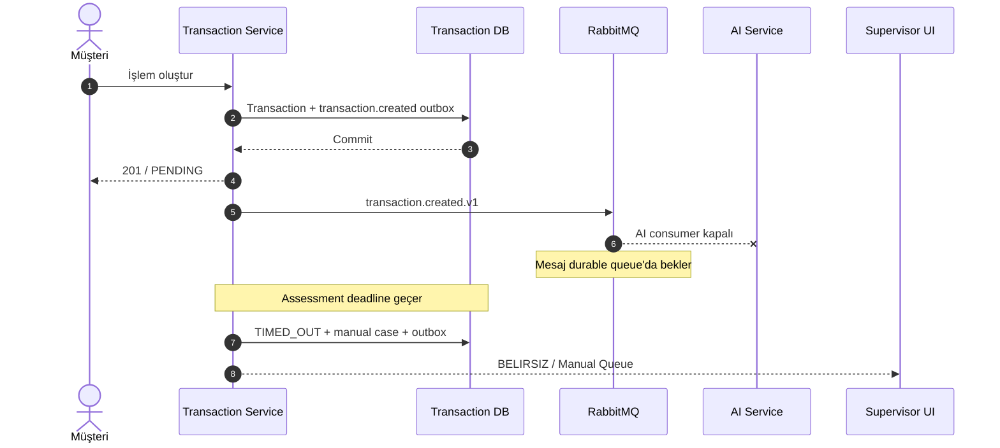
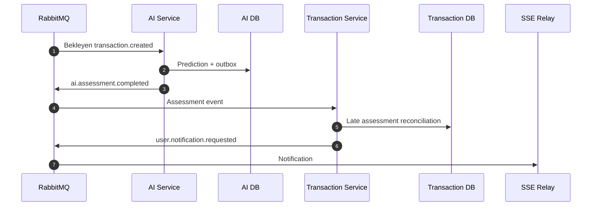
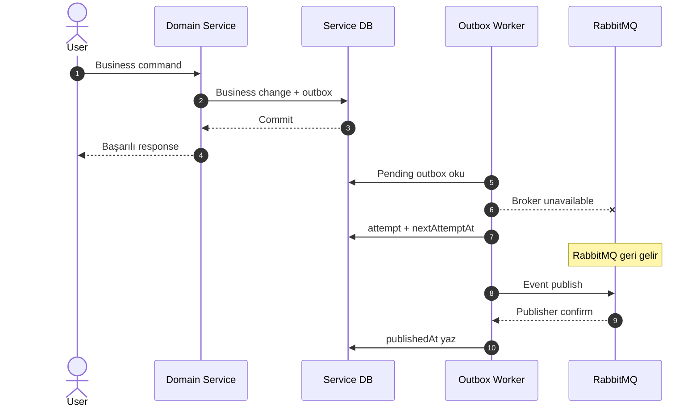
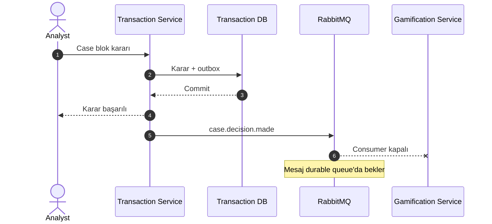

# FraudCell — Event-Driven Architecture ve RabbitMQ Tasarımı

**Doküman:** `08-EVENT-DRIVEN-ARCHITECTURE.md`
**Durum:** Accepted — Messaging Baseline v1.0
**Sistem:** FraudCell — Turkcell Gerçek Zamanlı Dolandırıcılık Tespit Platformu
**Son güncelleme:** YYYY-MM-DD

**İlgili dokümanlar:**

- `00-START-HERE.md`
- `01-REQUIREMENTS-TRACEABILITY.md`
- `02-ARCHITECTURE-OVERVIEW.md`
- `03-TECH-STACK.md`
- `04-SERVICE-BOUNDARIES.md`
- `05-DOMAIN-AND-STATE-MACHINE.md`
- `06-DATA-ARCHITECTURE.md`
- `07-API-DESIGN.md`
- `09-IDENTITY-SECURITY-AND-AUDIT.md`
- `10-AI-SERVICE-DESIGN.md`
- `11-GAMIFICATION-DESIGN.md`
- `12-RESILIENCE-AND-OBSERVABILITY.md`
- `13-DOCKER-COMPOSE-AND-OPERATIONS.md`
- `14-TEST-STRATEGY.md`
- `15-DEMO-AND-JURY-DEFENSE.md`

---

# 1. Dokümanın Amacı

Bu doküman FraudCell sisteminin servisler arası asenkron iletişim mimarisini kesinleştirir.

Bu dokümanda aşağıdaki sorular cevaplanır:

- Servisler neden event’lerle haberleşir?
- RabbitMQ hangi amaçla kullanılır?
- Hangi exchange ve queue’lar oluşturulur?
- Event isimleri nasıl standardize edilir?
- Routing key nasıl üretilir?
- Event envelope hangi alanları taşır?
- Hangi servis hangi event’i üretir?
- Hangi servis hangi event’i tüketir?
- Business veri ile event birlikte nasıl güvenli kaydedilir?
- RabbitMQ kapalı olduğunda event nasıl korunur?
- Aynı event iki kez gelirse ne olur?
- Consumer işlem sırasında çökerse ne olur?
- Publisher event’i gönderip işaretlemeden çökerse ne olur?
- Retry ve dead-letter queue nasıl çalışır?
- Poison message nasıl yönetilir?
- Event ordering nasıl ele alınır?
- Event schema nasıl versionlanır?
- AI Service kapalı olduğunda transaction nasıl korunur?
- Gamification Service kapalı olduğunda puan nasıl sonradan uygulanır?
- Audit event’leri nasıl merkezi kayda dönüşür?
- SSE notification event’leri Edge’e nasıl ulaşır?
- Event sistemi nasıl test edilir?
- Event sistemi canlı demoda nasıl kanıtlanır?

Bu doküman RabbitMQ topolojisinin ve integration event sözleşmelerinin ana otoritesidir.

Event payload’larının makine tarafından okunabilir karşılıkları aşağıdaki klasörde tutulacaktır:

```text
contracts/events/
```

---

# 2. Event-Driven Architecture Hedefleri

FraudCell event mimarisi aşağıdaki hedeflere sahiptir:

1. Bir servisin kapalı olması diğer servisin business işlemini engellememelidir.
2. Transaction oluşturma işlemi AI Service’in anlık erişilebilirliğine bağlı olmamalıdır.
3. Case kararı Gamification Service’in çalışmasına bağlı olmamalıdır.
4. Audit kaydı oluşturmak kaynak business transaction’ını başarısız yapmamalıdır.
5. RabbitMQ geçici olarak kapalı olduğunda business event kaybolmamalıdır.
6. Aynı event birden fazla kez teslim edilse bile business sonucu yalnızca bir kez oluşmalıdır.
7. Event’ler versioned ve açık sözleşmelere sahip olmalıdır.
8. Consumer hataları kontrollü şekilde retry edilmelidir.
9. Kalıcı olarak hatalı mesajlar sonsuz döngüye girmemelidir.
10. Event akışları correlation ID ile uçtan uca izlenebilmelidir.
11. Event payload’ları minimum gerekli veriyi taşımalıdır.
12. Servisler başka servislerin veritabanına bağlanmadan projection oluşturabilmelidir.
13. Eventual consistency kullanıcı arayüzünde açık durumlarla gösterilmelidir.
14. Sistem `at-least-once delivery` gerçeğine göre tasarlanmalıdır.
15. “Exactly once” gibi yanıltıcı bir iddia kullanılmamalıdır.

---

# 3. Temel Mesajlaşma Kararı

FraudCell aşağıdaki mesaj teslim modelini kullanacaktır:

```text
At-least-once delivery
+
Transactional Outbox
+
Publisher Confirm
+
Manual Consumer Acknowledgement
+
Idempotent Inbox
+
Database Constraints
```

Sistem aşağıdaki iddiada bulunmayacaktır:

```text
Exactly-once delivery
```

Dağıtık sistemde aynı mesajın birden fazla kez teslim edilmesi mümkündür.

FraudCell’in garantisi:

> Mesaj birden fazla kez teslim edilebilir; fakat aynı business sonucu birden fazla kez uygulanamaz.

Örnek:

- Aynı `case.decision.made` event’i iki kez gelebilir.
- Gamification Service yalnızca bir kez puan verir.
- Aynı badge ikinci kez kazanılmaz.
- AI accuracy metriği iki kez artmaz.
- Audit log duplicate kayıt oluşturmaz.

---

# 4. Event ve Command Ayrımı

## 4.1 Command

Command, bir işlemin gerçekleştirilmesini isteyen niyettir.

Örnek:

```text
CreateTransaction
AssessTransaction
AssignCase
AwardPoints
```

Command henüz gerçekleşmiş bir olay değildir.

## 4.2 Event

Event, geçmişte gerçekleşmiş ve artık değiştirilemeyen business gerçeğidir.

Örnek:

```text
transaction.created
ai.assessment.completed
case.assigned
case.decision.made
badge.earned
```

## 4.3 İsimlendirme Kuralı

Integration event’leri geçmiş zaman anlamı taşımalıdır.

Doğru:

```text
customer.verification.responded
case.sla.breached
identity.staff.profile.updated
```

Yanlış:

```text
respondCustomerVerification
checkSla
updateStaffProfile
```

---

# 5. Domain Event ve Integration Event Ayrımı

## 5.1 Domain Event

Domain event yalnızca servis içindeki domain davranışını temsil eder.

Örnek:

```text
RiskCaseBlocked
```

Domain event:

- RabbitMQ’yu bilmez.
- JSON schema bilmez.
- Routing key bilmez.
- Başka servisin DTO’sunu kullanmaz.

## 5.2 Integration Event

Integration event başka servislerin tüketmesi için yayınlanan versioned sözleşmedir.

Örnek:

```text
case.decision.made
```

## 5.3 Mapping

Application layer domain event’i integration event’e dönüştürebilir.

```text
RiskCaseBlocked
        ↓
case.decision.made.v1
```

Domain entity doğrudan RabbitMQ client çağırmayacaktır.

---

# 6. RabbitMQ Bileşenleri

FraudCell RabbitMQ topolojisinde aşağıdaki bileşenler bulunacaktır:

```text
Virtual Host
Main Topic Exchange
Retry Exchange
Dead-Letter Exchange
Durable Consumer Queues
Retry Queues
Dead-Letter Queues
Publisher Connections
Consumer Connections
Management UI
```

---

# 7. RabbitMQ Virtual Host

FraudCell için ayrı virtual host kullanılacaktır:

```text
/fraudcell
```

Amaç:

- Queue ve exchange izolasyonu
- Servis bazlı yetkilendirme
- Başka RabbitMQ uygulamalarından ayrım
- Yönetim ekranında kolay takip
- Demo sırasında topolojinin açık görünmesi

---

# 8. RabbitMQ Exchange’leri

## 8.1 Ana Event Exchange

```text
fraudcell.events
```

Özellikler:

```text
type: topic
durable: true
autoDelete: false
```

Bütün normal integration event’leri bu exchange’e publish edilir.

## 8.2 Retry Exchange

```text
fraudcell.retry
```

Özellikler:

```text
type: direct
durable: true
autoDelete: false
```

Retry queue’ları bu exchange üzerinden yönlendirilir.

## 8.3 Dead-Letter Exchange

```text
fraudcell.dead
```

Özellikler:

```text
type: topic
durable: true
autoDelete: false
```

Kalıcı olarak başarısız mesajlar bu exchange’e yönlendirilir.

---

# 9. Queue Tipi

Baseline queue tipi:

```text
Durable Classic Queue
```

olacaktır.

Quorum queue baseline’a eklenmeyecektir.

Nedenleri:

- Demo ortamı tek RabbitMQ node kullanır.
- Quorum queue tek node üzerinde gerçek replikasyon avantajı sağlamaz.
- Daha yüksek kaynak tüketimi oluşturur.
- Case’in ölçeği classic durable queue için uygundur.
- Operasyonel sadelik canlı demo için daha değerlidir.

Gerçek çok-node production ortamında quorum queue ayrıca değerlendirilebilir.

---

# 10. Queue Sahipliği

Her consumer kendi queue’sunun sahibidir.

Producer:

- Consumer queue isimlerini bilmek zorunda değildir.
- Yalnızca exchange ve routing key bilir.
- Event’i belirli bir servise değil business olaya publish eder.

Consumer:

- Kendi queue’sunu declare eder.
- Kendi binding’lerini tanımlar.
- Kendi retry ve DLQ yapısını yönetir.
- Kendi prefetch ve concurrency ayarlarını belirler.

Temel kural:

> Producer event yayınlar; hangi consumer’ın event’i okuyacağı producer’ın business sorumluluğu değildir.

---

# 11. Ana Queue Listesi

| Queue                                  | Sahip Servis | Amaç                                          |
| -------------------------------------- | ------------ | --------------------------------------------- |
| `ai.transaction-events`                | AI           | Yeni transaction’ları değerlendirmek          |
| `ai.identity-profile-events`           | AI           | Analist profile projection’ını güncellemek    |
| `ai.case-outcome-events`               | AI           | Model feedback ve analyst workload projection |
| `transaction.ai-assessment-events`     | Transaction  | AI assessment sonuçlarını uygulamak           |
| `transaction.identity-profile-events`  | Transaction  | Assignment eligibility projection             |
| `gamification.case-events`             | Gamification | Puan, badge ve performans hesaplamak          |
| `gamification.identity-profile-events` | Gamification | Analyst display/profile projection            |
| `identity.audit-requests`              | Identity     | Merkezi audit kayıtlarını oluşturmak          |
| `edge.user-notifications`              | Edge         | SSE notification iletmek                      |

Her queue için ayrıca:

```text
{queue}.retry.5s
{queue}.retry.30s
{queue}.retry.120s
{queue}.dead
```

queue’ları oluşturulabilir.

---

# 12. Queue ve Binding Matrisi

## 12.1 AI Transaction Queue

Queue:

```text
ai.transaction-events
```

Binding:

```text
transaction.created.v1
```

Amaç:

- Risk skoru üretmek
- Fraud türü belirlemek
- Reason code üretmek
- Analyst adaylarını sıralamak

## 12.2 AI Identity Projection Queue

Queue:

```text
ai.identity-profile-events
```

Binding’ler:

```text
identity.staff.created.v1
identity.staff.profile.updated.v1
identity.staff.deactivated.v1
```

Amaç:

- Analyst aktiflik
- Uzmanlık
- Bölge
- Assignment uygunluğu

projection’ını güncellemek.

## 12.3 AI Case Outcome Queue

Queue:

```text
ai.case-outcome-events
```

Binding’ler:

```text
case.assigned.v1
case.reassigned.v1
case.decision.made.v1
case.fraud_type.overridden.v1
customer.verification.responded.v1
analyst.performance.updated.v1
```

Amaç:

- Model doğruluk metriği
- Analyst workload projection
- Analyst performance projection
- Fraud type feedback

## 12.4 Transaction AI Assessment Queue

Queue:

```text
transaction.ai-assessment-events
```

Binding’ler:

```text
ai.assessment.completed.v1
ai.assessment.failed.v1
```

Amaç:

- AI sonucunu Transaction’a uygulamak
- RiskCase oluşturmak
- Temporary block uygulamak
- Assignment kesinleştirmek
- AI failure fallback uygulamak

## 12.5 Transaction Identity Projection Queue

Queue:

```text
transaction.identity-profile-events
```

Binding’ler:

```text
identity.staff.created.v1
identity.staff.profile.updated.v1
identity.staff.deactivated.v1
```

Amaç:

- Analyst aktiflik projection’ı
- Assignment enabled bilgisi
- Analyst uygunluk doğrulaması

## 12.6 Gamification Case Queue

Queue:

```text
gamification.case-events
```

Binding’ler:

```text
case.decision.made.v1
case.sla.breached.v1
case.closed.v1
customer.verification.responded.v1
customer.feedback.submitted.v1
```

Amaç:

- Puan hesaplamak
- Bonus/ceza uygulamak
- Badge değerlendirmek
- Analyst performance güncellemek
- Leaderboard güncellemek

## 12.7 Gamification Identity Projection Queue

Queue:

```text
gamification.identity-profile-events
```

Binding’ler:

```text
identity.staff.created.v1
identity.staff.profile.updated.v1
identity.staff.deactivated.v1
```

Amaç:

- Leaderboard display name
- Analyst aktiflik
- Profile projection

## 12.8 Identity Audit Queue

Queue:

```text
identity.audit-requests
```

Binding:

```text
audit.entry.requested.v1
```

Amaç:

- Diğer servislerden gelen audit taleplerini append-only log olarak kaydetmek

## 12.9 Edge Notification Queue

Queue:

```text
edge.user-notifications
```

Binding:

```text
user.notification.requested.v1
```

Amaç:

- Notification’ı hedef kullanıcının SSE bağlantısına iletmek

---

# 13. Routing Key Standardı

Canonical routing key formatı:

```text
{eventType}.v{eventVersion}
```

Örnek:

```text
transaction.created.v1
ai.assessment.completed.v1
case.decision.made.v1
badge.earned.v1
```

Event envelope içindeki logical event type version içermez:

```json
{
  "eventType": "transaction.created",
  "eventVersion": 1
}
```

RabbitMQ routing key:

```text
transaction.created.v1
```

olur.

Bu ayrım version bilgisinin hem makine tarafından açıkça okunmasını hem de topic routing yapılmasını sağlar.

---

# 14. Event İsimlendirme Standardı

Event type:

```text
lowercase.dot.separated
```

formatında olacaktır.

Örnek:

```text
identity.staff.profile.updated
customer.verification.responded
gamification.points.awarded
```

Kurallar:

1. Event type geçmişte gerçekleşmiş olayı anlatır.
2. Servis adı zorunlu olarak ilk segment değildir; domain aggregate tercih edilir.
3. Event adına teknik transport bilgisi eklenmez.
4. Version event type metninin içine eklenmez.
5. Event type yeniden adlandırılması breaking change kabul edilir.
6. Aynı event type zaman içinde farklı anlamda kullanılamaz.

---

# 15. Event Envelope

Bütün integration event’leri ortak envelope kullanacaktır.

```json
{
  "eventId": "01JZX5QJX7G0XDSHNFSBNQ52ZH",
  "eventType": "case.decision.made",
  "eventVersion": 1,
  "occurredAt": "2026-07-22T14:40:00Z",
  "producer": "transaction-service",
  "correlationId": "01JZX5M03SBBH5QEKWKSPKFBMG",
  "causationId": "01JZX5M7T0C27J5FPA60QFXB35",
  "subjectId": "01JZX5CASE00000000000000001",
  "subjectType": "RISK_CASE",
  "subjectVersion": 7,
  "traceParent": null,
  "payload": {}
}
```

---

# 16. Event Envelope Alanları

| Alan             | Zorunlu | Açıklama                                  |
| ---------------- | ------: | ----------------------------------------- |
| `eventId`        |    Evet | Global benzersiz event kimliği            |
| `eventType`      |    Evet | Logical event adı                         |
| `eventVersion`   |    Evet | Payload schema major sürümü               |
| `occurredAt`     |    Evet | Business olayının gerçekleştiği UTC zaman |
| `producer`       |    Evet | Event’i üreten servis                     |
| `correlationId`  |    Evet | Uçtan uca business akış kimliği           |
| `causationId`    |   Hayır | Event’i doğuran command/event kimliği     |
| `subjectId`      |    Evet | Ana aggregate/resource kimliği            |
| `subjectType`    |    Evet | Ana aggregate türü                        |
| `subjectVersion` |   Hayır | Aggregate version                         |
| `traceParent`    |   Hayır | Distributed trace bilgisi                 |
| `payload`        |    Evet | Event’e özel business veri                |

## 16.1 eventId

- ULID formatındadır.
- Her integration event için yeni üretilir.
- Duplicate delivery sırasında değişmez.
- Retry sırasında değişmez.
- Unmodified DLQ replay sırasında değişmez.

## 16.2 occurredAt

Event publish zamanı değildir.

Business olayının gerçekleştiği zamandır.

Örnek:

- Case 14:40’ta bloklandı.
- RabbitMQ 14:42’de geri geldi.
- Event 14:42’de publish edildi.
- `occurredAt` yine 14:40 olmalıdır.

## 16.3 subjectVersion

Projection event’lerinde stale event kontrolü için kullanılır.

Örnek:

```text
identity.staff.profile.updated
subjectVersion = 8
```

Consumer daha önce version `9` uyguladıysa version `8` event’ini projection’a uygulamaz.

---

# 17. RabbitMQ Message Properties

Envelope alanlarına ek olarak RabbitMQ message properties kullanılacaktır.

| RabbitMQ Property         | Değer              |
| ------------------------- | ------------------ |
| `message_id`              | `eventId`          |
| `type`                    | `eventType`        |
| `content_type`            | `application/json` |
| `content_encoding`        | `utf-8`            |
| `delivery_mode`           | `2` — persistent   |
| `correlation_id`          | `correlationId`    |
| `app_id`                  | Producer service   |
| `timestamp`               | Publish zamanı     |
| `headers.event_version`   | Event version      |
| `headers.causation_id`    | Causation ID       |
| `headers.subject_id`      | Subject ID         |
| `headers.subject_version` | Subject version    |
| `headers.traceparent`     | Trace parent       |
| `headers.schema`          | Schema identifier  |

Örnek schema identifier:

```text
fraudcell://events/case.decision.made/v1
```

---

# 18. Event Boyut Sınırı

Normal integration event maksimum boyutu:

```text
128 KB
```

olacaktır.

Event içine aşağıdakiler konulmayacaktır:

- Model artifact
- Büyük dataset
- Binary dosya
- Uzun HTML
- Bütün transaction geçmişi
- Bütün analyst geçmişi
- Stack trace
- Access token
- Refresh token
- Password hash

128 KB üstü event:

- Producer tarafından publish edilmez.
- Log ve metric oluşturulur.
- Business transaction event üretilemediği için başarısız sayılır veya payload küçültülür.
- Büyük içerik gerekiyorsa ayrı storage referansı kullanılır.

Baseline’da büyük event ihtiyacı bulunmamaktadır.

---

# 19. Event Veri Minimizasyonu

Event yalnızca consumer’ın business işlemi için gerekli veriyi taşır.

Örnek olarak `transaction.created` event’i aşağıdakileri taşıyabilir:

- Transaction ID
- Opaque customer ID
- Amount
- Transaction type
- Location
- Time
- Hashlenmiş veya türetilmiş device bilgisi
- Model için gerekli feature’lar

Aşağıdakileri taşımaz:

- Customer name
- GSM
- E-posta
- Password
- Refresh token
- Access token

Temel kural:

> Event payload’a “ileride lazım olur” düşüncesiyle kişisel veya gereksiz veri eklenmez.

---

# 20. Event Schema Dosya Yapısı

```text
contracts/
└── events/
    ├── asyncapi.yaml
    ├── README.md
    ├── examples/
    │   ├── transaction.created.v1.json
    │   ├── ai.assessment.completed.v1.json
    │   ├── case.decision.made.v1.json
    │   └── ...
    └── schemas/
        ├── event-envelope.v1.schema.json
        ├── transaction.created.v1.schema.json
        ├── ai.assessment.completed.v1.schema.json
        ├── ai.assessment.failed.v1.schema.json
        ├── identity.staff.created.v1.schema.json
        ├── identity.staff.profile.updated.v1.schema.json
        ├── identity.staff.deactivated.v1.schema.json
        ├── case.assigned.v1.schema.json
        ├── case.reassigned.v1.schema.json
        ├── case.decision.made.v1.schema.json
        ├── case.fraud_type.overridden.v1.schema.json
        ├── case.sla.breached.v1.schema.json
        ├── case.closed.v1.schema.json
        ├── customer.verification.responded.v1.schema.json
        ├── customer.feedback.submitted.v1.schema.json
        ├── analyst.performance.updated.v1.schema.json
        ├── audit.entry.requested.v1.schema.json
        └── user.notification.requested.v1.schema.json
```

---

# 21. Event Versioning

## 21.1 Version Alanı

Event version pozitif integer olacaktır:

```json
{
  "eventVersion": 1
}
```

## 21.2 Backward-Compatible Değişiklik

Aşağıdaki değişiklikler aynı event version içinde yapılabilir:

- Optional alan eklemek
- Optional nested object eklemek
- Consumer bilinmeyen alanları ignore ediyorsa ek metadata eklemek
- Açıklama alanı eklemek

## 21.3 Breaking Değişiklik

Aşağıdaki değişiklikler yeni event version gerektirir:

- Required alan silmek
- Required alan eklemek
- Alan tipini değiştirmek
- Alanın anlamını değiştirmek
- Enum değerini yeniden adlandırmak
- Subject semantiğini değiştirmek
- Event’in business anlamını değiştirmek

Örnek:

```text
case.decision.made.v1
case.decision.made.v2
```

## 21.4 Geçiş Dönemi

Yeni version geldiğinde producer belirli süre iki version yayınlayabilir:

```text
v1
v2
```

Ancak aynı consumer business sonucunu iki kez uygulamamalıdır.

Bu nedenle dual-publish yalnızca açık migration planıyla yapılır.

Baseline v1’de dual-publish bulunmayacaktır.

---

# 22. Consumer Version Politikası

Consumer aşağıdaki davranışı uygular:

## Desteklenen Version

Normal olarak işler.

## Daha Eski Desteklenen Version

Gerekirse adapter ile güncel internal modele dönüştürür.

## Desteklenmeyen Yeni Version

Mesaj retry edilmez.

Doğrudan DLQ’ya gönderilir.

Hata:

```text
UNSUPPORTED_EVENT_VERSION
```

## Geçersiz Schema

Mesaj transient hata değildir.

Doğrudan DLQ’ya gider.

Hata:

```text
EVENT_SCHEMA_VALIDATION_FAILED
```

---

# 23. Event Kataloğu

| Event                             | Producer                                  | Ana Consumer                  |
| --------------------------------- | ----------------------------------------- | ----------------------------- |
| `transaction.created`             | Transaction                               | AI                            |
| `ai.assessment.completed`         | AI                                        | Transaction                   |
| `ai.assessment.failed`            | AI                                        | Transaction                   |
| `identity.staff.created`          | Identity                                  | AI, Transaction, Gamification |
| `identity.staff.profile.updated`  | Identity                                  | AI, Transaction, Gamification |
| `identity.staff.deactivated`      | Identity                                  | AI, Transaction, Gamification |
| `case.assigned`                   | Transaction                               | AI                            |
| `case.reassigned`                 | Transaction                               | AI                            |
| `case.decision.made`              | Transaction                               | AI, Gamification              |
| `case.fraud_type.overridden`      | Transaction                               | AI                            |
| `case.sla.breached`               | Transaction                               | Gamification                  |
| `case.closed`                     | Transaction                               | Gamification                  |
| `customer.verification.responded` | Transaction                               | AI, Gamification              |
| `customer.feedback.submitted`     | Transaction                               | Gamification                  |
| `analyst.performance.updated`     | Gamification                              | AI                            |
| `audit.entry.requested`           | Edge/Identity/Transaction/AI/Gamification | Identity                      |
| `user.notification.requested`     | Identity/Transaction/AI/Gamification      | Edge                          |

---

# 24. Yayınlanmayacak Gereksiz Event’ler

Her domain değişikliği RabbitMQ integration event’i olmak zorunda değildir.

Örnek olarak aşağıdaki olaylar servis içinde domain event olarak kalabilir:

```text
case.note.added
case.review.started
transaction.number.generated
idempotency.record.created
outbox.message.claimed
```

Başka bir servis bu olaylara gerçekten ihtiyaç duymuyorsa integration event yayınlanmaz.

Temel kural:

> Consumer’ı olmayan event, gelecekte lazım olabilir düşüncesiyle yayınlanmaz.

Audit veya notification ihtiyacı varsa ilgili generic event üretilir:

```text
audit.entry.requested
user.notification.requested
```

---

# 25. transaction.created.v1

## 25.1 Producer

```text
Transaction Service
```

## 25.2 Consumer

```text
AI Service
```

## 25.3 Routing Key

```text
transaction.created.v1
```

## 25.4 Üretim Zamanı

Transaction ve outbox kaydı aynı local transaction içinde oluşturulur.

## 25.5 Payload

```json
{
  "eventId": "01JZX5M7T0C27J5FPA60QFXB35",
  "eventType": "transaction.created",
  "eventVersion": 1,
  "occurredAt": "2026-07-22T14:32:10Z",
  "producer": "transaction-service",
  "correlationId": "01JZX5M03SBBH5QEKWKSPKFBMG",
  "causationId": "01JZX5HTTPREQUEST0000000001",
  "subjectId": "01JZX5M0SDYF92K25F00V3R2R8",
  "subjectType": "TRANSACTION",
  "subjectVersion": 1,
  "traceParent": null,
  "payload": {
    "transactionId": "01JZX5M0SDYF92K25F00V3R2R8",
    "transactionNo": "TRX-2026-000123",
    "customerId": "01JZX5CUSTOMER0000000000001",
    "amount": 25000.0,
    "currency": "TRY",
    "transactionType": "TRANSFER",
    "recipientReferenceHash": "sha256:...",
    "deviceFingerprintHash": "sha256:...",
    "city": "Berlin",
    "countryCode": "DE",
    "occurredAt": "2026-07-22T02:14:00Z",
    "features": {
      "isNewDevice": true,
      "isNewRecipient": true,
      "amountDeviationRatio": 8.4,
      "transactionsLast10Minutes": 4,
      "transactionsLast24Hours": 12,
      "deviceAgeDays": 0,
      "recipientAgeDays": 0,
      "isNightTransaction": true,
      "isForeignCountry": true
    }
  }
}
```

## 25.6 Idempotency

AI Service için idempotency key:

```text
eventId + consumerName
```

Ayrıca aynı transaction ve model bundle için unique prediction constraint bulunur.

---

# 26. ai.assessment.completed.v1

## 26.1 Producer

```text
AI Service
```

## 26.2 Consumer

```text
Transaction Service
```

## 26.3 Routing Key

```text
ai.assessment.completed.v1
```

## 26.4 Payload

```json
{
  "eventId": "01JZX5QJX7G0XDSHNFSBNQ52ZH",
  "eventType": "ai.assessment.completed",
  "eventVersion": 1,
  "occurredAt": "2026-07-22T14:32:11Z",
  "producer": "ai-service",
  "correlationId": "01JZX5M03SBBH5QEKWKSPKFBMG",
  "causationId": "01JZX5M7T0C27J5FPA60QFXB35",
  "subjectId": "01JZX5M0SDYF92K25F00V3R2R8",
  "subjectType": "TRANSACTION",
  "subjectVersion": 1,
  "traceParent": null,
  "payload": {
    "assessmentId": "01JZX5ASSESSMENT000000000001",
    "transactionId": "01JZX5M0SDYF92K25F00V3R2R8",
    "riskScore": 0.94,
    "riskLevel": "KRITIK",
    "decision": "BLOK",
    "fraudType": "CALINTI_KART",
    "modelBundleVersion": "fraudcell-ai-1.0.0",
    "riskModelVersion": "risk-1.0.0",
    "fraudTypeModelVersion": "fraud-type-1.0.0",
    "reasonCodes": [
      {
        "code": "NEW_DEVICE",
        "label": "İlk kez görülen cihaz",
        "impact": "HIGH"
      },
      {
        "code": "AMOUNT_DEVIATION",
        "label": "Normal işlem tutarının 8.4 katı",
        "impact": "HIGH"
      },
      {
        "code": "UNUSUAL_LOCATION",
        "label": "Alışılmadık işlem konumu",
        "impact": "HIGH"
      }
    ],
    "analystCandidates": [
      {
        "analystId": "01JZX5ANALYST0000000000001",
        "rank": 1,
        "score": 0.91,
        "expertiseScore": 1.0,
        "capacityScore": 0.7,
        "performanceScore": 0.91
      }
    ],
    "assessedAt": "2026-07-22T14:32:11Z",
    "inferenceMilliseconds": 34.5
  }
}
```

## 26.5 Transaction Service Davranışı

Transaction Service:

1. Inbox kaydı oluşturur.
2. Assessment snapshot’ı kaydeder.
3. Risk threshold’larını doğrular.
4. Gerekirse RiskCase oluşturur.
5. Gerekirse temporary block uygular.
6. Analyst kapasitesini authoritative olarak kontrol eder.
7. Assignment’ı kesinleştirir.
8. Domain/outbox event’lerini yazar.
9. Transaction commit eder.
10. Mesajı ACK eder.

---

# 27. ai.assessment.failed.v1

## 27.1 Producer

```text
AI Service
```

## 27.2 Consumer

```text
Transaction Service
```

## 27.3 Payload

```json
{
  "eventId": "01JZX5AIFAIL0000000000000001",
  "eventType": "ai.assessment.failed",
  "eventVersion": 1,
  "occurredAt": "2026-07-22T14:32:12Z",
  "producer": "ai-service",
  "correlationId": "01JZX5M03SBBH5QEKWKSPKFBMG",
  "causationId": "01JZX5M7T0C27J5FPA60QFXB35",
  "subjectId": "01JZX5M0SDYF92K25F00V3R2R8",
  "subjectType": "TRANSACTION",
  "subjectVersion": 1,
  "payload": {
    "transactionId": "01JZX5M0SDYF92K25F00V3R2R8",
    "failureCode": "MODEL_INFERENCE_FAILED",
    "failureCategory": "TECHNICAL",
    "retryable": false,
    "failedAt": "2026-07-22T14:32:12Z"
  }
}
```

Payload içine:

- Stack trace
- File path
- Internal exception
- Model secret
- Environment variable

eklenmez.

## 27.4 Transaction Service Davranışı

- Assessment status `FAILED`
- Risk ekranda `BELIRSIZ`
- Safe decision `INCELEME`
- Manual fallback RiskCase
- SLA priority `YUKSEK`
- Manual queue
- Audit
- Supervisor notification

---

# 28. identity.staff.created.v1

## 28.1 Producer

```text
Identity Service
```

## 28.2 Consumer’lar

```text
AI Service
Transaction Service
Gamification Service
```

## 28.3 Payload

```json
{
  "eventId": "01JZX5STAFFCREATED00000000001",
  "eventType": "identity.staff.created",
  "eventVersion": 1,
  "occurredAt": "2026-07-22T10:00:00Z",
  "producer": "identity-service",
  "correlationId": "01JZX5CORRELATION00000000001",
  "causationId": "01JZX5ADMINCOMMAND000000001",
  "subjectId": "01JZX5ANALYST0000000000001",
  "subjectType": "STAFF",
  "subjectVersion": 1,
  "payload": {
    "staffId": "01JZX5ANALYST0000000000001",
    "displayName": "Ayşe Yılmaz",
    "role": "ANALYST",
    "isActive": true,
    "assignmentEnabled": true,
    "specialties": ["CALINTI_KART", "HESAP_ELE_GECIRME"],
    "regions": ["KARADENIZ", "YURT_DISI"],
    "createdAt": "2026-07-22T10:00:00Z"
  }
}
```

E-posta ve GSM projection consumer’ları için gerekli olmadığı için payload’a eklenmez.

---

# 29. identity.staff.profile.updated.v1

Bu event full snapshot taşır.

Consumer eski ve yeni alan farkını hesaplamak zorunda değildir.

```json
{
  "eventId": "01JZX5STAFFUPDATED00000000001",
  "eventType": "identity.staff.profile.updated",
  "eventVersion": 1,
  "occurredAt": "2026-07-22T11:00:00Z",
  "producer": "identity-service",
  "correlationId": "01JZX5CORRELATION00000000002",
  "causationId": "01JZX5ADMINCOMMAND000000002",
  "subjectId": "01JZX5ANALYST0000000000001",
  "subjectType": "STAFF",
  "subjectVersion": 4,
  "payload": {
    "staffId": "01JZX5ANALYST0000000000001",
    "displayName": "Ayşe Yılmaz",
    "role": "ANALYST",
    "isActive": true,
    "assignmentEnabled": true,
    "specialties": ["CALINTI_KART", "PARA_AKLAMA"],
    "regions": ["KARADENIZ", "YURT_DISI"],
    "updatedAt": "2026-07-22T11:00:00Z"
  }
}
```

Full snapshot kullanılmasının nedeni out-of-order event’lerde projection güncellemesini sadeleştirmektir.

---

# 30. identity.staff.deactivated.v1

```json
{
  "eventId": "01JZX5STAFFDEACT000000000001",
  "eventType": "identity.staff.deactivated",
  "eventVersion": 1,
  "occurredAt": "2026-07-22T12:00:00Z",
  "producer": "identity-service",
  "correlationId": "01J...",
  "causationId": "01J...",
  "subjectId": "01JZX5ANALYST0000000000001",
  "subjectType": "STAFF",
  "subjectVersion": 5,
  "payload": {
    "staffId": "01JZX5ANALYST0000000000001",
    "role": "ANALYST",
    "isActive": false,
    "assignmentEnabled": false,
    "deactivatedAt": "2026-07-22T12:00:00Z"
  }
}
```

Consumer davranışı:

- Yeni assignment adayı olarak kullanmaz.
- Mevcut aktif case’leri otomatik olarak silmez.
- Supervisor reassignment queue’suna bilgi düşürülebilir.
- Gamification geçmişi korunur.

---

# 31. case.assigned.v1

## 31.1 Producer

```text
Transaction Service
```

## 31.2 Consumer

```text
AI Service
```

## 31.3 Payload

```json
{
  "eventId": "01JZX5CASEASSIGNED00000000001",
  "eventType": "case.assigned",
  "eventVersion": 1,
  "occurredAt": "2026-07-22T14:32:12Z",
  "producer": "transaction-service",
  "correlationId": "01JZX5M03SBBH5QEKWKSPKFBMG",
  "causationId": "01JZX5QJX7G0XDSHNFSBNQ52ZH",
  "subjectId": "01JZX5CASE00000000000000001",
  "subjectType": "RISK_CASE",
  "subjectVersion": 2,
  "payload": {
    "caseId": "01JZX5CASE00000000000000001",
    "transactionId": "01JZX5M0SDYF92K25F00V3R2R8",
    "analystId": "01JZX5ANALYST0000000000001",
    "fraudType": "CALINTI_KART",
    "riskLevel": "KRITIK",
    "assignmentSource": "AI_RECOMMENDATION",
    "assignedAt": "2026-07-22T14:32:12Z"
  }
}
```

AI Service analyst workload projection’ını artırır.

Transaction Service kapasitenin authoritative sahibidir.

---

# 32. case.reassigned.v1

```json
{
  "eventId": "01JZX5CASEREASSIGNED000000001",
  "eventType": "case.reassigned",
  "eventVersion": 1,
  "occurredAt": "2026-07-22T14:45:00Z",
  "producer": "transaction-service",
  "correlationId": "01J...",
  "causationId": "01J...",
  "subjectId": "01JZX5CASE00000000000000001",
  "subjectType": "RISK_CASE",
  "subjectVersion": 6,
  "payload": {
    "caseId": "01JZX5CASE00000000000000001",
    "previousAnalystId": "01JZX5ANALYST0000000000001",
    "newAnalystId": "01JZX5ANALYST0000000000002",
    "fraudType": "CALINTI_KART",
    "riskLevel": "KRITIK",
    "reassignedAt": "2026-07-22T14:45:00Z"
  }
}
```

AI projection:

- Önceki analyst workload azaltılır.
- Yeni analyst workload artırılır.
- Duplicate event idempotent işlenir.

---

# 33. case.decision.made.v1

## 33.1 Producer

```text
Transaction Service
```

## 33.2 Consumer’lar

```text
AI Service
Gamification Service
```

## 33.3 Payload

```json
{
  "eventId": "01JZX5CASEDECISION0000000001",
  "eventType": "case.decision.made",
  "eventVersion": 1,
  "occurredAt": "2026-07-22T14:40:00Z",
  "producer": "transaction-service",
  "correlationId": "01JZX5M03SBBH5QEKWKSPKFBMG",
  "causationId": "01JZX5DECISIONCOMMAND0000001",
  "subjectId": "01JZX5CASE00000000000000001",
  "subjectType": "RISK_CASE",
  "subjectVersion": 7,
  "payload": {
    "caseId": "01JZX5CASE00000000000000001",
    "transactionId": "01JZX5M0SDYF92K25F00V3R2R8",
    "transactionNo": "TRX-2026-000123",
    "analystId": "01JZX5ANALYST0000000000001",
    "decision": "BLOCK",
    "fraudType": "CALINTI_KART",
    "aiFraudType": "CALINTI_KART",
    "riskLevel": "KRITIK",
    "aiRiskScore": 0.94,
    "amount": 25000.0,
    "currency": "TRY",
    "customerResponse": "NOT_MINE",
    "caseCreatedAt": "2026-07-22T14:32:11Z",
    "reviewStartedAt": "2026-07-22T14:34:00Z",
    "decidedAt": "2026-07-22T14:40:00Z",
    "decisionDurationSeconds": 473,
    "slaDeadlineAt": "2026-07-22T14:47:11Z",
    "slaCompliant": true,
    "wasTemporarilyBlocked": true
  }
}
```

## 33.4 Decision Note

Decision note event payload’a eklenmez.

Nedenleri:

- Serbest metin PII içerebilir.
- Gamification ve AI note’a ihtiyaç duymaz.
- Audit için ayrı yapılandırılmış audit event’i üretilir.
- Full note Transaction Database’te kalır.

## 33.5 Gamification Davranışı

Gamification:

- Karar puanı
- Hız bonusu
- Kritik SLA bonusu
- Müşteri teyitli fraud bonusu
- Badge
- Analyst performance

kurallarını değerlendirir.

## 33.6 AI Davranışı

AI:

- Fraud type agreement
- Decision agreement
- False-positive değerlendirme
- Analyst workload
- Model feedback

projection’larını günceller.

---

# 34. transaction.blocked Event Kararı

Case dokümanındaki `transaction.blocked` örneği FraudCell içinde şu şekilde temsil edilir:

```text
case.decision.made
decision = BLOCK
```

Ayrı bir `transaction.blocked` event’i yayınlanmayacaktır.

Nedeni:

- Aynı business gerçeğini iki farklı event ile çoğaltmamak
- Consumer’ın iki event’ten duplicate sonuç üretmesini engellemek
- Onay ve blok kararlarını tek versioned sözleşmede tutmak

`case.decision.made` payload’ı:

- Case ID
- Transaction ID
- Analyst ID
- Fraud type
- Risk level
- Amount
- Created at
- Decided at

bilgilerini taşıdığı için örnek event gereksinimini karşılar.

---

# 35. case.fraud_type.overridden.v1

```json
{
  "eventId": "01JZX5FRAUDOVERRIDE0000000001",
  "eventType": "case.fraud_type.overridden",
  "eventVersion": 1,
  "occurredAt": "2026-07-22T14:39:00Z",
  "producer": "transaction-service",
  "correlationId": "01J...",
  "causationId": "01J...",
  "subjectId": "01JZX5CASE00000000000000001",
  "subjectType": "RISK_CASE",
  "subjectVersion": 6,
  "payload": {
    "caseId": "01JZX5CASE00000000000000001",
    "transactionId": "01JZX5M0SDYF92K25F00V3R2R8",
    "assessmentId": "01JZX5ASSESSMENT000000000001",
    "aiFraudType": "CALINTI_KART",
    "previousEffectiveFraudType": "CALINTI_KART",
    "newEffectiveFraudType": "HESAP_ELE_GECIRME",
    "overriddenBy": "01JZX5ANALYST0000000000001",
    "actorRole": "ANALYST",
    "overriddenAt": "2026-07-22T14:39:00Z"
  }
}
```

Serbest metin override nedeni AI event payload’ına eklenmez.

AI doğruluk metriği için sınıf değişikliği yeterlidir.

---

# 36. case.sla.breached.v1

## 36.1 Producer

```text
Transaction Service
```

## 36.2 Consumer

```text
Gamification Service
```

## 36.3 Payload

```json
{
  "eventId": "01JZX5SLABREACH000000000001",
  "eventType": "case.sla.breached",
  "eventVersion": 1,
  "occurredAt": "2026-07-22T14:47:12Z",
  "producer": "transaction-service",
  "correlationId": "01J...",
  "causationId": "01JZX5SLAWORKER000000000001",
  "subjectId": "01JZX5CASE00000000000000001",
  "subjectType": "RISK_CASE",
  "subjectVersion": 8,
  "payload": {
    "caseId": "01JZX5CASE00000000000000001",
    "transactionId": "01JZX5M0SDYF92K25F00V3R2R8",
    "assignedAnalystId": "01JZX5ANALYST0000000000001",
    "riskLevel": "KRITIK",
    "slaPriority": "KRITIK",
    "slaStartedAt": "2026-07-22T14:32:11Z",
    "slaDeadlineAt": "2026-07-22T14:47:11Z",
    "breachedAt": "2026-07-22T14:47:12Z",
    "temporaryBlockApplied": true
  }
}
```

Aynı case için yalnızca bir SLA breach event’i üretilir.

Database constraint ve domain flag bunu korur.

---

# 37. case.closed.v1

```json
{
  "eventId": "01JZX5CASECLOSED00000000001",
  "eventType": "case.closed",
  "eventVersion": 1,
  "occurredAt": "2026-07-24T14:40:00Z",
  "producer": "transaction-service",
  "correlationId": "01J...",
  "causationId": "01JZX5CLOSUREWORKER00000001",
  "subjectId": "01JZX5CASE00000000000000001",
  "subjectType": "RISK_CASE",
  "subjectVersion": 8,
  "payload": {
    "caseId": "01JZX5CASE00000000000000001",
    "transactionId": "01JZX5M0SDYF92K25F00V3R2R8",
    "analystId": "01JZX5ANALYST0000000000001",
    "finalDecision": "BLOCK",
    "fraudType": "CALINTI_KART",
    "riskLevel": "KRITIK",
    "decidedAt": "2026-07-22T14:40:00Z",
    "closedAt": "2026-07-24T14:40:00Z"
  }
}
```

Gamification bu event’i ertelenmiş veya closure-temelli kurallar için kullanabilir.

Final karar puanı esas olarak `case.decision.made` event’inden hesaplanır.

---

# 38. customer.verification.responded.v1

## 38.1 Producer

```text
Transaction Service
```

## 38.2 Consumer’lar

```text
AI Service
Gamification Service
```

## 38.3 Payload

```json
{
  "eventId": "01JZX5CUSTOMERRESPONSE0000001",
  "eventType": "customer.verification.responded",
  "eventVersion": 1,
  "occurredAt": "2026-07-22T14:38:00Z",
  "producer": "transaction-service",
  "correlationId": "01J...",
  "causationId": "01JZX5VERIFYCOMMAND000000001",
  "subjectId": "01JZX5CASE00000000000000001",
  "subjectType": "RISK_CASE",
  "subjectVersion": 6,
  "payload": {
    "verificationId": "01JZX5VERIFICATION0000000001",
    "caseId": "01JZX5CASE00000000000000001",
    "transactionId": "01JZX5M0SDYF92K25F00V3R2R8",
    "assignedAnalystId": "01JZX5ANALYST0000000000001",
    "response": "NOT_MINE",
    "respondedAt": "2026-07-22T14:38:00Z",
    "effectiveRiskLevelAfterResponse": "KRITIK",
    "temporaryBlockApplied": true
  }
}
```

Customer ID event payload’a eklenmez; consumer’ların ihtiyacı yoktur.

---

# 39. customer.feedback.submitted.v1

```json
{
  "eventId": "01JZX5FEEDBACK00000000000001",
  "eventType": "customer.feedback.submitted",
  "eventVersion": 1,
  "occurredAt": "2026-07-24T15:00:00Z",
  "producer": "transaction-service",
  "correlationId": "01J...",
  "causationId": "01JZX5FEEDBACKCOMMAND0000001",
  "subjectId": "01JZX5CASE00000000000000001",
  "subjectType": "RISK_CASE",
  "subjectVersion": 9,
  "payload": {
    "feedbackId": "01JZX5FEEDBACKROW00000000001",
    "caseId": "01JZX5CASE00000000000000001",
    "transactionId": "01JZX5M0SDYF92K25F00V3R2R8",
    "analystId": "01JZX5ANALYST0000000000001",
    "finalDecision": "BLOCK",
    "rating": 5,
    "submittedAt": "2026-07-24T15:00:00Z"
  }
}
```

Feedback comment event payload’a eklenmez.

Puan kuralı için rating yeterlidir.

---

# 40. analyst.performance.updated.v1

## 40.1 Producer

```text
Gamification Service
```

## 40.2 Consumer

```text
AI Service
```

## 40.3 Payload

```json
{
  "eventId": "01JZX5PERFORMANCE00000000001",
  "eventType": "analyst.performance.updated",
  "eventVersion": 1,
  "occurredAt": "2026-07-22T14:40:01Z",
  "producer": "gamification-service",
  "correlationId": "01JZX5M03SBBH5QEKWKSPKFBMG",
  "causationId": "01JZX5CASEDECISION0000000001",
  "subjectId": "01JZX5ANALYST0000000000001",
  "subjectType": "ANALYST",
  "subjectVersion": 17,
  "payload": {
    "analystId": "01JZX5ANALYST0000000000001",
    "totalDecisions": 86,
    "correctDecisions": 79,
    "falsePositiveCount": 3,
    "slaCompliantCount": 80,
    "averageDecisionSeconds": 510,
    "accuracyRate": 0.9186,
    "performanceScore": 0.91,
    "updatedAt": "2026-07-22T14:40:01Z"
  }
}
```

Event full snapshot taşır.

AI Service subject version eskiyse event’i ignore eder.

---

# 41. audit.entry.requested.v1

## 41.1 Producer’lar

```text
Identity Service
Transaction Service
AI Service
Gamification Service
FraudCell Edge
```

## 41.2 Consumer

```text
Identity Service
```

## 41.3 Payload

```json
{
  "eventId": "01JZX5AUDITREQUEST0000000001",
  "eventType": "audit.entry.requested",
  "eventVersion": 1,
  "occurredAt": "2026-07-22T14:40:00Z",
  "producer": "transaction-service",
  "correlationId": "01JZX5M03SBBH5QEKWKSPKFBMG",
  "causationId": "01JZX5CASEDECISION0000000001",
  "subjectId": "01JZX5CASE00000000000000001",
  "subjectType": "RISK_CASE",
  "subjectVersion": 7,
  "payload": {
    "actorId": "01JZX5ANALYST0000000000001",
    "actorRole": "ANALYST",
    "action": "CASE_BLOCKED",
    "sourceService": "transaction-service",
    "resourceType": "RISK_CASE",
    "resourceId": "01JZX5CASE00000000000000001",
    "ipAddress": "127.0.0.1",
    "result": "SUCCESS",
    "details": {
      "previousState": "INCELENIYOR",
      "newState": "BLOKLANDI",
      "decision": "BLOCK"
    }
  }
}
```

## 41.4 Yasak Alanlar

Audit event içine aşağıdakiler eklenmez:

- Password
- OTP
- Raw token
- Cookie
- Decision note’un tamamı
- Gereksiz PII
- Stack trace
- Database exception

## 41.5 Idempotency

Identity Service:

```text
source event ID
```

üzerinden unique audit kaydı oluşturur.

---

# 42. Gateway Audit Güvenilirliği

Business servislerinde oluşan audit event’leri transactional outbox üzerinden yayınlanır.

Gateway kalıcı database’e sahip değildir.

Gateway kaynaklı olaylar:

- Geçersiz JWT
- Rate limit
- Gateway-level authentication denial
- Aşırı büyük request
- Geçersiz correlation header

için aşağıdaki davranış uygulanır:

1. Structured security log yazılır.
2. RabbitMQ erişilebiliyorsa `audit.entry.requested` event’i publisher confirm ile gönderilir.
3. RabbitMQ erişilemiyorsa request’in ana güvenlik sonucu değiştirilmez.
4. Audit publish hatası metric ve error log olarak kaydedilir.

Business role ve resource authorization servislerde tekrar uygulandığı için kritik `403` olayları servis outbox’ı üzerinden durable audit event üretir.

Bu nedenle Gateway audit mekanizması tek güvenlik kayıt noktası değildir.

---

# 43. user.notification.requested.v1

## 43.1 Producer’lar

```text
Identity Service
Transaction Service
AI Service
Gamification Service
```

## 43.2 Consumer

```text
FraudCell Edge
```

## 43.3 Payload

```json
{
  "eventId": "01JZX5NOTIFICATION0000000001",
  "eventType": "user.notification.requested",
  "eventVersion": 1,
  "occurredAt": "2026-07-22T14:40:01Z",
  "producer": "gamification-service",
  "correlationId": "01JZX5M03SBBH5QEKWKSPKFBMG",
  "causationId": "01JZX5CASEDECISION0000000001",
  "subjectId": "01JZX5ANALYST0000000000001",
  "subjectType": "USER",
  "subjectVersion": null,
  "payload": {
    "notificationId": "01JZX5NOTIFICATION0000000001",
    "targetUserId": "01JZX5ANALYST0000000000001",
    "notificationType": "POINTS_AWARDED",
    "severity": "SUCCESS",
    "title": "45 puan kazandınız",
    "message": "Kritik vakayı SLA içinde çözdünüz.",
    "resourceType": "RISK_CASE",
    "resourceId": "01JZX5CASE00000000000000001",
    "deduplicationKey": "case:01JZX5CASE00000000000000001:points",
    "occurredAt": "2026-07-22T14:40:01Z"
  }
}
```

## 43.4 Notification Type Örnekleri

```text
AI_ASSESSMENT_COMPLETED
TRANSACTION_TEMPORARILY_BLOCKED
CASE_ASSIGNED
CASE_STATUS_CHANGED
CUSTOMER_VERIFICATION_REQUESTED
CUSTOMER_VERIFICATION_RESPONDED
POINTS_AWARDED
POINTS_DEDUCTED
BADGE_EARNED
LEVEL_CHANGED
LEADERBOARD_UPDATED
SLA_WARNING
SLA_BREACHED
ACCOUNT_LOCKED
TOKEN_REUSE_DETECTED
```

## 43.5 Edge Davranışı

Edge:

- Notification’ın business doğruluğunu yeniden hesaplamaz.
- Target user’a ait aktif SSE connection’ları bulur.
- Notification’ı iletir.
- Aktif bağlantı yoksa mesajı kalıcı olarak saklamaz.
- Mesajı ACK eder.
- Client daha sonra authoritative API state’ini çeker.

Kalıcı notification inbox baseline kapsamında değildir.

---

# 44. Notification Duplicate Davranışı

Aynı notification event’i duplicate teslim edilebilir.

Edge memory içinde kısa ömürlü deduplication cache kullanabilir:

```text
eventId
```

Ancak Edge restart olduğunda cache kaybolabilir.

Frontend de notification ID ile session-level deduplication yapabilir.

Duplicate toast oluşması business veri hatası değildir.

Authoritative business sonuç ilgili servis database’indedir.

Puanın iki kez yazılmasını Edge değil Gamification inbox/ledger constraint’i engeller.

---

# 45. Transactional Outbox

## 45.1 Problem

Aşağıdaki yaklaşım güvenli değildir:

```text
1. Database’e transaction kaydet
2. Commit et
3. RabbitMQ’ya event gönder
```

Servis 2. ve 3. adım arasında çökerse:

- Transaction database’te bulunur.
- Event yayınlanmaz.
- AI işlemi değerlendirmez.

Tersi de güvenli değildir:

```text
1. Event publish et
2. Database commit et
```

Database commit başarısız olursa sistem gerçekleşmemiş bir olayı yayınlamış olur.

## 45.2 Çözüm

Business değişikliği ve outbox mesajı aynı local database transaction içinde kaydedilir.

```text
BEGIN

INSERT INTO transactions (...)
INSERT INTO outbox_messages (...)

COMMIT
```

RabbitMQ publish daha sonra background worker tarafından yapılır.

---

# 46. Outbox Tablo Alanları

Her servis outbox tablosunda aşağıdaki alanları tutar:

```text
id
event_id
event_type
event_version
routing_key
payload
headers
occurred_at
created_at
published_at
attempt_count
next_attempt_at
locked_until
lock_owner
last_error
```

Event ID unique olmalıdır.

---

# 47. Outbox Publisher Akışı

Outbox publisher aşağıdaki akışı uygular:

1. Yayınlanmamış ve zamanı gelmiş kayıtları bulur.
2. Kısa database transaction içinde kayıtları claim eder.
3. `lock_owner` ve `locked_until` yazar.
4. Database transaction’ını commit eder.
5. RabbitMQ’ya persistent message publish eder.
6. Publisher confirm bekler.
7. Confirm geldiyse `published_at` yazar.
8. Confirm gelmediyse attempt sayısını artırır.
9. `next_attempt_at` backoff ile güncellenir.
10. Lock temizlenir veya süresi dolmaya bırakılır.

Database transaction RabbitMQ network çağrısı boyunca açık tutulmaz.

---

# 48. Outbox Claim Query

Örnek:

```sql
SELECT id
FROM outbox_messages
WHERE published_at IS NULL
  AND next_attempt_at <= now()
  AND (
      locked_until IS NULL
      OR locked_until < now()
  )
ORDER BY created_at
FOR UPDATE SKIP LOCKED
LIMIT @batch_size;
```

Ardından:

```sql
UPDATE outbox_messages
SET
    lock_owner = @worker_id,
    locked_until = @now + interval '30 seconds'
WHERE id IN (...);
```

Kısa transaction commit edilir.

---

# 49. Publish Sonrası Crash Senaryosu

Senaryo:

1. Publisher RabbitMQ’ya event gönderir.
2. RabbitMQ confirm verir.
3. Publisher `published_at` yazmadan çöker.

Sonuç:

- Outbox satırı yayınlanmamış görünür.
- Worker event’i tekrar publish eder.
- Consumer aynı event ID’yi yeniden alır.
- Inbox duplicate event’i algılar.
- Business logic ikinci kez uygulanmaz.
- Mesaj ACK edilir.

Bu senaryo `at-least-once` tasarımının doğal sonucudur.

---

# 50. Publisher Confirm

Publisher message publish ettikten sonra RabbitMQ confirm bekler.

Outbox kaydı yalnızca confirm sonrasında:

```text
published_at != null
```

olarak işaretlenir.

Publish sırasında:

- Persistent delivery mode
- Durable exchange
- Durable queue
- Publisher confirm
- Mandatory flag

kullanılacaktır.

---

# 51. Unroutable Message

Publisher:

```text
mandatory = true
```

kullanacaktır.

Event hiçbir queue’ya route edilemiyorsa RabbitMQ return bildirimi oluşturur.

Bu durumda:

- Event published sayılmaz.
- Outbox `published_at` yazılmaz.
- Error loglanır.
- Metric artırılır.
- Retry uygulanır.
- Uzun süreli durumda alarm oluşur.

Bu yaklaşım yanlış routing key veya eksik binding problemini görünür kılar.

---

# 52. Outbox Retry Politikası

Outbox publisher network/broker hatalarında exponential backoff kullanır.

Örnek:

```text
1. deneme  -> hemen
2. deneme  -> 5 saniye
3. deneme  -> 15 saniye
4. deneme  -> 30 saniye
5. deneme  -> 1 dakika
Sonraki    -> maksimum 5 dakika
```

Jitter eklenebilir.

Outbox mesajı belirli attempt sonrasında silinmez.

Broker geri gelene kadar korunur.

Uzun süre publish edilemeyen event:

- Metric
- Error log
- Health `Degraded`
- Dashboard/ops warning

oluşturur.

---

# 53. Outbox Batch Ayarları

Baseline:

```text
Batch size: 50
Poll interval: 500 ms
Lock duration: 30 saniye
```

Environment variable örnekleri:

```text
OUTBOX_BATCH_SIZE=50
OUTBOX_POLL_INTERVAL_MS=500
OUTBOX_LOCK_SECONDS=30
```

Değerler servis yüküne göre değiştirilebilir.

Demo ortamında düşük latency için 500 ms uygundur.

---

# 54. Outbox Retention

Başarıyla publish edilmiş outbox mesajları:

```text
7 gün
```

saklanır.

Amaç:

- Debug
- Demo kanıtı
- Correlation incelemesi
- Event history doğrulaması

Cleanup worker yalnızca:

```text
published_at IS NOT NULL
AND published_at < now - retention
```

kayıtlarını temizler.

Yayınlanmamış event hiçbir zaman retention nedeniyle silinmez.

---

# 55. Idempotent Inbox

## 55.1 Problem

RabbitMQ aynı mesajı tekrar teslim edebilir.

Örnek nedenler:

- Consumer business transaction’ı commit etti ancak ACK göndermeden çöktü.
- Network ACK’i kayboldu.
- Publisher aynı outbox event’ini tekrar yayınladı.
- DLQ replay yapıldı.

## 55.2 Çözüm

Her consumer kendi database’inde inbox kaydı tutar.

Unique key:

```text
event_id + consumer_name
```

olacaktır.

---

# 56. Inbox İşleme Akışı

Consumer mesaj aldığında:

1. Event envelope parse edilir.
2. Message size kontrol edilir.
3. Event type kontrol edilir.
4. Event version kontrol edilir.
5. JSON schema validation yapılır.
6. Local database transaction başlatılır.
7. Inbox kaydı insert edilir.
8. Duplicate ise mevcut payload hash kontrol edilir.
9. Business logic çalıştırılır.
10. Gerekli domain değişiklikleri yapılır.
11. Gerekli outbox event’leri yazılır.
12. Inbox status `PROCESSED` olur.
13. Database transaction commit edilir.
14. RabbitMQ mesajı ACK edilir.

---

# 57. Duplicate Event Davranışı

Inbox insert unique conflict verirse:

## Aynı Event ID ve Aynı Payload Hash

- Event daha önce işlenmiştir.
- Business logic tekrar çalışmaz.
- Mesaj ACK edilir.
- Duplicate metric artırılır.

## Aynı Event ID ve Farklı Payload Hash

Bu güvenlik veya producer bütünlük ihlalidir.

- Mesaj işlenmez.
- ACK edilmez ve retry edilmez.
- Doğrudan DLQ’ya gönderilir.
- Security log üretilir.
- Alert metric artırılır.

Error code:

```text
EVENT_ID_PAYLOAD_MISMATCH
```

---

# 58. Consumer ACK Politikası

Mesaj yalnızca aşağıdaki işlemler tamamlandıktan sonra ACK edilir:

1. Schema validation başarılı
2. Business işlem başarılı
3. Local database transaction commit edilmiş
4. Outbox mesajları aynı transaction içinde yazılmış

ACK aşağıdaki aşamalarda gönderilmez:

- Business işlem devam ederken
- Database commit öncesinde
- Event yalnızca memory’ye alındığında
- Outbox kaydı yazılmadan önce

---

# 59. Consumer Crash Senaryosu

Senaryo:

1. Consumer event’i alır.
2. Inbox ve business değişikliği commit eder.
3. ACK göndermeden çöker.

RabbitMQ mesajı tekrar teslim eder.

İkinci teslim:

- Inbox unique constraint duplicate’i tespit eder.
- Payload hash eşleşir.
- Business logic çalışmaz.
- Mesaj ACK edilir.

Sonuç:

```text
Business sonucu yalnızca bir kez oluşur.
```

---

# 60. Retry Sınıflandırması

Her hata retry edilmemelidir.

## 60.1 Transient Hatalar

Retry edilir:

- Database geçici bağlantı hatası
- Database deadlock
- Connection reset
- Timeout
- Geçici broker/channel problemi
- Projection dependency henüz oluşmamışsa kontrollü kısa gecikme
- Service startup sırasında migration beklenmesi

## 60.2 Permanent Hatalar

Retry edilmez:

- Geçersiz JSON
- Desteklenmeyen event version
- Eksik required alan
- Invalid enum
- Risk score aralık dışı
- Event ID/payload hash uyuşmazlığı
- Business açısından imkânsız payload
- Şema bozukluğu

Permanent hata doğrudan DLQ’ya gider.

## 60.3 Domain Duplicate

Retry edilmez ve DLQ’ya da gitmez:

- Event daha önce başarıyla işlenmiş
- Aynı badge zaten kazanılmış
- Aynı point rule zaten uygulanmış
- Aynı assessment zaten kaydedilmiş

Bu durum idempotent başarı olarak ACK edilir.

---

# 61. Consumer Retry Queue Tasarımı

Her ana queue için üç retry queue bulunabilir:

```text
{mainQueue}.retry.5s
{mainQueue}.retry.30s
{mainQueue}.retry.120s
```

Örnek:

```text
gamification.case-events.retry.5s
gamification.case-events.retry.30s
gamification.case-events.retry.120s
```

Retry queue:

- Mesajı TTL süresince tutar.
- TTL bitince ana exchange’e veya ana queue’ya dead-letter eder.
- Consumer çalıştırmaz.
- Mesajın event ID’sini değiştirmez.

---

# 62. Consumer Retry Sırası

```text
İlk transient hata    -> 5 saniye
İkinci transient hata -> 30 saniye
Üçüncü transient hata -> 120 saniye
Dördüncü hata         -> Dead-Letter Queue
```

Retry count header:

```text
x-fraudcell-retry-count
```

olarak taşınabilir.

RabbitMQ `x-death` header’ı da incelenebilir.

Application retry sayısını tek ve açık bir yöntemle hesaplamalıdır.

---

# 63. Dead-Letter Queue

Her ana consumer queue için ayrı dead-letter queue bulunur.

Örnek:

```text
ai.transaction-events.dead
transaction.ai-assessment-events.dead
gamification.case-events.dead
identity.audit-requests.dead
edge.user-notifications.dead
```

Dead queue binding routing key’i consumer queue’ya özel olabilir.

Dead message:

- Otomatik olarak tekrar ana queue’ya gönderilmez.
- Manuel veya kontrollü operasyonla incelenir.
- Root cause çözülmeden replay edilmez.

---

# 64. Dead-Letter Metadata

DLQ’ya gönderilen mesaj aşağıdaki metadata’yı taşır:

```text
Original queue
Original routing key
Failure category
Failure code
Failure message sanitized
Retry count
First failed at
Last failed at
Consumer name
Service version
Event ID
Correlation ID
```

Stack trace mesaj payload’ına yazılmayacaktır.

Stack trace yalnızca internal structured log’da bulunabilir.

---

# 65. DLQ Replay Politikası

DLQ replay otomatik ve kör şekilde yapılmayacaktır.

Replay adımları:

1. Mesaj incelenir.
2. Hata tipi belirlenir.
3. Consumer bug’ı veya schema problemi düzeltilir.
4. Test ortamında replay denenir.
5. Event’in hâlâ business açısından uygulanabilir olduğu doğrulanır.
6. Kontrollü replay script’i çalıştırılır.
7. Sonuç loglanır ve audit edilir.

Script örnekleri:

```text
scripts/replay-dlq.sh
scripts/replay-dlq.ps1
```

## 65.1 Değiştirilmemiş Replay

Aynı mesaj tekrar gönderiliyorsa:

```text
eventId korunur
```

Consumer daha önce işlemişse duplicate olarak ignore eder.

## 65.2 Düzeltilmiş Mesaj

Payload manuel olarak düzeltiliyorsa:

- Yeni event ID üretilir.
- `originalEventId` header’ı eklenir.
- Manual correction reason kaydedilir.
- Audit oluşturulur.

Business event geçmişi sessizce değiştirilmez.

---

# 66. Poison Message

Poison message sürekli hata üreten mesajdır.

Örnek:

- Schema geçerli ancak consumer kodu belirli bir veriyle sürekli exception atıyor.
- Event version yanlış anlaşılmış.
- Business invariant producer tarafından ihlal edilmiş.

Poison message:

- Sonsuz `nack/requeue` döngüsüne girmez.
- Belirlenen retry sayısından sonra DLQ’ya gider.
- Ana queue’daki diğer mesajları engellemez.

---

# 67. Prefetch Politikası

Consumer sınırsız sayıda unacknowledged mesaj almayacaktır.

Baseline prefetch değerleri:

| Queue                                  | Prefetch |
| -------------------------------------- | -------: |
| `ai.transaction-events`                |        5 |
| `ai.identity-profile-events`           |       20 |
| `ai.case-outcome-events`               |       20 |
| `transaction.ai-assessment-events`     |       20 |
| `transaction.identity-profile-events`  |       20 |
| `gamification.case-events`             |       20 |
| `gamification.identity-profile-events` |       20 |
| `identity.audit-requests`              |       50 |
| `edge.user-notifications`              |      100 |

AI inference CPU ağırlıklı olabileceği için daha düşük prefetch kullanır.

Değerler environment variable ile değiştirilebilir.

---

# 68. Consumer Concurrency

Consumer concurrency:

- Queue türüne
- Database kapasitesine
- Business ordering ihtiyacına
- CPU kullanımına

göre belirlenir.

Baseline:

```text
AI assessment worker concurrency: 2–4
Transaction assessment consumer: 4
Gamification consumer: 4
Audit consumer: 4
Edge notification consumer: 1–4
```

Consumer concurrency artırıldığında idempotency ve concurrency constraint’leri yine zorunludur.

---

# 69. Event Ordering

RabbitMQ global event ordering garantisi olarak kullanılmayacaktır.

Aynı queue içinde belirli koşullarda sıra korunabilir; ancak aşağıdaki durumlar sıralamayı değiştirebilir:

- Birden fazla consumer
- Retry queue
- Consumer crash
- Requeue
- Farklı producer channel’ları
- Event’lerin farklı queue’lara gitmesi

FraudCell business doğruluğu global ordering’e bağlı olmayacaktır.

---

# 70. Subject Version ile Stale Event Koruması

Projection event’leri `subjectVersion` taşır.

Consumer projection tablosunda:

```text
lastAppliedSubjectVersion
```

tutar.

Davranış:

## Gelen Version Daha Büyükse

Projection güncellenir.

## Gelen Version Eşitse

Duplicate kabul edilir.

## Gelen Version Daha Küçükse

Stale event olarak ignore edilir.

## Version Atlaması Varsa

Örnek:

```text
mevcut version = 5
gelen version = 8
```

Full snapshot event ise version 8 uygulanabilir.

Delta event ise:

- Retry/defer
- Projection rebuild
- Source query

gerekebilir.

FraudCell projection event’leri mümkün olduğunca full snapshot taşıyacaktır.

---

# 71. Event Sıralamasına Güvenilmeyen Örnek

Identity profile:

```text
version 4 -> uzmanlık güncellendi
version 5 -> personel deaktive edildi
```

Version 5 önce gelirse analyst pasif yapılır.

Version 4 daha sonra gelirse:

- `subjectVersion=4`
- Mevcut projection version `5`
- Event ignore edilir
- Personel yanlışlıkla tekrar aktif olmaz

---

# 72. Correlation ve Causation

## 72.1 Correlation ID

Aynı uçtan uca business akış boyunca değişmez.

Örnek:

```text
Customer transaction request
→ transaction.created
→ ai.assessment.completed
→ case.assigned
→ case.decision.made
→ points awarded
```

Bütün event’ler aynı `correlationId` taşır.

## 72.2 Causation ID

Bir event’i doğrudan tetikleyen command veya event kimliğidir.

Örnek:

```text
transaction.created eventId = A
ai.assessment.completed causationId = A
case.assigned causationId = ai.assessment.completed eventId
```

Bu zincir event akışının neden-sonuç ilişkisini gösterir.

---

# 73. Trace Context

OpenTelemetry zorunlu olmasa bile event envelope içinde opsiyonel:

```text
traceParent
```

alanı bulunur.

HTTP request’ten event’e trace context taşınabilir.

Consumer yeni span başlatır ve event processing süresini ölçebilir.

Trace altyapısı kapalıysa alan `null` olabilir.

Correlation ID her durumda zorunludur.

---

# 74. RabbitMQ Connection Yönetimi

Her servis RabbitMQ bağlantısını her mesajda yeniden açmayacaktır.

Kullanılacak yaklaşım:

- Uzun ömürlü connection
- Kontrollü channel/model yönetimi
- Publisher ve consumer için uygun ayrı channel’lar
- Connection recovery
- Topology recovery
- Graceful shutdown
- Health state

Connection thread-safe kullanım kurallarına göre yönetilecektir.

Aynı channel üzerinde eşzamanlı publish güvenliği client kütüphanesinin gereksinimlerine göre korunur.

---

# 75. Servis Bazlı RabbitMQ Kullanıcıları

Önerilen kullanıcılar:

```text
identity_mq_user
transaction_mq_user
ai_mq_user
gamification_mq_user
edge_mq_user
topology_mq_admin
```

## 75.1 Identity Yetkileri

- `fraudcell.events` exchange’e gerekli event’leri write
- `identity.audit-requests` queue read
- Kendi retry/DLQ queue’larını configure

## 75.2 Transaction Yetkileri

- Transaction/case event’lerini write
- `transaction.ai-assessment-events` read
- `transaction.identity-profile-events` read

## 75.3 AI Yetkileri

- Assessment event’lerini write
- AI queue’larını read

## 75.4 Gamification Yetkileri

- Performance ve notification event’lerini write
- Gamification queue’larını read

## 75.5 Edge Yetkileri

- `edge.user-notifications` read
- Gateway audit event’leri için main exchange write

Least privilege regex izinleri `13-DOCKER-COMPOSE-AND-OPERATIONS.md` içinde uygulanacaktır.

---

# 76. Topology Declaration

Exchange ve queue declaration idempotent olmalıdır.

Aynı isimle farklı özellikte topology declare edilirse servis startup hatası verir.

Baseline yaklaşım:

1. `rabbitmq-init` one-shot container vhost, users ve base exchange’leri oluşturur.
2. Her consumer kendi queue, retry queue, DLQ ve binding’lerini declare eder.
3. Her servis topology’nin beklenen özelliklerini doğrular.
4. Queue hazır olmadan readiness başarılı olmaz.

Producer consumer queue’sunu oluşturmaz.

---

# 77. RabbitMQ Management UI

Management UI yalnızca development/demo-debug profile’da host’a açılır.

Örnek:

```text
http://localhost:15672
```

Management UI:

- Queue depth
- Consumer sayısı
- Unacked message
- Publish rate
- Deliver rate
- DLQ
- Binding

göstermek için kullanılır.

Demo ana kullanıcı akışı Management UI’a bağımlı değildir.

Credential root README’de gerçek production secret olarak paylaşılmaz.

---

# 78. Graceful Shutdown

Consumer service kapanırken:

1. Yeni mesaj alımı durdurulur.
2. Aktif handler’ların tamamlanması için kısa grace period verilir.
3. Commit edilmemiş mesajlar ACK edilmez.
4. Gerekirse `nack/requeue` uygulanır.
5. Channel kontrollü kapatılır.
6. Connection kapatılır.
7. Process sonlandırılır.

Baseline grace period:

```text
20 saniye
```

Docker stop timeout bu süreden kısa olmamalıdır.

---

# 79. AI Service Kapalıyken Akış



Beklenen:

- Transaction kaybolmaz.
- HTTP request timeout olmaz.
- Risk `BELIRSIZ` görünür.
- Karar `INCELEME` olur.
- Manual queue oluşur.
- AI queue’sunda mesaj bekler.

---

# 80. AI Service Geri Geldiğinde Akış



Late assessment:

- Kaydedilir.
- Existing manual case silinmez.
- Nihai insan kararı varsa değiştirilmez.
- Review başlamışsa evidence olarak gösterilir.
- Final case ise yalnızca metric/audit için saklanır.

---

# 81. RabbitMQ Kapalıyken Akış



Business işlem RabbitMQ kapalı olduğu için geri alınmaz.

Servis kendi database’ine erişebiliyorsa ana business command’i kabul etmeye devam eder.

---

# 82. Gamification Service Kapalıyken Akış



Gamification geri geldiğinde:

- Event tüketilir.
- Puan ledger’a yazılır.
- Badge değerlendirilir.
- Leaderboard güncellenir.
- Notification oluşturulur.

Case kararı geriye alınmaz.

---

# 83. Identity Service Kapalıyken Audit Akışı

Diğer servisler audit event’lerini kendi outbox’larına yazar.

Identity Service kapalıysa:

- `identity.audit-requests` queue’sunda mesajlar bekler.
- Source business işlemleri başarılı olur.
- Identity geri geldiğinde audit consumer mesajları işler.
- `source_event_id` unique constraint duplicate audit’i engeller.

---

# 84. Eventual Consistency Kullanıcı Durumları

UI aşağıdaki durumları gösterebilir:

```text
PENDING
PROCESSING
COMPLETED
TIMED_OUT
FAILED
QUEUED
DEGRADED
TEMPORARILY_UNAVAILABLE
```

Örnek:

```text
İşlem oluşturuldu.
Risk değerlendirmesi devam ediyor.
```

AI sonucu geldiğinde SSE notification sonrası transaction query yeniden çekilir.

UI kullanıcıya yanlış şekilde:

```text
İşlem hatalı
```

göstermez.

`PENDING` normal asenkron durumdur.

---

# 85. Event Handler Tasarım Standardı

Her consumer handler aşağıdaki yapıya sahip olmalıdır:

```text
Parse
Validate envelope
Validate schema
Begin local transaction
Insert inbox
Load required local state
Apply business operation
Insert outbox events
Mark inbox processed
Commit
ACK
```

Handler içinde:

- HTTP response oluşturulmaz.
- Başka database’e erişilmez.
- Uzun synchronous external call yapılmaz.
- Kullanıcıya doğrudan notification gönderilmez.
- RabbitMQ’ya doğrudan yeni event publish edilmez.

Yeni event önce local outbox’a yazılır.

---

# 86. Handler Sorumluluk Örneği

Yanlış:

```text
case.decision.made consumer
→ point hesapla
→ database commit
→ doğrudan RabbitMQ badge event publish et
```

Doğru:

```text
BEGIN

Inbox insert
Point ledger insert
Score summary update
Badge insert
Notification outbox insert
Performance outbox insert
Inbox processed

COMMIT
```

Daha sonra Gamification Outbox Publisher event’leri yayınlar.

---

# 87. Consumer İçinde HTTP Çağrısı

Consumer handler içinde başka servise synchronous HTTP çağrısı varsayılan olarak yapılmayacaktır.

Nedenleri:

- Consumer latency’si downstream servise bağlanır.
- Retry zinciri karmaşıklaşır.
- Mesaj processing süresi uzar.
- Başka servis arızası queue backlog oluşturur.
- Event-driven bağımsızlık zayıflar.

Gerekli veri local projection veya event payload ile sağlanmalıdır.

İstisna ADR gerektirir.

---

# 88. Event Payload ile Projection Arasındaki Denge

Event payload’ın çok küçük olması consumer’ı synchronous query’ye zorlayabilir.

Çok büyük olması ise coupling ve PII riskini artırır.

FraudCell event’leri:

- Consumer’ın anlık business işlemi için gerekli veriyi taşır.
- Authoritative olmayan projection’lar için full snapshot taşıyabilir.
- Büyük entity graph taşımaz.
- Gereksiz serbest metin taşımaz.
- Sensitive identity bilgisi taşımaz.

---

# 89. Message Schema Validation

Consumer business logic öncesinde JSON schema validation uygular.

Validation sırası:

1. JSON parse
2. Envelope required fields
3. Event type
4. Event version
5. Event ID formatı
6. Timestamp formatı
7. Subject ID
8. Payload schema
9. Enum
10. Numeric range
11. Maximum string/array size

Geçersiz schema transient kabul edilmez.

Doğrudan DLQ’ya gider.

---

# 90. Event Contract Testleri

Her event için:

- JSON Schema validation
- Producer serialization testi
- Consumer deserialization testi
- Example fixture testi
- Required field testi
- Unknown field testi
- Enum testi
- Version testi
- Maximum size testi
- Duplicate delivery testi

bulunacaktır.

Producer’ın ürettiği fixture consumer tarafından okunabilmelidir.

---

# 91. AsyncAPI

Ana AsyncAPI dosyası:

```text
contracts/events/asyncapi.yaml
```

İçeriği:

- RabbitMQ server
- Virtual host
- Exchange
- Channel/routing key
- Event schema
- Producer
- Consumer
- Message example
- Security scheme
- Retry/DLQ açıklaması

AsyncAPI dokümanı local olarak render edilebilmelidir.

Ana demo internet bağlantısına bağımlı olmamalıdır.

---

# 92. EVENTS.md Teslimatı

Case teslimat beklentisini doğrudan karşılamak için repository kökünde veya docs altında ayrıca:

```text
EVENTS.md
```

bulunacaktır.

Bu dosya bu mimari dokümanın daha operasyonel özetidir.

İçeriği:

- Exchange
- Queue listesi
- Routing key
- Producer/consumer matrisi
- Event catalog
- Payload link’leri
- Retry
- DLQ
- Outbox/inbox
- Local çalıştırma
- Event debug komutları

`EVENTS.md` ile `08-EVENT-DRIVEN-ARCHITECTURE.md` çelişmemelidir.

Bu doküman detaylı tasarım; `EVENTS.md` teslim ve hızlı başvuru belgesi olacaktır.

---

# 93. Event Loglama

Her publish log’u aşağıdaki alanları taşımalıdır:

```text
service
eventId
eventType
eventVersion
routingKey
correlationId
subjectId
attemptCount
duration
result
```

Her consume log’u:

```text
service
consumerName
queue
eventId
eventType
eventVersion
correlationId
subjectId
deliveryTag
redelivered
retryCount
processingDuration
result
```

Payload’ın tamamı varsayılan olarak loglanmaz.

---

# 94. Event Metrikleri

## Producer Metrikleri

```text
outbox_pending_count
outbox_oldest_pending_seconds
events_publish_success_total
events_publish_failure_total
events_publish_duration_ms
events_unroutable_total
```

## Consumer Metrikleri

```text
events_consumed_total
events_processed_total
events_duplicate_total
events_failed_total
events_retried_total
events_dead_lettered_total
event_processing_duration_ms
consumer_unacked_count
```

## Queue Metrikleri

```text
queue_ready_count
queue_unacked_count
queue_consumer_count
queue_oldest_message_age
dead_letter_count
```

---

# 95. Health ve Degraded Durumu

## RabbitMQ Kapalı, Database Açık

Business servis:

```text
ready = true
degraded = true
```

olabilir.

Çünkü business command outbox’a yazılabilir.

Health detayı:

```json
{
  "status": "Degraded",
  "checks": {
    "database": "Healthy",
    "rabbitmq": "Unhealthy",
    "outboxPending": 12,
    "oldestOutboxSeconds": 35
  }
}
```

## Kendi Database’i Kapalı

Servis:

```text
ready = false
```

olmalıdır.

Business command güvenli şekilde kaydedilemez.

---

# 96. Backlog Eşikleri

Baseline operasyon eşikleri:

| Metric                 |   Warning |  Critical |
| ---------------------- | --------: | --------: |
| Outbox pending         |    `> 50` |   `> 500` |
| Oldest outbox age      | `> 30 sn` |  `> 5 dk` |
| Consumer queue ready   |   `> 100` |  `> 1000` |
| DLQ count              |     `> 0` |    `> 10` |
| AI queue oldest age    |  `> 2 sn` | `> 30 sn` |
| Audit queue oldest age | `> 30 sn` |  `> 5 dk` |

Demo ölçeğinde eşikler düşük tutulabilir.

Ana amaç sorunu görünür kılmaktır.

---

# 97. Security Kuralları

RabbitMQ ve event sisteminde:

- TLS production ortamında kullanılmalıdır.
- Default `guest` kullanıcısı application tarafından kullanılmamalıdır.
- Her servis ayrı credential kullanmalıdır.
- Virtual host izole edilmelidir.
- Queue configure/read/write izinleri sınırlandırılmalıdır.
- Message payload validation yapılmalıdır.
- Event boyutu sınırlandırılmalıdır.
- Secret payload’a eklenmemelidir.
- Management UI public internet’e açılmamalıdır.
- Credential loglanmamalıdır.
- DLQ replay yetkili operasyon olmalıdır.
- Event ID/payload mismatch güvenlik olayı sayılmalıdır.

---

# 98. Message Integrity

Baseline’da event payload application-level dijital imza taşımayacaktır.

Güvenlik aşağıdakilerle sağlanır:

- Private Docker network
- RabbitMQ authentication
- Vhost permission
- Servis bazlı credential
- TLS production’da
- Schema validation
- Producer adı kontrolü
- Queue binding kontrolü

Yüksek güvenlikli production ortamında HMAC veya event signature ayrıca değerlendirilebilir.

Demo baseline’a eklenmeyecektir.

---

# 99. Producer Adı Kontrolü

Consumer yalnızca beklenen producer’dan gelen event’i kabul etmelidir.

Örnek:

```text
ai.assessment.completed
expected producer = ai-service
```

Event envelope:

```json
{
  "producer": "transaction-service"
}
```

gelirse event reddedilir ve DLQ’ya gider.

Error:

```text
UNEXPECTED_EVENT_PRODUCER
```

RabbitMQ credential permission’ları da yanlış servisin event yayınlamasını sınırlandırmalıdır.

---

# 100. Clock ve Timestamp Kontrolü

Consumer event timestamp’ini güvenlik/business kararı için körlemesine kullanmaz.

Kontroller:

- Timestamp parse edilebilir mi?
- Aşırı gelecekte mi?
- Aşırı geçmişte mi?
- Domain state ile uyumlu mu?

Producer clock drift toleransı:

```text
5 dakika
```

Event `occurredAt` 5 dakikadan fazla gelecekteyse:

- Şüpheli olarak loglanır.
- Critical business event ise DLQ veya controlled rejection uygulanabilir.

SLA source of truth Transaction Service database zamanıdır.

---

# 101. Event Replay ve Business Zamanı

Unmodified event replay edildiğinde:

- `eventId` değişmez.
- `occurredAt` değişmez.
- `correlationId` değişmez.
- `causationId` değişmez.
- Publish zamanı yeni olabilir.

Gamification günlük/haftalık puanı:

```text
event occurredAt
```

veya açık business timestamp alanına göre hesaplamalıdır.

Replay zamanı puanın ait olduğu günü değiştirmemelidir.

---

# 102. Gamification Event Zamanı

Gamification için authoritative zaman:

- Decision puanı → `decidedAt`
- SLA breach cezası → `breachedAt`
- Feedback → `submittedAt`
- Badge şartı → İlgili business event zamanı

RabbitMQ teslim zamanı kullanılmayacaktır.

Gamification Service bir gün kapalı olsa bile event’ler doğru business dönemine yazılır.

---

# 103. Exactly-Once İddiasının Yasaklanması

Sunumda aşağıdaki ifade kullanılmayacaktır:

```text
RabbitMQ ile exactly-once sağladık.
```

Doğru ifade:

> RabbitMQ’da at-least-once teslim modelini kabul ediyoruz. Transactional outbox ile event kaybını, inbox ve unique constraint’lerle duplicate business sonucunu engelliyoruz.

Bu ifade dağıtık sistem gerçekliğine uygundur.

---

# 104. Event Hata Kodları

```text
EVENT_JSON_INVALID
EVENT_ENVELOPE_INVALID
EVENT_SCHEMA_VALIDATION_FAILED
EVENT_TYPE_UNSUPPORTED
UNSUPPORTED_EVENT_VERSION
UNEXPECTED_EVENT_PRODUCER
EVENT_ID_PAYLOAD_MISMATCH
EVENT_PAYLOAD_TOO_LARGE
EVENT_SUBJECT_INVALID
EVENT_TIMESTAMP_INVALID
EVENT_PROCESSING_TRANSIENT_FAILURE
EVENT_PROCESSING_PERMANENT_FAILURE
EVENT_PUBLISH_FAILED
EVENT_UNROUTABLE
OUTBOX_LOCK_FAILED
INBOX_DUPLICATE
DLQ_REPLAY_REJECTED
```

Bu kodlar log ve metric için kullanılır.

Client’a doğrudan gösterilmez.

---

# 105. Test Stratejisi

## 105.1 Unit Test

- Routing key generation
- Envelope validation
- Retry classification
- Retry delay
- Event version handling
- Payload hash
- Projection stale version
- Notification mapping
- Gamification rule idempotency

## 105.2 Integration Test

Gerçek RabbitMQ Testcontainer kullanılır.

Testler:

- Exchange ve queue declaration
- Publish/consume
- Publisher confirm
- Mandatory unroutable return
- Manual ACK
- Consumer crash/redelivery
- Retry queue
- DLQ
- Duplicate delivery
- Outbox publish
- Inbox duplicate
- Broker restart

## 105.3 Contract Test

- Producer fixture schema’ya uyuyor
- Consumer fixture okuyabiliyor
- Required alan eksikliği reddediliyor
- Unsupported version DLQ
- Unknown optional alan kabul ediliyor
- Oversized message reddediliyor

## 105.4 Resilience Test

- AI Service stop
- Gamification Service stop
- Identity Service stop
- RabbitMQ stop
- RabbitMQ restart
- Consumer commit sonrası ACK öncesi crash
- Publisher confirm sonrası DB mark öncesi crash
- Poison message
- Queue backlog recovery

---

# 106. Zorunlu Demo Senaryoları

## 106.1 Normal Event Akışı

1. Customer transaction oluşturur.
2. Transaction DB’ye ve outbox’a yazılır.
3. `transaction.created` yayınlanır.
4. AI consumer event’i işler.
5. `ai.assessment.completed` yayınlanır.
6. Transaction case oluşturur.
7. Analyst assignment yapılır.
8. Analyst blok kararı verir.
9. `case.decision.made` yayınlanır.
10. Gamification puan hesaplar.
11. Notification Edge’e gider.
12. Leaderboard güncellenir.

## 106.2 AI Kapalı

```bash
docker compose stop ai-service
```

Yeni transaction:

- Başarıyla oluşturulur
- PENDING görünür
- Timeout sonrası BELIRSIZ/manual queue
- RabbitMQ queue’da mesaj görünür

## 106.3 AI Recovery

```bash
docker compose start ai-service
```

- Queue boşalmaya başlar
- AI result oluşur
- Late result reconciliation çalışır
- UI güncellenir

## 106.4 Gamification Kapalı

```bash
docker compose stop gamification-service
```

Analyst karar verir:

- Case başarılı şekilde bloklanır
- Gamification queue’da event bekler

Servis açılır:

- Puan uygulanır
- Leaderboard güncellenir

## 106.5 RabbitMQ Kapalı

```bash
docker compose stop rabbitmq
```

Transaction oluşturulur:

- Business data commit edilir
- Outbox pending artar
- Health `Degraded`

RabbitMQ açılır:

- Outbox publish edilir
- AI değerlendirmesi gerçekleşir

---

# 107. Event Definition of Done

Yeni bir integration event tamamlanmış sayılabilmesi için:

1. Business amacı tanımlanmış
2. Producer belirlenmiş
3. En az bir consumer belirlenmiş
4. Event type belirlenmiş
5. Event version belirlenmiş
6. Routing key belirlenmiş
7. JSON Schema yazılmış
8. Example payload yazılmış
9. AsyncAPI’ye eklenmiş
10. Queue binding tanımlanmış
11. PII değerlendirmesi yapılmış
12. Idempotency davranışı tanımlanmış
13. Retry sınıfı tanımlanmış
14. DLQ davranışı tanımlanmış
15. Producer contract testi yazılmış
16. Consumer contract testi yazılmış
17. Duplicate delivery testi yazılmış
18. Failure/recovery testi yazılmış
19. Correlation/causation alanları eklenmiş
20. `EVENTS.md` güncellenmiş

---

# 108. Event Review Checklist

Her event pull request’inde:

- Bu gerçekten gerçekleşmiş bir olay mı?
- Command event gibi adlandırılmış mı?
- Event’e gerçek bir consumer ihtiyaç duyuyor mu?
- Producer doğru domain sahibi mi?
- Payload gereksiz PII içeriyor mu?
- Payload consumer’ı synchronous query’ye zorluyor mu?
- Event version doğru mu?
- Event ID stable mı?
- Subject version gerekli mi?
- Duplicate teslim güvenli mi?
- Consumer transaction ve inbox aynı commit’te mi?
- Yeni event outbox’tan mı çıkıyor?
- Retry edilebilir ve edilemez hatalar ayrılmış mı?
- DLQ gözlemlenebilir mi?
- Event eski sırada gelirse ne olur?
- Event replay edilirse business tarih doğru kalır mı?
- Schema ve fixture güncellendi mi?

---

# 109. Yasaklanan Mesajlaşma Kalıpları

## 109.1 Database Commit Sonrası Doğrudan Publish

```text
DB commit
RabbitMQ publish
```

Outbox olmadan yasaktır.

## 109.2 ACK Öncesi Olmayan Commit

Mesaj business işlem commit edilmeden ACK edilemez.

## 109.3 Auto ACK

Business consumer’larda:

```text
autoAck = true
```

kullanılmayacaktır.

## 109.4 Sonsuz Requeue

```text
nack(requeue=true)
```

ile sonsuz döngü yasaktır.

## 109.5 Event İçinde Business Command

```text
give.points
block.transaction
```

gibi command event isimleri kullanılmaz.

## 109.6 Shared Event Class Package

Servisler ortak C# veya Python business event class package’ına compile-time bağımlı olmayacaktır.

Paylaşılan source of truth:

```text
JSON Schema
AsyncAPI
Example fixtures
```

olacaktır.

## 109.7 Consumer’dan Doğrudan Publish

Consumer business işleminden doğan event doğrudan RabbitMQ’ya publish edilmez.

Local outbox’a yazılır.

## 109.8 Event İçine Secret Koymak

Kesinlikle yasaktır.

---

# 110. Event Sözleşmesi ve Kod Üretimi

JSON Schema veya AsyncAPI’den code generation değerlendirilebilir.

Ancak generated code:

- Servis domain entity’si değildir.
- Yalnızca transport DTO’sudur.
- Servis içinde internal modele map edilir.
- Generated dosya elle değiştirilmez.
- Generator version sabitlenir.

İlk sürümde manuel typed DTO ve schema contract testi daha düşük riskli olabilir.

Code generation zorunlu değildir.

---

# 111. Event Consumer İsimlendirme

Consumer name stable olmalıdır.

Örnek:

```text
ai.transaction-created.v1
transaction.ai-assessment-completed.v1
gamification.case-decision.v1
identity.audit-entry.v1
```

Inbox unique key içinde consumer name kullanılır.

Consumer adı deployment instance ID içermemelidir.

Yanlış:

```text
gamification-pod-abc123
```

Doğru:

```text
gamification.case-decision.v1
```

---

# 112. Queue İsimlendirme

Queue isimleri:

```text
{consumer-service}.{business-purpose}
```

formatında olacaktır.

Örnek:

```text
ai.transaction-events
gamification.case-events
identity.audit-requests
```

Queue isminde environment prefix kullanılabilir:

```text
dev.ai.transaction-events
demo.ai.transaction-events
```

Ancak ayrı vhost kullanılıyorsa environment prefix zorunlu değildir.

Baseline ayrı Compose RabbitMQ instance/vhost kullandığı için kısa isimler tercih edilir.

---

# 113. Retry Queue İsimlendirme

```text
{mainQueue}.retry.{delay}
```

Örnek:

```text
transaction.ai-assessment-events.retry.5s
transaction.ai-assessment-events.retry.30s
transaction.ai-assessment-events.retry.120s
```

DLQ:

```text
transaction.ai-assessment-events.dead
```

---

# 114. Consumer Error Handling Pseudo-Code

```text
onMessage(message):
    try:
        envelope = parse(message)

        validateEnvelope(envelope)
        validateSchema(envelope)
        validateProducer(envelope)

        beginTransaction()

        inboxResult = tryInsertInbox(
            eventId,
            consumerName,
            payloadHash
        )

        if inboxResult == DUPLICATE_SAME_PAYLOAD:
            commitOrRollbackWithoutBusinessChange()
            ack(message)
            return

        if inboxResult == DUPLICATE_DIFFERENT_PAYLOAD:
            rollback()
            deadLetter(message, EVENT_ID_PAYLOAD_MISMATCH)
            return

        applyBusinessLogic(envelope)
        writeOutboxEvents()
        markInboxProcessed()

        commit()
        ack(message)

    catch PermanentEventException:
        rollback()
        deadLetter(message)

    catch TransientException:
        rollback()
        retryOrDeadLetter(message)

    catch Exception:
        rollback()
        retryOrDeadLetter(message)
```

Beklenmeyen exception ilk aşamada transient gibi retry edilebilir; maksimum retry sonrası DLQ’ya gider.

---

# 115. Outbox Publisher Pseudo-Code

```text
while serviceRunning:
    claimedMessages = claimPendingOutboxBatch()

    if empty:
        wait(pollInterval)
        continue

    for message in claimedMessages:
        try:
            publishPersistent(
                exchange = fraudcell.events,
                routingKey = message.routingKey,
                mandatory = true
            )

            waitPublisherConfirm()
            markPublished(message.id)

        catch UnroutableMessage:
            scheduleRetry(message, EVENT_UNROUTABLE)

        catch BrokerUnavailable:
            scheduleRetry(message, EVENT_PUBLISH_FAILED)

        catch Exception:
            scheduleRetry(message, EVENT_PUBLISH_FAILED)
```

---

# 116. Open Decisions Kapatma

Bu doküman aşağıdaki kararları kapatır:

| Konu                         | Nihai Karar                            |
| ---------------------------- | -------------------------------------- |
| Mesaj broker                 | RabbitMQ                               |
| Exchange tipi                | Topic                                  |
| Ana exchange                 | `fraudcell.events`                     |
| Queue tipi                   | Durable classic                        |
| Teslim modeli                | At-least-once                          |
| Event kaybı koruması         | Transactional outbox                   |
| Duplicate koruması           | Inbox + unique constraint              |
| ACK                          | Manual, DB commit sonrası              |
| Publisher güvenliği          | Publisher confirm + mandatory          |
| Retry                        | 5 sn, 30 sn, 120 sn                    |
| Kalıcı hata                  | Consumer-specific DLQ                  |
| Event version                | Numeric field + versioned routing key  |
| Event ID                     | ULID                                   |
| Event payload                | JSON, schema validated                 |
| Event schema                 | JSON Schema + AsyncAPI                 |
| Event boyutu                 | Maksimum 128 KB                        |
| Event ordering               | Global garanti yok                     |
| Projection ordering          | Subject version                        |
| Notification                 | Generic notification event → Edge SSE  |
| Audit                        | Generic audit request → Identity       |
| AI ana akışı                 | Asenkron event-first                   |
| Gamification tetikleme       | Transaction event’leri                 |
| `transaction.blocked` örneği | `case.decision.made`, decision `BLOCK` |
| DLQ replay                   | Manuel ve kontrollü                    |
| Shared event code            | Yasak; shared contract kullanılabilir  |

---

# 117. Event Architecture Kabul Kriterleri

## Topoloji

- RabbitMQ `/fraudcell` vhost bulunur.
- Main, retry ve dead exchanges bulunur.
- Bütün consumer queue’ları durable’dır.
- Queue binding’leri contract ile uyumludur.
- Her servis ayrı RabbitMQ credential kullanır.

## Producer

- Business change ve outbox aynı transaction’da yazılır.
- Event persistent publish edilir.
- Publisher confirm kullanılır.
- Mandatory flag kullanılır.
- Unroutable event published sayılmaz.
- Correlation ve causation taşınır.

## Consumer

- Auto ACK kullanılmaz.
- Schema validation business logic öncesi yapılır.
- Inbox business işlemle aynı transaction’dadır.
- Duplicate event duplicate business sonucu üretmez.
- Permanent hata retry edilmez.
- Transient hata kontrollü retry edilir.
- Dördüncü başarısızlık DLQ’ya gider.

## Resilience

- AI kapalıyken transaction oluşturulur.
- AI queue mesajı korur.
- Gamification kapalıyken case kararı tamamlanır.
- RabbitMQ kapalıyken outbox mesajı korur.
- Identity kapalıyken audit event queue’da bekler.
- Servis geri geldiğinde backlog işlenir.

## Contract

- Bütün event’lerin JSON Schema’sı bulunur.
- AsyncAPI bulunur.
- Example payload bulunur.
- Producer/consumer contract testleri geçer.
- `EVENTS.md` günceldir.

## Demo

- Normal event akışı gösterilebilir.
- AI stop/recovery gösterilebilir.
- Gamification stop/recovery gösterilebilir.
- RabbitMQ stop/outbox recovery gösterilebilir.
- Duplicate event’in duplicate puan üretmediği kanıtlanabilir.
- RabbitMQ Management UI’da queue backlog gösterilebilir.

---

# 118. Nihai Event İlkeleri

1. Event gerçekleşmiş business gerçeğidir.
2. Producer consumer queue’sunu bilmez.
3. Consumer başka servisin database’ine erişmez.
4. Business veri ile event aynı local transaction’da outbox’a yazılır.
5. RabbitMQ publish confirm edilmeden outbox event’i yayınlanmış sayılmaz.
6. Consumer local transaction commit edilmeden ACK göndermez.
7. Duplicate event normal dağıtık sistem davranışıdır.
8. Duplicate business sonucu kabul edilmez.
9. Event ID retry sırasında değişmez.
10. Event version explicit taşınır.
11. Routing key version içerir.
12. Global event ordering’e güvenilmez.
13. Projection stale event’leri subject version ile reddeder.
14. Schema hatası transient değildir.
15. Poison message sonsuz requeue edilmez.
16. DLQ kör şekilde replay edilmez.
17. Event payload minimum gerekli veriyi taşır.
18. Secret ve gereksiz PII event’e eklenmez.
19. Audit ve notification kaynak business işlemini engellemez.
20. AI Service’in arızası transaction oluşturmayı engellemez.
21. Gamification arızası case kararını engellemez.
22. RabbitMQ arızası business event’in kaybolmasına neden olmaz.
23. “Exactly once” iddiası kullanılmaz.
24. Her event test, schema ve consumer sahibi olmadan tamamlanmış sayılmaz.
25. Event mimarisi diyagramla değil failure/recovery demosuyla kanıtlanır.

---

# 119. Sonraki Doküman

Bu dokümandan sonra hazırlanacak dosya:

```text
09-IDENTITY-SECURITY-AND-AUDIT.md
```

Bu dosyada aşağıdakiler kesinleştirilecektir:

- Customer GSM + OTP akışı
- Personel e-posta + şifre akışı
- Argon2id password hashing
- Password policy
- Account lockout
- JWT access token
- RSA key yönetimi
- Refresh token hashing
- Refresh token rotation
- Token family
- Refresh reuse detection
- Logout ve session revoke
- Gateway ve servis JWT doğrulaması
- Role-based authorization
- Resource-based authorization
- IDOR savunması
- Rate limiting
- SQL injection
- XSS
- CSRF
- Security header’ları
- Audit event ve audit log modeli
- 403 audit davranışı
- IP ve proxy güvenliği
- Secret yönetimi
- Security test senaryoları
