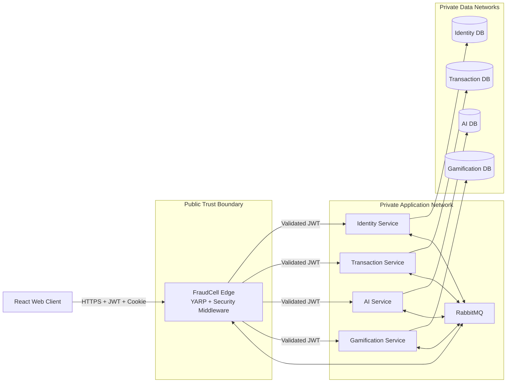
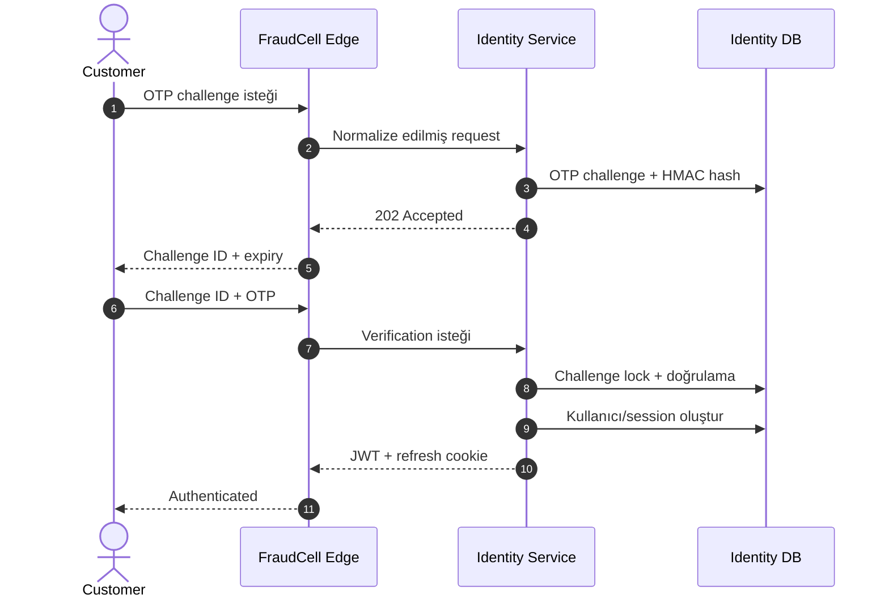
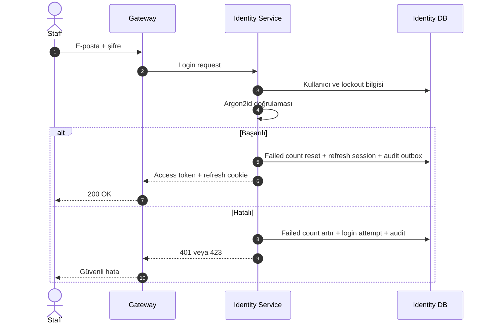
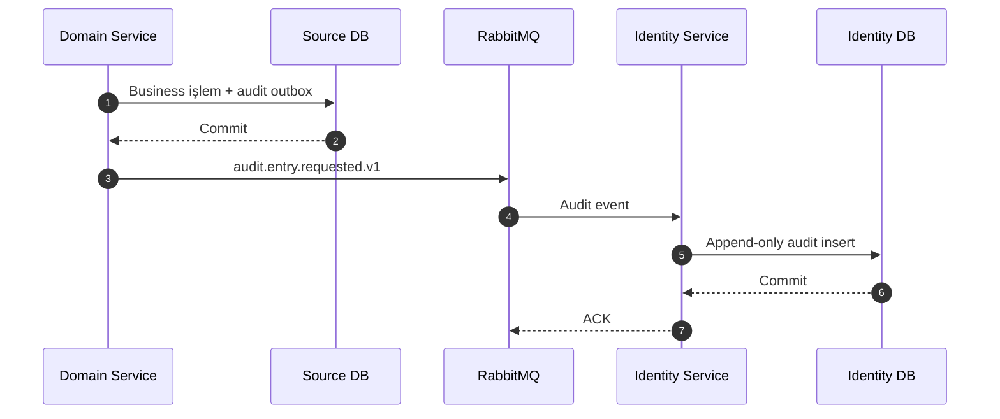

# FraudCell — Identity, Güvenlik ve Audit Mimarisi

**Doküman:** `09-IDENTITY-SECURITY-AND-AUDIT.md`
**Durum:** Accepted — Security Baseline v1.0
**Sistem:** FraudCell — Turkcell Gerçek Zamanlı Dolandırıcılık Tespit Platformu
**Son güncelleme:** YYYY-MM-DD
**Bilgi sınıfı:** Internal Architecture
**İlgili dokümanlar:**

- `00-START-HERE.md`
- `01-REQUIREMENTS-TRACEABILITY.md`
- `02-ARCHITECTURE-OVERVIEW.md`
- `03-TECH-STACK.md`
- `04-SERVICE-BOUNDARIES.md`
- `05-DOMAIN-AND-STATE-MACHINE.md`
- `06-DATA-ARCHITECTURE.md`
- `07-API-DESIGN.md`
- `08-EVENT-DRIVEN-ARCHITECTURE.md`
- `10-AI-SERVICE-DESIGN.md`
- `11-GAMIFICATION-DESIGN.md`
- `12-RESILIENCE-AND-OBSERVABILITY.md`
- `13-DOCKER-COMPOSE-AND-OPERATIONS.md`
- `14-TEST-STRATEGY.md`
- `15-DEMO-AND-JURY-DEFENSE.md`

---

# 1. Dokümanın Amacı

Bu doküman FraudCell sisteminin kimlik doğrulama, oturum yönetimi, yetkilendirme, güvenlik sınırları ve audit mimarisini kesinleştirir.

Bu dokümanda aşağıdaki sorular cevaplanır:

- Müşteri GSM ve OTP ile nasıl kayıt olur veya giriş yapar?
- Demo ortamındaki sabit `1234` OTP kodu nasıl güvenli biçimde sınırlandırılır?
- Personel hesaplarını kim oluşturabilir?
- Personel şifreleri hangi kurallara uyar?
- Şifreler nasıl hash’lenir?
- Beş başarısız giriş sonrası hesap nasıl kilitlenir?
- Kilitli kullanıcıya kalan süre nasıl döndürülür?
- JWT access token hangi claim’leri taşır?
- JWT hangi algoritmayla imzalanır ve nasıl doğrulanır?
- Refresh token nasıl üretilir, saklanır ve rotate edilir?
- Eski refresh token tekrar kullanılırsa ne olur?
- Logout ve bütün oturumları sonlandırma nasıl uygulanır?
- Yetkilendirme Gateway ve servis arasında nasıl bölünür?
- IDOR saldırıları nasıl engellenir?
- Role sahip olmak neden tek başına yeterli değildir?
- 401, 403 ve ownership kaynaklı 404 ne zaman kullanılır?
- Hangi işlemler audit log’a yazılır?
- Audit kaydı Identity Service kapalıyken nasıl korunur?
- SQL injection, XSS, CSRF ve brute-force saldırıları nasıl engellenir?
- Client IP bilgisi reverse proxy arkasında nasıl güvenilir biçimde belirlenir?
- Secret ve signing key’ler nasıl yönetilir?
- Jürinin canlı güvenlik testinde hangi davranışlar gösterilir?

Bu doküman FraudCell güvenlik kararlarının ana otoritesidir.

---

# 2. Güvenlik Hedefleri

FraudCell aşağıdaki güvenlik hedeflerine sahip olacaktır:

1. Kullanıcının kimliği güvenilir biçimde doğrulanmalıdır.
2. Kullanıcı yalnızca kendi rolünün izin verdiği işlemleri yapabilmelidir.
3. Role sahip olmak başka kullanıcıların kaynaklarına erişim hakkı vermemelidir.
4. Şifre, OTP, refresh token ve signing key plaintext olarak saklanmamalıdır.
5. Çalınmış veya tekrar kullanılan refresh token tespit edilebilmelidir.
6. Yetkisiz erişim denemeleri audit edilmelidir.
7. Bir güvenlik kontrolü yalnızca frontend’e veya Gateway’e bırakılmamalıdır.
8. Bir servis başka servisin veritabanına güvenlik amacıyla dahi doğrudan erişmemelidir.
9. Güvenlik olayı kaynak business transaction’ını mümkün olduğunca bozmadan kaydedilmelidir.
10. Kullanıcı girdisi hiçbir zaman SQL, HTML veya log komutu olarak yorumlanmamalıdır.
11. Sistemdeki secret’lar source control içine girmemelidir.
12. Güvenlik hataları internal sistem detaylarını kullanıcıya sızdırmamalıdır.
13. Bütün kritik güvenlik davranışları otomatik test veya canlı demo ile kanıtlanmalıdır.
14. Güvenlik tasarımı servis bağımsızlığını tamamen ortadan kaldırmamalıdır.
15. Defense in depth uygulanmalıdır.

---

# 3. Standart ve Güvenlik Referansları

FraudCell güvenlik tasarımı aşağıdaki güncel standart ve rehberlerle uyumlu olacak şekilde hazırlanmıştır:

- OWASP, password storage için Argon2id kullanımını ve en az `19 MiB memory`, `2 iteration`, `1 parallelism` seviyesini önerir. FraudCell bunun üzerinde bir baseline kullanacaktır. :contentReference[oaicite:1]{index=1}
- Refresh token rotation ve eski token tekrar kullanımından replay/theft tespiti yaklaşımı OAuth 2.0 Security Best Current Practice içinde tanımlanmaktadır. :contentReference[oaicite:2]{index=2}
- JWT doğrulamasında algoritmanın açık allowlist ile sınırlandırılması, issuer ve audience kontrolleri JWT Best Current Practices ile uyumludur. :contentReference[oaicite:3]{index=3}
- SQL injection’a karşı temel savunma parametreli sorgular ve allowlist tabanlı dinamik sorgu kontrolüdür. :contentReference[oaicite:4]{index=4}
- XSS savunmasının temeli context-aware output encoding ve güvenli DOM sink’leridir; CSP ek savunma katmanıdır. :contentReference[oaicite:5]{index=5}
- Session cookie’lerinde `HttpOnly`, `Secure` ve `SameSite` kullanımı oturum güvenliğinin temel parçalarıdır. :contentReference[oaicite:6]{index=6}
- Cookie tabanlı authentication işlemlerinde CSRF koruması uygulanmalıdır. ASP.NET Core bu amaçla antiforgery altyapısı sağlar. :contentReference[oaicite:7]{index=7}
- Reverse proxy arkasında scheme ve client IP gibi forwarded header’lar yalnızca güvenilen proxy’lerden kabul edilmelidir. :contentReference[oaicite:8]{index=8}
- Güvenlik loglarında authentication başarı/başarısızlıkları bulunmalı; şifre, token ve benzeri secret’lar loglanmamalıdır. :contentReference[oaicite:9]{index=9}

Bu kaynaklar case gereksinimlerinin yerine geçmez.

Case gereksinimleri zorunludur; kaynaklar uygulama kararlarının güvenlik seviyesini yükseltir.

---

# 4. Güvenlik Mimarisi



---

# 5. Trust Boundary’ler

## 5.1 Browser → Gateway

Bu sınır tamamen untrusted kabul edilir.

Browser’dan gelen:

- JWT
- Cookie
- JSON body
- Header
- Query string
- Path parametresi
- IP header’ı
- User agent
- Correlation ID

doğrulanmadan kullanılmaz.

Bu boundary’de:

- TLS
- JWT validation
- Rate limiting
- Request-size limit
- Security header
- CORS
- CSRF
- Input validation
- Correlation
- Forwarded-header kontrolü

uygulanır.

## 5.2 Gateway → Business Service

Gateway’den gelen request otomatik olarak güvenilir kabul edilmez.

Business service:

- JWT imzasını tekrar doğrular.
- Issuer ve audience kontrol eder.
- Role policy uygular.
- Resource ownership kontrol eder.
- Case assignment kontrol eder.
- State machine kontrol eder.

Gateway compromise edilse veya bypass edilse dahi servis kendi domain sınırını korur.

## 5.3 Service → RabbitMQ

Event payload’ları trusted code tarafından üretilmiş olsa bile consumer:

- Event type
- Event version
- Producer
- Schema
- Event ID
- Payload hash
- Boyut

kontrolü uygular.

## 5.4 Service → Database

Her servis yalnızca kendi database credential’ına sahiptir.

Database runtime kullanıcısı:

- Schema değiştiremez.
- Başka database’e erişemez.
- Gereksiz delete yetkisine sahip değildir.
- Parametreli sorgular kullanır.

---

# 6. Kimlik Türleri

FraudCell iki farklı authentication modeli destekler.

## 6.1 Müşteri

Authentication yöntemi:

```text
GSM + OTP
```

Rol:

```text
CUSTOMER
```

## 6.2 Personel

Authentication yöntemi:

```text
E-posta + şifre
```

Roller:

```text
ANALYST
SUPERVISOR
ADMIN
```

Müşteri ve personel aynı login endpoint’ini kullanmayacaktır.

Bunun nedenleri:

- Farklı credential türleri
- Farklı rate-limit politikaları
- Farklı lockout davranışı
- Farklı kullanıcı deneyimi
- Daha açık audit
- Daha düşük account-enumeration riski

---

# 7. Identity Service Sorumlulukları

Identity Service aşağıdaki güvenlik yeteneklerinin tek sahibidir:

- Müşteri kaydı
- GSM normalizasyonu
- OTP challenge
- OTP verification
- Personel hesabı oluşturma
- Personel şifre doğrulama
- Password policy
- Password hash
- Account lockout
- Role yönetimi
- Uzmanlık ve bölge yönetimi
- Access token üretimi
- Refresh token üretimi
- Refresh rotation
- Token family
- Token reuse detection
- Session revoke
- Logout
- Security stamp
- Audit log persistence
- Login-attempt history

Identity Service aşağıdaki işlemlerin sahibi değildir:

- Transaction ownership kontrolü
- Case assignment ownership kontrolü
- Risk case state machine
- Fraud-type override business kuralı
- Puan ve badge
- AI model yetkisi

---

# 8. Müşteri GSM Normalizasyonu

Müşteri GSM numarası canonical E.164 benzeri formatta normalize edilir.

Örnek input’lar:

```text
0555 111 22 33
5551112233
+90 555 111 22 33
0090 555 111 22 33
```

Canonical değer:

```text
+905551112233
```

Kurallar:

1. Boşluk, tire ve parantez temizlenir.
2. Türkiye numarası için `+90` formatına normalize edilir.
3. Geçersiz uzunluk reddedilir.
4. Yalnızca izin verilen karakterler kabul edilir.
5. Normalize edilmiş GSM unique constraint ile korunur.
6. Loglarda tam GSM gösterilmez.
7. API response’unda maskelenmiş GSM döndürülür.

Örnek:

```text
+90******2233
```

---

# 9. Customer OTP Akışı



---

# 10. OTP Challenge

Endpoint:

```text
POST /api/v1/auth/customer/otp/challenges
```

Request:

```json
{
  "gsmNumber": "+905551112233",
  "purpose": "CUSTOMER_LOGIN"
}
```

Purpose:

```text
CUSTOMER_REGISTER
CUSTOMER_LOGIN
```

Challenge aşağıdaki alanları içerir:

- Challenge ID
- Normalize GSM
- OTP hash
- Purpose
- Status
- Attempt count
- Expiration
- Creation IP
- User agent hash veya sınırlı snapshot
- Created at

---

# 11. Demo OTP Sağlayıcısı

Demo environment’ta OTP kodu:

```text
1234
```

olacaktır.

Bu davranış yalnızca aşağıdaki environment’ta aktif olabilir:

```text
ASPNETCORE_ENVIRONMENT=Demo
```

veya:

```text
OTP_PROVIDER=Demo
```

Production benzeri profile’da sabit OTP kullanılamaz.

Uygulama startup sırasında aşağıdaki kombinasyonu reddeder:

```text
ENVIRONMENT=Production
OTP_PROVIDER=Demo
```

Demo OTP response içinde yalnızca demo profile’da açıklanabilir:

```json
{
  "demoHint": "Demo ortamında OTP: 1234"
}
```

Production response’unda `demoHint` alanı bulunmaz.

---

# 12. OTP Saklama

OTP kodu plaintext olarak database’e yazılmayacaktır.

OTP düşük entropili olduğu için yalnızca düz SHA-256 hash kullanılması tercih edilmeyecektir.

Baseline:

```text
HMAC-SHA-256(
    secret = OTP_HASH_KEY,
    message = challengeId + ":" + otpCode
)
```

Database yalnızca HMAC çıktısını saklar.

Avantajları:

- Database sızıntısında dört haneli OTP offline olarak kolayca doğrulanamaz.
- Aynı OTP farklı challenge’larda farklı hash sonucu üretir.
- Kod loglanmaz.
- Challenge ID bağlamına sabitlenir.

`OTP_HASH_KEY`:

- Source control’a girmez.
- Identity Service’e secret olarak mount edilir.
- Loglanmaz.
- Başka servislerle paylaşılmaz.

---

# 13. OTP Süresi ve Deneme Sayısı

Baseline OTP süresi:

```text
5 dakika
```

Maksimum doğrulama denemesi:

```text
5
```

Durumlar:

```text
PENDING
VERIFIED
EXPIRED
LOCKED
CANCELLED
```

Kurallar:

1. Süresi dolmuş challenge kullanılamaz.
2. Doğrulanmış challenge tekrar kullanılamaz.
3. Beş yanlış denemede challenge `LOCKED` olur.
4. Doğrulama ve attempt artırma aynı database transaction içinde yapılır.
5. Aynı challenge’a paralel iki başarılı verification yalnızca bir session üretir.
6. OTP response veya loglarda gösterilmez.

---

# 14. OTP Rate Limit

Baseline politikalar:

| Kapsam               |                    Limit |
| -------------------- | -----------------------: |
| Aynı GSM             |  3 challenge / 10 dakika |
| Aynı IP              | 10 challenge / 10 dakika |
| Aynı challenge       |  5 verification denemesi |
| Aynı IP verification |    20 deneme / 10 dakika |

GSM rate-limit key’i plaintext GSM olarak tutulmamalıdır.

Önerilen key:

```text
HMAC(rateLimitKey, normalizedGsm)
```

Rate-limit aşımında:

```http
429 Too Many Requests
Retry-After: ...
```

döner.

---

# 15. OTP Account Enumeration Savunması

Challenge endpoint’i GSM’nin sistemde kayıtlı olup olmadığını açıkça belirtmez.

Yanlış response:

```text
Bu GSM sistemde kayıtlı değildir.
```

Tercih edilen response:

```text
Uygun olması durumunda doğrulama kodu gönderildi.
```

Demo customer registration akışında kullanıcı kaydı yoksa verification sonrasında profil oluşturulabilir.

Login ve registration purpose açıkça ayrılır; fakat response timing ve mesajları gereksiz account enumeration oluşturmamalıdır.

---

# 16. Müşteri Kayıt Akışı

`CUSTOMER_REGISTER` challenge doğrulandığında:

1. Challenge `PENDING` olmalıdır.
2. OTP doğru olmalıdır.
3. Challenge süresi dolmamış olmalıdır.
4. GSM başka customer’a ait olmamalıdır.
5. Ad zorunludur.
6. Soyad zorunludur.
7. E-posta opsiyoneldir.
8. E-posta verilmişse normalize edilir ve format doğrulanır.
9. Customer user oluşturulur.
10. Customer profile oluşturulur.
11. `CUSTOMER` rolü atanır.
12. Challenge `VERIFIED` olur.
13. Refresh session oluşturulur.
14. Access token oluşturulur.
15. Audit kaydı üretilir.
16. Bütün database değişiklikleri tek local transaction’da commit edilir.

---

# 17. Personel Hesabı Oluşturma

Personel hesabı yalnızca `ADMIN` rolü tarafından oluşturulabilir.

Endpoint:

```text
POST /api/v1/staff
```

Desteklenen personel rolleri:

```text
ANALYST
SUPERVISOR
ADMIN
```

Normal admin ekranı üzerinden yeni `ADMIN` oluşturma baseline’da kapalı tutulabilir.

Nihai karar:

```text
Admin, ANALYST ve SUPERVISOR oluşturabilir.
Yeni ADMIN yalnızca seed veya kontrollü internal operasyonla oluşturulur.
```

Bu karar privilege escalation riskini azaltır.

Personel oluşturulurken:

- Ad
- Soyad
- E-posta
- Geçici veya başlangıç şifresi
- Rol
- Uzmanlıklar
- Bölgeler
- Assignment enabled

alanları doğrulanır.

---

# 18. İlk Admin Hesabı

İlk admin hesabı reference/demo seed sırasında oluşturulur.

Kurallar:

- Password hash seed sırasında gerçek password hasher ile oluşturulur.
- Plaintext şifre migration veya SQL dosyasına yazılmaz.
- Demo credential root README’de yalnızca demo environment için belirtilir.
- Production benzeri profile’da environment secret’tan alınır.
- İlk girişte şifre değiştirme production ortamında zorunlu hale getirilebilir.
- Seed işlemi ikinci admin kopyası oluşturmaz.

---

# 19. Personel E-posta Normalizasyonu

E-posta lookup için:

```text
normalizedEmail
```

alanı kullanılır.

Kurallar:

1. Baş ve son whitespace temizlenir.
2. Domain kısmı lowercase yapılır.
3. Uygulama içinde tutarlı normalization uygulanır.
4. Normalize edilmiş e-posta unique olmalıdır.
5. Login sorgusu normalize edilmiş değer üzerinden yapılır.
6. Audit log’da tam e-posta yerine kullanıcı ID tercih edilir.
7. Bilinmeyen e-posta ve yanlış şifre aynı genel hata mesajını üretir.

---

# 20. Şifre Politikası

Personel şifresi aşağıdaki case kurallarına uymalıdır:

```text
Minimum 8 karakter
En az 1 büyük harf
En az 1 rakam
En az 1 özel karakter
```

FraudCell ek baseline kuralları:

```text
Maksimum 128 karakter
Boş veya yalnızca whitespace olamaz
Null karakter kabul edilmez
Kontrol karakterleri kabul edilmez
```

Şifre alanında:

- Baş/son whitespace otomatik trim edilmez.
- Kullanıcının yazdığı değer aynen değerlendirilir.
- Şifre loglanmaz.
- Şifre response’a eklenmez.
- Şifre event payload’a eklenmez.
- Şifre audit details içine eklenmez.

---

# 21. Şifre Hata Mesajları

Password policy ihlalinde hangi kuralın ihlal edildiği açıkça döndürülür.

Örnek:

```json
{
  "success": false,
  "data": null,
  "error": {
    "code": "PASSWORD_POLICY_VIOLATION",
    "message": "Şifre güvenlik kurallarını karşılamıyor.",
    "details": {
      "violations": [
        {
          "code": "PASSWORD_REQUIRES_UPPERCASE",
          "message": "Şifre en az bir büyük harf içermelidir."
        },
        {
          "code": "PASSWORD_REQUIRES_SPECIAL_CHARACTER",
          "message": "Şifre en az bir özel karakter içermelidir."
        }
      ]
    }
  },
  "meta": {
    "traceId": "01J..."
  }
}
```

Error code’ları:

```text
PASSWORD_TOO_SHORT
PASSWORD_TOO_LONG
PASSWORD_REQUIRES_UPPERCASE
PASSWORD_REQUIRES_DIGIT
PASSWORD_REQUIRES_SPECIAL_CHARACTER
PASSWORD_CONTAINS_CONTROL_CHARACTER
```

---

# 22. Password Hash Algoritması

Nihai password hash algoritması:

```text
Argon2id
```

olacaktır.

Düz metin, MD5, SHA-1 veya tek başına SHA-256 password hash olarak kullanılmayacaktır.

FraudCell baseline Argon2id parametreleri:

```text
Memory cost: 64 MiB
Iterations: 3
Parallelism: 1
Salt length: 16 byte
Hash length: 32 byte
```

Bu değerler OWASP minimum profilinin üzerindedir. :contentReference[oaicite:10]{index=10}

Parametreler final ortamında benchmark edilmelidir.

Hedef personel login hash süresi:

```text
Yaklaşık 150–400 ms
```

Bu hedef mutlak güvenlik standardı değil, demo donanımı ile güvenlik ve kullanılabilirlik dengesidir.

---

# 23. Password Hash Formatı

Password hash, algoritma ve parametre bilgisini içeren standardize formatta saklanmalıdır.

Örnek:

```text
$argon2id$v=19$m=65536,t=3,p=1$...$...
```

Bu sayede:

- Eski parametreler tanınabilir.
- Başarılı login sonrasında rehash yapılabilir.
- Parametre güncellemesi kullanıcı şifresini sıfırlamadan uygulanabilir.
- Hash algoritması sessizce tahmin edilmez.

---

# 24. Salt ve Pepper Kararı

Her şifre için kriptografik random ve unique salt kullanılacaktır.

Salt Argon2id encoded hash içinde tutulabilir.

Baseline’da merkezi password pepper zorunlu tutulmayacaktır.

Nedeni:

- Pepper kaybı bütün kullanıcıların login’ini bozabilir.
- Demo operasyonunu zorlaştırır.
- Argon2id + unique salt case gereksinimi için yeterlidir.
- Secret rotation ek operasyon ister.

Production hardening aşamasında HSM veya secret manager tabanlı pepper ayrıca değerlendirilebilir.

---

# 25. Password Verification

Personel login sırasında:

1. E-posta normalize edilir.
2. Kullanıcı bulunur.
3. Hesap aktifliği kontrol edilir.
4. Lockout durumu kontrol edilir.
5. Password hash doğrulanır.
6. Başarılıysa failed count sıfırlanır.
7. Hash parametreleri eskiyse rehash yapılır.
8. Session oluşturulur.
9. Access ve refresh token üretilir.
10. Audit kaydı oluşturulur.

Password comparison işlemi kullanılan Argon2id kütüphanesi üzerinden yapılır.

Manuel string karşılaştırması yapılmaz.

---

# 26. Bilinmeyen Kullanıcı Timing Savunması

Login e-postası bulunamadığında request hemen dönmemelidir.

Bilinmeyen kullanıcı için önceden üretilmiş dummy Argon2id hash doğrulaması çalıştırılır.

Amaç:

- Kullanıcı var/yok timing farkını azaltmak
- E-posta enumeration saldırısını zorlaştırmak

Response her iki durumda da:

```text
INVALID_CREDENTIALS
```

olur.

---

# 27. Personel Login Akışı



---

# 28. Hesap Kilitleme

Beş başarısız personel login denemesinde hesap:

```text
15 dakika
```

kilitlenir.

Kurallar:

```text
Başarısız deneme sayısı: 5
Kilit süresi: 15 dakika
```

Kilit bilgisi database’te tutulur:

```text
access_failed_count
lockout_end_at
```

Beşinci başarısız denemede aynı transaction içinde:

1. Failed count artırılır.
2. `lockout_end_at = now + 15 dakika` atanır.
3. Login attempt kaydedilir.
4. Audit outbox kaydı oluşturulur.
5. Account locked event’i oluşturulur.

---

# 29. Lockout Concurrency

Aynı hesaba paralel login denemeleri yapılabilir.

Failed count artırma işlemi:

- Row-level lock
- Optimistic concurrency
- Atomic update

ile korunmalıdır.

Örnek:

```sql
UPDATE identity.users
SET
    access_failed_count = access_failed_count + 1,
    lockout_end_at =
        CASE
            WHEN access_failed_count + 1 >= 5
            THEN @lockoutEnd
            ELSE lockout_end_at
        END,
    version = version + 1
WHERE id = @userId;
```

Paralel denemeler failed count kaybına neden olmamalıdır.

---

# 30. Kilitli Hesap Response’u

Kilitli hesap login denemesinde:

```http
423 Locked
```

döndürülür.

Response:

```json
{
  "success": false,
  "data": null,
  "error": {
    "code": "ACCOUNT_LOCKED",
    "message": "Hesap geçici olarak kilitlenmiştir.",
    "details": {
      "lockedUntil": "2026-07-22T15:30:00Z",
      "remainingSeconds": 840
    }
  },
  "meta": {
    "traceId": "01J..."
  }
}
```

Kalan süre server clock üzerinden hesaplanır.

Frontend kendi tahminini security source of truth olarak kullanmaz.

---

# 31. Lockout Sonrası Davranış

`lockout_end_at <= now` olduğunda hesap yeniden login deneyebilir.

Başarılı login sonrasında:

```text
access_failed_count = 0
lockout_end_at = null
```

olur.

Başarısız login olursa count yeni seri için tekrar artar.

Ayrı unlock worker zorunlu değildir.

Lock durumu timestamp üzerinden hesaplanabilir.

Admin manuel unlock endpoint’i baseline’da zorunlu değildir.

Eklenirse:

- Admin-only olmalı
- Reason zorunlu olmalı
- Audit edilmeli
- Concurrency kontrolü uygulanmalı

---

# 32. Gateway Rate Limit ile Account Lockout Ayrımı

Rate limiting ve account lockout farklı problemleri çözer.

## Gateway Rate Limit

Korur:

- Tek IP’den yüksek hacimli deneme
- Bot saldırısı
- API kaynak tüketimi
- OTP spam

## Account Lockout

Korur:

- Aynı personel hesabına farklı IP’lerden parola denemesi
- Password spraying sonrası hesap bazlı kontrol
- Case’in zorunlu 5 hata kuralı

Her ikisi birlikte uygulanacaktır.

---

# 33. Access Token Kararı

Access token:

```text
JWT
```

olacaktır.

Geçerlilik süresi:

```text
15 dakika
```

Signing algoritması:

```text
RS256
```

JWT header:

```json
{
  "alg": "RS256",
  "typ": "JWT",
  "kid": "fraudcell-signing-2026-01"
}
```

Token doğrulaması yalnızca `RS256` algoritmasına izin verir.

JWT header’daki `alg` değerine kör güvenilmez; validation configuration açık allowlist kullanır. :contentReference[oaicite:11]{index=11}

---

# 34. RSA Signing Key

Baseline RSA key boyutu:

```text
En az 2048 bit
```

Önerilen demo key boyutu:

```text
3072 bit
```

Private key yalnızca Identity Service tarafından okunabilir.

Public key:

- Gateway
- Identity Service
- Transaction Service
- AI Service
- Gamification Service

tarafından okunabilir.

Token doğrulayabilen servis token imzalayamaz.

---

# 35. JWT Claim’leri

Access token aşağıdaki claim’leri taşır:

```text
sub
user_id
role
specialties
regions
jti
sid
iss
aud
iat
nbf
exp
auth_time
```

## `sub`

Canonical user ID.

## `user_id`

Case dokümanındaki açık beklentiyi karşılayan user ID alanı.

`sub` ile aynı değeri taşır.

## `role`

Aşağıdaki değerlerden biri:

```text
CUSTOMER
ANALYST
SUPERVISOR
ADMIN
```

## `specialties`

Analist uzmanlık listesi.

Customer, supervisor veya admin için boş olabilir.

## `regions`

Personel bölge listesi.

## `jti`

Access token’ın benzersiz kimliği.

## `sid`

Refresh session kimliği.

## `iss`

Token issuer.

## `aud`

FraudCell API audience.

## `iat`, `nbf`, `exp`

Token zaman sınırları.

## `auth_time`

Kullanıcının credential ile son doğrulandığı zaman.

---

# 36. JWT Örnek Payload

```json
{
  "sub": "01JZX5ANALYST0000000000001",
  "user_id": "01JZX5ANALYST0000000000001",
  "role": "ANALYST",
  "specialties": ["CALINTI_KART", "HESAP_ELE_GECIRME"],
  "regions": ["KARADENIZ", "YURT_DISI"],
  "jti": "01JZX5JWT00000000000000001",
  "sid": "01JZX5SESSION0000000000001",
  "iss": "fraudcell-identity",
  "aud": "fraudcell-api",
  "iat": 1784732400,
  "nbf": 1784732400,
  "exp": 1784733300,
  "auth_time": 1784732400
}
```

JWT içinde aşağıdakiler bulunmayacaktır:

- Password hash
- OTP
- E-posta zorunlu değilse
- GSM
- Refresh token
- Tam customer profile
- Audit details
- Model veya case verisi

---

# 37. JWT Validation

Gateway ve her business service aşağıdaki kontrolleri uygular:

1. Token mevcut mu?
2. Token formatı geçerli mi?
3. Signature geçerli mi?
4. `alg` tam olarak `RS256` mi?
5. `kid` bilinen key’e karşılık geliyor mu?
6. `iss` beklenen değer mi?
7. `aud` beklenen değer mi?
8. `exp` mevcut ve geçerli mi?
9. `nbf` geçerli mi?
10. `sub` mevcut mu?
11. `user_id` mevcut ve `sub` ile eşleşiyor mu?
12. `role` desteklenen değer mi?
13. `jti` mevcut mu?
14. `sid` mevcut mu?
15. Token access token bağlamında mı kullanılıyor?

Baseline clock skew:

```text
30 saniye
```

ASP.NET Core’un yüksek varsayılan clock skew değerine güvenilmeyecektir.

---

# 38. JWT Reddi

Aşağıdaki durumlar:

```http
401 Unauthorized
```

üretir:

- Signature bozuk
- Payload değiştirilmiş
- `alg=none`
- Yanlış algoritma
- Expired token
- Gelecekteki `nbf`
- Yanlış issuer
- Yanlış audience
- Bilinmeyen `kid`
- Eksik `sub`
- Eksik `jti`
- Eksik `sid`
- Desteklenmeyen role

Response internal validation detayını açıklamaz.

Örnek:

```json
{
  "success": false,
  "data": null,
  "error": {
    "code": "ACCESS_TOKEN_INVALID",
    "message": "Oturum doğrulanamadı."
  },
  "meta": {
    "traceId": "01J..."
  }
}
```

Server log’u daha teknik reason code taşıyabilir.

---

# 39. Signing Key Saklama

RSA private key:

- Repository’ye commit edilmez.
- Docker image içine kopyalanmaz.
- Environment variable içine büyük plaintext olarak yazılmaz.
- Read-only file veya Docker secret olarak mount edilir.
- Yalnızca Identity Service container’ına verilir.
- File permission ile sınırlandırılır.
- Loglanmaz.
- Error response’a eklenmez.

Public key secret değildir; ancak kontrollü config artifact olarak yönetilir.

---

# 40. Signing Key Rotation

JWT header `kid` taşıdığı için key rotation desteklenir.

Rotation akışı:

1. Yeni key pair offline üretilir.
2. Yeni public key Gateway ve servislere dağıtılır.
3. Servisler eski ve yeni public key’i kabul eder.
4. Identity yeni private key ile token imzalamaya başlar.
5. En uzun access-token süresi geçtikten sonra eski public key kaldırılır.
6. Eski private key güvenli biçimde arşivlenir veya imha edilir.
7. Rotation audit edilir.

Key rotation application startup’ında otomatik random key üretimiyle yapılmayacaktır.

Container restart token’ları geçersiz hale getirmemelidir.

---

# 41. Refresh Token Kararı

Refresh token:

```text
En az 256-bit kriptografik random değer
```

olacaktır.

Önerilen üretim:

```text
RandomNumberGenerator.GetBytes(32)
+
Base64URL encoding
```

Geçerlilik süresi:

```text
7 gün
```

Refresh token:

- JWT olmak zorunda değildir.
- Opaque random token olacaktır.
- Browser’a HttpOnly cookie olarak verilir.
- Response body’de döndürülmez.
- Database’te plaintext saklanmaz.
- URL veya query string içinde taşınmaz.
- Loglanmaz.

---

# 42. Refresh Token Hash

Refresh token database’e yazılmadan önce:

```text
SHA-256
```

ile hash’lenir.

Random token 256-bit entropili olduğu için password benzeri yavaş hash gerektirmez.

Saklanan değer:

```text
token_hash
```

Raw refresh token yalnızca:

- Üretim anında
- Cookie response oluşturulurken

kısa süreli memory’de bulunur.

---

# 43. Refresh Session

Her browser/device login’i ayrı session oluşturur.

Session alanları:

```text
id
user_id
family_id
token_hash
parent_session_id
replaced_by_session_id
created_at
expires_at
last_used_at
revoked_at
revocation_reason
reuse_detected_at
created_ip
last_used_ip
user_agent
version
```

JWT `sid` claim’i session ID’yi taşır.

---

# 44. Token Family

Bir login ile başlayan refresh rotation zinciri aynı:

```text
family_id
```

değerini taşır.

Örnek:

```text
Session A
  ↓ refresh
Session B
  ↓ refresh
Session C
```

A, B ve C aynı token family’ye aittir.

Her rotation’da:

- Eski session revoke edilir.
- Yeni session oluşturulur.
- Eski session `replaced_by_session_id` ile yenisine bağlanır.
- Yeni session `parent_session_id` ile eskisine bağlanır.

---

# 45. Refresh Token Rotation

Refresh endpoint’i çağrıldığında:

1. Cookie’den raw token alınır.
2. Token hash hesaplanır.
3. Session satırı `FOR UPDATE` veya eşdeğer lock ile alınır.
4. Token mevcut mu kontrol edilir.
5. Expired mı kontrol edilir.
6. Revoked mı kontrol edilir.
7. User aktif mi kontrol edilir.
8. Yeni refresh token üretilir.
9. Eski session revoke edilir.
10. Yeni session oluşturulur.
11. Replacement ilişkisi yazılır.
12. Yeni access token üretilir.
13. Audit outbox kaydı oluşturulur.
14. Database transaction commit edilir.
15. Yeni refresh cookie gönderilir.

Rotation ve session değişiklikleri atomik olmalıdır.

Refresh-token rotation, eski token tekrar kullanımının tespit edilebilmesine olanak verir. :contentReference[oaicite:12]{index=12}

---

# 46. Paralel Refresh Yarışı

Aynı refresh token iki paralel request’te kullanılabilir.

Sadece ilk request başarılı olmalıdır.

İkinci request:

- Eski token’ın revoke edildiğini görür.
- Reuse detection akışını tetikler.
- Yeni token üretmez.
- `401` döndürür.

Frontend paralel refresh isteği göndermemelidir.

Frontend API client içinde tek bir refresh promise/lock kullanacaktır.

---

# 47. Refresh Token Reuse Detection

Revoke edilmiş refresh token tekrar kullanılırsa olay:

```text
REFRESH_TOKEN_REUSE_DETECTED
```

olarak değerlendirilir.

Case gereksinimi gereği yalnızca aynı token family değil:

```text
Kullanıcının bütün aktif refresh session’ları
```

sonlandırılır.

Akış:

1. Kullanılan token session’ı bulunur.
2. Session’ın revoke edildiği görülür.
3. `reuse_detected_at` atanır.
4. Kullanıcının bütün aktif refresh session’ları revoke edilir.
5. Revocation reason `TOKEN_REUSE_DETECTED` olur.
6. Kullanıcının security stamp değeri değiştirilir.
7. Audit kaydı oluşturulur.
8. Yüksek öncelikli security log oluşturulur.
9. Kullanıcıya güvenlik bildirimi hazırlanır.
10. Request `401` ile reddedilir.

---

# 48. Reuse Response’u

```http
401 Unauthorized
```

```json
{
  "success": false,
  "data": null,
  "error": {
    "code": "REFRESH_TOKEN_REUSE_DETECTED",
    "message": "Oturum güvenliği nedeniyle tüm oturumlar sonlandırıldı. Lütfen yeniden giriş yapın."
  },
  "meta": {
    "traceId": "01J..."
  }
}
```

Response:

- Hangi token’ın çalındığını açıklamaz.
- Token değerini göstermez.
- Internal family ID’yi göstermez.
- Session listesi döndürmez.

---

# 49. Access Token Hard Revocation

JWT access token doğası gereği yalnızca imza doğrulamasıyla kullanılırsa expiration süresine kadar geçerli kalabilir.

FraudCell güvenlik baseline’ı iki seviyeden oluşur.

## 49.1 Zorunlu Seviye

- Bütün refresh session’ları revoke edilir.
- Yeni access token alınamaz.
- Mevcut access token en fazla 15 dakika içinde süresi dolduğu için risk penceresi sınırlıdır.

## 49.2 Hard-Revocation Seviye

Token reuse, user deactivation veya kritik role change durumunda:

```text
identity.user.sessions.revoked.v1
```

event’i üretilir.

Payload:

```json
{
  "userId": "01J...",
  "rejectTokensIssuedAtOrBefore": "2026-07-22T14:40:00Z",
  "reason": "TOKEN_REUSE_DETECTED",
  "occurredAt": "2026-07-22T14:40:00Z"
}
```

Gateway ve business servisleri bu bilgiyi local security projection olarak tutar.

JWT:

```text
iat <= rejectTokensIssuedAtOrBefore
```

ise reddedilir.

Bu mekanizma eski access token’ların 15 dakikayı beklemeden reddedilmesini sağlar.

---

# 50. Local Security Revocation Projection

Transaction, AI ve Gamification servislerinde minimum projection:

```text
security_user_revocations
- user_id
- reject_tokens_issued_at_or_before
- reason
- source_event_id
- updated_at
- expires_at
```

Gateway kalıcı DB sahibi olmadığı için kısa ömürlü in-memory cache tutabilir.

Gateway tek güvenlik noktası değildir.

Business servisi kendi local projection’ına göre token’ı tekrar kontrol eder.

Revocation kayıtları:

```text
Access token maksimum ömrü + clock skew
```

geçtikten sonra temizlenebilir.

Baseline retention:

```text
20 dakika
```

---

# 51. Revocation Event Tutarlılığı

RabbitMQ geçici olarak kapalıysa:

- Identity session revoke işlemi database’te commit edilir.
- Event Identity outbox’ında bekler.
- Eski refresh token anında kullanılamaz.
- Access-token hard-revocation event’i broker geri geldiğinde yayılır.
- Maksimum residual risk access-token’ın 15 dakikalık ömrüyle sınırlıdır.

Bu sınırlama dokümantasyonda gizlenmeyecektir.

---

# 52. Logout

Endpoint:

```text
POST /api/v1/auth/logout
```

Logout:

1. Refresh cookie’yi okur.
2. Token hash üzerinden session’ı bulur.
3. Session’ı revoke eder.
4. Reason `USER_LOGOUT` olarak kaydeder.
5. Audit kaydı üretir.
6. Cookie’yi siler.
7. `204 No Content` döner.

Logout idempotenttir.

Session zaten revoke edilmişse secret veya session durumu açıklanmadan başarılı response verilebilir.

Normal logout bütün cihazları kapatmaz.

---

# 53. Bütün Oturumları Sonlandırma

Endpoint:

```text
DELETE /api/v1/auth/sessions
```

Davranış:

1. Kullanıcının bütün refresh session’ları revoke edilir.
2. Security stamp değiştirilir.
3. Hard-revocation event’i üretilir.
4. Mevcut browser cookie’si silinir.
5. Audit kaydı oluşturulur.

Bu işlem sonrasında kullanıcı yeniden login olmalıdır.

---

# 54. Tek Oturumu Sonlandırma

Endpoint:

```text
DELETE /api/v1/auth/sessions/{sessionId}
```

Kullanıcı yalnızca kendi session’ını revoke edebilir.

Admin’in başka kullanıcının session’ını revoke etmesi baseline public API’de bulunmayacaktır.

Gerekirse ayrı internal security operation olarak tasarlanır.

Session ID tahmin edilebilir olmamalıdır.

Başka kullanıcıya ait session ID:

```http
404 Not Found
```

döndürür.

---

# 55. Role Change ve Session Güvenliği

Kullanıcının rolü değiştirildiğinde eski JWT içindeki role claim’i stale hale gelir.

Bu nedenle role change transaction’ında:

1. Role değiştirilir.
2. Security stamp değiştirilir.
3. Bütün refresh session’ları revoke edilir.
4. Hard-revocation event’i üretilir.
5. Audit kaydı oluşturulur.
6. Kullanıcı yeniden login olmaya zorlanır.

Bu davranış eski `ANALYST` token’ının role değişikliğinden sonra kullanılmasını engeller.

---

# 56. Staff Deactivation

Personel deaktive edildiğinde:

1. `is_active = false`
2. `assignment_enabled = false`
3. Bütün refresh session’ları revoke edilir.
4. Security stamp değiştirilir.
5. Access-token hard-revocation event’i üretilir.
6. `identity.staff.deactivated` event’i yayınlanır.
7. Audit kaydı oluşturulur.

Deaktive personel:

- Login olamaz.
- Refresh yapamaz.
- Yeni assignment alamaz.
- Eski token’ıyla business service’e erişemez.

Mevcut case’ler otomatik silinmez.

Supervisor reassignment işlemi yapar.

---

# 57. Refresh Cookie

Production HTTPS ortamında tercih edilen cookie:

```text
Name: __Host-fraudcell-refresh
HttpOnly: true
Secure: true
SameSite: Strict
Path: /
Domain: belirtilmez
Max-Age: 7 gün
```

`__Host-` cookie güvenlik özellikleri nedeniyle yalnızca HTTPS ve root path ile kullanılabilir.

Demo ortamı HTTP kullanıyorsa:

```text
Name: fraudcell_refresh
HttpOnly: true
Secure: false
SameSite: Strict
Path: /api/v1/auth
```

kullanılabilir.

HTTP demo ayarı production ortamında kabul edilmez.

---

# 58. Access Token Frontend Saklama

Access token:

```text
Browser memory
```

içinde tutulacaktır.

Aşağıdaki alanlarda tutulmayacaktır:

```text
localStorage
sessionStorage
URL query string
IndexedDB
Non-HttpOnly cookie
```

Session identifier ve token’ların JavaScript tarafından erişilebilir storage alanlarında tutulması XSS etkisini büyütür. :contentReference[oaicite:13]{index=13}

Sayfa yenilendiğinde frontend refresh endpoint’ini çağırarak yeni access token alabilir.

---

# 59. CSRF Tehdit Alanı

Normal business API request’leri:

```http
Authorization: Bearer {accessToken}
```

header’ı kullandığı için browser tarafından cross-site otomatik credential gönderimine dayanmaz.

Ancak refresh token cookie olarak gönderildiği için aşağıdaki endpoint’ler CSRF koruması gerektirir:

```text
POST /auth/refresh
POST /auth/logout
DELETE /auth/sessions
DELETE /auth/sessions/{id}
```

---

# 60. CSRF Savunması

Cookie kullanan state-changing auth endpoint’lerinde aşağıdaki kontroller birlikte uygulanır:

1. `SameSite=Strict`
2. `Origin` allowlist kontrolü
3. `Referer` fallback kontrolü
4. ASP.NET Core antiforgery token
5. Custom request header
6. JSON content type
7. Same-origin frontend

Header:

```http
X-XSRF-TOKEN: {token}
```

Readable CSRF cookie:

```text
XSRF-TOKEN
```

Refresh token cookie HttpOnly kalmaya devam eder.

CSRF token authentication secret değildir; request’in same-origin uygulamadan geldiğini doğrulamak için kullanılır.

---

# 61. CSRF Bootstrap

Frontend gerektiğinde:

```text
GET /api/v1/auth/csrf
```

endpoint’ini çağırır.

Response:

```http
Set-Cookie: XSRF-TOKEN=...; SameSite=Strict; Path=/; Secure
```

Body:

```json
{
  "success": true,
  "data": {
    "headerName": "X-XSRF-TOKEN"
  },
  "error": null,
  "meta": {
    "traceId": "01J..."
  }
}
```

Refresh ve logout request’i CSRF header olmadan reddedilir:

```http
400 Bad Request
```

Error:

```text
CSRF_VALIDATION_FAILED
```

---

# 62. Role-Based Authorization

Roller:

```text
CUSTOMER
ANALYST
SUPERVISOR
ADMIN
```

Endpoint policy’leri hardcoded dağınık role string’leriyle uygulanmayacaktır.

Named policy’ler kullanılacaktır.

Örnek:

```text
CustomerOnly
AnalystOnly
SupervisorOnly
AdminOnly
AnalystOrSupervisor
SupervisorOrAdmin
AuthenticatedUser
```

---

# 63. Yetki Matrisi

| İşlem                          |     Customer |      Analyst | Supervisor | Admin |
| ------------------------------ | -----------: | -----------: | ---------: | ----: |
| İşlem oluşturma                |         Evet |        Hayır |      Hayır | Hayır |
| Kendi transaction’ını görme    |         Evet |        Hayır |       Tümü |  Tümü |
| Atanmış case’i görme           |        Hayır |         Evet |       Tümü |  Tümü |
| Case state değiştirme          |        Hayır | Atanmış case |       Evet | Hayır |
| Manuel assignment              |        Hayır |        Hayır |       Evet | Hayır |
| Fraud-type override            |        Hayır | Atanmış case |       Evet | Hayır |
| Risk-level override            |        Hayır |        Hayır |       Evet | Hayır |
| Dashboard                      |        Hayır |        Hayır |       Evet |  Evet |
| Personel hesabı oluşturma      |        Hayır |        Hayır |      Hayır |  Evet |
| Role yönetimi                  |        Hayır |        Hayır |      Hayır |  Evet |
| Audit log görüntüleme          |        Hayır |        Hayır |      Hayır |  Evet |
| Kendi gamification profili     |        Hayır |         Evet |       Evet |  Evet |
| Customer verification response | Kendi case’i |        Hayır |      Hayır | Hayır |

---

# 64. Resource-Based Authorization

Role kontrolü resource ownership’in yerine geçmez.

## Customer Transaction Kontrolü

```text
transaction.customer_id == currentUserId
```

## Customer Case Kontrolü

```text
risk_case.customer_id == currentUserId
```

## Analyst Case Kontrolü

```text
risk_case.assigned_analyst_id == currentUserId
```

## Session Kontrolü

```text
refresh_session.user_id == currentUserId
```

Ownership mümkün olduğunda database query’sine eklenir.

Yanlış:

```text
Önce case’i ID ile getir
Sonra actor aynı mı bak
```

Tercih edilen:

```sql
SELECT ...
FROM risk_cases
WHERE id = @caseId
AND assigned_analyst_id = @currentAnalystId;
```

---

# 65. IDOR Savunması

IDOR testi:

```text
Customer A kendi transaction ID’sindeki bir karakteri değiştirip
Customer B’nin transaction’ına erişmeye çalışır.
```

Beklenen:

```http
404 Not Found
```

Analyst A, Analyst B’ye atanmış case’e erişmeye çalışır.

Beklenen:

```http
404 Not Found
```

Kaynak gerçekten yok veya actor’a ait değil ayrımı dışarıya açıklanmaz.

Bu erişim girişimi:

```text
RESOURCE_ACCESS_DENIED
```

olarak audit edilir.

---

# 66. 401, 403 ve 404 Politikası

## 401 Unauthorized

Kullanılır:

- Token yok
- Token geçersiz
- Token expired
- Signature yanlış
- Refresh token geçersiz
- Session revoke edilmiş

## 403 Forbidden

Kullanılır:

- Kullanıcı authenticated
- Endpoint’in role policy’sine uygun değil

Örnek:

```text
Customer token → Supervisor dashboard
```

Case gereksinimi doğrultusunda 403 audit edilir.

## 404 Not Found

Kullanılır:

- Resource gerçekten yok
- Resource actor’a ait değil
- Resource varlığını açıklamak IDOR riski doğuruyor

Ownership kaynaklı 404 de security audit üretir.

---

# 67. Gateway ve Service Authorization Ayrımı

## Gateway

Kontrol eder:

- JWT var mı?
- JWT signature geçerli mi?
- Expired mı?
- Route role policy uygun mu?
- Rate limit uygun mu?
- Request boyutu uygun mu?

## Business Service

Kontrol eder:

- JWT tekrar geçerli mi?
- Actor resource owner mı?
- Analyst case’e atanmış mı?
- State transition’a yetkili mi?
- Supervisor override reason vermiş mi?
- Session hard-revocation projection’ında mı?

Temel ilke:

> Gateway ilk savunma hattıdır; business service nihai yetki otoritesidir.

---

# 68. Client Tarafından Gönderilen Identity Header’ları

Aşağıdaki browser header’larına güvenilmeyecektir:

```text
X-User-Id
X-Role
X-Customer-Id
X-Analyst-Id
X-Staff-Id
X-Specialties
X-Regions
X-Is-Admin
```

Gateway:

1. Client’tan gelen bu header’ları siler.
2. Business service kullanıcı kimliğini JWT’den çıkarır.
3. Identity bilgisini custom header’dan okumak yerine token principal kullanılır.

---

# 69. Internal Service Authentication

FraudCell’in ana business iletişimi RabbitMQ üzerinden gerçekleşir.

Sınırlı internal HTTP endpoint’lerinde:

- Private Docker network
- Host’a kapalı port
- Servis başına internal token
- Request timestamp
- Caller identity
- Rate limit
- Audit/log

kullanılır.

Header örneği:

```http
Authorization: Internal {serviceToken}
X-Internal-Service: transaction-service
X-Request-Timestamp: 2026-07-22T14:32:11Z
```

Internal token:

```text
En az 256-bit random
```

olmalıdır.

Internal network bulunması authentication ihtiyacını tamamen ortadan kaldırmaz.

mTLS baseline’a eklenmeyecektir.

---

# 70. Reverse Proxy ve Client IP Güvenliği

Audit kaydı için gerçek client IP önemlidir.

Ancak browser tarafından gönderilen:

```text
X-Forwarded-For
X-Real-IP
```

header’larına doğrudan güvenilmez.

Gateway:

1. Yalnızca bilinen upstream proxy’den gelen forwarded header’ları kabul eder.
2. Client’tan gelen sahte forwarded header’ları temizler.
3. Güvenilen proxy zincirine göre gerçek IP’yi belirler.
4. Business servise normalize edilmiş client IP aktarır.
5. Immediate peer IP’yi ayrıca loglayabilir.

Forwarded Headers Middleware doğru middleware sırasıyla ve bilinen proxy/network ayarlarıyla kullanılmalıdır. :contentReference[oaicite:14]{index=14}

---

# 71. Trusted Client IP Header

Gateway iç servise aşağıdaki header’ı ekleyebilir:

```http
X-FraudCell-Client-IP: 203.0.113.10
```

Kurallar:

- Browser’dan gelen aynı isimli header silinir.
- Yalnızca Gateway bu header’ı üretir.
- İç servis header’a yalnızca request Gateway network/host’undan geldiyse güvenir.
- İç servis portları host’a açık değildir.
- Audit event’inde hem client IP hem source service bulunur.

---

# 72. SQL Injection Savunması

Bütün database erişimleri:

- EF Core LINQ
- SQLAlchemy expression API
- Parametreli raw SQL
- Allowlist tabanlı sort/filter mapping

üzerinden yapılacaktır.

User input string birleştirmeyle SQL içine eklenmez.

Yanlış:

```csharp
var sql = $"SELECT * FROM users WHERE email = '{email}'";
```

Doğru:

```csharp
var user = await db.Users
    .SingleOrDefaultAsync(x => x.NormalizedEmail == normalizedEmail);
```

Raw SQL gerekiyorsa parametre kullanılır.

Parametreli sorgular SQL kodu ile kullanıcı verisini birbirinden ayırır. :contentReference[oaicite:15]{index=15}

---

# 73. Dinamik Sort ve Filter Güvenliği

Client tarafından gönderilen sort değeri doğrudan SQL kolon adına dönüştürülmez.

Allowlist:

```text
createdAt
slaDeadlineAt
riskLevel
status
```

Örnek mapping:

```text
createdAt -> entity.CreatedAt
slaDeadlineAt -> entity.SlaDeadlineAt
```

Desteklenmeyen alan:

```http
400 Bad Request
```

```text
UNSUPPORTED_SORT
```

üretir.

Table name, column name veya SQL fragment kullanıcı girdisinden oluşturulmaz.

---

# 74. XSS Savunması

FraudCell serbest metin alanları:

- Analyst note
- Decision note
- Override reason
- Feedback comment
- Notification text

plain text olarak değerlendirilir.

Frontend:

- React’in varsayılan text escaping davranışını kullanır.
- `dangerouslySetInnerHTML` kullanmaz.
- User input’u `innerHTML` ile yazmaz.
- HTML render etmek yerine text node kullanır.
- URL ve attribute alanlarında allowlist uygular.

Output encoding, kullanıcı girdisinin browser tarafından kod yerine veri olarak yorumlanmasını sağlar. :contentReference[oaicite:16]{index=16}

---

# 75. HTML Sanitization Kararı

Baseline’da kullanıcıların zengin HTML içerik girmesine izin verilmeyecektir.

Bu nedenle genel HTML sanitizer dependency’si eklenmeyecektir.

Kullanıcı:

```html
<script>
  alert(1);
</script>
```

gönderirse:

- Request plain text olarak saklanabilir.
- UI’da metin olarak görünür.
- Script çalışmaz.

HTML özelliği gelecekte eklenirse güvenilir sanitizer ve açık allowlist zorunlu olacaktır.

---

# 76. Content Security Policy

Edge aşağıdaki baseline CSP’yi uygulayacaktır:

```text
default-src 'self';
script-src 'self';
style-src 'self';
img-src 'self' data:;
font-src 'self';
connect-src 'self';
object-src 'none';
base-uri 'none';
frame-ancestors 'none';
form-action 'self';
```

SSE aynı origin üzerinden çalıştığı için:

```text
connect-src 'self'
```

yeterlidir.

Baseline CSP içinde:

```text
'unsafe-eval'
```

bulunmayacaktır.

`'unsafe-inline'` yalnızca somut build zorunluluğu varsa nonce/hash ile çözülecek; varsayılan olarak kullanılmayacaktır.

CSP temel output-encoding savunmasının yerine geçmez; ek güvenlik katmanıdır. :contentReference[oaicite:17]{index=17}

---

# 77. Security Response Header’ları

Edge aşağıdaki header’ları uygular:

```text
Content-Security-Policy
X-Content-Type-Options: nosniff
Referrer-Policy: no-referrer
Permissions-Policy
Cross-Origin-Opener-Policy: same-origin
Cross-Origin-Resource-Policy: same-origin
```

HTTPS production ortamında:

```text
Strict-Transport-Security
```

eklenir.

Clickjacking savunması CSP:

```text
frame-ancestors 'none'
```

üzerinden uygulanır.

Legacy uyumluluk gerekirse ayrıca:

```text
X-Frame-Options: DENY
```

eklenebilir.

---

# 78. CORS Politikası

React uygulaması Edge tarafından aynı origin’den sunulur.

Normal demo ve production topolojisinde CORS gerekmemelidir.

Development sırasında izin verilecek origin’ler açık allowlist’tir.

Örnek:

```text
http://localhost:5173
```

Aşağıdaki kullanım yasaktır:

```text
AllowAnyOrigin + AllowCredentials
```

Credential içeren request’lerde wildcard origin kullanılmaz.

---

# 79. Request Validation

Bütün external input aşağıdaki katmanlarda doğrulanır:

1. HTTP method
2. Content type
3. Body size
4. JSON parse
5. Schema
6. String uzunluğu
7. Enum
8. Numeric range
9. Format
10. Authorization
11. Resource ownership
12. Domain invariant
13. Database constraint

Input validation SQL injection veya XSS savunmasının tek başına yerine geçmez.

---

# 80. Mass Assignment Savunması

API request DTO’ları persistence entity’si olarak bind edilmeyecektir.

Yanlış:

```csharp
MapPost("/staff", (UserEntity user) => ...)
```

Doğru:

```csharp
CreateStaffRequest
```

gibi açık request modeli kullanılır.

Client aşağıdaki yetkisiz alanları gönderse bile uygulanmaz:

```json
{
  "role": "ADMIN",
  "isActive": true,
  "accessFailedCount": 0,
  "securityStamp": "attacker",
  "totalPoints": 999999
}
```

Unknown-field politikası kritik command’lerde request’i reddedebilir.

---

# 81. Brute-Force Savunması

Birden fazla kontrol birlikte uygulanır:

- Gateway IP rate limit
- Login identifier rate limit
- Account lockout
- OTP challenge limit
- OTP verification attempt limit
- Generic login error
- Dummy hash timing
- Structured login audit
- Alert metric
- Request body limit

Rate limit tek başına account lockout’ın yerine geçmez.

Account lockout da dağıtık IP saldırısına karşı tek başına yeterli değildir.

---

# 82. Login Error Politikası

Kullanıcı bulunamadı veya şifre yanlış olduğunda:

```http
401 Unauthorized
```

```json
{
  "success": false,
  "data": null,
  "error": {
    "code": "INVALID_CREDENTIALS",
    "message": "E-posta veya şifre hatalı."
  },
  "meta": {
    "traceId": "01J..."
  }
}
```

Aşağıdaki mesajlar kullanılmayacaktır:

```text
Bu e-posta bulunamadı.
Şifre yanlış.
Bu kullanıcı analist değil.
```

Amaç account enumeration bilgisini azaltmaktır.

---

# 83. Sensitive Response Cache

Aşağıdaki endpoint’ler:

```http
Cache-Control: no-store
Pragma: no-cache
```

kullanır:

- OTP verification
- Staff login
- Refresh
- Logout
- Session listesi
- Current user
- Audit log
- Token reuse response

Authentication response’ları browser veya proxy cache’inde tutulmamalıdır.

---

# 84. Secret Yönetimi

Secret örnekleri:

- Database password
- RabbitMQ password
- JWT private key
- OTP HMAC key
- Internal API token
- CSRF/data-protection key
- Demo seed password

Kurallar:

1. Secret source control’a commit edilmez.
2. `.env.example` gerçek secret içermez.
3. Local `.env` `.gitignore` içindedir.
4. Production secret Docker secret veya eşdeğer mekanizmayla verilir.
5. Secret image layer’ına kopyalanmaz.
6. Secret startup log’unda gösterilmez.
7. Exception response’a eklenmez.
8. CI secret scanner çalıştırılır.
9. Secret rotation prosedürü bulunur.
10. Her servise yalnızca ihtiyacı olan secret verilir.

Secret’lar hiçbir zaman loglanmamalıdır. :contentReference[oaicite:18]{index=18}

---

# 85. ASP.NET Core Data Protection

CSRF ve benzeri koruma verileri için kullanılan ASP.NET Core Data Protection key’leri container restart’ında kaybolmamalıdır.

Demo baseline:

- Edge veya Identity için ayrı persistent volume
- Service-specific application name
- File-system key ring
- Key ring’e yalnızca ilgili service erişimi

Birden fazla instance kullanılmadığı için merkezi external key store zorunlu değildir.

Key ring source control’a girmez.

---

# 86. Log Güvenliği

Loglara aşağıdakiler yazılmayacaktır:

```text
Password
OTP
Access token
Refresh token
Cookie
Authorization header
JWT private key
Database password
RabbitMQ password
Internal API token
CSRF token
Full card/customer secret
```

Loglarda mümkün olduğunca aşağıdaki ID’ler kullanılır:

```text
userId
sessionId
transactionId
caseId
eventId
correlationId
```

E-posta veya GSM gerekiyorsa maskelenir.

---

# 87. Log Injection Savunması

User-controlled string doğrudan formatlanmış log satırına yazılmayacaktır.

Structured logging kullanılacaktır.

Carriage return ve line feed gibi karakterler log görünümünü bozmamalıdır.

Yanlış:

```csharp
logger.LogInformation("Login failed: " + userInput);
```

Tercih edilen:

```csharp
logger.LogWarning(
    "Login failed for identifier hash {IdentifierHash}",
    identifierHash);
```

Security event verileri log injection’a karşı sanitize edilmelidir. :contentReference[oaicite:19]{index=19}

---

# 88. Audit Log Amacı

Audit log normal application log’dan farklıdır.

## Application Log

Amaç:

- Debug
- Operasyon
- Hata teşhisi
- Performance

## Audit Log

Amaç:

- Kim hangi işlemi yaptı?
- Ne zaman yaptı?
- Hangi kaynağı etkiledi?
- Sonuç ne oldu?
- Yetkisiz erişim denemesi oldu mu?
- Güvenlik veya kritik domain değişikliği gerçekleşti mi?

Audit kaydı kalıcı, yapılandırılmış ve append-only olacaktır.

---

# 89. Zorunlu Audit Olayları

Case gereksinimi doğrultusunda aşağıdaki işlemler audit edilir:

## Authentication

- Başarılı customer OTP login
- Başarısız OTP verification
- Başarılı staff login
- Başarısız staff login
- Kilitli hesaba login denemesi
- Refresh başarısı
- Refresh başarısızlığı
- Refresh-token reuse
- Logout
- Bütün session’ların revoke edilmesi

## Account ve Role

- Customer registration
- Staff account creation
- Staff activation/deactivation
- Account lock
- Manuel account unlock
- Role change
- Specialty change
- Region change
- Assignment-enabled change
- Password change/reset varsa

## Authorization

- Role nedeniyle 403
- Resource ownership nedeniyle 404
- Başka analyst’in case’ine erişim
- Başka customer’ın transaction’ına erişim
- Admin endpoint’ine yetkisiz erişim
- Internal endpoint’e yetkisiz erişim

## Critical Domain

- Transaction silme girişimi
- Case state değişikliği
- Case assignment
- Case reassignment
- Fraud-type override
- Risk-level override
- Customer verification request
- Customer verification response
- Temporary block
- Final approve
- Final block
- SLA breach
- Case close
- Feedback submission
- Model activation
- DLQ replay
- Security configuration değişikliği

---

# 90. Audit Log Alanları

Her audit kaydı aşağıdaki alanları taşır:

```text
id
source_event_id
actor_id
actor_role
action
source_service
resource_type
resource_id
ip_address
result
correlation_id
details
occurred_at
persisted_at
```

Case beklentisiyle eşleşen alanlar:

| Case Beklentisi | FraudCell Alanı                           |
| --------------- | ----------------------------------------- |
| Kim             | `actor_id`                                |
| Ne              | `action`                                  |
| Ne zaman        | `occurred_at`                             |
| Nereden         | `ip_address`                              |
| Sonuç           | `result`                                  |
| Detay/kaynak ID | `resource_type`, `resource_id`, `details` |

---

# 91. Audit Result

Audit result enum:

```text
SUCCESS
FAILURE
DENIED
```

Örnek:

```text
LOGIN_STAFF + FAILURE
ACCOUNT_LOCKED + SUCCESS
SUPERVISOR_DASHBOARD_ACCESS + DENIED
CASE_BLOCKED + SUCCESS
```

---

# 92. Audit Action Kataloğu

Örnek action code’ları:

```text
CUSTOMER_REGISTERED
CUSTOMER_OTP_LOGIN_SUCCEEDED
CUSTOMER_OTP_LOGIN_FAILED
STAFF_LOGIN_SUCCEEDED
STAFF_LOGIN_FAILED
ACCOUNT_LOCKED
ACCOUNT_UNLOCKED
REFRESH_SUCCEEDED
REFRESH_FAILED
REFRESH_TOKEN_REUSE_DETECTED
SESSION_REVOKED
ALL_SESSIONS_REVOKED
LOGOUT_SUCCEEDED
STAFF_CREATED
STAFF_DEACTIVATED
STAFF_PROFILE_UPDATED
ROLE_CHANGED
SPECIALTIES_CHANGED
REGIONS_CHANGED
ACCESS_DENIED
RESOURCE_ACCESS_DENIED
CASE_ASSIGNED
CASE_REASSIGNED
CASE_REVIEW_STARTED
CUSTOMER_VERIFICATION_REQUESTED
CUSTOMER_VERIFICATION_RESPONDED
FRAUD_TYPE_OVERRIDDEN
RISK_LEVEL_OVERRIDDEN
TRANSACTION_TEMPORARILY_BLOCKED
CASE_APPROVED
CASE_BLOCKED
CASE_SLA_BREACHED
CASE_CLOSED
MODEL_ACTIVATED
DLQ_MESSAGE_REPLAYED
```

Action code’ları serbest metin olmayacaktır.

---

# 93. Audit Details

`details` alanı yapılandırılmış JSONB olabilir.

Örnek:

```json
{
  "previousState": "INCELENIYOR",
  "newState": "BLOKLANDI",
  "decision": "BLOCK",
  "slaCompliant": true
}
```

Audit details içine aşağıdakiler konulmayacaktır:

- Password
- OTP
- Token
- Cookie
- Full decision note
- Full feedback comment
- Database exception
- Stack trace
- Gereksiz PII

Gerekirse serbest metin yerine:

```text
reasonCode
```

kullanılır.

---

# 94. Audit Append-Only Politikası

Audit log:

- Update edilemez.
- Delete edilemez.
- Public mutation endpoint’i yoktur.
- Runtime database user mümkünse yalnızca `SELECT` ve `INSERT` yetkisine sahiptir.
- `source_event_id` unique constraint ile korunur.
- Eski kayıt yeni veriyle overwrite edilmez.
- Düzeltme gerekiyorsa yeni bir correction audit kaydı oluşturulur.

Audit log görüntüleme yalnızca `ADMIN` rolüne açıktır.

---

# 95. Dağıtık Audit Akışı



Kaynak business işlem ve audit outbox aynı local transaction’a yazılır.

Identity Service geçici olarak kapalıysa audit event durable queue’da bekler.

---

# 96. Gateway Audit Sınırı

Gateway kalıcı database sahibi değildir.

Gateway kaynaklı olaylar:

- Invalid JWT
- Expired JWT
- Rate limit
- Oversized request
- Route-level role denial
- Invalid forwarded header

için:

1. Structured security log yazılır.
2. RabbitMQ erişilebiliyorsa audit event publish edilir.
3. Publish hatası security metric oluşturur.
4. Kritik authorization business serviste tekrar uygulanır.
5. Business service durable outbox ile kendi denial audit’ini oluşturur.

Böylece Gateway audit kaybı tek güvenlik kaydı kaybı anlamına gelmez.

---

# 97. Audit Event Idempotency

Identity Service:

```text
source_event_id
```

unique constraint kullanır.

Aynı audit event tekrar gelirse:

- İkinci audit satırı oluşturulmaz.
- Mesaj idempotent başarı olarak ACK edilir.

Aynı event ID farklı payload ile gelirse:

- Security integrity hatası kabul edilir.
- Mesaj DLQ’ya gider.
- Alert oluşturulur.

---

# 98. Audit Sorgulama Güvenliği

Audit API:

```text
GET /api/v1/audit-logs
```

yalnızca admin tarafından kullanılabilir.

Filter allowlist:

```text
actorId
action
sourceService
resourceType
resourceId
result
from
to
correlationId
```

Arbitrary JSONB query veya raw SQL filter kabul edilmez.

Audit response’unda sensitive details maskelenir.

Liste pagination kullanır.

---

# 99. Audit Retention

Case yasal retention süresi tanımlamamaktadır.

FraudCell yarışma baseline’ında audit kayıtları otomatik silinmeyecektir.

Gerçek production ortamında retention:

- Hukuk
- KVKK
- Kurumsal güvenlik
- Fraud investigation

gereksinimlerine göre belirlenmelidir.

Teknik cleanup public API üzerinden yapılmayacaktır.

---

# 100. PII Minimizasyonu

Identity Service dışında başka servislerde aşağıdaki veriler mümkün olduğunca tutulmaz:

- Tam GSM
- Tam e-posta
- Customer adı
- Customer soyadı

Diğer servisler çoğunlukla opaque:

```text
userId
customerId
analystId
```

kullanır.

Event payload’a yalnızca consumer’ın ihtiyacı olan identity verisi eklenir.

---

# 101. Error Handling Güvenliği

Beklenmeyen hata response’u:

```http
500 Internal Server Error
```

```json
{
  "success": false,
  "data": null,
  "error": {
    "code": "INTERNAL_ERROR",
    "message": "İşlem tamamlanırken beklenmeyen bir hata oluştu."
  },
  "meta": {
    "traceId": "01J..."
  }
}
```

Response içinde:

- Exception type
- Stack trace
- SQL
- Database host
- File path
- Key path
- Container adı
- Secret

bulunmaz.

Trace ID kullanıcıdan alınarak log korelasyonu yapılabilir.

---

# 102. Health Endpoint Güvenliği

Public health endpoint minimum bilgi döner:

```json
{
  "status": "Healthy"
}
```

Detaylı health response:

- Database host
- Queue adı
- Connection string
- Exception
- Outbox payload

göstermemelidir.

Detay health yalnızca internal network veya admin/debug profile’da bulunabilir.

---

# 103. Development ve Demo Güvenlik Ayrımı

Demo kolaylığı için yapılan ayarlar production baseline’a sızmamalıdır.

| Özellik                | Demo                | Production     |
| ---------------------- | ------------------- | -------------- |
| Sabit OTP `1234`       | Evet                | Yasak          |
| HTTP cookie            | Lokal gerekirse     | Yasak          |
| Swagger açık           | Evet                | Admin/internal |
| RabbitMQ UI host portu | Debug profile       | Public değil   |
| Demo kullanıcıları     | Evet                | Yasak          |
| Detailed errors        | Kontrollü local     | Yasak          |
| Seed password          | Demo dokümantasyonu | Secret         |
| Database host portu    | Debug profile       | Kapalı         |

Startup environment guard’ları yanlış kombinasyonları reddeder.

---

# 104. Güvenlik Event’leri

Identity Service aşağıdaki integration event’leri yayınlayabilir:

```text
identity.account.locked.v1
identity.account.unlocked.v1
identity.staff.created.v1
identity.staff.profile.updated.v1
identity.staff.deactivated.v1
identity.user.role.changed.v1
identity.session.revoked.v1
identity.user.sessions.revoked.v1
identity.token.reuse.detected.v1
audit.entry.requested.v1
user.notification.requested.v1
```

Bu event’ler `08-EVENT-DRIVEN-ARCHITECTURE.md` event kataloğu ve AsyncAPI sözleşmesiyle uyumlu tutulmalıdır.

---

# 105. identity.token.reuse.detected.v1

Örnek:

```json
{
  "eventId": "01J...",
  "eventType": "identity.token.reuse.detected",
  "eventVersion": 1,
  "occurredAt": "2026-07-22T14:40:00Z",
  "producer": "identity-service",
  "correlationId": "01J...",
  "causationId": "01J...",
  "subjectId": "01JZX5USER00000000000000001",
  "subjectType": "USER",
  "subjectVersion": 9,
  "payload": {
    "userId": "01JZX5USER00000000000000001",
    "detectedSessionId": "01JZX5SESSION0000000000001",
    "allSessionsRevoked": true,
    "detectedAt": "2026-07-22T14:40:00Z"
  }
}
```

Payload içinde token değeri veya hash’i bulunmaz.

---

# 106. identity.user.sessions.revoked.v1

Örnek:

```json
{
  "eventId": "01J...",
  "eventType": "identity.user.sessions.revoked",
  "eventVersion": 1,
  "occurredAt": "2026-07-22T14:40:00Z",
  "producer": "identity-service",
  "correlationId": "01J...",
  "causationId": "01J...",
  "subjectId": "01JZX5USER00000000000000001",
  "subjectType": "USER",
  "subjectVersion": 10,
  "payload": {
    "userId": "01JZX5USER00000000000000001",
    "rejectTokensIssuedAtOrBefore": "2026-07-22T14:40:00Z",
    "reason": "TOKEN_REUSE_DETECTED",
    "revokedAt": "2026-07-22T14:40:00Z"
  }
}
```

Consumer’lar:

- Gateway
- Transaction Service
- AI Service
- Gamification Service

---

# 107. Güvenlik Metrikleri

## Authentication

```text
login_success_total
login_failure_total
account_lock_total
otp_challenge_total
otp_verification_failure_total
refresh_success_total
refresh_failure_total
refresh_reuse_detected_total
active_refresh_sessions
```

## Authorization

```text
authorization_denied_total
idor_attempt_total
admin_endpoint_denied_total
resource_access_denied_total
```

## Gateway

```text
rate_limit_rejected_total
invalid_jwt_total
expired_jwt_total
oversized_request_total
csrf_validation_failure_total
```

## Audit

```text
audit_event_pending_count
audit_event_persisted_total
audit_event_duplicate_total
audit_event_failed_total
audit_queue_oldest_seconds
```

Metrikler kullanıcıya PII sızdırmaz.

---

# 108. Güvenlik Alarm Eşikleri

Demo/operasyon baseline:

| Olay                                 |           Warning |
| ------------------------------------ | ----------------: |
| Aynı kullanıcıda login failure       |      3 / 5 dakika |
| Account lock                         |          Her olay |
| Refresh-token reuse                  | Her olay — kritik |
| Aynı IP’den invalid JWT              |     10 / 5 dakika |
| Aynı actor için 403                  |      5 / 5 dakika |
| IDOR denemesi                        |          Her olay |
| Audit queue gecikmesi                |         30 saniye |
| Audit DLQ                            |         Her mesaj |
| CSRF failure                         |      5 / 5 dakika |
| SQLi pattern security-test ortamında |     Bilgilendirme |

Alarm mekanizması baseline’da structured log ve metric üzerinden gösterilebilir.

Harici SIEM zorunlu değildir.

---

# 109. Canlı Güvenlik Testi — SQL Injection

Test input:

```text
' OR 1=1 --
```

Örnek alanlar:

- Staff login e-posta
- Audit filter
- Case search
- Transaction recipient
- Analyst note

Beklenen:

- Query yapısı değişmez.
- Authentication bypass olmaz.
- Başka kayıt dönmez.
- SQL exception client’a sızmaz.
- Database tablosu değişmez.
- Normal validation veya güvenli literal işlem gerçekleşir.

---

# 110. Canlı Güvenlik Testi — Yetkisiz Endpoint

Senaryo:

```text
Customer access token
→ GET /api/v1/dashboard/operations/summary
```

Beklenen:

```http
403 Forbidden
```

Ayrıca:

```text
ACCESS_DENIED
```

audit kaydı oluşur.

Audit alanları:

- Customer user ID
- `CUSTOMER` role
- İstenen route/resource
- IP
- `DENIED`
- Correlation ID
- Timestamp

---

# 111. Canlı Güvenlik Testi — IDOR

Senaryo:

1. Customer A kendi transaction’ını açar.
2. URL’de transaction ID Customer B’ye ait ID ile değiştirilir.
3. Request gönderilir.

Beklenen:

```http
404 Not Found
```

- Customer B verisi dönmez.
- Transaction’ın varlığı doğrulanmaz.
- `RESOURCE_ACCESS_DENIED` audit edilir.

Analyst case ID testi için aynı davranış uygulanır.

---

# 112. Canlı Güvenlik Testi — JWT Manipülasyonu

Testler:

- JWT payload role alanını `ADMIN` yapmak
- Signature’ın son karakterini değiştirmek
- Signature’ı kaldırmak
- `alg=none`
- Expired JWT
- Yanlış audience
- Yanlış issuer
- Bilinmeyen key ID

Beklenen:

```http
401 Unauthorized
```

- Endpoint çalışmaz.
- Role yükseltilemez.
- Internal token detayları gösterilmez.
- Security log oluşur.

---

# 113. Canlı Güvenlik Testi — Refresh Reuse

Adımlar:

1. Staff login yapılır.
2. Refresh token `R1` alınır.
3. `R1` ile refresh yapılır.
4. Yeni token `R2` alınır.
5. Eski `R1` tekrar gönderilir.

Beklenen:

- `R1` ikinci kullanımda `401`
- `REFRESH_TOKEN_REUSE_DETECTED`
- Kullanıcının bütün refresh session’ları revoke
- `R2` de artık kullanılamaz
- Audit kaydı oluşur
- Security notification oluşur
- Hard-revocation event’i yayınlanır

Bu test otomatik security integration test olarak da bulunmalıdır.

---

# 114. Canlı Güvenlik Testi — XSS

Input:

```html
<script>
  alert("fraudcell");
</script>
```

Alan:

```text
Analyst note
```

Beklenen:

- Script execution olmaz.
- Metin plain text olarak görünür veya validation ile reddedilir.
- DOM içinde executable HTML oluşmaz.
- CSP ihlal oluşturabilir ancak uygulama etkilenmez.
- Cookie JavaScript tarafından okunamaz.

Ek payload:

```html

```

aynı şekilde executable olmamalıdır.

---

# 115. Canlı Güvenlik Testi — Brute Force

Adımlar:

1. Aynı staff hesabına art arda yanlış şifre gönderilir.
2. Beşinci başarısız denemeye ulaşılır.
3. Doğru şifreyle tekrar login denenir.

Beklenen:

- Beş başarısız denemede hesap 15 dakika kilitlenir.
- Doğru şifre de kilit süresi bitmeden kabul edilmez.
- Response kalan süreyi gösterir.
- Gateway yoğun denemede ayrıca `429` verebilir.
- Account lock audit kaydı oluşur.

Rate limit nedeniyle beş denemeye ulaşmak engellenirse test kontrollü hızda veya farklı test policy ile gerçekleştirilir.

---

# 116. Canlı Güvenlik Testi — CSRF

Senaryo:

- Başka origin’den refresh veya logout request’i gönderilir.
- Browser cookie’yi göndermeye çalışır.
- CSRF header bulunmaz veya Origin geçersizdir.

Beklenen:

```http
400 Bad Request
```

veya security policy’ye göre:

```http
403 Forbidden
```

Error:

```text
CSRF_VALIDATION_FAILED
```

Session rotate edilmez.

---

# 117. Security Test Script’i

Repository’de:

```text
scripts/security-test.sh
```

ve Windows için gerekirse:

```text
scripts/security-test.ps1
```

bulunacaktır.

Script aşağıdaki testleri otomatik çalıştırır:

```text
01-invalid-jwt
02-expired-jwt
03-customer-to-supervisor-403
04-customer-idor
05-analyst-idor
06-sql-injection
07-xss-persistence
08-refresh-reuse
09-brute-force-lockout
10-csrf-refresh
11-missing-if-match
12-internal-endpoint-access
```

Script test sonunda özet üretir:

```text
PASS
FAIL
SKIPPED
```

---

# 118. Güvenlik Test Verisi

Security test’leri ayrı deterministic kullanıcılar kullanır:

```text
security-customer-a
security-customer-b
security-analyst-a
security-analyst-b
security-supervisor
security-admin
```

Test kullanıcıları demo kullanıcılarından ayrılabilir.

Testler:

- Birbirinin verilerine sahip olmayacak şekilde seed edilir.
- Bilinen assignment’lara sahip olur.
- Başarısız deneme count’u resetlenebilir.
- Production profile’da oluşturulmaz.

---

# 119. Security Code Review Checklist

Her pull request için:

- Yeni endpoint authentication gerektiriyor mu?
- Doğru role policy uygulanmış mı?
- Resource ownership query içinde mi?
- Entity doğrudan request body’ye bind edilmiş mi?
- Raw SQL parametreli mi?
- Dynamic sort/filter allowlist mi?
- Secret loglanıyor mu?
- Token URL’ye yazılıyor mu?
- PII event payload’a gereksiz eklenmiş mi?
- Audit gereken işlem audit ediliyor mu?
- 403 audit oluşturuyor mu?
- Error response internal detay sızdırıyor mu?
- Cookie flag’leri doğru mu?
- CSRF gerekiyor mu?
- Rate-limit policy atanmış mı?
- New dependency güvenli ve lisanslı mı?
- Security test eklenmiş mi?
- State-changing request concurrency korumasına sahip mi?

---

# 120. Dependency Güvenliği

CI içinde:

## .NET

```bash
dotnet list package --vulnerable
```

## Python

```text
pip-audit veya uyumlu vulnerability scanner
```

## Node

```bash
npm audit
```

## Container

```text
Trivy
```

## Secret

```text
Gitleaks
```

Critical vulnerability:

- Review edilmeden ignore edilmez.
- Etkilenen runtime path değerlendirilir.
- Güncelleme veya mitigation belgelenir.
- Final dependency freeze öncesinde tekrar taranır.

---

# 121. Container Güvenliği

Identity ve Gateway container’larında:

- Non-root user
- Read-only root filesystem mümkün olduğunda
- Private key read-only mount
- Gereksiz Linux capability’lerinin kaldırılması
- Privileged mode kullanılmaması
- Health check
- Request-size limit
- Resource limit
- Secret’ın image içinde bulunmaması
- Debug tool’larının runtime image’da bulunmaması

uygulanacaktır.

Database ve RabbitMQ portları public host’a açılmaz.

---

# 122. Güvenlik Failure Davranışı

## Identity Database Kapalı

- Login reddedilir.
- Refresh reddedilir.
- Identity readiness `Unhealthy`.
- Token üretilemez.
- Mevcut valid access token’larla diğer servisler çalışabilir.

## RabbitMQ Kapalı

- Login ve session işlemleri Identity DB’ye kaydedilebilir.
- Audit/security event Identity outbox’ında bekler.
- Identity health `Degraded`.
- Refresh reuse DB seviyesinde bütün refresh session’ları yine revoke eder.
- Hard-revocation event broker gelince yayınlanır.

## Identity Service Kapalı

- Yeni login yapılamaz.
- Refresh yapılamaz.
- Logout server tarafında tamamlanamaz.
- Daha önce verilmiş ve revoke projection’ına takılmayan access token’lar expiry süresine kadar kullanılabilir.
- Business servisleri Identity DB’ye bağlanmaz.

---

# 123. Fail-Open ve Fail-Closed Kararları

| Kontrol                       | Failure Davranışı                                  |
| ----------------------------- | -------------------------------------------------- |
| JWT signature validation      | Fail closed                                        |
| Role authorization            | Fail closed                                        |
| Resource ownership            | Fail closed                                        |
| CSRF validation               | Fail closed                                        |
| Password verification         | Fail closed                                        |
| Refresh session DB lookup     | Fail closed                                        |
| Identity audit consumer       | Business işlem için asynchronous                   |
| Gateway audit publish         | Log + metric, request security sonucu korunur      |
| Revocation projection erişimi | Kritik endpoint’lerde fail closed veya local cache |
| Notification                  | Fail open; business state korunur                  |
| RabbitMQ audit publish        | Outbox’ta bekler                                   |

Authentication veya authorization kontrolü teknik hata nedeniyle atlanamaz.

---

# 124. Security Error Code Kataloğu

## Authentication

```text
INVALID_CREDENTIALS
ACCOUNT_INACTIVE
ACCOUNT_LOCKED
OTP_CHALLENGE_NOT_FOUND
OTP_CHALLENGE_EXPIRED
OTP_CHALLENGE_LOCKED
OTP_CODE_INVALID
OTP_ALREADY_VERIFIED
ACCESS_TOKEN_REQUIRED
ACCESS_TOKEN_INVALID
ACCESS_TOKEN_EXPIRED
ACCESS_TOKEN_REVOKED
REFRESH_TOKEN_REQUIRED
REFRESH_TOKEN_INVALID
REFRESH_TOKEN_EXPIRED
REFRESH_TOKEN_REVOKED
REFRESH_TOKEN_REUSE_DETECTED
SESSION_NOT_FOUND
SESSION_REVOKED
```

## Authorization

```text
FORBIDDEN
ROLE_NOT_ALLOWED
RESOURCE_ACCESS_DENIED
CASE_NOT_ASSIGNED_TO_ACTOR
CUSTOMER_NOT_OWNER
ADMIN_REQUIRED
SUPERVISOR_REQUIRED
```

## Password

```text
PASSWORD_POLICY_VIOLATION
PASSWORD_TOO_SHORT
PASSWORD_TOO_LONG
PASSWORD_REQUIRES_UPPERCASE
PASSWORD_REQUIRES_DIGIT
PASSWORD_REQUIRES_SPECIAL_CHARACTER
PASSWORD_CONTAINS_CONTROL_CHARACTER
```

## CSRF ve Gateway

```text
CSRF_VALIDATION_FAILED
ORIGIN_NOT_ALLOWED
RATE_LIMIT_EXCEEDED
REQUEST_TOO_LARGE
INVALID_CORRELATION_ID
INVALID_FORWARDED_HEADER
```

## Internal Security

```text
INTERNAL_AUTH_REQUIRED
INTERNAL_AUTH_INVALID
INTERNAL_CALLER_NOT_ALLOWED
INTERNAL_REQUEST_EXPIRED
```

---

# 125. Güvenlik Definition of Done

Bir authentication veya authorization özelliği tamamlanmış sayılabilmesi için:

1. Threat scenario tanımlı
2. Request/response contract tanımlı
3. Authentication uygulanmış
4. Role policy uygulanmış
5. Resource ownership uygulanmış
6. Rate-limit ihtiyacı değerlendirilmiş
7. Audit ihtiyacı uygulanmış
8. Secret ve log kontrolü yapılmış
9. Error response güvenli
10. Unit test yazılmış
11. Integration test yazılmış
12. Negative security test yazılmış
13. OpenAPI güncellenmiş
14. Event contract gerekiyorsa yazılmış
15. Database constraint gerekiyorsa eklenmiş
16. Demo adımı belgelenmiş
17. PII değerlendirmesi yapılmış
18. Failure davranışı tanımlanmış

---

# 126. Güvenlik Kabul Kriterleri

## Customer Authentication

- GSM normalize edilir.
- OTP challenge sürelidir.
- Demo OTP yalnızca demo profile’da çalışır.
- OTP plaintext saklanmaz.
- OTP challenge tek kullanımlıktır.
- Beş yanlış denemede challenge kilitlenir.
- OTP rate limit çalışır.
- Customer kayıt ve login audit edilir.

## Staff Authentication

- Staff yalnızca e-posta ve şifreyle login olur.
- Şifre policy detaylı hata verir.
- Argon2id kullanılır.
- Password plaintext saklanmaz veya loglanmaz.
- Beş başarısız login 15 dakika lock oluşturur.
- Kilitli hesap kalan süre döndürür.
- Başarılı login failed count’u sıfırlar.
- Unknown-user timing savunması bulunur.

## Token

- Access token 15 dakika geçerlidir.
- Refresh token 7 gün geçerlidir.
- JWT yalnızca RS256 kabul eder.
- Issuer ve audience doğrulanır.
- JWT’de user ID, role, specialties ve regions bulunur.
- Refresh token database’te hash olarak saklanır.
- Her refresh token rotate edilir.
- Eski refresh token tekrar kullanılırsa bütün session’lar revoke edilir.
- Logout refresh session’ı revoke eder.
- Role change ve deactivation session’ları revoke eder.

## Authorization

- Customer yalnızca kendi transaction/case’ini görür.
- Analyst yalnızca atanmış case’i görür.
- Supervisor bütün operasyon kayıtlarını görebilir.
- Admin audit ve personel yönetimine erişebilir.
- Customer supervisor endpoint’inde `403` alır.
- IDOR girişimi veri sızdırmaz.
- Gateway ve service ayrı authorization uygular.

## Audit

- Başarılı ve başarısız login audit edilir.
- Account lock audit edilir.
- Role change audit edilir.
- 403 audit edilir.
- Ownership denial audit edilir.
- Kritik state değişiklikleri audit edilir.
- Audit append-only tutulur.
- Audit event duplicate kayıt oluşturmaz.
- Identity kapalıyken audit queue/outbox’ta korunur.
- Yalnızca admin audit log görüntüler.

## Web Güvenliği

- SQL injection authentication bypass yapamaz.
- XSS payload script olarak çalışmaz.
- Refresh/logout CSRF korumasına sahiptir.
- Refresh cookie HttpOnly ve SameSite’tır.
- Production cookie Secure’dur.
- Access token localStorage’da tutulmaz.
- CSP ve güvenlik header’ları uygulanır.
- CORS wildcard credential kombinasyonu yoktur.

## Operasyon

- Secret repository’de bulunmaz.
- Private key yalnızca Identity Service’e verilir.
- Container’lar non-root çalışır.
- Dependency ve image scan çalışır.
- Security test script’i bütün kritik senaryoları geçer.
- Canlı jüri testi prova edilmiştir.

---

# 127. Kapatılan Güvenlik Kararları

| Konu                         | Nihai Karar                             |
| ---------------------------- | --------------------------------------- |
| Customer authentication      | GSM + OTP                               |
| Demo OTP                     | Yalnızca Demo profile’da `1234`         |
| OTP saklama                  | HMAC-SHA-256                            |
| OTP süresi                   | 5 dakika                                |
| OTP max deneme               | 5                                       |
| Staff authentication         | E-posta + şifre                         |
| Password minimum             | 8 karakter                              |
| Password maximum             | 128 karakter                            |
| Password hash                | Argon2id                                |
| Argon2 memory                | 64 MiB                                  |
| Argon2 iteration             | 3                                       |
| Argon2 parallelism           | 1                                       |
| Staff lockout                | 5 hata → 15 dakika                      |
| Access token                 | JWT, 15 dakika                          |
| JWT algoritması              | RS256                                   |
| RSA key                      | En az 2048 bit, önerilen 3072           |
| Refresh token                | 256-bit opaque random                   |
| Refresh token ömrü           | 7 gün                                   |
| Refresh storage              | SHA-256 hash                            |
| Refresh rotation             | Her kullanımda zorunlu                  |
| Refresh reuse                | Bütün user session’larını revoke        |
| Access-token hard revoke     | Security revocation event/projection    |
| Refresh cookie               | HttpOnly + SameSite + production Secure |
| Access-token browser storage | Memory                                  |
| CSRF                         | SameSite + Origin + antiforgery header  |
| Authorization                | Role + resource ownership               |
| IDOR response                | Kaynak gizleme için 404                 |
| Role denial                  | 403 + audit                             |
| Audit sahibi                 | Identity Service                        |
| Audit iletişimi              | Event + source outbox                   |
| Audit mutability             | Append-only                             |
| SQLi savunması               | ORM/parameterized query + allowlist     |
| XSS savunması                | Plain text + React escaping + CSP       |
| Internal auth                | Private network + service token         |
| mTLS                         | Baseline’da yok                         |
| Secret yönetimi              | Docker secret/read-only mounted file    |
| Security test                | Otomatik script + canlı demo            |

---

# 128. Nihai Güvenlik İlkeleri

1. Authentication tek başına authorization değildir.
2. Role tek başına resource erişimi sağlamaz.
3. Gateway tek güvenlik katmanı değildir.
4. Business service kendi resource sınırını korur.
5. Şifre hiçbir zaman plaintext saklanmaz.
6. OTP hiçbir zaman plaintext saklanmaz.
7. Refresh token database’te plaintext saklanmaz.
8. Access token localStorage’da tutulmaz.
9. Token doğrulamasında algoritma açık allowlist’tir.
10. JWT issuer, audience, signature ve expiry her serviste doğrulanır.
11. Refresh token her kullanımda rotate edilir.
12. Eski refresh token tekrar kullanımı güvenlik olayıdır.
13. Token reuse bütün kullanıcı session’larını sonlandırır.
14. Role change eski session’ları geçersiz kılar.
15. Deaktive kullanıcı mevcut token’ıyla erişemez.
16. Customer yalnızca kendi kaynağını görür.
17. Analyst yalnızca atanmış case’i görür.
18. Role denial `403` ve audit üretir.
19. Ownership denial veri varlığını açıklamaz.
20. SQL user input ile string birleştirilerek oluşturulmaz.
21. User input HTML olarak render edilmez.
22. CSP XSS’in tek savunması değildir.
23. Cookie tabanlı auth işlemleri CSRF korumasına sahiptir.
24. Client IP yalnızca güvenilen proxy zincirinden belirlenir.
25. Secret source control’a girmez.
26. Audit log application log’dan ayrıdır.
27. Audit kayıtları append-only tutulur.
28. Security log’lara token, şifre veya OTP yazılmaz.
29. Güvenlik kontrolü teknik hata durumunda sessizce atlanmaz.
30. Her güvenlik iddiası negative test ile kanıtlanır.
31. Canlı jüri saldırıları demo öncesinde tekrar tekrar prova edilir.
32. Güvenlik karmaşıklığı mimari açıklanabilirliği ortadan kaldırmamalıdır.

---

# 129. Sonraki Doküman

Bu dokümandan sonra hazırlanacak dosya:

```text
10-AI-SERVICE-DESIGN.md
```

Bu dosyada aşağıdakiler kesinleştirilecektir:

- AI Service’in kesin sorumlulukları
- Synthetic dataset tasarımı
- Minimum ve hedef veri sayısı
- Feature engineering
- Risk skorlama modeli
- Fraud-type classification modeli
- Rule + ML hybrid katmanı
- Model calibration
- Risk threshold’ları
- Explainability ve reason code’lar
- Analyst candidate scoring
- Analyst projection’ları
- Model training pipeline
- Train/validation/test split
- Model artifact ve checksum
- Model versioning
- Accuracy ve category accuracy
- Ground-truth tanımı
- False-positive hesabı
- Analyst override feedback
- Late assessment
- AI failure ve fallback
- Model smoke testleri
- AI bonus puanını kanıtlama stratejisi
