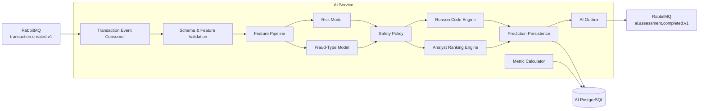
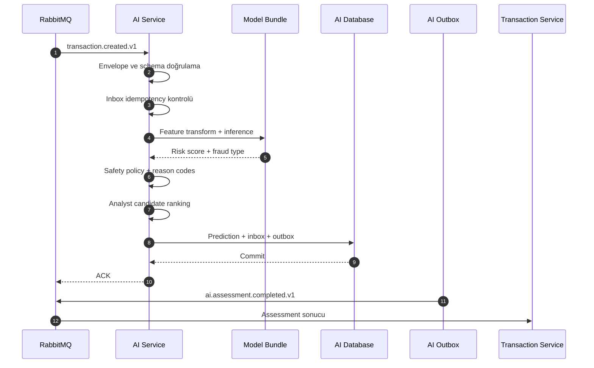

# FraudCell — AI Service ve Makine Öğrenmesi Tasarımı

**Doküman:** `10-AI-SERVICE-DESIGN.md`
**Durum:** Accepted — AI Architecture Baseline v1.0
**Sistem:** FraudCell — Turkcell Gerçek Zamanlı Dolandırıcılık Tespit Platformu
**Son güncelleme:** YYYY-MM-DD
**Bilgi sınıfı:** Internal Architecture

**İlgili dokümanlar:**

- `00-START-HERE.md`
- `01-REQUIREMENTS-TRACEABILITY.md`
- `02-ARCHITECTURE-OVERVIEW.md`
- `03-TECH-STACK.md`
- `04-SERVICE-BOUNDARIES.md`
- `05-DOMAIN-AND-STATE-MACHINE.md`
- `06-DATA-ARCHITECTURE.md`
- `07-API-DESIGN.md`
- `08-EVENT-DRIVEN-ARCHITECTURE.md`
- `09-IDENTITY-SECURITY-AND-AUDIT.md`
- `11-GAMIFICATION-DESIGN.md`
- `12-RESILIENCE-AND-OBSERVABILITY.md`
- `13-DOCKER-COMPOSE-AND-OPERATIONS.md`
- `14-TEST-STRATEGY.md`
- `15-DEMO-AND-JURY-DEFENSE.md`
- `16-IMPLEMENTATION-ROADMAP-AND-DOD.md`

---

# 1. Dokümanın Amacı

Bu doküman FraudCell AI Service’in görevlerini, makine öğrenmesi yaklaşımını, veri setini, model eğitim sürecini, inference akışını, açıklanabilirlik yöntemini ve akıllı analist atama algoritmasını kesinleştirir.

Bu dokümanda aşağıdaki sorular cevaplanır:

- AI Service hangi business sorumluluklara sahiptir?
- AI Service hangi kararların sahibi değildir?
- FraudCell gerçek bir makine öğrenmesi modeli kullandığını nasıl kanıtlar?
- Sentetik veri seti nasıl üretilecektir?
- Veri seti kaç kayıt içerecektir?
- Fraud kategorileri nasıl temsil edilecektir?
- Veri sızıntısı nasıl engellenecektir?
- Risk skoru hangi model tarafından üretilecektir?
- Dolandırıcılık türü hangi model tarafından sınıflandırılacaktır?
- Model seçimi hangi objektif metriklerle yapılacaktır?
- Risk skoru neden kalibre edilmelidir?
- `0.40` ve `0.90` karar eşikleri nasıl uygulanacaktır?
- Rule-based güvenlik katmanı ML modelini nasıl tamamlayacaktır?
- Model tahmini nasıl açıklanacaktır?
- Analyst adayları hangi formülle sıralanacaktır?
- Analyst kapasitesi ve performansı nasıl hesaba katılacaktır?
- AI Service hangi event’leri tüketir ve yayınlar?
- Prediction ve completion event’i nasıl atomik hale getirilir?
- AI Service kapalı olduğunda sistem nasıl davranır?
- Geç gelen AI sonucu nasıl ele alınır?
- AI doğruluğu ve kategori bazlı başarı nasıl hesaplanır?
- Fraud-type override model feedback’ine nasıl dönüşür?
- Model artifact’ları nasıl versionlanır ve doğrulanır?
- Güvenilmeyen model artifact’larının çalıştırılması nasıl engellenir?
- AI sistemi nasıl test edilir?
- AI bonus puanı jüriye nasıl kanıtlanır?

Bu doküman AI Service’in ana mimari otoritesidir.

---

# 2. AI Service’in Temel Rolü

AI Service FraudCell sisteminin karar destek motorudur.

AI Service aşağıdaki çıktıları üretir:

1. Transaction risk skoru
2. Risk seviyesi önerisi
3. İlk tarama kararı
4. Dolandırıcılık türü tahmini
5. Açıklayıcı reason code’lar
6. Uygun analist aday sıralaması
7. Model metadata bilgisi
8. Genel model doğruluk metrikleri
9. Fraud kategorisi bazlı doğruluk metrikleri
10. Model ve insan kararı uyum metrikleri

AI Service’in ürettiği çıktı:

```text
Recommendation
```

niteliğindedir.

Nihai business otoritesi Transaction Service’tir.

---

# 3. AI Service’in Sahibi Olduğu Alanlar

AI Service aşağıdaki alanların authoritative sahibidir:

- Dataset version
- Dataset metadata
- Training run
- Model version
- Model bundle
- Model artifact metadata
- Feature schema
- Prediction
- Risk probability
- Fraud-type prediction
- AI reason code
- Analyst candidate ranking
- Offline training metric
- Online accuracy metric
- Category accuracy metric
- Prediction feedback
- Analyst assignment projection’ları
- AI outbox ve inbox kayıtları

---

# 4. AI Service’in Sahibi Olmadığı Alanlar

AI Service aşağıdaki işlemleri gerçekleştiremez:

- Transaction oluşturmak
- Transaction Database’e bağlanmak
- RiskCase oluşturmak
- RiskCase state’ini değiştirmek
- Transaction’ı nihai olarak onaylamak
- Transaction’ı nihai olarak bloklamak
- Analyst assignment’ı kesinleştirmek
- Analyst kapasite değerini authoritative olarak değiştirmek
- Customer verification oluşturmak
- SLA başlatmak veya durdurmak
- Gamification puanı hesaplamak
- Badge vermek
- Kullanıcı rolü değiştirmek
- JWT üretmek
- Identity Database’e bağlanmak
- Gamification Database’e bağlanmak

Temel ilke:

> AI önerir, Transaction doğrular ve uygular.

---

# 5. AI Mimarisinin Genel Görünümü



---

# 6. Ana AI İş Akışı

FraudCell’in normal production-benzeri AI akışı event-driven olacaktır.



Ana akışta Transaction Service AI HTTP response’u beklemeyecektir.

---

# 7. Senkron AI Endpoint’inin Rolü

AI Service aşağıdaki internal endpoint’i sağlayabilir:

```text
POST /internal/v1/assessments/score
```

Bu endpoint yalnızca:

- OpenAPI gösterimi
- Model smoke test
- Contract test
- Internal diagnostic
- Performance benchmark
- Demo sırasında doğrudan model kanıtı

için kullanılacaktır.

Ana transaction akışı bu endpoint’e bağımlı olmayacaktır.

---

# 8. Harici LLM Kullanılmaması

FraudCell risk skorlama veya fraud-type classification için harici LLM kullanmayacaktır.

Kullanılmayacak örnekler:

- OpenAI API
- Gemini API
- Claude API
- Harici sohbet modeli
- Prompt tabanlı sınıflandırma
- İnternet gerektiren inference
- Üçüncü taraf fraud scoring servisi

Nedenleri:

1. Case gerçek ML modeli beklemektedir.
2. Harici internet bağımlılığı demo riskidir.
3. Sonuçların deterministikliği azalır.
4. Gecikme kontrolü zorlaşır.
5. Maliyet ve rate-limit riski oluşur.
6. Kişisel veri üçüncü tarafa çıkabilir.
7. Modelin ekip tarafından geliştirildiği yeterince kanıtlanamaz.
8. Offline Docker Compose demosu zorlaşır.

FraudCell kendi veri setini, eğitim kodunu ve model artifact’larını kullanacaktır.

---

# 9. Makine Öğrenmesi Problem Tanımları

AI Service iki ayrı supervised learning problemi çözer.

## 9.1 Risk Skorlama

Problem türü:

```text
Binary classification
```

Hedef:

```text
isFraud
```

Değerler:

```text
0 = Temiz işlem
1 = Fraud işlem
```

Model çıktısı:

```text
P(isFraud = 1)
```

Bu olasılık FraudCell risk skoru olarak kullanılır.

## 9.2 Fraud-Type Classification

Problem türü:

```text
Multi-class classification
```

Hedef sınıflar:

```text
CALINTI_KART
HESAP_ELE_GECIRME
PARA_AKLAMA
SUPHELI_DAVRANIS
TEMIZ
```

Model her sınıf için probability dağılımı üretebilir.

En yüksek olasılığa sahip sınıf tahmin olarak döndürülür.

---

# 10. Neden İki Ayrı Model Kullanılır?

Risk skoru ve fraud türü aynı problem değildir.

Risk modeli şu soruyu cevaplar:

```text
Bu işlem fraud olma ihtimali taşıyor mu?
```

Fraud-type modeli şu soruyu cevaplar:

```text
Bu işlem hangi fraud davranışına daha çok benziyor?
```

Tek bir multi-class modeli doğrudan risk skoru kaynağı yapmak mümkündür; ancak iki ayrı model aşağıdaki avantajları sağlar:

- Risk probability bağımsız biçimde kalibre edilebilir.
- Fraud-type doğruluğu ayrı ölçülebilir.
- TEMIZ ile fraud sınıfları daha açık ayrılır.
- Farklı model algoritmaları kullanılabilir.
- Kategori bazlı metrikler daha anlaşılır olur.
- Bir modelin başarısızlığı diğerinden ayrı teşhis edilebilir.
- Model bundle versioning daha açık yapılabilir.

---

# 11. Veri Seti Stratejisi

FraudCell kendi sentetik veri setini üretecektir.

Minimum case beklentisi:

```text
En az 100 örnek
```

FraudCell hedefi:

```text
10.000 transaction
```

olacaktır.

10.000 kayıt:

- Model eğitimi için yeterli bir yarışma ölçeği sunar.
- Kategori bazlı doğruluk ölçümüne imkân verir.
- Eğitim süresini gereksiz büyütmez.
- Repository ve Docker artifact boyutunu kontrol altında tutar.
- Sentetik senaryoların dağılımını açık biçimde göstermeye izin verir.

---

# 12. Dataset Boyutu

Baseline dataset:

```text
Toplam transaction: 10.000
```

Önerilen dağılım:

| Sınıf               |      Kayıt |     Oran |
| ------------------- | ---------: | -------: |
| `TEMIZ`             |      6.000 |    `%60` |
| `SUPHELI_DAVRANIS`  |      1.200 |    `%12` |
| `CALINTI_KART`      |      1.000 |    `%10` |
| `HESAP_ELE_GECIRME` |      1.000 |    `%10` |
| `PARA_AKLAMA`       |        800 |     `%8` |
| **Toplam**          | **10.000** | **%100** |

Bu dağılım gerçek üretim fraud oranını temsil ettiği iddiasını taşımaz.

Amaç:

- Sınıf dengesizliğini tamamen ortadan kaldırmamak
- Her fraud kategorisi için yeterli test örneği oluşturmak
- Kategori bazlı precision, recall ve F1 hesaplayabilmek
- Yarışma demosunda bütün sınıfları gösterebilmek

---

# 13. Dataset Dosya Yapısı

```text
src/AI/
├── data/
│   ├── raw/
│   │   └── fraudcell-transactions-v1.csv
│   ├── processed/
│   │   ├── train-v1.parquet
│   │   ├── validation-v1.parquet
│   │   └── test-v1.parquet
│   ├── metadata/
│   │   ├── dataset-v1.json
│   │   ├── class-distribution-v1.json
│   │   └── feature-schema-v1.json
│   └── README.md
├── training/
├── app/
├── models/
└── tests/
```

Raw dataset repository boyutu için CSV veya Parquet olarak tutulabilir.

Processed split’ler deterministik olarak yeniden üretilebilir olmalıdır.

---

# 14. Dataset Metadata

Dataset metadata örneği:

```json
{
  "datasetId": "fraudcell-synthetic-v1",
  "datasetVersion": "1.0.0",
  "recordCount": 10000,
  "generatorVersion": "1.0.0",
  "randomSeed": 20260722,
  "createdAt": "2026-07-22T10:00:00Z",
  "schemaVersion": 1,
  "classDistribution": {
    "TEMIZ": 6000,
    "SUPHELI_DAVRANIS": 1200,
    "CALINTI_KART": 1000,
    "HESAP_ELE_GECIRME": 1000,
    "PARA_AKLAMA": 800
  },
  "sha256": "..."
}
```

Random seed sabit olacaktır:

```text
20260722
```

Bu sayede veri üretimi yeniden çalıştırıldığında aynı sonuç elde edilebilir.

---

# 15. Sentetik Veri Üretim Yaklaşımı

Dataset doğrudan bağımsız random kolonlardan oluşturulmayacaktır.

Önce sentetik müşteri profilleri üretilecektir.

Her profil:

- Ortalama işlem tutarı
- Tutar standart sapması
- Sık kullanılan işlem türleri
- Normal işlem saatleri
- Sık kullanılan şehirler
- Normal ülke
- Bilinen cihazlar
- Bilinen alıcılar
- Günlük işlem sıklığı
- Haftalık işlem sıklığı
- Hesap yaşı

gibi davranış özelliklerine sahip olacaktır.

Transaction’lar bu profil bağlamında üretilecektir.

Bu sayede:

```text
amountDeviationRatio
isNewDevice
isNewRecipient
isUnusualLocation
```

gibi feature’lar anlamlı hale gelir.

---

# 16. Sentetik Customer Profili

Örnek profile:

```json
{
  "customerSyntheticId": "SYN-CUS-000123",
  "accountAgeDays": 820,
  "averageTransactionAmount": 1350.0,
  "transactionAmountStdDev": 420.0,
  "usualCountryCode": "TR",
  "usualCities": ["Istanbul", "Kocaeli"],
  "usualTransactionHours": {
    "start": 8,
    "end": 23
  },
  "knownDeviceCount": 2,
  "knownRecipientCount": 8,
  "averageDailyTransactionCount": 3.2
}
```

Sentetik customer ID gerçek kullanıcı ID’si değildir.

Dataset içinde gerçek kişisel veri bulunmayacaktır.

---

# 17. Temiz İşlem Senaryosu

`TEMIZ` transaction çoğunlukla aşağıdaki özelliklere sahiptir:

- Bilinen cihaz
- Bilinen veya makul alıcı
- Müşterinin normal lokasyonu
- Normal işlem saati
- Ortalama tutara yakın miktar
- Düşük velocity
- Müşteri geçmişiyle uyum
- Hesap yaşına uygun davranış

Ancak temiz transaction’lar tamamen kusursuz olmayacaktır.

Bazı temiz işlemler:

- Yeni cihaz
- Yüksek tutar
- Yurt dışı konum
- Gece saati

gibi tekil risk sinyalleri taşıyabilir.

Bu, modelin tek bir özelliği fraud etiketiyle eşitlemesini engeller.

---

# 18. Çalıntı Kart Senaryosu

`CALINTI_KART` için olası özellik kombinasyonları:

- Yeni cihaz
- Yeni alıcı
- Fiziksel POS veya ödeme davranışı
- Alışılmadık lokasyon
- Müşteri profilinden yüksek tutar sapması
- Kısa sürede art arda deneme
- Gece saati
- Önce küçük test işlemi, sonra yüksek tutar
- Birden fazla başarısız işlem girişimi
- Yeni ülke veya şehir

Bütün kayıtlar aynı pattern’i taşımayacaktır.

Senaryo içinde kontrollü varyasyon bulunacaktır.

---

# 19. Hesap Ele Geçirme Senaryosu

`HESAP_ELE_GECIRME` için olası özellikler:

- Yeni cihaz
- Yeni IP bölgesi
- Yeni recipient
- Kısa sürede birden fazla transfer
- Hesap davranışından farklı saat
- Müşterinin alışılmadık ülkesinden işlem
- Yüksek amount deviation
- Recipient age çok düşük
- Device age sıfıra yakın
- Velocity artışı

Çalıntı karttan farkı:

- Transfer ağırlığı
- Hesap erişimi değişikliği benzeri sinyaller
- Yeni recipient ve cihaz kombinasyonu
- Hesap üzerinden seri işlem davranışı

---

# 20. Para Aklama Senaryosu

`PARA_AKLAMA` için olası özellikler:

- Çok sayıda recipient
- Birbirine yakın yuvarlak tutarlar
- Kısa zaman aralıklarında seri transfer
- Günlük transaction hacminde büyük artış
- Birden fazla küçük giriş sonrası yüksek çıkış
- Yeni recipient ağı
- Yüksek 24 saatlik toplam tutar
- Müşteri ortalamasından sistematik sapma
- Tek işlem yerine yapılandırılmış transaction dizisi
- Yurt dışı veya farklı bölge hareketleri

Para aklama sınıfı yalnızca tek yüksek tutara göre oluşturulmayacaktır.

Velocity ve işlem ağı davranışı önem taşıyacaktır.

---

# 21. Şüpheli Davranış Senaryosu

`SUPHELI_DAVRANIS` diğer fraud sınıflarına kesin biçimde uymayan riskli davranışları temsil eder.

Olası sinyaller:

- Orta seviye amount deviation
- Tek yeni cihaz
- Tek yeni recipient
- Alışılmadık saat
- Hafif velocity artışı
- Lokasyon sapması
- Profil dışı işlem türü
- Birden fazla orta risk sinyali
- Kesin fraud pattern’i oluşturmayan anomaliler

Bu sınıf, modelin her şüpheli işlemi belirli bir fraud kategorisine zorlamasını engeller.

---

# 22. Dataset Feature’ları

Baseline feature listesi:

## Transaction Özellikleri

```text
amount
transactionType
currency
hourOfDay
dayOfWeek
isWeekend
isNightTransaction
countryCode
isForeignCountry
```

## Customer Davranış Özellikleri

```text
accountAgeDays
averageTransactionAmount
transactionAmountStdDev
amountDeviationRatio
transactionsLast10Minutes
transactionsLast1Hour
transactionsLast24Hours
totalAmountLast24Hours
daysSinceLastTransaction
```

## Device Özellikleri

```text
isNewDevice
deviceAgeDays
transactionsFromDeviceLast24Hours
knownDeviceCount
```

## Recipient Özellikleri

```text
isNewRecipient
recipientAgeDays
transactionsToRecipientLast24Hours
uniqueRecipientsLast24Hours
knownRecipientCount
```

## Lokasyon Özellikleri

```text
isUsualCity
isUsualCountry
distanceFromUsualLocationKm
locationChangeSpeedKmh
```

## Derived Özellikler

```text
amountLog
velocityScore
recipientNoveltyScore
deviceNoveltyScore
locationAnomalyScore
behaviorDeviationScore
```

---

# 23. Kullanılmayacak Feature’lar

Aşağıdaki veriler model feature’ı olarak kullanılmayacaktır:

- İsim
- Soyad
- GSM
- E-posta
- Irk
- Etnik köken
- Din
- Cinsiyet
- Politik görüş
- Sağlık verisi
- Password bilgisi
- OTP
- Access token
- Refresh token
- Analyst’in kimliği
- Case final kararı
- Case’in gelecekteki state’i
- Customer feedback’in gelecekteki değeri

Protected veya gereksiz kişisel özellikler fraud modeli için kullanılmayacaktır.

---

# 24. Feature Schema

Feature schema versioned olacaktır.

Örnek:

```json
{
  "schemaVersion": 1,
  "features": [
    {
      "name": "amount",
      "type": "number",
      "required": true,
      "minimum": 0.01
    },
    {
      "name": "transactionType",
      "type": "string",
      "required": true,
      "allowedValues": ["ODEME", "TRANSFER", "FATURA", "CEKIM"]
    },
    {
      "name": "isNewDevice",
      "type": "boolean",
      "required": true
    }
  ]
}
```

Model artifact, prediction event ve input event aynı feature schema version ile ilişkilendirilecektir.

---

# 25. Missing Feature Politikası

Required feature eksikse inference sessizce default değer kullanmayacaktır.

Davranış:

```text
EVENT_SCHEMA_VALIDATION_FAILED
```

veya:

```text
FEATURE_VALIDATION_FAILED
```

olur.

Gerçekten opsiyonel feature’lar için training pipeline ve inference pipeline aynı default/imputation kuralını kullanır.

Örnek:

```text
distanceFromUsualLocationKm bulunamıyorsa:
- missing indicator = true
- median imputation
```

Ancak eksik değer kuralı model pipeline içine kaydedilmelidir.

---

# 26. Feature Pipeline

Feature transform işlemleri model artifact’ının bir parçası olacaktır.

Örnek pipeline:

```text
Raw event payload
→ Schema validation
→ Numeric feature selection
→ Categorical encoding
→ Missing-value handling
→ Log transformation
→ Model inference
```

Training ve inference için ayrı ayrı elle yazılmış transform kodları kullanılmayacaktır.

Mümkün olduğunda scikit-learn:

```text
Pipeline
ColumnTransformer
```

yapıları kullanılacaktır.

Amaç training-serving skew riskini azaltmaktır.

---

# 27. Veri Sızıntısı

Data leakage modelin gerçek hayatta erişemeyeceği gelecekteki bilgiyi training sırasında kullanmasıdır.

Aşağıdaki alanlar feature olarak kullanılamaz:

- Final analyst decision
- Customer verification response
- Case block durumu
- SLA sonucu
- Customer feedback
- Effective fraud type override
- Gamification puanı
- Modelden sonra oluşan herhangi bir alan
- Dataset label’ından doğrudan türetilmiş reason code

Leakage tespit edilmeden yüksek accuracy iddiası kabul edilmeyecektir.

---

# 28. Zaman Bazlı Veri Sızıntısı

Velocity ve history feature’ları yalnızca transaction zamanından önceki işlemler kullanılarak hesaplanacaktır.

Yanlış:

```text
Transaction'ın bulunduğu günün bütün işlemlerini kullanmak
```

Bu yaklaşım gelecekte gerçekleşen işlemleri modele sızdırabilir.

Doğru:

```text
Her transaction için yalnızca occurredAt öncesindeki history
```

kullanılır.

---

# 29. Train, Validation ve Test Ayrımı

Dataset deterministic olarak:

```text
%70 train
%15 validation
%15 test
```

oranında ayrılır.

Yaklaşık kayıt sayıları:

| Split      | Kayıt |
| ---------- | ----: |
| Train      | 7.000 |
| Validation | 1.500 |
| Test       | 1.500 |

---

# 30. Split Stratejisi

Primary split yaklaşımı zaman bazlı olacaktır.

1. Transaction’lar `occurredAt` alanına göre sıralanır.
2. İlk `%70` train
3. Sonraki `%15` validation
4. Son `%15` test

Bu yöntem modelin gelecekteki transaction’larda nasıl çalışacağını daha gerçekçi ölçer.

Ek kontroller:

- Her split bütün fraud sınıflarından yeterli örnek içermelidir.
- Test split’i training sırasında kullanılmaz.
- Random seed metadata’da saklanır.
- Class dağılımı raporlanır.
- Aynı transaction hiçbir split’te tekrar bulunmaz.

---

# 31. Customer Leakage Kontrolü

Aynı sentetik customer’ın farklı zamanlardaki transaction’ları train ve test içinde bulunabilir.

Bu production davranışını temsil eder; mevcut customer history’siyle gelecekteki işlemi değerlendirmek normaldir.

Bununla birlikte genelleme ölçümü için ek bir:

```text
unseen-customer holdout
```

testi yapılacaktır.

Bu test:

- Training sırasında hiç görülmeyen customer profilleri
- Yeni hesaplar
- Kısıtlı history

üzerindeki performansı ölçer.

Unseen-customer testi ana test setinin yerine geçmez; ek robustness metriğidir.

---

# 32. Class Imbalance

Dataset tamamen dengeli değildir.

Risk modelinde değerlendirilecek yöntemler:

- Class weight
- Sample weight
- Threshold-independent metrikler
- Precision-recall analizi
- Kontrollü scenario sampling

Baseline’da SMOTE zorunlu olarak kullanılmayacaktır.

Nedenleri:

- Dataset zaten sentetik üretilebilmektedir.
- Kategorik ve derived feature’larda yapay kombinasyon riski oluşabilir.
- Gerçekçi scenario üretmek sentetik interpolation’dan daha açıklanabilirdir.

SMOTE yalnızca deneysel aday olarak benchmark edilebilir.

---

# 33. Model Seçim İlkesi

Model algoritması mimari bir dogma olarak seçilmeyecektir.

Sabitlenecek karar:

```text
Reproducible model-selection protocol
```

olacaktır.

Aynı dataset split’i üzerinde birden fazla aday model eğitilir.

Kazanan model önceden ismine göre değil, validation metric’lerine göre seçilir.

Bu yaklaşım:

- Deney yapılmadan model seçme hatasını önler.
- Jüriye gerçek model karşılaştırması gösterir.
- Model seçiminin objektif olduğunu kanıtlar.
- Dataset değiştiğinde doğru modelin değişmesine izin verir.

---

# 34. Risk Modeli Adayları

Risk modeli için minimum adaylar:

```text
LogisticRegression
RandomForestClassifier
HistGradientBoostingClassifier
```

## Logistic Regression

Amaç:

- Açıklanabilir baseline
- Düşük complexity
- Hızlı inference
- Probability baseline

## Random Forest

Amaç:

- Non-linear ilişkileri yakalamak
- Feature interaction’larını modellemek
- Güçlü yarışma baseline’ı

## Histogram Gradient Boosting

Amaç:

- Tabular veride güçlü non-linear performans
- Büyük feature etkileşimleri
- Kontrollü inference süresi

---

# 35. Fraud-Type Modeli Adayları

Fraud-type classifier için minimum adaylar:

```text
LogisticRegression
RandomForestClassifier
HistGradientBoostingClassifier
```

Multi-class destek ve probability çıktısı zorunludur.

Fraud-type modelinin ana seçim metriği:

```text
Macro F1
```

olacaktır.

Macro F1 her sınıfa eşit önem verir.

Böylece büyük `TEMIZ` sınıfının küçük fraud kategorilerini gizlemesi engellenir.

---

# 36. Model Seçim Metrikleri — Risk

Risk modeli seçim sırası:

## Primary Metric

```text
PR-AUC
```

Precision-recall eğrisi fraud gibi dengesiz sınıflarda önemlidir.

## Secondary Metrics

```text
ROC-AUC
F1
Recall
Precision
Brier Score
Log Loss
Calibration Error
```

## Operational Metrics

```text
Recall at riskScore > 0.90
Precision at riskScore > 0.90
Manual review rate
False-positive rate
Inference latency
```

---

# 37. Model Seçim Metrikleri — Fraud Type

Fraud-type model seçim sırası:

## Primary Metric

```text
Macro F1
```

## Secondary Metrics

```text
Weighted F1
Overall accuracy
Per-category precision
Per-category recall
Per-category F1
Confusion matrix
Log loss
```

Bir model yalnızca overall accuracy yüksek olduğu için seçilmeyecektir.

---

# 38. Champion Model Seçimi

Training pipeline sonuçta bir:

```text
Champion Model Bundle
```

oluşturur.

Champion seçimi:

1. Bütün aday modeller aynı train split üzerinde eğitilir.
2. Hyperparameter araması yalnızca train ve validation kullanır.
3. Risk modelleri PR-AUC ve calibration’a göre karşılaştırılır.
4. Fraud-type modelleri Macro F1’a göre karşılaştırılır.
5. Latency ve artifact boyutu kontrol edilir.
6. Kazanan modeller validation sonucuna göre seçilir.
7. Test seti yalnızca final değerlendirmede bir kez kullanılır.
8. Test sonucu model seçimini yeniden yönlendirmek için kullanılmaz.
9. Champion artifact metadata’sı kaydedilir.
10. Active model bundle yalnızca validation gate’lerini geçerse oluşturulur.

---

# 39. İlk Beklenen Champion

Başlangıç engineering beklentisi:

```text
Risk:
HistGradientBoostingClassifier
+
Probability calibration

Fraud type:
RandomForestClassifier
```

olacaktır.

Ancak bu algoritmalar validation karşılaştırmasını kaybederse sırf dokümana yazıldığı için kullanılmayacaktır.

Nihai active model:

```text
model-metrics.json
```

ve training run kaydı tarafından kanıtlanacaktır.

Bu dokümanın değişmez kararı model adı değil, seçim protokolüdür.

---

# 40. Hyperparameter Arama

Arama yöntemi:

```text
RandomizedSearchCV
```

veya küçük kontrollü grid olabilir.

Gereksiz büyük arama alanı kullanılmayacaktır.

Risk modeli örnek parametreleri:

```text
learning_rate
max_iter
max_leaf_nodes
min_samples_leaf
l2_regularization
class_weight
```

Random Forest örnek parametreleri:

```text
n_estimators
max_depth
min_samples_leaf
max_features
class_weight
```

Arama seed’i sabit olmalıdır.

---

# 41. Cross-Validation

Zaman bağımlı veri olduğu için standard random K-fold ana yöntem olmayacaktır.

Tercih:

```text
TimeSeriesSplit
```

veya sabit zaman bazlı validation split.

Dataset üretimi birden fazla bağımsız dönemi temsil ediyorsa expanding-window validation uygulanabilir.

Amaç gelecekteki veriyi geçmiş training fold’una sızdırmamaktır.

---

# 42. Risk Probability Calibration

Case kararları doğrudan risk skoru eşiklerine bağlıdır:

```text
< 0.40
0.40–0.90
> 0.90
```

Bu nedenle model probability çıktısının kalibrasyonu önemlidir.

Calibration adayları:

```text
Sigmoid
Isotonic
```

Seçim validation seti üzerinde yapılır.

Test seti calibration için kullanılmaz.

Kalibrasyon sonrası aşağıdaki metrikler karşılaştırılır:

- Brier score
- Reliability curve
- Expected calibration error
- Critical threshold precision
- Critical threshold recall

---

# 43. Risk Skoru

AI Service iki skor kavramını ayırır:

```text
modelRiskScore
policyAdjustedRiskScore
```

## Model Risk Score

Kalibre edilmiş ML probability çıktısıdır.

```text
0.0 <= modelRiskScore <= 1.0
```

## Policy-Adjusted Risk Score

Sınırlı deterministic safety policy uygulandıktan sonraki skordur.

Transaction Service’e gönderilen canonical risk skoru:

```text
policyAdjustedRiskScore
```

olacaktır.

Prediction kaydında iki değer de saklanır.

---

# 44. Risk Decision Eşikleri

Canonical karar eşikleri:

```text
riskScore < 0.40           -> ONAY
0.40 <= riskScore <= 0.90 -> INCELEME
riskScore > 0.90           -> BLOK
```

Boundary testleri:

|     Skor | Karar      |
| -------: | ---------- |
| `0.0000` | `ONAY`     |
| `0.3999` | `ONAY`     |
| `0.4000` | `INCELEME` |
| `0.9000` | `INCELEME` |
| `0.9001` | `BLOK`     |
| `1.0000` | `BLOK`     |

Bu eşikler runtime config ile sessizce değiştirilmeyecektir.

Değişiklik ADR, model evaluation ve contract update gerektirir.

---

# 45. Risk Level Mapping

```text
0.00 <= riskScore < 0.40  -> DUSUK
0.40 <= riskScore < 0.70  -> ORTA
0.70 <= riskScore <= 0.90 -> YUKSEK
0.90 < riskScore <= 1.00  -> KRITIK
```

Risk level ve decision aynı policy modülü tarafından hesaplanacaktır.

AI model doğrudan string decision üretmeyecektir.

Model probability üretir.

Domain policy:

- Risk level
- Decision

değerlerini deterministic olarak hesaplar.

---

# 46. Safety Policy

FraudCell saf rule-based sistem olmayacaktır.

ML model risk skorunun ana üreticisidir.

Safety policy yalnızca sınırlı, belgelenmiş ve yüksek güvenlikli kombinasyonlarda minimum risk floor uygular.

Örnek safety rule:

```text
isNewDevice = true
AND isNewRecipient = true
AND amountDeviationRatio >= 8
AND isForeignCountry = true
AND transactionsLast10Minutes >= 3
```

Bu durumda:

```text
policyAdjustedRiskScore =
    max(modelRiskScore, 0.91)
```

olabilir.

---

# 47. Safety Policy Kısıtları

Safety policy:

1. Tek bir zayıf sinyalle kritik skor üretmez.
2. Model risk skorunu düşürmez.
3. Yalnızca açıkça versionlanmış kurallar kullanır.
4. Hangi rule’un uygulandığını prediction’a yazar.
5. Raw model score’u korur.
6. Online doğrulukta raw ve adjusted score ayrı ölçülür.
7. Testlerle korunur.
8. Modelin yerini alacak kadar genişletilmez.
9. Rule sayısı minimum tutulur.
10. Rule değişikliği model bundle version veya policy version değiştirir.

---

# 48. Modelin Gerçek Etkisini Kanıtlama

Jüriye AI’ın hardcoded olmadığını kanıtlamak için:

- Training script gösterilir.
- Dataset gösterilir.
- En az üç model karşılaştırması gösterilir.
- Validation metric tablosu gösterilir.
- Model artifact gösterilir.
- Aynı transaction’da feature değişince skorun değiştiği gösterilir.
- Raw model probability gösterilir.
- Safety rule uygulanıp uygulanmadığı gösterilir.
- Tahmin model version ile birlikte gösterilir.
- Dataset dışından yeni örnek skorlanır.
- Model kapatıldığında Transaction fallback davranışı gösterilir.

Safety policy olmadan da model risk skoru üretebilmelidir.

---

# 49. Fraud-Type Tahmini

Fraud-type model aşağıdaki probability dağılımını üretebilir:

```json
{
  "CALINTI_KART": 0.72,
  "HESAP_ELE_GECIRME": 0.18,
  "PARA_AKLAMA": 0.03,
  "SUPHELI_DAVRANIS": 0.06,
  "TEMIZ": 0.01
}
```

Canonical fraud type:

```text
argmax(probabilities)
```

ile belirlenir.

Prediction kaydında:

- Seçilen fraud type
- Top probability
- Bütün class probability’leri
- Model version

saklanabilir.

Transaction event payload’ında bütün probability dağılımını taşımak zorunlu değildir.

---

# 50. Fraud-Type Confidence

AI Service fraud-type confidence üretir:

```text
fraudTypeConfidence
```

Aralık:

```text
0.0–1.0
```

Low-confidence eşiği:

```text
< 0.55
```

olabilir.

Low-confidence durumda:

- Fraud type yine en yüksek sınıf olarak döner.
- Reason code `LOW_CLASSIFICATION_CONFIDENCE` eklenir.
- Analyst ekranında belirsizlik gösterilir.
- Otomatik assignment’ta generic analyst fallback değerlendirilebilir.

Confidence final case kararını engellemez.

---

# 51. TEMIZ Tahmini ile Risk Kararı Uyumsuzluğu

Aşağıdaki durum mümkün olabilir:

```text
riskScore = 0.78
fraudType = TEMIZ
```

Bu model uyumsuzluğudur.

Canonical policy:

1. Risk modeli transaction’ın incelenmesi gerektiğini söyler.
2. Fraud-type modeli belirli kategori konusunda emin değildir.
3. Case yine oluşturulur.
4. Effective fraud type başlangıçta `SUPHELI_DAVRANIS` yapılmaz.
5. AI tahmini `TEMIZ` olarak korunur.
6. Reason code `MODEL_OUTPUT_DISAGREEMENT` eklenir.
7. Analyst’e düşük fraud-type confidence gösterilir.

Risk modeli case oluşturma açısından önceliklidir.

---

# 52. Risk Düşük, Fraud Type Fraud Durumu

Örnek:

```text
riskScore = 0.25
fraudType = CALINTI_KART
fraudTypeConfidence = 0.42
```

Canonical karar:

- Risk decision `ONAY`
- Case oluşturulmaz
- Prediction kaydedilir
- Model disagreement metric’i artırılır
- Fraud type customer’a kritik fraud olarak gösterilmez

Bu tür uyumsuzluklar model kalite metriği olarak takip edilir.

Safety policy kritik combination tespit ederse risk score floor uygulayabilir.

---

# 53. Explainability Yaklaşımı

FraudCell runtime explainability için deterministic:

```text
Reason Code Engine
```

kullanacaktır.

Reason code’lar:

- Kullanılan feature’lara dayanır.
- Model output ile birlikte üretilir.
- Analist için anlaşılır Türkçe açıklama sağlar.
- Deterministik ve test edilebilir olur.
- Model artifact’ından bağımsız business anlatımı sunar.

FraudCell runtime reason code’ları için:

```text
SHAP kullandık
```

iddiasında bulunmayacaktır.

Gerçekte SHAP uygulanmadıkça bu ifade kullanılmaz.

---

# 54. Reason Code Kataloğu

Örnek reason code’lar:

```text
NEW_DEVICE
NEW_RECIPIENT
UNUSUAL_LOCATION
FOREIGN_COUNTRY
NIGHT_TRANSACTION
AMOUNT_DEVIATION
HIGH_TRANSACTION_VELOCITY
HIGH_DAILY_AMOUNT
MANY_UNIQUE_RECIPIENTS
IMPOSSIBLE_TRAVEL
NEW_ACCOUNT
RECIPIENT_NETWORK_ANOMALY
LOW_CLASSIFICATION_CONFIDENCE
MODEL_OUTPUT_DISAGREEMENT
SAFETY_POLICY_APPLIED
```

---

# 55. Reason Code Formatı

```json
{
  "code": "AMOUNT_DEVIATION",
  "label": "İşlem tutarı müşteri ortalamasının 8.4 katı",
  "impact": "HIGH",
  "feature": "amountDeviationRatio",
  "observedValue": 8.4,
  "threshold": 4.0
}
```

`impact` değerleri:

```text
LOW
MEDIUM
HIGH
```

Reason code en fazla:

```text
5
```

adet döndürülmelidir.

Analist ekranında en anlamlı üç reason öne çıkarılabilir.

---

# 56. Reason Code Güvenliği

Reason code içinde:

- GSM
- E-posta
- Password
- Token
- Tam cihaz fingerprint
- Tam recipient identifier
- Internal model path
- Stack trace

bulunmayacaktır.

Reason code:

```text
Yeni alıcı
```

diyebilir ancak alıcının hassas değerini event içinde taşımak zorunda değildir.

---

# 57. Reason Code ile Model Açıklaması Ayrımı

Reason code:

```text
İşlemin hangi şüpheli sinyallere sahip olduğunu
```

açıklar.

Reason code aşağıdaki iddiayı taşımaz:

```text
Model kararının matematiksel olarak tam olarak yüzde kaçını bu feature üretti.
```

Offline analysis için:

- Feature importance
- Permutation importance
- Confusion matrix
- Calibration plot

üretilebilir.

Runtime açıklama ise kontrollü reason code’dur.

---

# 58. Analyst Assignment Amacı

AI Service case için uygun analist adaylarını sıralar.

AI Service kesin assignment yapmaz.

Çıktı:

```text
Top N analyst candidates
```

olacaktır.

Baseline:

```text
Top 3
```

aday döndürülür.

Transaction Service:

- Analyst aktif mi?
- Assignment enabled mı?
- Güncel aktif case sayısı kaç?
- Kapasite müsait mi?
- Assignment race condition var mı?

kontrollerini yeniden yapar.

---

# 59. Analyst Projection’ları

AI Service üç temel projection kullanır.

## Analyst Profile Projection

Kaynak:

```text
identity.staff.created
identity.staff.profile.updated
identity.staff.deactivated
```

Alanlar:

- Analyst ID
- Active
- Assignment enabled
- Specialties
- Regions
- Display name
- Identity profile version

## Analyst Workload Projection

Kaynak:

```text
case.assigned
case.reassigned
case.decision.made
```

Alanlar:

- Analyst ID
- Active case count
- Last assigned at
- Projection version

## Analyst Performance Projection

Kaynak:

```text
analyst.performance.updated
```

Alanlar:

- Analyst ID
- Total decisions
- Accuracy
- False-positive count
- SLA compliance
- Average duration
- Normalized performance score

---

# 60. Assignment Eligibility

Analyst candidate listesine girebilmek için:

```text
isActive = true
assignmentEnabled = true
activeCaseCount < 10
role = ANALYST
```

olmalıdır.

Role projection içinde bulunabilir.

Eksik profile projection’a sahip analyst aday olarak kullanılmaz.

---

# 61. Bölge Uygunluğu

Bölge doğrudan ağırlıklı formülün parçası olmayacaktır.

Bölge ön filtre olarak uygulanır.

## Türkiye İçindeki Transaction

Transaction şehri bir FraudCell region koduna map edilir.

Analyst’in region listesi uygun region’ı içeriyorsa candidate olur.

## Yurt Dışı Transaction

Analyst’in region listesinde:

```text
YURT_DISI
```

aranır.

## Bölgesel Aday Yoksa

Eligibility filtresi kontrollü olarak gevşetilir.

Candidate response’a:

```text
REGION_FALLBACK
```

açıklaması eklenir.

Case manuel queue’ya bırakılmak yerine uzmanlık ve kapasiteye göre aday sıralanabilir.

Transaction Service son kararı verir.

---

# 62. Assignment Formülü

Canonical analyst score:

```text
totalScore =
    expertiseScore × 0.50
  + capacityScore × 0.30
  + performanceScore × 0.20
```

Ağırlıklar:

| Bileşen    | Ağırlık |
| ---------- | ------: |
| Uzmanlık   |  `0.50` |
| Kapasite   |  `0.30` |
| Performans |  `0.20` |

Toplam:

```text
1.00
```

---

# 63. Expertise Score

Fraud type analyst specialties içinde bulunuyorsa:

```text
expertiseScore = 1.00
```

Fraud type:

```text
SUPHELI_DAVRANIS
```

ise bütün aktif analyst’ler için:

```text
expertiseScore = 0.60
```

olabilir.

Fraud type `TEMIZ` fakat case mevcutsa:

```text
expertiseScore = 0.50
```

kullanılır.

Fraud type analyst specialties içinde yoksa:

```text
expertiseScore = 0.00
```

olur.

Uzmanlığı olmayan analist tamamen elenmez; ancak skor avantajı kazanmaz.

---

# 64. Capacity Score

Maksimum aktif case:

```text
10
```

Formül:

```text
capacityScore = 1 - activeCaseCount / 10
```

Örnek:

| Aktif case |  Capacity score |
| ---------: | --------------: |
|        `0` |          `1.00` |
|        `2` |          `0.80` |
|        `5` |          `0.50` |
|        `8` |          `0.20` |
|        `9` |          `0.10` |
|       `10` | Candidate değil |

Score:

```text
0.0–1.0
```

aralığına clamp edilir.

---

# 65. Performance Score

Performance score Gamification Service tarafından normalize edilerek event ile yayınlanır.

Aralık:

```text
0.0–1.0
```

Yeni analyst için:

```text
performanceScore = 0.50
```

kullanılır.

Bu neutral başlangıç değeri yeni analyst’in hiç case alamamasını engeller.

AI Service performans formülünü yeniden hesaplamaz.

Gamification projection değerini kullanır.

---

# 66. Assignment Score Örneği

Analyst A:

```text
expertiseScore = 1.00
capacityScore = 0.70
performanceScore = 0.90
```

Toplam:

```text
1.00 × 0.50 = 0.500
0.70 × 0.30 = 0.210
0.90 × 0.20 = 0.180

totalScore = 0.890
```

Analyst B:

```text
expertiseScore = 0.00
capacityScore = 1.00
performanceScore = 0.95
```

Toplam:

```text
0.00 × 0.50 = 0.000
1.00 × 0.30 = 0.300
0.95 × 0.20 = 0.190

totalScore = 0.490
```

Analyst A daha dolu olmasına rağmen uzmanlık nedeniyle öne geçer.

---

# 67. Deterministic Tie-Break

İki analyst aynı total score’a sahipse sıralama:

1. Daha az aktif case
2. Daha yüksek performance score
3. Daha eski `lastAssignedAt`
4. Lexicographic analyst ID

sırasıyla belirlenir.

Bu kurallar deterministic test edilebilir assignment sonucu sağlar.

Random analyst seçimi yapılmayacaktır.

---

# 68. Candidate Response

```json
{
  "analystId": "01J...",
  "rank": 1,
  "totalScore": 0.89,
  "expertiseScore": 1.0,
  "capacityScore": 0.7,
  "performanceScore": 0.9,
  "activeCaseCountSnapshot": 3,
  "reasons": [
    "EXACT_SPECIALTY_MATCH",
    "REGION_MATCH",
    "CAPACITY_AVAILABLE",
    "HIGH_PERFORMANCE"
  ],
  "projectionUpdatedAt": "2026-07-22T14:32:10Z"
}
```

Candidate listesi authoritative assignment değildir.

---

# 69. Projection Staleness

AI projection’ı event delivery gecikmesi nedeniyle stale olabilir.

Her candidate response:

```text
projectionUpdatedAt
```

taşır.

Stale threshold:

```text
30 saniye
```

olabilir.

Projection bu süreden eskiyse:

- Candidate yine döndürülebilir.
- Response reason `STALE_PROJECTION` içerebilir.
- Transaction Service kapasiteyi mutlaka revalidate eder.
- Hiç güvenilir candidate yoksa manual queue uygulanır.

---

# 70. Transaction Service Revalidation

Transaction Service candidate listesini aldığında:

1. Sırayla candidate’ları değerlendirir.
2. Analyst eligibility projection’ını kontrol eder.
3. `activeCaseCount < 10` atomic update uygular.
4. Başarılı candidate için assignment oluşturur.
5. Kapasitesi dolu candidate’ı atlar.
6. Sonraki candidate’ı dener.
7. Hiçbiri uygun değilse case queue’ya alınır.

Bu davranış AI’ın stale projection üretmesi durumunda capacity ihlalini engeller.

---

# 71. Hiç Analyst Adayı Bulunamaması

Aşağıdaki durumlarda candidate listesi boş olabilir:

- Bütün analyst’ler pasif
- Bütün analyst’ler capacity `10`
- Profile projection bulunamıyor
- Projection henüz initialize edilmedi
- Region ve fallback koşulları uygulanamıyor

AI assessment yine başarılı sayılabilir.

Response:

```json
{
  "analystCandidates": [],
  "assignmentRecommendationStatus": "NO_ELIGIBLE_ANALYST"
}
```

Transaction Service case’i:

```text
QUEUED
```

veya:

```text
MANUAL_QUEUE
```

durumuna alır.

Risk skorlama analyst bulunamaması nedeniyle başarısız sayılmaz.

---

# 72. Prediction Veri Modeli

Prediction kaydı aşağıdakileri içerir:

```text
id
transaction_id
source_event_id
correlation_id
model_bundle_id
feature_schema_version
model_risk_score
policy_adjusted_risk_score
risk_level
decision
fraud_type
fraud_type_confidence
class_probabilities
feature_snapshot
reason_codes
safety_policy_version
applied_safety_rules
predicted_at
inference_milliseconds
created_at
```

Prediction satırı immutable olacaktır.

---

# 73. Feature Snapshot

Prediction sırasında kullanılan feature’ların snapshot’ı saklanır.

Amaç:

- Model sonucunu yeniden açıklayabilmek
- Training-serving uyuşmazlığını incelemek
- Hatalı tahmini analiz etmek
- Jüriye model girdisini göstermek
- Model drift analizi yapmak

Feature snapshot gereksiz PII taşımaz.

Raw device fingerprint yerine derived özellik bulunur.

---

# 74. Model Bundle

Model bundle birlikte kullanılan artifact’ları temsil eder:

```text
Risk model
Fraud-type model
Feature pipeline
Calibration object
Risk policy version
Reason-code version
Feature schema version
```

Örnek:

```text
fraudcell-ai-1.0.0
```

Bir prediction yalnızca bir model bundle version ile ilişkilidir.

---

# 75. Model Artifact Yapısı

```text
src/AI/models/
└── fraudcell-ai-1.0.0/
    ├── risk-model.joblib
    ├── fraud-type-model.joblib
    ├── risk-calibrator.joblib
    ├── feature-pipeline.joblib
    ├── metadata.json
    ├── feature-schema.json
    ├── metrics.json
    ├── confusion-matrix.json
    ├── category-metrics.json
    ├── calibration-metrics.json
    └── checksums.sha256
```

Model artifact’ları repository içinde veya build artifact olarak saklanabilir.

Docker image build sırasında yalnızca active bundle alınır.

---

# 76. Model Metadata

```json
{
  "bundleVersion": "fraudcell-ai-1.0.0",
  "datasetVersion": "fraudcell-synthetic-v1",
  "featureSchemaVersion": 1,
  "riskModel": {
    "algorithm": "HistGradientBoostingClassifier",
    "version": "risk-1.0.0",
    "calibration": "sigmoid"
  },
  "fraudTypeModel": {
    "algorithm": "RandomForestClassifier",
    "version": "fraud-type-1.0.0"
  },
  "policyVersion": "risk-policy-1.0.0",
  "reasonCodeVersion": "reason-codes-1.0.0",
  "sourceCommitSha": "...",
  "trainedAt": "2026-07-22T10:00:00Z",
  "pythonVersion": "...",
  "scikitLearnVersion": "...",
  "artifactSha256": "..."
}
```

Exact runtime package version’ları lock file içinde pin edilecektir.

---

# 77. Güvenilmeyen Model Artifact’ı

Joblib ve pickle tabanlı artifact’lar güvenilmeyen kaynaktan yüklenmeyecektir.

Kurallar:

1. Model upload public API’si bulunmaz.
2. Model artifact yalnızca build pipeline tarafından üretilir.
3. Artifact checksum doğrulanır.
4. Artifact version allowlist ile seçilir.
5. Runtime internetten model indirmez.
6. Artifact path user input’tan oluşturulmaz.
7. Container yalnızca read-only model klasörünü okur.
8. Checksum uyuşmazsa servis ready olmaz.
9. Unknown model bundle çalıştırılmaz.
10. Model activation audit edilir.

---

# 78. Model Activation

Model activation internal/admin operation’dır.

Aktif bundle değişikliği:

1. Bundle metadata doğrulanır.
2. Checksum doğrulanır.
3. Feature schema doğrulanır.
4. Model smoke test çalıştırılır.
5. Gerekli metric gate’leri kontrol edilir.
6. Database’te bundle `ACTIVE` yapılır.
7. Önceki bundle `RETIRED` yapılır.
8. Model process memory’sine kontrollü yüklenir.
9. `ai.model.activated` event’i yayınlanır.
10. Audit kaydı oluşturulur.

Aynı anda yalnızca bir active bundle bulunur.

---

# 79. Model Startup

AI Service startup sırasında:

1. Database bağlantısını kontrol eder.
2. Migration durumunu kontrol eder.
3. Active model bundle metadata’sını okur.
4. Artifact dosyalarının varlığını kontrol eder.
5. Checksum doğrular.
6. Feature schema’yı yükler.
7. Model ve pipeline’ı yükler.
8. Smoke test inference çalıştırır.
9. Output range’lerini doğrular.
10. Readiness durumunu belirler.

Model yüklenemezse:

```text
readiness = Unhealthy
```

olur.

Transaction Service kendi fallback’ını uygular.

---

# 80. Model Smoke Test

Artifact klasörü aşağıdaki sabit smoke test örneklerini içerir:

```text
known-clean.json
known-review.json
known-critical.json
```

Beklenen kontroller:

- Skor `0–1`
- Risk level valid
- Decision valid
- Fraud type valid
- Reason code array valid
- Model version doğru
- NaN/Infinity yok
- Inference exception yok

Smoke test exact score eşitliği istemek zorunda değildir.

Beklenen score range kullanılabilir.

---

# 81. Training Pipeline

Training komutu:

```bash
python -m training.train_all
```

veya Makefile üzerinden:

```bash
make train-ai
```

Pipeline adımları:

1. Random seed ayarla
2. Dataset metadata doğrula
3. Dataset checksum doğrula
4. Feature schema doğrula
5. Leakage kontrollerini çalıştır
6. Train/validation/test split oluştur
7. Preprocessing pipeline oluştur
8. Baseline modelleri eğit
9. Hyperparameter araması yap
10. Probability calibration uygula
11. Validation metric’lerini karşılaştır
12. Champion modelleri seç
13. Test setinde final ölçüm yap
14. Category metric üret
15. Confusion matrix üret
16. Calibration metric üret
17. Model artifact’larını kaydet
18. Checksum üret
19. Metadata kaydet
20. Smoke test çalıştır

---

# 82. Eğitim Reproducibility

Reproducibility için:

- Python version pin edilir.
- Dependency lock file bulunur.
- Random seed sabittir.
- Dataset checksum kayıtlıdır.
- Source commit SHA metadata’ya yazılır.
- Hyperparameter’lar kaydedilir.
- Split index’leri saklanabilir.
- Training command README’de belgelenir.
- Model artifact checksum tutulur.
- Environment bilgisi metadata’ya yazılır.

Aynı commit, dataset ve dependency’lerle training sonucu kabul edilebilir tolerans içinde tekrarlanabilir olmalıdır.

---

# 83. Eğitim Runtime’dan Ayrıdır

Model training normal AI API process’i içinde çalıştırılmayacaktır.

Training:

- Developer komutu
- CI job
- Ayrı Docker Compose profile
- One-shot training container

üzerinden çalışabilir.

Normal AI Service:

```text
Inference only
```

davranır.

Public API üzerinden model eğitme endpoint’i bulunmayacaktır.

---

# 84. Training Container

Opsiyonel Compose profile:

```text
ai-training
```

örneği:

```bash
docker compose --profile training run --rm ai-training
```

Training container:

- Dataset’i read-only okuyabilir.
- Artifact output volume’a yazabilir.
- Runtime database credential kullanmak zorunda değildir.
- Production service network’lerine bağlanmak zorunda değildir.
- Eğitim tamamlanınca kapanır.

---

# 85. Offline Metric Raporu

Training sonunda:

```text
reports/ai/model-evaluation-v1.md
```

oluşturulacaktır.

Rapor:

- Dataset özeti
- Class distribution
- Feature listesi
- Split yöntemi
- Aday modeller
- Hyperparameter’lar
- Risk metric tablosu
- Fraud-type metric tablosu
- Confusion matrix
- Category metrics
- Calibration plot
- Threshold distribution
- Inference latency
- Champion seçiminin nedeni
- Bilinen sınırlamalar

içermelidir.

---

# 86. Örnek Risk Model Karşılaştırması

Gerçek değerler training sonrasında doldurulacaktır.

| Model                | PR-AUC | ROC-AUC | Brier | Critical Recall | P95 Inference |
| -------------------- | -----: | ------: | ----: | --------------: | ------------: |
| Logistic Regression  |    TBD |     TBD |   TBD |             TBD |           TBD |
| Random Forest        |    TBD |     TBD |   TBD |             TBD |           TBD |
| HistGradientBoosting |    TBD |     TBD |   TBD |             TBD |           TBD |

Dokümana uydurma yüksek metric yazılmayacaktır.

Training çalışmadan `0.99 accuracy` gibi iddia oluşturulmaz.

---

# 87. Örnek Fraud-Type Karşılaştırması

| Model                | Macro F1 | Weighted F1 | Accuracy | P95 Inference |
| -------------------- | -------: | ----------: | -------: | ------------: |
| Logistic Regression  |      TBD |         TBD |      TBD |           TBD |
| Random Forest        |      TBD |         TBD |      TBD |           TBD |
| HistGradientBoosting |      TBD |         TBD |      TBD |           TBD |

Nihai model validation sonucuyla seçilecektir.

---

# 88. Confusion Matrix

Fraud-type confusion matrix aşağıdaki sınıfları içerir:

```text
CALINTI_KART
HESAP_ELE_GECIRME
PARA_AKLAMA
SUPHELI_DAVRANIS
TEMIZ
```

Confusion matrix:

- Raw count
- Row-normalized oran

olarak üretilecektir.

Bu sayede örneğin:

```text
PARA_AKLAMA → SUPHELI_DAVRANIS
```

karışıklığı görünür hale gelir.

---

# 89. Category Accuracy

Kategori bazlı endpoint:

```text
GET /api/v1/ai/metrics/categories
```

Her kategori için:

```text
sampleCount
precision
recall
f1Score
accuracy
support
```

döndürür.

Buradaki kategori accuracy tek başına yeterli değildir.

Precision, recall ve F1 birlikte gösterilir.

---

# 90. Online Ground Truth

Online metric hesaplarında nihai business sonucu ground truth olarak kullanılır.

## Risk Ground Truth

```text
Final decision BLOCK   -> fraud = true
Final decision APPROVE -> fraud = false
```

## Fraud-Type Ground Truth

Case final karara ulaştığında:

- Effective fraud type kullanılır.
- Analyst override yaptıysa override edilen type kullanılır.
- Final karar `APPROVE` ise ground truth type `TEMIZ` kabul edilir.

Customer response tek başına ground truth değildir.

---

# 91. Online Metric Sınırlaması

Analist kararı mutlak gerçeklik değildir.

Analist hata yapabilir.

Bu nedenle online metric:

```text
Model–analist/final business kararı uyumu
```

olarak yorumlanmalıdır.

Raporlarda aşağıdaki ifade tercih edilir:

```text
Decision agreement rate
```

Mutlak dünya doğruluğu iddiası yapılmaz.

Sentetik offline test setinde gerçek generator label’ı bilindiği için gerçek model accuracy ayrıca ölçülür.

---

# 92. Decision Agreement

Decision agreement:

```text
AI decision ile final case kararının uyumu
```

şeklinde hesaplanır.

Örnek mapping:

| AI kararı  | Final karar |        Agreement |
| ---------- | ----------- | ---------------: |
| `ONAY`     | `APPROVE`   |             Evet |
| `BLOK`     | `BLOCK`     |             Evet |
| `INCELEME` | `APPROVE`   | Nötr/ayrı metric |
| `INCELEME` | `BLOCK`     | Nötr/ayrı metric |
| `BLOK`     | `APPROVE`   |            Hayır |
| `ONAY`     | `BLOCK`     |            Hayır |

`INCELEME` doğrudan final karar olmadığı için ayrı:

```text
reviewOutcomeDistribution
```

metriğinde izlenir.

---

# 93. False Positive

AI false positive baseline tanımı:

```text
AI decision = BLOK
AND final decision = APPROVE
```

Ek geniş metric:

```text
AI decision IN (INCELEME, BLOK)
AND final decision = APPROVE
```

şeklinde:

```text
flagged-clean rate
```

olarak ayrıca ölçülebilir.

Bu iki metric birbirine karıştırılmayacaktır.

---

# 94. False Negative

AI false negative:

```text
AI decision = ONAY
AND daha sonra doğrulanmış fraud sonucu oluşması
```

Normal akışta `ONAY` işlemi için RiskCase oluşmadığından online false negative doğrudan gözlenemeyebilir.

Bu nedenle:

- Offline test dataset
- Kontrollü labelled demo
- Sonradan gelen external fraud feedback gelecekte
- Sampled manual review gelecekte

gibi yöntemler gerekir.

FraudCell bu sınırlamayı açıkça dokümante edecektir.

---

# 95. Analyst Override Feedback

Transaction Service:

```text
case.fraud_type.overridden.v1
```

event’i yayınlar.

AI Service:

1. Inbox kaydı oluşturur.
2. Prediction kaydını bulur.
3. Orijinal AI fraud type’ı korur.
4. Effective fraud type’ı feedback olarak kaydeder.
5. Category metric projection’ını günceller.
6. Model retraining dataset’ine doğrudan otomatik eklemez.
7. Feedback review status oluşturabilir.

Override reason event payload’a gerekmedikçe eklenmez.

---

# 96. Feedback’in Otomatik Eğitime Eklenmemesi

Online analyst feedback doğrudan otomatik training verisine dönüşmeyecektir.

Nedenleri:

- Analyst hatalı olabilir.
- Kötü niyetli veya yanlış etiket oluşabilir.
- Data poisoning riski bulunur.
- Feedback dağılımı bias taşıyabilir.
- Model kalitesi kontrolsüz değişebilir.

Retraining dataset’e eklenmeden önce:

- Validation
- Supervisor review gerekirse
- Duplicate kontrolü
- Label confidence
- Data quality

değerlendirilmelidir.

Baseline’da otomatik online learning yoktur.

---

# 97. Model Retraining

Model otomatik günlük retraining yapmayacaktır.

Retraining manual ve kontrollü operasyon olacaktır.

Tetikleyiciler:

- Yeni dataset version
- Yeterli labelled feedback
- Model drift
- Category metric düşüşü
- Yeni fraud pattern’i
- Feature schema değişikliği
- Güvenlik veya model bug’ı

Her retraining yeni:

```text
TrainingRun
ModelVersion
ModelBundle
```

oluşturur.

Eski prediction’lar eski model version ile ilişkilendirilmeye devam eder.

---

# 98. Model Drift

Baseline drift kontrolleri:

## Feature Drift

Training ve recent inference dağılımları karşılaştırılır.

Örnek feature’lar:

- Amount
- Amount deviation
- New device oranı
- Foreign-country oranı
- Transaction velocity
- Fraud-type prediction dağılımı

## Prediction Drift

- Ortalama risk skoru
- Critical oranı
- Review oranı
- Fraud-type dağılımı

## Performance Drift

- Decision agreement
- Category F1 proxy
- False-positive rate

Tam production drift platformu baseline kapsamına dahil değildir.

Basit rapor ve metric yeterlidir.

---

# 99. Drift Eşikleri

Başlangıç warning örnekleri:

```text
Population Stability Index > 0.20
Category distribution farkı > %20
False-positive rate artışı > %50
Decision agreement düşüşü > 10 percentage points
```

Bu eşikler yarışma baseline’ıdır.

Gerçek production verisi olmadan kesin kurumsal threshold iddiası yapılmayacaktır.

---

# 100. AI Assessment Event İşleme

`transaction.created.v1` consumer akışı:

1. RabbitMQ mesajını al.
2. Message size kontrol et.
3. Envelope doğrula.
4. Producer `transaction-service` mı kontrol et.
5. Event version kontrol et.
6. Payload schema doğrula.
7. AI database transaction başlat.
8. Inbox kaydı ekle.
9. Duplicate ise ACK et.
10. Feature schema doğrula.
11. Model bundle yüklenmiş mi kontrol et.
12. Feature pipeline çalıştır.
13. Risk inference çalıştır.
14. Probability calibration uygula.
15. Fraud-type inference çalıştır.
16. Safety policy uygula.
17. Risk level ve decision hesapla.
18. Reason code üret.
19. Analyst candidate ranking üret.
20. Prediction kaydet.
21. Completion outbox event’i yaz.
22. Inbox `PROCESSED` yap.
23. Database commit et.
24. RabbitMQ mesajını ACK et.

---

# 101. Prediction ile Outbox Atomikliği

Aşağıdaki iki işlem aynı AI Database transaction içinde yapılır:

```text
Prediction insert
ai.assessment.completed outbox insert
```

Bu sayede:

- Prediction kaydı varsa event eninde sonunda yayınlanır.
- Event yayınlanmış ancak prediction kaydı yok durumu oluşmaz.
- RabbitMQ kapalıysa event outbox’ta bekler.
- Publisher crash sonrası duplicate publish consumer inbox ile korunur.

---

# 102. AI Assessment Failure

AI Service transaction event’ini alıp inference yapamazsa hata sınıflandırılır.

## Transient Hata

Örnek:

- AI Database geçici bağlantı hatası
- Deadlock
- Geçici filesystem erişimi
- Process resource pressure

Davranış:

- Consumer retry queue
- Belirlenen denemeler
- Sonunda DLQ

## Permanent Hata

Örnek:

- Feature schema uyumsuz
- Model output NaN
- Risk score range dışı
- Model artifact bozuk
- Desteklenmeyen event version

Davranış:

- Mesaj DLQ
- `ai.assessment.failed` event’i üretme durumu değerlendirilir
- Transaction Service watchdog fallback’ı zaten korur

---

# 103. ai.assessment.failed Üretimi

Consumer bir business transaction’ı güvenli biçimde tanımlayabiliyor ancak prediction oluşturamıyorsa:

```text
ai.assessment.failed.v1
```

event’i yayınlayabilir.

Örnek failure code’lar:

```text
FEATURE_VALIDATION_FAILED
MODEL_INFERENCE_FAILED
MODEL_OUTPUT_INVALID
MODEL_NOT_AVAILABLE
```

Event içinde:

- Stack trace
- File path
- Secret
- Ham exception

bulunmaz.

Event’in üretilemediği durumda Transaction Service assessment watchdog fallback uygular.

---

# 104. AI Service Kapalıyken Davranış

AI Service kapalıysa:

1. Transaction Service transaction’ı kaydeder.
2. `transaction.created` event’i outbox üzerinden RabbitMQ’ya ulaşır.
3. Event AI queue’sunda bekler.
4. Transaction response `PENDING` olur.
5. Assessment deadline aşılırsa Transaction Service manual fallback case oluşturur.
6. Risk ekranda `BELIRSIZ` görünür.
7. Safe decision `INCELEME` olur.
8. Case manual queue’ya alınır.
9. Sistem kullanılamaz hale gelmez.

---

# 105. AI Assessment Deadline

Assessment deadline Transaction Service tarafından yönetilir.

Demo baseline:

```text
10 saniye
```

Environment:

```text
AI_ASSESSMENT_TIMEOUT_SECONDS=10
```

Bu süre AI inference latency hedefi değildir.

Aşağıdakilerin toplamı için operasyonel bekleme sınırıdır:

- Outbox publish gecikmesi
- Queue gecikmesi
- AI processing
- Completion event publish
- Transaction consumer processing

Production-benzeri ortamda daha yüksek threshold kullanılabilir.

---

# 106. Late AI Result

AI sonucu timeout sonrası gelebilir.

AI Service normal completion event’i yayınlar.

Late olup olmadığına Transaction Service karar verir.

AI Service event payload’ında:

```text
assessedAt
```

bulunur.

Transaction Service:

- Received at
- Assessment deadline
- Existing case state

üzerinden late reconciliation uygular.

AI Service case state’i bilmek için Transaction Service’e synchronous query göndermez.

---

# 107. Late Result Sonrası AI Davranışı

AI Service:

- Prediction’ı normal olarak saklar.
- Completion event’i normal olarak yayınlar.
- Existing manual case’i silmez.
- Analyst assignment’ı değiştirmez.
- Final decision’ı değiştirmez.
- Gamification puanı üretmez.
- Late reconciliation kararını Transaction Service’e bırakır.

---

# 108. Inference Latency Hedefi

AI model inference hedefi:

```text
P50 < 100 ms
P95 < 250 ms
P99 < 500 ms
```

Bu süre:

- Event queue bekleme süresini
- RabbitMQ publish süresini
- Transaction consumer süresini

içermez.

Yalnızca AI process içindeki:

```text
validation + feature transform + model inference + ranking
```

süresidir.

Demo donanımında benchmark raporu üretilecektir.

---

# 109. Throughput Hedefi

Yarışma baseline hedefi:

```text
En az 20 assessment / saniye
```

tek AI container ile.

Bu değer case ölçeği için yeterlidir.

Throughput testi:

- Sabit model bundle
- Warm process
- En az 1.000 transaction
- Error rate
- P50/P95/P99 latency
- CPU ve memory

raporlamalıdır.

---

# 110. Model Warmup

AI Service startup sırasında:

- Model artifact’ını yükler.
- Sabit smoke transaction ile inference çalıştırır.
- Lazy initialization kaynaklı ilk istek gecikmesini azaltır.
- Model cache ve pipeline’ı hazırlar.

Readiness warmup tamamlanmadan başarılı olmaz.

---

# 111. Worker Concurrency

AI assessment worker concurrency başlangıç değeri:

```text
2
```

olacaktır.

Environment:

```text
AI_CONSUMER_CONCURRENCY=2
AI_CONSUMER_PREFETCH=5
```

Model CPU ağırlıklıysa process sayısı kontrollü artırılır.

Aşırı concurrency:

- Memory kullanımını artırabilir.
- CPU contention oluşturabilir.
- Model artifact’ını tekrar memory’ye yükleyebilir.
- Latency’yi kötüleştirebilir.

Benchmark sonucu olmadan yüksek worker sayısı kullanılmayacaktır.

---

# 112. AI Database Failure

AI Database kapalıysa:

- AI Service readiness `Unhealthy`
- Consumer mesajı ACK etmez
- RabbitMQ mesajı retry veya queue’da kalır
- Transaction Service timeout fallback uygular
- Model metric endpoint’leri `503` dönebilir
- Sistemin diğer servisleri çalışmaya devam eder

Prediction database’e kaydedilmeden completion event publish edilmez.

---

# 113. RabbitMQ Failure

RabbitMQ kapalıysa ancak AI Database çalışıyorsa:

- Daha önce alınmış event işlenebilir.
- Prediction ve completion outbox kaydedilir.
- Completion event AI outbox’ında bekler.
- AI health `Degraded`
- RabbitMQ geri geldiğinde event publish edilir
- Transaction Service late result olarak değerlendirebilir

---

# 114. Model Artifact Failure

Model artifact kayıp veya checksum hatalıysa:

```text
AI readiness = Unhealthy
```

Consumer inference başlatmaz.

Uygulama:

- Placeholder skor üretmez.
- Hardcoded `0.5` dönmez.
- Rastgele skor üretmez.
- Eski bilinmeyen artifact’ı otomatik yüklemez.
- Model olmadan `Healthy` görünmez.

Transaction Service fallback akışı sistemi korur.

---

# 115. Projection Failure

Analyst projection’ları yüklenemiyorsa risk assessment yine üretilebilir.

Response:

```text
assignmentRecommendationStatus =
    PROJECTION_UNAVAILABLE
```

Candidate listesi boş dönebilir.

AI assessment tamamen başarısız sayılmaz.

Transaction Service manual/queued assignment uygular.

Risk skorlama ve assignment ranking birbirinden ayrı failure alanlarıdır.

---

# 116. API Response Modeli

Internal score response örneği:

```json
{
  "success": true,
  "data": {
    "assessmentId": "01J...",
    "transactionId": "01J...",
    "modelRiskScore": 0.88,
    "riskScore": 0.94,
    "riskLevel": "KRITIK",
    "decision": "BLOK",
    "fraudType": "CALINTI_KART",
    "fraudTypeConfidence": 0.72,
    "modelBundleVersion": "fraudcell-ai-1.0.0",
    "policyVersion": "risk-policy-1.0.0",
    "safetyPolicyApplied": true,
    "reasonCodes": [
      {
        "code": "NEW_DEVICE",
        "label": "İlk kez görülen cihaz",
        "impact": "HIGH"
      },
      {
        "code": "AMOUNT_DEVIATION",
        "label": "İşlem tutarı müşteri ortalamasının 8.4 katı",
        "impact": "HIGH"
      }
    ],
    "analystCandidates": [
      {
        "analystId": "01J...",
        "rank": 1,
        "totalScore": 0.89,
        "expertiseScore": 1.0,
        "capacityScore": 0.7,
        "performanceScore": 0.9
      }
    ],
    "assessedAt": "2026-07-22T14:32:11Z",
    "inferenceMilliseconds": 34.5
  },
  "error": null,
  "meta": {
    "traceId": "01J..."
  }
}
```

---

# 117. AI Metric Endpoint’leri

Public metric endpoint’leri:

```text
GET /api/v1/ai/models/active
GET /api/v1/ai/metrics/overview
GET /api/v1/ai/metrics/categories
GET /api/v1/ai/metrics/decision-agreement
GET /api/v1/ai/predictions/{assessmentId}
```

Erişim:

```text
SUPERVISOR
ADMIN
```

Assigned analyst kendi case’inin prediction detayını Transaction Service üzerinden görebilir.

---

# 118. Prediction Detay Güvenliği

Prediction detail response’unda:

- Risk score
- Risk level
- Fraud type
- Model version
- Reason code
- Candidate score gerektiğinde

bulunabilir.

Aşağıdakiler bulunmaz:

- Full feature snapshot customer’a
- Internal artifact path
- Model binary
- Secret
- Raw device fingerprint
- PII
- Training dataset satırları
- Internal exception

Customer’a analyst candidate bilgisi gösterilmez.

---

# 119. Model Accuracy Endpoint’i

Overview response:

```json
{
  "sampleCount": 1250,
  "offlineTestRiskPrAuc": 0.91,
  "offlineTestFraudTypeMacroF1": 0.86,
  "onlineDecisionAgreementRate": 0.89,
  "onlineFalsePositiveRate": 0.04,
  "reviewRate": 0.18,
  "criticalRate": 0.03,
  "averageInferenceMilliseconds": 35.2,
  "p95InferenceMilliseconds": 112.4,
  "lateAssessmentRate": 0.008,
  "modelBundleVersion": "fraudcell-ai-1.0.0",
  "calculatedAt": "2026-07-22T14:00:00Z"
}
```

Offline ve online metric’ler aynı alan gibi gösterilmeyecektir.

Kaynak açıkça belirtilir.

---

# 120. Metric Minimum Sample

Kategori metric’i düşük örnek sayısında yanıltıcı olabilir.

Baseline:

```text
sampleCount < 20
```

ise response:

```text
confidence = LOW
```

veya:

```text
insufficientSample = true
```

alanı taşır.

Metric gizlenmez; fakat güven seviyesi belirtilir.

---

# 121. Model Metric Snapshot

Metric hesapları her request’te bütün prediction geçmişinden yeniden hesaplanmayacaktır.

AI Service:

```text
model_metric_snapshots
```

projection tablosu kullanır.

Snapshot:

- Overall
- Fraud type
- Decision
- Period

bazında oluşturulur.

Metric worker idempotent ve yeniden çalıştırılabilir olmalıdır.

---

# 122. Offline ve Online Metric Ayrımı

## Offline Metric

Kaynak:

```text
Labelled synthetic test dataset
```

Ölçer:

- Gerçek generator label’ına göre model başarısı

## Online Metric

Kaynak:

```text
Final case ve analyst feedback event’leri
```

Ölçer:

- Model ile operasyonel karar uyumu

Dashboard iki metriği ayrı başlıklarla göstermelidir.

---

# 123. AI Loglama

Prediction log’larında:

```text
assessmentId
transactionId
eventId
correlationId
modelBundleVersion
riskLevel
decision
fraudType
inferenceMilliseconds
safetyPolicyApplied
candidateCount
result
```

bulunabilir.

Loglarda:

- Full feature payload
- Customer ID gerekmiyorsa
- Device fingerprint
- Recipient value
- PII
- Model binary
- Token
- Secret

bulunmayacaktır.

---

# 124. AI Metrikleri

## Event Processing

```text
ai_events_received_total
ai_events_processed_total
ai_events_duplicate_total
ai_events_failed_total
ai_events_dead_lettered_total
```

## Inference

```text
ai_inference_total
ai_inference_failure_total
ai_inference_duration_ms
ai_risk_score_distribution
ai_decision_total
ai_fraud_type_total
ai_safety_policy_applied_total
```

## Assignment

```text
ai_assignment_candidates_total
ai_no_candidate_total
ai_projection_stale_total
ai_region_fallback_total
```

## Model Quality

```text
ai_decision_agreement_rate
ai_false_positive_rate
ai_category_f1
ai_override_total
ai_model_disagreement_total
```

---

# 125. AI Health

AI health response internal detail örneği:

```json
{
  "status": "Healthy",
  "checks": {
    "database": "Healthy",
    "modelBundle": "Healthy",
    "featureSchema": "Healthy",
    "rabbitmq": "Healthy",
    "analystProjection": "Healthy"
  },
  "model": {
    "bundleVersion": "fraudcell-ai-1.0.0",
    "loadedAt": "2026-07-22T10:00:00Z"
  }
}
```

Public health endpoint yalnızca genel status gösterebilir.

---

# 126. AI Security

AI Service güvenlik kuralları:

1. Public model upload endpoint’i yoktur.
2. Model artifact read-only mount edilir.
3. Artifact checksum doğrulanır.
4. Internal score endpoint’i authenticated’dir.
5. Event producer doğrulanır.
6. Event schema doğrulanır.
7. Feature boyutu sınırlandırılır.
8. Unknown feature kabul edilmez veya kontrollü ignore edilir.
9. NaN ve Infinity reddedilir.
10. Model dosya path’i request’ten alınmaz.
11. Training runtime API process’inde çalışmaz.
12. Dataset gerçek PII içermez.
13. Prediction loglarında raw hassas veri bulunmaz.
14. Container non-root çalışır.
15. Dependency vulnerability scan uygulanır.

---

# 127. Adversarial Input Kontrolleri

AI input için:

- Negatif amount reddedilir.
- `NaN` reddedilir.
- `Infinity` reddedilir.
- Aşırı uzun string reddedilir.
- Bilinmeyen transaction type reddedilir.
- Riskli JSON nesting sınırlandırılır.
- Feature array boyutları sınırlanır.
- Future timestamp kontrol edilir.
- Unsupported schema version reddedilir.

Model input validation business event validation’dan sonra tekrar uygulanır.

---

# 128. Determinism

Aynı:

- Model bundle
- Feature schema
- Input feature
- Safety policy

ile aynı inference sonucu üretilmelidir.

Training random olabilir; ancak inference deterministic olmalıdır.

Random Forest ve benzeri modeller training sırasında sabit `random_state` kullanır.

Analyst tie-break deterministic’tir.

---

# 129. Model Bias ve Etik Kontrol

Model aşağıdaki protected kişisel özellikleri kullanmadığı için temel ayrımcılık riski azaltılır.

Bununla birlikte aşağıdaki kontroller yapılır:

- Feature’ların gereksiz proxy görevi görüp görmediği incelenir.
- Lokasyon feature’ı tek başına kritik fraud kararı üretmez.
- Customer segmentlerine göre false-positive farkı gözlenebilir.
- Model sonucu nihai insan kararının yerine geçmez.
- Reason code’lar analiste gösterilir.
- Override mekanizması vardır.
- Orijinal tahmin ve insan kararı birlikte saklanır.

---

# 130. Model Sınırlamaları

FraudCell AI aşağıdaki sınırlamalara sahiptir:

1. Dataset sentetiktir.
2. Gerçek telekom transaction dağılımını temsil ettiği iddia edilmez.
3. Online ground truth analist kararına dayanır.
4. Final `ONAY` işlemlerinde online false-negative gözlemi sınırlıdır.
5. Analyst workload projection gecikmeli olabilir.
6. Reason code’lar tam matematiksel model açıklaması değildir.
7. Safety rules kontrollü hardcoded politika içerir.
8. Tek-node demo altyapısı gerçek production ölçeği değildir.
9. Model otomatik online learning yapmaz.
10. Gerçek production kullanımı için veri yönetişimi ve yeniden doğrulama gerekir.

Bu sınırlamalar sunumda gizlenmeyecektir.

---

# 131. AI Unit Testleri

## Risk Policy

- `0.3999 → ONAY`
- `0.4000 → INCELEME`
- `0.9000 → INCELEME`
- `0.9001 → BLOK`
- Negatif skor reddi
- `1.0` üstü skor reddi

## Risk Level

- `0.3999 → DUSUK`
- `0.4000 → ORTA`
- `0.6999 → ORTA`
- `0.7000 → YUKSEK`
- `0.9000 → YUKSEK`
- `0.9001 → KRITIK`

## Assignment

- Expertise ağırlığı
- Capacity formülü
- Performance ağırlığı
- Yeni analyst default `0.50`
- Capacity `10` candidate değil
- Tie-break
- Region fallback
- No-candidate

## Reason Code

- New device
- Amount deviation
- Night transaction
- High velocity
- Maksimum reason sayısı
- PII bulunmaması

## Safety Policy

- Tek zayıf sinyal critical yapmaz
- Belgelenmiş kombinasyon floor uygular
- Raw model score korunur
- Risk score düşürülmez

---

# 132. Dataset Testleri

Dataset testleri:

- Toplam kayıt `10.000`
- Bütün sınıflar mevcut
- Minimum kategori kayıt sayısı
- Duplicate transaction ID yok
- Amount pozitif
- Risk label valid
- Fraud type valid
- Timestamp valid
- NaN oranı kontrolü
- Feature range kontrolü
- Class distribution metadata ile uyum
- Random seed reproducibility
- Checksum doğrulaması
- Gerçek PII pattern’i bulunmaması

---

# 133. Training Testleri

- Pipeline küçük fixture dataset ile eğitilebilir
- Bütün model adayları probability üretir
- Prediction `0–1` aralığında
- Test split training’de kullanılmaz
- Feature pipeline artifact’a dahildir
- Metadata oluşur
- Checksum oluşur
- Champion seçim kuralı uygulanır
- Confusion matrix oluşur
- Category metric oluşur
- Calibration report oluşur
- Smoke test geçer

---

# 134. Integration Testleri

Gerçek PostgreSQL ve RabbitMQ Testcontainer ile:

- `transaction.created` tüketilir
- Prediction database’e yazılır
- Completion outbox’a yazılır
- Completion event yayınlanır
- Duplicate event duplicate prediction üretmez
- Invalid schema DLQ’ya gider
- Unsupported version DLQ’ya gider
- Broker kapalıyken outbox bekler
- Broker açılınca event publish edilir
- AI DB kapalıyken mesaj ACK edilmez
- Analyst projection event’leri uygulanır
- Stale subject version ignore edilir

---

# 135. Contract Testleri

- `transaction.created.v1` JSON Schema
- `ai.assessment.completed.v1` JSON Schema
- `ai.assessment.failed.v1` JSON Schema
- Identity profile projection event’leri
- Case outcome event’leri
- Performance event’i
- Unknown optional field kabulü
- Required field eksikliği reddi
- Invalid risk score reddi
- Invalid enum reddi
- Event size sınırı

---

# 136. Model Regression Testleri

Model artifact değiştiğinde:

- Sabit golden dataset skorlanır.
- Metric önceki accepted bundle ile karşılaştırılır.
- Risk score dağılımı karşılaştırılır.
- Critical prediction oranı karşılaştırılır.
- Kategori F1 düşüşü kontrol edilir.
- Inference latency kontrol edilir.
- Artifact checksum güncellenir.
- Değişiklik raporu oluşturulur.

Model değişimi sessizce davranış değiştiremez.

---

# 137. Minimum Model Gate’leri

Gerçek metric sonuçları eğitimden sonra doldurulacaktır.

Başlangıç kabul gate’leri:

```text
Risk PR-AUC >= 0.80
Risk ROC-AUC >= 0.85
Fraud-type Macro F1 >= 0.75
Her fraud kategorisinde recall >= 0.60
Critical karar precision >= 0.70
P95 inference < 250 ms
NaN output = 0
```

Sentetik dataset çok kolay olduğu için aşırı yüksek metric tek başına başarı sayılmaz.

Leakage kontrolleri de geçmelidir.

Gate başarısızsa model `ACTIVE` yapılamaz.

---

# 138. Accuracy İddiası Politikası

Sunumda yalnızca test raporunda gerçekten ölçülen değer söylenecektir.

Yanlış:

```text
Modelimiz %99 doğru çalışıyor.
```

Doğru:

```text
Sabit test setimizde Macro F1 X, risk PR-AUC Y ölçtük.
Kategori bazlı sonuçlarımız burada.
```

Metric:

- Dataset version
- Model version
- Sample count
- Split yöntemi

ile birlikte gösterilir.

---

# 139. AI Demo Senaryosu

## Normal Akış

1. Yüksek tutarlı yurt dışı transaction oluşturulur.
2. Transaction `PENDING` görünür.
3. AI `transaction.created` event’ini tüketir.
4. Risk skoru hesaplanır.
5. Fraud type belirlenir.
6. Reason code’lar oluşur.
7. Analyst adayları sıralanır.
8. Completion event yayınlanır.
9. Transaction Service case ve temporary block oluşturur.
10. Analyst ekranı SSE ile güncellenir.

## Gösterilecek AI Bilgileri

```text
Risk score
Risk level
Decision
Fraud type
Fraud-type confidence
Model version
Reason codes
Analyst candidate score breakdown
Inference duration
```

---

# 140. Modelin Hardcoded Olmadığını Gösterme

Canlı demo sırasında aynı temel transaction üzerinde feature değişimi yapılabilir.

## Örnek A — Düşük Risk

```text
Normal amount
Bilinen cihaz
Bilinen alıcı
Türkiye
Normal saat
Düşük velocity
```

Beklenen:

```text
Düşük skor
ONAY
```

## Örnek B — Orta/Yüksek Risk

```text
Yeni cihaz
Yeni alıcı
Yüksek amount deviation
Gece saati
```

Beklenen:

```text
INCELEME
```

## Örnek C — Kritik Risk

```text
Yeni cihaz
Yeni alıcı
Yurt dışı
Çok yüksek amount deviation
Yüksek velocity
```

Beklenen:

```text
> 0.90
BLOK
KRITIK
```

Sonuçların tek sabit score olmadığı gösterilir.

---

# 141. Model Karşılaştırma Kanıtı

Jüriye aşağıdaki tablo gösterilir:

```text
Logistic Regression
Random Forest
Histogram Gradient Boosting
```

Metrikler:

```text
PR-AUC
Macro F1
Brier score
P95 inference
```

Champion seçiminin nedenleri açıklanır.

Bu gösterim kendi modelimizi geliştirdiğimizi kanıtlayan en güçlü unsurlardan biridir.

---

# 142. Kategori Bazlı Doğruluk Kanıtı

Dashboard veya raporda:

- Çalıntı Kart
- Hesap Ele Geçirme
- Para Aklama
- Şüpheli Davranış
- Temiz

için ayrı:

```text
Precision
Recall
F1
Sample count
```

gösterilir.

Yalnızca tek overall accuracy kartı yeterli kabul edilmeyecektir.

---

# 143. AI Failure Demo

```bash
docker compose stop ai-service
```

Yeni transaction oluşturulur.

Gösterilecekler:

- Transaction kaydedildi
- Assessment `PENDING`
- Sistem çalışmaya devam ediyor
- Queue mesajı bekliyor
- Timeout sonrası `BELIRSIZ`
- Safe decision `INCELEME`
- Manual queue oluştu

Ardından:

```bash
docker compose start ai-service
```

Gösterilecekler:

- Queue boşalıyor
- Prediction oluşuyor
- Late result kaydediliyor
- Manual case silinmiyor
- İnsan süreci bozulmuyor

---

# 144. AI Definition of Done

AI özelliği tamamlanmış sayılabilmesi için:

1. Dataset generator mevcut
2. Dataset metadata mevcut
3. Dataset checksum mevcut
4. Minimum 100, hedef 10.000 kayıt mevcut
5. Bütün fraud kategorileri mevcut
6. Feature schema versioned
7. Leakage testleri mevcut
8. Train/validation/test ayrımı mevcut
9. En az üç model adayı karşılaştırılmış
10. Risk calibration uygulanmış veya gerekçeli biçimde reddedilmiş
11. Champion seçim raporu mevcut
12. Model artifact versioned
13. Artifact checksum mevcut
14. Smoke test mevcut
15. Risk threshold testleri geçiyor
16. Fraud-type category metrics mevcut
17. Reason code’lar mevcut
18. Analyst ranking mevcut
19. Prediction + outbox atomik
20. Inbox idempotency mevcut
21. Event contract mevcut
22. OpenAPI mevcut
23. Failure fallback test edilmiş
24. Performance benchmark mevcut
25. Güvenlik kontrolleri uygulanmış
26. Demo senaryosu prova edilmiş

---

# 145. AI Code Review Checklist

Her AI değişikliğinde:

- Feature gerçek inference zamanında mevcut mu?
- Gelecek bilgisi modele sızıyor mu?
- Dataset label doğrudan feature’a dönüşmüş mü?
- Gerçek PII kullanılıyor mu?
- Training ve inference pipeline aynı mı?
- Random seed sabit mi?
- Model version güncellendi mi?
- Feature schema version güncellendi mi?
- Artifact checksum güncellendi mi?
- Model metric raporu oluştu mu?
- Category metric kötüleşti mi?
- Calibration bozuldu mu?
- Reason code PII içeriyor mu?
- Safety rule modeli gereksizce ezmeye başladı mı?
- Candidate ranking deterministic mi?
- Projection stale davranışı güvenli mi?
- Duplicate event duplicate prediction üretiyor mu?
- Model dosyası güvenilir kaynaktan mı?
- Failure durumunda hardcoded skor dönüyor mu?
- OpenAPI ve AsyncAPI güncellendi mi?
- Demo fixture’ları güncellendi mi?

---

# 146. Yasaklanan AI Kalıpları

## Hardcoded Skor

```python
return 0.94
```

yasaktır.

## Random Skor

```python
return random.random()
```

yasaktır.

## Label Leakage

Final case kararını input feature olarak kullanmak yasaktır.

## Training Verisi ile Test Etmek

Training seti üzerinde ölçülen accuracy final metric olarak sunulamaz.

## Tek Overall Accuracy

Kategori performansını gizleyen yalnızca overall accuracy yaklaşımı yeterli değildir.

## Model Olmadan Healthy

Artifact yüklenemediği halde servis `Healthy` görünemez.

## Public Model Upload

Kullanıcının `.pkl` veya `.joblib` yüklemesine izin verilmez.

## Synchronous Transaction Bağımlılığı

Transaction oluşturma AI HTTP response’una bağlanmaz.

## AI’ın Assignment Yazması

AI Transaction Database’e assignment yazamaz.

## Otomatik Online Learning

Analist feedback’i review olmadan modele eklenmez.

## Sahte Explainability

SHAP uygulanmadan SHAP kullanıldığı söylenmez.

## Sahte Accuracy

Ölçülmeyen yüksek accuracy değeri dokümana yazılmaz.

---

# 147. Kapatılan AI Kararları

| Konu                      | Nihai Karar                                    |
| ------------------------- | ---------------------------------------------- |
| AI runtime                | Python + FastAPI                               |
| ML kütüphanesi            | scikit-learn                                   |
| Harici LLM                | Kullanılmayacak                                |
| Ana akış                  | RabbitMQ event-driven                          |
| Senkron score endpoint    | Yalnızca internal/diagnostic                   |
| Dataset                   | Kendi sentetik dataset’imiz                    |
| Minimum kayıt             | Case gereği en az 100                          |
| Hedef kayıt               | 10.000                                         |
| Risk problemi             | Binary classification                          |
| Fraud-type problemi       | Multi-class classification                     |
| Risk model seçimi         | Aday model karşılaştırması                     |
| Fraud model seçimi        | Macro F1 bazlı karşılaştırma                   |
| İlk risk adayı            | Calibrated HistGradientBoosting                |
| İlk type adayı            | Random Forest                                  |
| Split                     | `%70/%15/%15`, zaman bazlı                     |
| Risk primary metric       | PR-AUC                                         |
| Fraud-type primary metric | Macro F1                                       |
| Calibration               | Sigmoid/isotonic validation karşılaştırması    |
| Karar eşikleri            | `<0.40`, `0.40–0.90`, `>0.90`                  |
| Risk seviyeleri           | DUSUK/ORTA/YUKSEK/KRITIK                       |
| Safety katmanı            | Sınırlı ve versioned risk floor                |
| Explainability            | Deterministic reason code                      |
| SHAP iddiası              | Yok                                            |
| Candidate sayısı          | Top 3                                          |
| Assignment formülü        | `%50 uzmanlık + %30 kapasite + %20 performans` |
| Maksimum capacity         | 10                                             |
| Yeni analyst performance  | `0.50`                                         |
| Assignment otoritesi      | Transaction Service                            |
| Prediction persistence    | AI Database                                    |
| Completion güvenliği      | Prediction + outbox aynı transaction           |
| Duplicate güvenliği       | Inbox + unique constraint                      |
| Model artifact            | Versioned, checksum doğrulamalı                |
| Model upload              | Public olarak yok                              |
| Online learning           | Yok                                            |
| Late result kararı        | Transaction Service                            |
| AI failure                | BELIRSIZ + INCELEME + manual fallback          |
| Category accuracy         | Zorunlu                                        |
| Training                  | Runtime’dan ayrı                               |
| Active bundle             | Aynı anda bir tane                             |

---

# 148. Nihai AI İlkeleri

1. AI gerçek bir eğitilmiş model kullanır.
2. Model skoru hardcoded veya random değildir.
3. Dataset ekip tarafından üretilir ve versionlanır.
4. Dataset gerçek kişisel veri içermez.
5. Risk ve fraud-type ayrı model problemleridir.
6. Model seçimi algoritma adına değil metric’e dayanır.
7. Test seti model seçimi için kullanılmaz.
8. Risk probability kalibre edilir.
9. Risk threshold’ları deterministic policy ile uygulanır.
10. ML modeli risk skorunun ana üreticisidir.
11. Safety policy sınırlı ve görünürdür.
12. Raw model score hiçbir zaman kaybedilmez.
13. AI orijinal tahmini immutable tutulur.
14. Reason code analiste anlaşılır sinyaller sunar.
15. Reason code tam matematiksel açıklama iddiası taşımaz.
16. AI analyst adaylarını sıralar; assignment yapmaz.
17. Transaction Service kapasiteyi yeniden doğrular.
18. Analyst capacity hiçbir zaman 10’u aşamaz.
19. Projection authoritative veri değildir.
20. Prediction ve outbox aynı transaction’da yazılır.
21. Duplicate event duplicate prediction üretmez.
22. AI Service arızası transaction oluşturmayı engellemez.
23. Model artifact bulunamazsa sahte skor dönülmez.
24. Geç gelen AI sonucu insan kararını geri almaz.
25. Offline ve online metric birbirinden ayrılır.
26. Category accuracy açıkça gösterilir.
27. Ölçülmeyen accuracy iddiası yapılmaz.
28. Model artifact yalnızca güvenilir build sürecinden yüklenir.
29. Analyst feedback otomatik olarak training verisine eklenmez.
30. Bütün AI iddiaları script, artifact, metric ve demo ile kanıtlanır.

---

# 149. Sonraki Doküman

Bu dokümandan sonra hazırlanacak dosya:

```text
11-GAMIFICATION-DESIGN.md
```

Bu dosyada aşağıdakiler kesinleştirilecektir:

- Event-driven puan hesaplama
- Immutable point ledger
- Karar puanı
- Hız bonusu
- Doğrulanmış fraud bonusu
- Kritik SLA bonusu
- SLA breach cezası
- False-positive cezası
- Puan idempotency
- Puanların bir transaction’da birleştirilmesi
- Rozet kuralları
- Seviye kuralları
- Günlük leaderboard
- Haftalık leaderboard
- Top 10 sıralama
- Tie-break kuralları
- Analyst performance metriği
- AI Service’e performance projection
- Badge ve puan bildirimleri
- Customer feedback etkisi
- Gamification Service failure/recovery
- Gamification testleri
- Jury demo akışı
