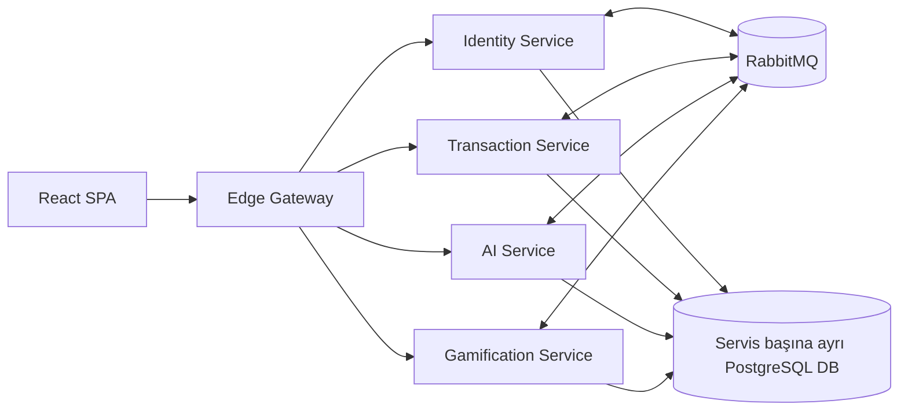

# FraudCell

FraudCell; müşteri işlemlerini makine öğrenmesiyle skorlayan, risk vakalarını uygun
analiste atayan ve analist performansını oyunlaştıran event-driven bir fraud operasyon
platformudur. Uygulamanın tek dış giriş noktası Edge Gateway'dir; frontend de gateway
tarafından `http://127.0.0.1:8080` adresinde sunulur.

## Mimari



Stack 7 container'dan oluşur: Edge, Identity, Transaction, AI, Gamification,
PostgreSQL ve RabbitMQ. PostgreSQL tek instance içinde servis başına ayrı database ve
ayrı uygulama rolü kullanır. Yalnızca gateway host portu açar.

## Hızlı başlangıç

Gereksinim: güncel Docker Desktop ve Docker Compose v2.

```bat
scripts\start-fraudcell.bat
```

Script, yoksa `BACKEND\.env.example` dosyasından `BACKEND\.env` oluşturur; tüm
imajları build eder, migrasyon/seed işlemlerini yürütür ve gateway hazır olunca
tarayıcıyı açar. Aynı işlem terminalden de çalıştırılabilir:

```powershell
cd BACKEND
docker compose up -d --build
docker compose ps
```

- Uygulama: `http://127.0.0.1:8080`
- Gateway health: `http://127.0.0.1:8080/health/ready`
- Admin: `admin@fraudcell.local` / `ChangeMe123!`
- Yeni müşteri: herhangi bir `5xxxxxxxxx` GSM, demo OTP: `1234`

Bu kimlik bilgileri yalnızca `Development` demo ortamı içindir.

Sistemi durdurmak için `scripts\stop-fraudcell.bat`; volume'lar dahil sıfırlamak için
`scripts\stop-fraudcell.bat --temizle` kullanılır.

## Zorunlu demo akışı

1. Yeni müşteri oluşturup gece, yurt dışı, 50.000 TRY transfer girin.
2. İşlem detayında yüksek risk, `ÇALINTI_KART` ve `İNCELEME` kararını gösterin.
3. Analist hesabıyla vakayı başlatıp blok kararı ve not girin.
4. Puan hareketini ve süpervizör liderlik tablosunu gösterin.
5. `cd BACKEND && docker compose stop ai-service` çalıştırın; yeni işlemin yine
   kaydedilip `TIMED_OUT / MANUAL_QUEUE` vakasına dönüştüğünü gösterin.
6. `docker compose up -d ai-service` ile AI servisini geri kaldırın.

## Doğrulama

```powershell
dotnet build BACKEND/FraudCell.sln -c Release
dotnet test BACKEND/FraudCell.sln -c Release

cd BACKEND/src/Ai/fraudcell-ai
uv run ruff check .
uv run mypy app
uv run pytest -q

cd ../../../../FRONTEND/app
npm test
npm run typecheck
npm run build
$env:PLAYWRIGHT_BASE_URL='http://127.0.0.1:8080'
npm run e2e
```

## Dokümantasyon

- Gereksinim izlenebilirliği: [BACKEND/docs/01-REQUIREMENTS-TRACEABILITY.md](BACKEND/docs/01-REQUIREMENTS-TRACEABILITY.md)
- Mimari ve servis sınırları: [BACKEND/docs/02-ARCHITECTURE-OVERVIEW.md](BACKEND/docs/02-ARCHITECTURE-OVERVIEW.md)
- State machine: [BACKEND/docs/05-DOMAIN-AND-STATE-MACHINE.md](BACKEND/docs/05-DOMAIN-AND-STATE-MACHINE.md)
- Event kataloğu: [BACKEND/EVENTS.md](BACKEND/EVENTS.md)
- AI yaklaşımı/eğitim: [BACKEND/docs/10-AI-SERVICE-DESIGN.md](BACKEND/docs/10-AI-SERVICE-DESIGN.md)
- Sunum ve teslim playbook'u: [BACKEND/docs/11-FINAL-DELIVERY-PLAYBOOK.md](BACKEND/docs/11-FINAL-DELIVERY-PLAYBOOK.md)
- OpenAPI snapshot'ları: `BACKEND/contracts/openapi/`

Servislerin sorumlulukları, endpoint grupları ve environment değişkenleri kendi
klasörlerindeki README dosyalarında yer alır.
